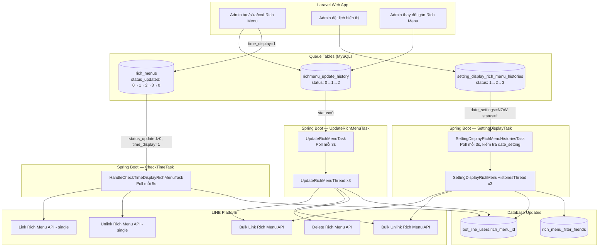

# Job Spec — FA-004 Rich Menu「リッチメニュー」

> **Mức độ tin cậy tổng thể: Cao** — phân tích trực tiếp từ source code Spring Boot

---

## 1. Tổng quan

### Tại sao cần background job?
Rich Menu cần gán (link) hoặc gỡ (unlink) cho **hàng nghìn LINE users** cùng lúc. Thao tác này không thể thực hiện đồng bộ trong web request vì:
- Mỗi lần link/unlink cần gọi LINE Messaging API cho từng batch 500 users
- Admin thay đổi Rich Menu mặc định → ảnh hưởng toàn bộ friends của bot
- Đặt lịch hiển thị Rich Menu theo thời gian (open_date / close_date) cần polling liên tục

### Kiểu giao tiếp
**Database Polling Model** — Laravel web app INSERT records vào queue tables, Spring Boot poll và xử lý.

### Có 3 job groups liên quan đến Rich Menu:

| # | Task Manager | Queue Table | Feature Flag | Mô tả |
|---|-------------|-------------|-------------|-------|
| 1 | `UpdateRichMenuTask` | `richmenu_update_history` | `ENABLE_UPDATE_RICHMENU` | Link/unlink Rich Menu hàng loạt cho users |
| 2 | `SettingDisplayRichMenuHistoriesTask` | `setting_display_rich_menu_histories` | `ENABLE_SETTING_DISPLAY_RICHMENU` | Đặt lịch hiển thị/dừng Rich Menu theo filter |
| 3 | `HandleCheckTimeDisplayRichMenuTask` | *(poll trực tiếp bảng `rich_menus`)* | *(không có flag riêng — khởi động qua cơ chế StoppableTask)* | Tự động link/unlink theo time_display (open_date/close_date) |

**Tin cậy: Cao** — xác nhận từ `AppMain.java` dòng 228-232 và `ConfigFile.java` dòng 101-102.

---

## 2. Queue Tables

### 2.1 `richmenu_update_history`

**Entity JPA:** `sns.line.models.linedb.entities.RichmenuUpdateHistory`
**File:** `src/job/linect-service/src/main/java/sns/line/models/linedb/entities/RichmenuUpdateHistory.java`

| Cột | Kiểu | Mô tả |
|-----|------|-------|
| `id` | Long (PK, auto) | ID bản ghi |
| `bot_id` | Long | Bot LINE OA cần xử lý |
| `richmenu_id` | Long | FK → `rich_menus.id` — Rich Menu cần thao tác |
| `rich_menu_id_current` | String | LINE Rich Menu ID hiện tại (dạng `richmenu-xxx`) |
| `rich_menu_id_old` | String | LINE Rich Menu ID cũ (cần xoá trên LINE sau khi xử lý) |
| `is_updated` | Integer | Loại thao tác (xem bảng bên dưới) |
| `count` | Long | Số users đã xử lý (ghi sau khi hoàn tất) |
| `status` | Integer | Trạng thái xử lý |
| `message` | String | Thông báo lỗi (nếu có) |
| `filter_display_ids` | String | IDs filter hiển thị |
| `created_at` | String | Thời gian tạo |

**State Machine — `status`:**
```
STATUS_NEW (0) → STATUS_PROCESS (1) → STATUS_DONE (2)
                                    → STATUS_ERROR (3)
                                    → STATUS_IGNORE (4)
```

**Loại thao tác — `is_updated`:**

| Giá trị | Hằng số | Mô tả |
|---------|---------|-------|
| 1 | `UPDATED_LINK_BY_RICH_MENU` | Link Rich Menu cho users đang gán Rich Menu này |
| 2 | `UPDATED_UNLINK_BY_RICH_MENU` | Unlink Rich Menu khỏi users đang gán nó, chuyển về default |
| 3 | `UPDATED_LINK_ALL` | Link Rich Menu cho **tất cả** friends của bot (không chặn) |
| 4 | `UPDATED_UNLINK_ALL` | Unlink Rich Menu khỏi **tất cả** friends của bot |
| 5 | `UPDATED_DELETE_RICHMENU` | Xoá Rich Menu — unlink khỏi users, chuyển về default |

**Điều kiện poll:** `status = 0` (STATUS_NEW), không có điều kiện thời gian.
**Tần suất poll:** 3 giây (`sleep(3000)`).

**Tin cậy: Cao**

---

### 2.2 `setting_display_rich_menu_histories`

**Entity JPA:** `sns.line.models.linedb.entities.SettingDisplayRichMenuHistories`
**File:** `src/job/linect-service/src/main/java/sns/line/models/linedb/entities/SettingDisplayRichMenuHistories.java`

| Cột | Kiểu | Mô tả |
|-----|------|-------|
| `id` | Long (PK, auto) | ID bản ghi |
| `bot_id` | Long | Bot LINE OA |
| `rich_id` | Long | FK → `rich_menus.id` |
| `date_setting` | LocalDateTime | Thời điểm cần thực thi (đặt lịch) |
| `action` | Integer | Hành động: 1=hiển thị, 2=dừng |
| `type` | Integer | Loại (chưa rõ ý nghĩa cụ thể) |
| `status` | Integer | Trạng thái xử lý |
| `filter_id` | String | ID filter để lọc users |
| `count_friend` | Integer | Số friends đã xử lý |

**State Machine — `status`:**
```
STATUS_NEW (1) → STATUS_PROCESS (2) → STATUS_DONE (3)
                                    → STATUS_ERROR (5)
                                    → STATUS_EXPIRED_BOT (8)
```

**Lưu ý:** STATUS_NEW = 1 (khác với `richmenu_update_history` dùng 0).

**Action values:**

| Giá trị | Hằng số | Mô tả |
|---------|---------|-------|
| 1 | `ACTION_SHOW` | Hiển thị Rich Menu — link cho users theo filter |
| 2 | `ACTION_STOP` | Dừng hiển thị — unlink khỏi users đang gán |

**Điều kiện poll:** `date_setting <= NOW() AND status = 1` (STATUS_NEW).
**Tần suất poll:** 3 giây (`sleep(3000)`).

**Tin cậy: Cao**

---

### 2.3 Bảng `rich_menus` (poll trực tiếp, không phải queue table riêng)

`HandleCheckTimeDisplayRichMenuTask` poll trực tiếp bảng `rich_menus` dựa trên cột `status_updated` và `time_display`.

**Cột liên quan:**

| Cột | Mô tả |
|-----|-------|
| `status_updated` | State machine: 0=không cần update, 1=cần update trước mở, 2=cần update trong thời gian, 3=cần update sau đóng |
| `time_display` | Flag: 1=có đặt lịch hiển thị |
| `open_date` | Thời gian bắt đầu hiển thị |
| `close_date` | Thời gian kết thúc hiển thị |

**State Machine — `status_updated`:**
```
STATUS_NO_UPDATE (0)
STATUS_NEED_UPDATE_FROM_BEFORE (1) → STATUS_NEED_UPDATE_FROM_IN_TIME_DISPLAY (2) → STATUS_NEED_UPDATE_FROM_AFTER (3) → STATUS_NO_UPDATE (0)
```

**3 giai đoạn xử lý:**
1. **Trước mở** (`status_updated=1, open_date > NOW()`): Unlink Rich Menu hiện tại (chuẩn bị)
2. **Trong thời gian** (`status_updated IN(1,2), open_date <= NOW(), close_date >= NOW()`): Link Rich Menu cho tất cả users đã gán
3. **Sau đóng** (`status_updated IN(1,2,3), close_date < NOW()`): Unlink Rich Menu, reset `status_updated=0`

**Tần suất poll:** 5 giây (`sleep(5000)`), batch 10 records mỗi lần.

**Tin cậy: Cao** — xác nhận từ native queries trong `RichMenuRepository.java`.

---

## 3. Task Managers

### 3.1 UpdateRichMenuTask

**File:** `src/job/linect-service/src/main/java/sns/line/threads/richmenu/UpdateRichMenuTask.java`
**Feature Flag:** `ENABLE_UPDATE_RICHMENU` (trong `config.properties`)
**Khởi động:** `AppMain.startUpdateRichMenuTask()` → `ExecutorService.submit(new UpdateRichMenuTask())`

**Polling Logic:**
1. Khởi tạo: Load tất cả records có `status = STATUS_PROCESS (1)` vào queue nội bộ (phục hồi sau restart)
2. Khởi tạo 3 worker threads (`UpdateRichMenuThread`)
3. Vòng lặp chính: Poll `richmenu_update_history` WHERE `status = STATUS_NEW (0)`
4. Với mỗi record: cập nhật `status = STATUS_PROCESS (1)`, thêm vào queue nội bộ (LinkedList)
5. Sleep 3 giây nếu không có record mới

**Thread Pool:** 3 worker threads song song
**Concurrency Control:** `mapBotIdRunning` — mỗi bot chỉ được xử lý bởi 1 thread tại 1 thời điểm (tránh xung đột khi link/unlink cùng bot)

**Tin cậy: Cao**

---

### 3.2 SettingDisplayRichMenuHistoriesTask

**File:** `src/job/linect-service/src/main/java/sns/line/threads/richmenu/SettingDisplayRichMenuHistoriesTask.java`
**Feature Flag:** `ENABLE_SETTING_DISPLAY_RICHMENU` (trong `config.properties`)
**Khởi động:** `AppMain.startSettingDisplayRichMenuHistoriesTask()` → `ExecutorService.submit(...)`

**Polling Logic:**
1. Khởi tạo: Load tất cả records có `status = STATUS_PROCESS (2)` vào queue (phục hồi sau restart)
2. Khởi tạo 3 worker threads (`SettingDisplayRichMenuHistoriesThread`)
3. Vòng lặp chính: Poll `setting_display_rich_menu_histories` WHERE `date_setting <= NOW() AND status = STATUS_NEW (1)`
4. Với mỗi record: cập nhật `status = STATUS_PROCESS (2)`, thêm vào queue
5. Sleep 3 giây nếu không có record mới

**Thread Pool:** 3 worker threads song song
**Concurrency Control:** `mapBotIdRunning` — tương tự UpdateRichMenuTask

**Tin cậy: Cao**

---

### 3.3 HandleCheckTimeDisplayRichMenuTask

**File:** `src/job/linect-service/src/main/java/sns/line/task/HandleCheckTimeDisplayRichMenuTask.java`
**Feature Flag:** Không có flag riêng trong `ConfigFile`. Kế thừa `StoppableTask` — có thể được khởi động qua cơ chế khác (không tìm thấy trong `AppMain.run()`).
**Kiểu:** Single-thread, polling trực tiếp bảng `rich_menus`

**Polling Logic:**
1. Vòng lặp `while(true)`, mỗi 5 giây gọi 3 methods tuần tự:
   - `needUpdateFromBeforeOpenDateDisplay()` — xử lý giai đoạn trước mở
   - `needUpdateFromInTimeDisplay()` — xử lý giai đoạn trong thời gian
   - `needUpdateFromAfterCloseDateDisplay()` — xử lý giai đoạn sau đóng
2. Batch 10 records mỗi query

**Tin cậy: Cao** (code rõ ràng). Tuy nhiên **mức khởi động: Trung bình** — không tìm thấy đăng ký trong `AppMain.run()`, có thể được bật qua cơ chế `StoppableTask` hoặc đã bị vô hiệu hoá.

---

## 4. Processing Chain

### 4.1 UpdateRichMenuTask → UpdateRichMenuThread

```
UpdateRichMenuTask (poll queue table)
  │
  ├── Poll richmenu_update_history WHERE status=0
  ├── Update status → 1 (PROCESS)
  ├── Add vào LinkedList nội bộ
  │
  └── UpdateRichMenuThread (3 threads)
        │
        ├── Poll từ LinkedList (synchronized)
        ├── Kiểm tra mapBotIdRunning (không xử lý 2 tasks cùng bot)
        ├── Clear cache: RichMenuManager.getRich(id, true) + RedisHelper.notifyRichmenuClearCache()
        ├── Load RichMenu entity từ DB
        │
        └── update(richMenu, updateHistory) — switch theo is_updated:
              │
              ├── Case 1 (LINK_BY_RICH_MENU):
              │     Tìm BotLineUser đang gán richMenuId này → bulkLinkRichMenu
              │
              ├── Case 2 (UNLINK_BY_RICH_MENU):
              │     Tìm BotLineUser đang gán → bulkUnLinkRichMenu
              │     → Tìm Rich Menu default → bulkLinkRichMenu default (hoặc set null)
              │
              ├── Case 3 (LINK_ALL):
              │     Tìm TẤT CẢ BotLineUser không bị block → bulkLinkRichMenu
              │     → Update richMenuId trong bot_line_users
              │
              ├── Case 4 (UNLINK_ALL):
              │     Tìm TẤT CẢ BotLineUser → bulkUnLinkRichMenu
              │     → Set richMenuId = null
              │
              └── Case 5 (DELETE_RICHMENU):
                    Tìm BotLineUser đang gán → bulkUnLinkRichMenu
                    → Tìm default → link default (hoặc set null)
                    → deleteRichMenu trên LINE (xoá rich_menu_id_old)
```

**Pagination:** Mỗi batch 500 `BotLineUser`, lặp cho đến hết.
**Sau xử lý xong:** Nếu case 1 hoặc 5 có `rich_menu_id_old` → gọi LINE API `deleteRichMenu` để xoá Rich Menu cũ trên LINE.
**Cuối cùng:** Update `status = STATUS_DONE (2)`, ghi `count` = số users đã xử lý.

**Tin cậy: Cao**

---

### 4.2 SettingDisplayRichMenuHistoriesTask → SettingDisplayRichMenuHistoriesThread

```
SettingDisplayRichMenuHistoriesTask (poll queue table)
  │
  ├── Poll setting_display_rich_menu_histories WHERE date_setting <= NOW() AND status=1
  ├── Update status → 2 (PROCESS)
  │
  └── SettingDisplayRichMenuHistoriesThread (3 threads)
        │
        ├── Kiểm tra Bot expired (> 7 ngày) → STATUS_EXPIRED_BOT (8)
        ├── Load RichMenu entity
        │
        └── update(richMenu, updateHistory) — switch theo action:
              │
              ├── ACTION_SHOW (1):
              │     Lọc users theo FilterV2 (FILTER_TYPE_SETTING_RICH_MENU)
              │     → Batch 500 users → bulkLinkRichMenu trên LINE
              │     → Lưu RichMenuFilterFriend (ghi nhận user nào đã được link)
              │     → Update bot_line_users.rich_menu_id
              │
              └── ACTION_STOP (2):
                    Tìm BotLineUser đang gán richMenuId
                    → bulkUnLinkRichMenu trên LINE
                    → Lưu RichMenuFilterFriend
                    → Set bot_line_users.rich_menu_id = null
```

**Khác biệt với UpdateRichMenuTask:**
- Hỗ trợ **filter users** (qua `FilterV2.FILTER_TYPE_SETTING_RICH_MENU`) — chỉ link/unlink cho nhóm users cụ thể
- Ghi nhận **`rich_menu_filter_friends`** — tracking users nào đã xử lý
- Kiểm tra **Bot expired** — bỏ qua nếu bot hết hạn quá 7 ngày
- Có **đặt lịch** qua `date_setting` — không xử lý ngay mà chờ đến thời điểm

**Tin cậy: Cao**

---

### 4.3 HandleCheckTimeDisplayRichMenuTask (time-based display)

```
HandleCheckTimeDisplayRichMenuTask (single thread, poll rich_menus)
  │
  ├── needUpdateFromBeforeOpenDateDisplay()
  │     Query: status_updated=1, time_display=1, open_date > NOW()
  │     → Unlink Rich Menu cho tất cả users đang gán (chuẩn bị trước khi mở)
  │     → Set status_updated = 2
  │
  ├── needUpdateFromInTimeDisplay()
  │     Query: status_updated IN(1,2), time_display=1, open_date <= NOW(), close_date >= NOW()
  │     → Load Bot → Tìm BotLineUser gán richMenuId này
  │     → Gọi RichMenuModel.linkRichMenu() cho từng user (KHÔNG batch)
  │     → Set status_updated = 3
  │
  └── needUpdateFromAfterCloseDateDisplay()
        Query: status_updated IN(1,2,3), time_display=1, close_date < NOW()
        → Unlink Rich Menu cho tất cả users đang gán
        → Set status_updated = 0 (reset)
        → Nếu sau close: BotLineUserModel.updateRichMenu(null) — xoá reference
```

**Khác biệt quan trọng:**
- Task này link/unlink **từng user một** (gọi `RichMenuModel.linkRichMenu/unlinkRichMenu`) thay vì bulk API
- Chỉ xử lý Rich Menu có `time_display = 1` (đặt lịch hiển thị)
- Tự động xử lý vòng đời: trước mở → trong thời gian → sau đóng

**Tin cậy: Cao**

---

## 5. Services & Helpers

### 5.1 RichMenuModel
**File:** `src/job/linect-service/src/main/java/sns/line/models/RichMenuModel.java`

| Method | Mô tả | LINE API |
|--------|-------|----------|
| `linkRichMenu(bot, lineUser, richMenu)` | Link 1 Rich Menu cho 1 user | `POST /v2/bot/user/{userId}/richmenu/{richMenuId}` |
| `unlinkRichMenu(accessToken, lineUserId, callback)` | Unlink Rich Menu khỏi 1 user | `DELETE /v2/bot/user/{userId}/richmenu` |
| `linkToDefault(bot, lineUser)` | Tìm default Rich Menu (statusLine=1) và link cho user | `linkRichMenu` |
| `updateRichMenu(bot, richMenuId, lineUser)` | Logic phức tạp: link cụ thể, link default (-1), unlink | Tuỳ trường hợp |
| `findDefaultRich(botId)` | Tìm default Rich Menu (`status_line=1, status_rich=1`) | — |
| `findRichMenuById(id)` | Tìm Rich Menu theo id (`status_rich=1`) | — |

### 5.2 RichMenuManager (In-memory Cache)
**File:** `src/job/linect-service/src/main/java/sns/line/helper/RichMenuManager.java`

- Cache in-memory cho `RichMenu` entities (tránh query DB liên tục)
- TTL: 2 phút (`VALID_TIME_LOAD_RICH = 2*60000`)
- Max cache size: 50 entries (LRU-like qua LinkedList)
- `getRich(id, true)` → clear cache cho id cụ thể
- `getRich(id, false)` → lấy từ cache hoặc query DB

### 5.3 RedisHelper
- `RedisHelper.notifyRichmenuClearCache(richmenuId)` — gửi thông báo clear cache Rich Menu qua Redis pub/sub (để đồng bộ giữa các instance)

### 5.4 BotLineUserModel
- `updateRichMenu(botId, lineUserId, richMenuId)` — cập nhật cột `rich_menu_id` trong bảng `bot_line_users`

**Tin cậy: Cao**

---

## 6. External API Calls (LINE Messaging API)

| API | Method | Endpoint | Sử dụng bởi |
|-----|--------|----------|-------------|
| Link Rich Menu (single) | POST | `/v2/bot/user/{userId}/richmenu/{richMenuId}` | `RichMenuModel.linkRichMenu()` — dùng trong HandleCheckTimeDisplayRichMenuTask |
| Unlink Rich Menu (single) | DELETE | `/v2/bot/user/{userId}/richmenu` | `RichMenuModel.unlinkRichMenu()` — dùng trong HandleCheckTimeDisplayRichMenuTask |
| Bulk Link Rich Menu | POST | `/v2/bot/richmenu/bulk/link` | `UpdateRichMenuThread.bulkLinkRichMenu()`, `SettingDisplayRichMenuHistoriesThread.bulkLinkRichMenu()` |
| Bulk Unlink Rich Menu | POST | `/v2/bot/richmenu/bulk/unlink` | `UpdateRichMenuThread.bulkUnLinkRichMenu()`, `SettingDisplayRichMenuHistoriesThread.bulkUnLinkRichMenu()` |
| Delete Rich Menu | DELETE | `/v2/bot/richmenu/{richMenuId}` | `UpdateRichMenuThread.deleteQueueRichMenu()` |

**Request Body cho Bulk API:**
```json
{
  "richMenuId": "richmenu-xxx",
  "userIds": ["Uxxxx1", "Uxxxx2", ...]
}
```
Class: `sns.line.models.requestbody.BulkLinkRichMenuBody`

**Tin cậy: Cao** — xác nhận từ `RequestHelper` và LINE API documentation.

---

## 7. Data Flow



---

## 8. Error Handling

| Tình huống | Xử lý |
|-----------|-------|
| Rich Menu không tìm thấy trong DB | `status = STATUS_ERROR`, ghi message, dừng xử lý record |
| Bot không tìm thấy trong DB | `status = STATUS_ERROR`, ghi message |
| Bot expired > 7 ngày | `status = STATUS_EXPIRED_BOT (8)` — chỉ SettingDisplay |
| LINE API call fail | Log error, gửi báo cáo Chatwork, **không retry** từng API call |
| LineUser không tìm thấy | Log warning, bỏ qua user đó, tiếp tục batch |
| Exception trong worker thread | Log error, gửi báo cáo Chatwork, sleep 60 giây rồi tiếp tục |
| Exception trong task manager | Log error, gửi báo cáo Chatwork, sleep 60 giây rồi tiếp tục |

**Cơ chế báo cáo lỗi:** `NotifyUtils.sendReportChatwork()` — gửi thông báo lỗi đến Chatwork room (ID: `316148419` cho UpdateRichMenu, `291087346` cho SettingDisplay).

**Không có retry cho từng LINE API call** — nếu bulk link/unlink fail, hệ thống ghi log nhưng vẫn đánh dấu `STATUS_DONE`. Điều này có thể dẫn đến tình trạng Rich Menu không được gán đúng cho một số users.

**Tin cậy: Cao**

---

## 9. Liên kết với Web App

| Action trên Web (Laravel) | Queue Table | is_updated / action | Task Manager | Kết quả |
|--------------------------|-------------|-------------------|-------------|---------|
| Tạo Rich Menu mới + set default | `richmenu_update_history` | `UPDATED_LINK_ALL (3)` | UpdateRichMenuTask | Link cho tất cả friends |
| Sửa Rich Menu (tạo mới trên LINE, link lại) | `richmenu_update_history` | `UPDATED_LINK_BY_RICH_MENU (1)` | UpdateRichMenuTask | Re-link cho users đang gán, xoá Rich Menu cũ trên LINE |
| Xoá Rich Menu | `richmenu_update_history` | `UPDATED_DELETE_RICHMENU (5)` | UpdateRichMenuTask | Unlink khỏi users, chuyển về default, xoá trên LINE |
| Bỏ default Rich Menu | `richmenu_update_history` | `UPDATED_UNLINK_BY_RICH_MENU (2)` | UpdateRichMenuTask | Unlink khỏi users, chuyển về default khác (nếu có) |
| Unlink tất cả | `richmenu_update_history` | `UPDATED_UNLINK_ALL (4)` | UpdateRichMenuTask | Unlink tất cả friends, set null |
| Đặt lịch hiển thị Rich Menu | `setting_display_rich_menu_histories` | `ACTION_SHOW (1)` | SettingDisplayTask | Link theo filter tại thời điểm `date_setting` |
| Đặt lịch dừng hiển thị | `setting_display_rich_menu_histories` | `ACTION_STOP (2)` | SettingDisplayTask | Unlink tại thời điểm `date_setting` |
| Rich Menu có `time_display=1` | Cập nhật `rich_menus.status_updated` | — | HandleCheckTimeTask | Tự động link/unlink theo open_date/close_date |

---

## 10. Bảng tham chiếu DB đọc/ghi

| Bảng | Đọc | Ghi | Bởi |
|------|-----|-----|-----|
| `richmenu_update_history` | Poll status=0, status=1 | Update status, count, message | UpdateRichMenuTask |
| `setting_display_rich_menu_histories` | Poll date_setting + status=1, status=2 | Update status, count_friend | SettingDisplayTask |
| `rich_menus` | Load by id, poll status_updated, find default | Update status_updated | HandleCheckTimeTask, UpdateRichMenuThread |
| `bot_line_users` | Find by botId + richMenuId, find all by botId | Update rich_menu_id | Tất cả tasks |
| `bots` | Find by id | — | Tất cả tasks |
| `line_users` | Find by id | — | Tất cả tasks |
| `rich_menu_filter_friends` | — | Insert (tracking) | SettingDisplayThread |

---

## 11. Danh sách file source code

| File | Vai trò |
|------|---------|
| `src/job/.../AppMain.java` (dòng 228-232, 796-802) | Khởi động task managers |
| `src/job/.../ConfigFile.java` (dòng 101-102, 247-248) | Feature flags |
| `src/job/.../task/HandleCheckTimeDisplayRichMenuTask.java` | Task Manager #3 — time-based display |
| `src/job/.../threads/richmenu/UpdateRichMenuTask.java` | Task Manager #1 — polling loop |
| `src/job/.../threads/richmenu/UpdateRichMenuThread.java` | Worker thread — link/unlink hàng loạt |
| `src/job/.../threads/richmenu/SettingDisplayRichMenuHistoriesTask.java` | Task Manager #2 — scheduled display |
| `src/job/.../threads/richmenu/SettingDisplayRichMenuHistoriesThread.java` | Worker thread — scheduled link/unlink |
| `src/job/.../threads/richmenu/RichMenuTask.java` | **Legacy** (code bị comment out) — phiên bản cũ xử lý tag-based link |
| `src/job/.../models/RichMenuModel.java` | Helper — single link/unlink via LINE API |
| `src/job/.../helper/RichMenuManager.java` | In-memory cache cho RichMenu entities |
| `src/job/.../models/linedb/entities/RichmenuUpdateHistory.java` | Entity JPA — queue table 1 |
| `src/job/.../models/linedb/entities/SettingDisplayRichMenuHistories.java` | Entity JPA — queue table 2 |
| `src/job/.../models/linedb/entities/RichMenu.java` | Entity JPA — bảng rich_menus |
| `src/job/.../models/linedb/repository/RichMenuRepository.java` | JPA Repository — native queries |
| `src/job/.../models/linedb/repository/SettingDisplayRichMenuHistoriesRepository.java` | JPA Repository |
| `src/job/.../models/requestbody/BulkLinkRichMenuBody.java` | Request body cho LINE Bulk API |

> **Lưu ý:** `RichMenuTask.java` chứa code cũ (gần toàn bộ bị comment out). Đây là phiên bản trước đó xử lý link/unlink theo tag + thời gian, đã được thay thế bởi `UpdateRichMenuTask` (bulk) và `HandleCheckTimeDisplayRichMenuTask` (time-based). **Tin cậy: Cao**
