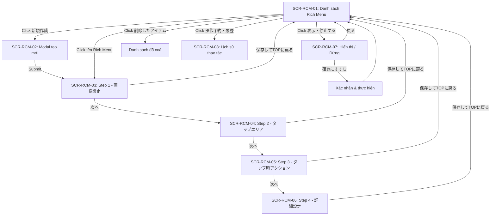

# FA-004 Rich Menu「リッチメニュー」 — UI Spec

## Tổng quan
- **Mã tính năng**: FA-004
- **Tên**: Rich Menu
- **Tên JP**: 「リッチメニュー」
- **Mô tả**: Quản lý Rich Menu cho LINE Official Account — tạo, chỉnh sửa, hiển thị/dừng Rich Menu trên ứng dụng LINE của bạn bè. Rich Menu là thanh menu cố định hiển thị ở cuối màn hình chat LINE, cho phép người dùng tap vào các vùng để thực hiện hành động.
- **Portal**: Admin
- **URL pattern**: `/basic/rich-menu`, `/basic/rich-menu/edit/{id}`

## Đối tượng sử dụng (Actors)
| Actor | Vai trò | Quyền truy cập |
|-------|---------|----------------|
| Admin | Tạo, chỉnh sửa, hiển thị/dừng Rich Menu cho LINE OA | Toàn quyền |
| Staff | Truy cập tương tự Admin | Tuỳ role — có thể bị giới hạn quyền tạo/sửa/xoá |

## Các màn hình

### SCR-RCM-01: Danh sách Rich Menu
- **URL**: `/basic/rich-menu`
- **Tiêu đề trang**: 「リッチメニュー」
- **Screenshot**: `screenshots/main.png`, `screenshots/list-with-data.png`

#### Layout tổng thể
- **Header**: Tiêu đề「リッチメニュー」+ nút「新規作成」(xanh lá)
- **Bên trái**: Panel folder — phân loại Rich Menu theo thư mục
- **Trung tâm**: Thanh tìm kiếm + toolbar + bảng dữ liệu
- **Bên phải**: Side panel「アクションプレビュー」(drawer/iframe) hiển thị preview action của Rich Menu đang chọn
- **Cuối trang**: Batch actions + phân trang

#### Thanh công cụ / Header actions
| Vị trí | Element | Text JP | Loại | Hành vi |
|--------|---------|---------|------|---------|
| Header phải | Nút tạo mới | 「新規作成」 | Button (xanh lá) | Mở modal tạo mới (SCR-RCM-02) |
| Toolbar | Ô tìm kiếm | 「管理名を入力して検索」 | Textbox + icon search | Tìm kiếm Rich Menu theo tên quản lý |
| Toolbar | Xem đã xoá | 「削除したアイテム」 | Button | Hiển thị danh sách Rich Menu đã xoá (soft delete) |
| Toolbar | Sắp xếp | 「並べ替え」 | Button | Thay đổi thứ tự hiển thị (drag & drop) |
| Toolbar | Lịch sử thao tác | 「操作予約・履歴」 | Button | Xem lịch sử và lịch đặt hiển thị/dừng |

#### Folder Panel (bên trái)
| Element | Text JP | Loại | Hành vi |
|---------|---------|------|---------|
| Tiêu đề | 「フォルダ」 | Label | — |
| Nút thêm folder | Icon + | Button | Tạo folder mới |
| Nút sửa folder | Icon edit | Button | Đổi tên folder |
| Folder mặc định | 「未分類」 | Item (clickable) | Lọc Rich Menu chưa phân loại. Hiển thị số lượng `(N)` |
| Folder tuỳ chỉnh | Tên folder | Item (clickable) | Lọc theo folder. Hiển thị số lượng `(N)`. Có icon menu (edit/delete) |
| Ẩn folder | 「フォルダを非表示」 | Button | Thu gọn panel folder |

#### Bảng dữ liệu
| # | Cột | Text JP | Kiểu dữ liệu | Sortable? | Ghi chú |
|---|-----|---------|-------------|----------|---------|
| 0 | Checkbox | — | Checkbox | Không | Chọn nhiều để batch action |
| 1 | Tên quản lý + hình thu nhỏ | 「管理名」 | Text + Image thumbnail | Không | Click vào tên → chuyển đến trang edit (`/basic/rich-menu/edit/{id}`). Thumbnail là ảnh Rich Menu đã upload |
| 2 | Trạng thái action | 「設定済みアクション」 | Badge | Không | 2 giá trị: 「アクション設定済」(đã cài đặt) / 「アクション未設定」(chưa cài đặt). Click → mở preview action |
| 3 | Ngày tạo | 「作成日」 | Date (YYYY.MM.DD) | Không | — |
| 4 | Ngày sửa cuối | 「最終編集日」 | Date (YYYY.MM.DD) | Không | — |
| 5 | Thao tác | 「操作」 | Button | Không | Nút「表示・停止する」→ chuyển đến SCR-RCM-07 |
| 6 | Đang hiển thị | 「表示中」 | Number + Button | Không | Hiển thị số người đang xem (「X 人」) + nút「データ表示」+ icon chevron mở rộng |

#### Actions batch (cuối trang)
| Action | Text JP | Hành vi | Điều kiện |
|--------|---------|---------|----------|
| Đổi folder hàng loạt | 「一括フォルダ変更」 | Di chuyển các Rich Menu đã chọn sang folder khác | Cần chọn ít nhất 1 item |
| Xoá hàng loạt | 「一括削除」 | Xoá (soft delete) các Rich Menu đã chọn | Cần chọn ít nhất 1 item |

#### Pagination
- Hiển thị dropdown chọn số lượng item/trang, mặc định: 「100件 / ページ」
- Phân trang dạng cursor/offset

#### Side Panel — Action Preview
| Element | Text JP | Loại | Hành vi |
|---------|---------|------|---------|
| Tiêu đề | 「アクションプレビュー」 | Label | — |
| Nút đóng | Icon X | Button | Đóng panel preview |
| Link chỉnh sửa | 「アクションを編集」 | Link | Navigate đến `/basic/rich-menu/edit/?stepActive=3` (step 3 — action setting) |

#### Observations
- Danh sách lấy qua API: `GET /ajax/rich-menu/list/{folder_id}` với params filter, sorter, limit, page
- Folder lấy qua API: `GET /ajax/folder/rich-menu`
- Thông tin bot lấy qua: `POST /ajax/get-bot-data`
- Sắp xếp mặc định theo `position` DESC
- URL image thumbnail: `/msg_template/media/images/{admin_id}/{bot_id}/rich-menu/richmenu_{bot_id}_{rich_menu_id}_{hash}.jpg`
- Empty state: hiển thị illustration + text「まだデータがありません」+「新規作成するとここにデータが表示されます」

---

### SCR-RCM-02: Modal tạo mới
- **URL**: `/basic/rich-menu` (modal overlay)
- **Tiêu đề**: 「リッチメニュー 新規作成」
- **Screenshot**: `screenshots/create-step1.png`

#### Layout tổng thể
- Modal dialog overlay trên trang danh sách
- Header: tiêu đề + nút đóng (X)
- Body: form fields
- Footer: nút submit

#### Form fields
| # | Label JP | Loại input | Bắt buộc? | Giá trị mặc định | Placeholder | Validation | Ghi chú |
|---|---------|-----------|----------|-----------------|-------------|-----------|---------|
| 1 | 「管理名」 | Text | Có (suy luận) | — | 「管理名を入力して下さい」 | Max 50 ký tự (hiển thị counter `0/50`) | Tên nội bộ để quản lý, không hiển thị cho LINE user |
| 2 | 「フォルダ」 | Dropdown | Không | 「未分類」 | — | — | Chọn folder đã tạo |
| 3 | 「フォルダ内の一番上に追加する」 | Checkbox | Không | Unchecked | — | — | Nếu unchecked → thêm vào cuối folder (ghi chú: 「※ 未選択の場合、フォルダの一番下に追加されます」) |

#### Actions
| Action | Text JP | Hành vi |
|--------|---------|---------|
| Submit | 「リッチメニューの登録に進む」 | Tạo Rich Menu mới và chuyển đến trang edit (SCR-RCM-03) |
| Đóng | Icon X | Đóng modal, quay lại danh sách |

---

### SCR-RCM-03: Edit Step 1 — Cài đặt hình ảnh「画像設定」
- **URL**: `/basic/rich-menu/edit/{id}` (stepActive=1)
- **Tiêu đề**: 「リッチメニュー 編集」
- **Screenshot**: `screenshots/edit-step1.png`

#### Layout tổng thể
- **Breadcrumb**: TOP > リッチメニュー 編集
- **Header area**: Tên quản lý (editable) + Folder selector
- **Step indicator**: 4 bước, highlight bước hiện tại (1.「画像設定」→ 2.「タップエリア」→ 3.「タップ時アクション」→ 4.「詳細設定」)
- **Content**: Preview mockup điện thoại (bên trái) + thông tin hình ảnh (bên phải)
- **Footer**: Nút navigation (「次へ >」,「保存してTOPに戻る」)

#### Form fields (Header — chung cho cả 4 steps)
| # | Label JP | Loại input | Bắt buộc? | Giá trị mặc định | Validation | Ghi chú |
|---|---------|-----------|----------|-----------------|-----------|---------|
| 1 | 「管理名」 | Text | Có | Giá trị đã nhập khi tạo | Max 50 ký tự (hiển thị counter `N / 50`) | Có thể sửa bất cứ lúc nào |
| 2 | 「フォルダ」 | Dropdown (clickable) | Không | Folder đã chọn khi tạo | — | Click để đổi folder |

#### Content — Step 1: Hình ảnh
| Element | Text JP | Loại | Hành vi |
|---------|---------|------|---------|
| Preview | — | Phone mockup + image | Hiển thị preview Rich Menu trên mô hình điện thoại |
| Hình đang cài đặt | 「設定中の画像」 | Image display | Hiển thị ảnh đã upload |
| Nút đổi ảnh | 「画像を変更する」 | Button (upload) | Mở dialog chọn file để upload ảnh mới |
| Gợi ý kích thước | 「ヒント」 | Info box | 2 kích thước cho phép: 2500x1686px, 2500x843px |
| Link Canva | 「Canva(c)」 | Link | Mở trang Canva template cho LINE Rich Menu |
| Thông tin phản ánh | 「編集内容の友だちへの反映タイミング」 | Collapsible info | Giải thích khi nào thay đổi được áp dụng cho bạn bè |

#### Actions
| Action | Text JP | Hành vi |
|--------|---------|---------|
| Tiếp | 「次へ >」 | Chuyển sang Step 2 |
| Lưu và quay lại | 「保存してTOPに戻る」 | Lưu và quay về danh sách |

---

### SCR-RCM-04: Edit Step 2 — Vùng tap「タップエリア」
- **URL**: `/basic/rich-menu/edit/{id}` (stepActive=2)
- **Tiêu đề**: 「リッチメニュー 編集」
- **Screenshot**: `screenshots/edit-step2.png`

#### Content — Step 2: Chọn layout vùng tap
| Element | Text JP | Loại | Hành vi |
|---------|---------|------|---------|
| Tiêu đề | 「STEP② タップエリアの設定」 | Heading | — |
| Preview | — | Phone mockup + overlay grid | Hiển thị ảnh Rich Menu với grid các vùng tap |
| Hướng dẫn | 「タップエリアを選択してください」 | Text | — |
| Template layout 1-7 | — | Image (clickable) | 7 templates bố cục vùng tap predefined (chia 2, 3, 4, 6 vùng...) |
| Chỉnh sửa thủ công | 「手動編集」 | Button (cuối danh sách templates) | Cho phép tự do kéo/resize các vùng tap trên ảnh |
| Nút「手動編集」trên preview | 「手動編集」 | Button overlay | Chuyển sang chế độ tự do chỉnh sửa vùng tap |

#### Observations
- Có 7 template bố cục + 1 option chỉnh sửa thủ công = tổng 8 lựa chọn
- Template phụ thuộc vào kích thước ảnh (2500x1686 có nhiều template hơn 2500x843)
- Mỗi template chia ảnh thành các vùng hình chữ nhật không chồng lấn

#### Actions
| Action | Text JP | Hành vi |
|--------|---------|---------|
| Tiếp | 「次へ >」 | Chuyển sang Step 3 |
| Lưu và quay lại | 「保存してTOPに戻る」 | Lưu và quay về danh sách |

---

### SCR-RCM-05: Edit Step 3 — Action khi tap「タップ時アクション」
- **URL**: `/basic/rich-menu/edit/{id}` (stepActive=3)
- **Tiêu đề**: 「リッチメニュー 編集」
- **Screenshot**: `screenshots/edit-step3.png`

#### Layout tổng thể
- **Bên trái**: Preview ảnh Rich Menu với các vùng tap đánh số. Click vùng để chọn area cần cấu hình.
- **Bên phải**: Panel cấu hình action cho area đang chọn
- **Nút thêm area**: 「＋ タップエリア追加」

#### Content — Step 3: Cấu hình action
| Element | Text JP | Loại | Hành vi |
|---------|---------|------|---------|
| Tiêu đề | 「STEP③ タップ時アクションの設定」 | Heading | — |
| Chọn area | 「アクションを設定したいエリアを選択」 | Instruction | Click vùng trên preview hoặc chọn từ dropdown |
| Thêm area | 「＋ タップエリア追加」 | Button | Thêm vùng tap mới (chế độ thủ công) |
| Tiêu đề area | 「エリア 1」,「エリア 2」, ... | Expandable section | Mỗi area có panel riêng, có nút expand/collapse, delete, reorder |
| Cảnh báo reset | 「一度保存した後に変更した場合、タップ回数詳細がリセットされます」 | Warning text | — |

#### Tabs action (cho mỗi area)
| Tab | Text JP | Mô tả | Mặc định? |
|-----|---------|-------|----------|
| Tab 1 | 「エルメアクション」 | Hành động mở trang/tính năng trong hệ thống LME (xem danh sách bên dưới) | Có |
| Tab 2 | 「友だちアクション」 | Hành động trên bạn bè (tag, step, template, v.v.) — **Shared Component SC-004** | Không |
| Tab 3 | 「リッチメニュー切り替え」 | Chuyển đổi sang Rich Menu khác | Không |
| Tab 4 | 「LINE URLスキーム」 | Sử dụng LINE URL scheme (deep link) | Không |

#### Tab 1 — Elme Action: Danh sách hành động
| # | Action | Text JP | Mô tả |
|---|--------|---------|-------|
| 1 | Mở trang chỉ định | 「指定ページをひらく」 | Mở URL bất kỳ |
| 2 | Mở form trả lời | 「回答フォームをひらく」 | Mở form đã tạo trong FA-011 |
| 3 | Mở đặt lịch salon | 「サロン予約をひらく」 | Mở trang đặt lịch salon (FA-020) |
| 4 | Mở đặt lịch bài học | 「レッスン予約をひらく」 | Mở trang đặt lịch lesson (FA-019) |
| 5 | Mở đặt lịch sự kiện | 「イベント予約をひらく」 | Mở trang đặt sự kiện (FA-021) |
| 6 | Mở trang bán hàng | 「商品販売ページをひらく」 | Mở trang thanh toán sản phẩm (FA-026). Có sub-tabs:「単品商品」/「継続商品」, sub-options:「販売ページ」/「決済カード変更ページ」/「解約ページ」 |
| 7 | Đăng ký conversion | 「コンバージョン登録ページをひらく」 | Mở trang conversion (FA-025) |
| 8 | Gọi điện | 「電話をかけさせる」 | Trigger cuộc gọi điện thoại từ LINE |
| 9 | Gửi text | 「テキストを送らせる」 | Bạn bè tự động gửi text message đến chat |
| 10 | Gửi email | 「メールを送らせる」 | Mở ứng dụng email |

#### Lưu ý action
- 「エルメアクションを併用しない場合、このエリアのタップ回数はカウントされません。」— Nếu không dùng Elme Action kết hợp thì không đếm số lần tap
- Khi chọn「商品販売ページをひらく」: hiển thị sub-selector chọn sản phẩm cụ thể + warning về「外部サイトに移動したため機能が正常に動作しないか...」
- Action「アクション設定を削除」: xoá toàn bộ action đã cài cho area đó

#### Observations
- Tab「友だちアクション」chính là **SC-004 (Action Settings)** — cùng bộ action types đã thấy trong FA-003, FA-013, FA-015
- Tab「リッチメニュー切り替え」cho phép khi tap area này → chuyển sang hiển thị Rich Menu khác cho bạn bè (self-referencing feature)
- Mỗi area có thể có nhiều action cùng lúc (Elme Action + Friend Action)
- Nút expand/collapse, reorder (up/down arrows), delete cho mỗi area

#### Actions
| Action | Text JP | Hành vi |
|--------|---------|---------|
| Tiếp | 「次へ >」 | Chuyển sang Step 4 |
| Lưu và quay lại | 「保存してTOPに戻る」 | Lưu và quay về danh sách |

---

### SCR-RCM-06: Edit Step 4 — Cài đặt chi tiết「詳細設定」
- **URL**: `/basic/rich-menu/edit/{id}` (stepActive=4)
- **Tiêu đề**: 「リッチメニュー 編集」
- **Screenshot**: `screenshots/edit-step4.png`

#### Layout tổng thể
- **Bên trái**: Preview mockup điện thoại hiển thị Rich Menu với menu bar text
- **Bên phải**: Form cài đặt chi tiết

#### Form fields
| # | Label JP | Loại input | Bắt buộc? | Giá trị mặc định | Validation | Ghi chú |
|---|---------|-----------|----------|-----------------|-----------|---------|
| 1 | 「メニューバーのテキスト」 | Text | Không | — | Max 14 ký tự (hiển thị counter `N / 14`) | Text hiển thị trên thanh menu bar trong LINE chat. Mô tả:「メニューバーに表示するテキストを設定します。」 |
| 2 | 「トーク画面の初期表示」 | Radio (2 options) | Có | — | — | Trạng thái hiển thị Rich Menu khi bạn bè mở chat. Mô tả:「友だちがトーク画面を開いた時のリッチメニュー表示状態を設定します。」 |

#### Radio options cho「トーク画面の初期表示」
| Option | Text JP | Mô tả |
|--------|---------|-------|
| 1 | 「表示する」 | Rich Menu tự động hiện khi mở chat |
| 2 | 「表示しない」 | Rich Menu ẩn, bạn bè cần tap menu bar để mở |

#### Actions
| Action | Text JP | Hành vi |
|--------|---------|---------|
| Lưu và quay lại | 「保存してTOPに戻る」 | Lưu toàn bộ và quay về danh sách |
| Xem cách hiển thị | 「表示方法を確認」 | Hiển thị hướng dẫn cách bật Rich Menu cho bạn bè |

#### Lưu ý hiển thị (info box cuối trang)
- 「リッチメニューを保存しただけでは友だちには表示されません。」— Lưu Rich Menu không tự động hiển thị cho bạn bè, cần thực hiện thao tác hiển thị riêng (SCR-RCM-07)

---

### SCR-RCM-07: Hiển thị / Dừng Rich Menu
- **URL**: `/basic/rich-menu/display-stop/{id}` (suy luận)
- **Tiêu đề**: 「リッチメニュー表示・停止の設定」
- **Breadcrumb**: TOP > リッチメニュー表示・停止の設定
- **Screenshot**: `screenshots/display-stop-modal.png`

#### Layout tổng thể
- **Header**: Tên Rich Menu (「thanh 3 nga edit」)
- **Thông tin**: Số bạn bè đang xem + thumbnail ảnh Rich Menu
- **Form**: Chọn thao tác (hiển thị/dừng), đặt lịch, chọn đối tượng

#### Thông tin hiển thị
| Element | Text JP | Loại | Ghi chú |
|---------|---------|------|---------|
| Số người xem | 「このリッチメニューが表示されている友だち」 | Label + Number | Ví dụ: 「0人」 |
| Thumbnail | — | Image | Ảnh Rich Menu đã upload |

#### Form fields
| # | Label JP | Loại input | Bắt buộc? | Giá trị mặc định | Ghi chú |
|---|---------|-----------|----------|-----------------|---------|
| 1 | 「リッチメニュー 表示・停止の操作」 | Toggle/Radio 2 options | Có | — | Chọn「表示する」hoặc「停止する」 |
| 2 | 「表示予約」 | Radio 2 options | Có | 「表示日時を設定しない（すぐに表示する）」 | Đặt lịch hiển thị |
| 3 | 「リッチメニューを表示する友だちを選択」 | Radio 2 options | Có | 「エルメ上の友だち全員」 | Chọn đối tượng hiển thị |

#### Option chi tiết — Thao tác hiển thị/dừng
| Option | Text JP | Mô tả |
|--------|---------|-------|
| Hiển thị | 「表示する」 | Bật Rich Menu cho bạn bè |
| Dừng | 「停止する」 | Tắt Rich Menu |

#### Option chi tiết — Đặt lịch hiển thị「表示予約」
| Option | Text JP | Mô tả |
|--------|---------|-------|
| Ngay lập tức | 「表示日時を設定しない（すぐに表示する）」 | Hiển thị ngay khi xác nhận |
| Đặt lịch | 「表示日時を設定する」 | Chọn ngày giờ cụ thể để tự động hiển thị (suy luận: mở date/time picker) |

#### Lưu ý
- 「他のリッチメニューが表示されている場合も、このリッチメニューに切り替わります。」— Nếu bạn bè đang xem Rich Menu khác, sẽ bị thay thế bằng Rich Menu này
- Mô tả đặt lịch:「表示日時が到来すると、自動的にこのリッチメニューを表示します。」

#### Option chi tiết — Chọn đối tượng
| Option | Text JP | Mô tả |
|--------|---------|-------|
| Tất cả | 「エルメ上の友だち全員」 | Hiển thị cho toàn bộ bạn bè trên Elme |
| Chọn riêng | 「個別に選択する」 | Chọn bạn bè cụ thể (suy luận: mở dialog chọn bạn bè, có thể dùng SC-003 Friend Filter) |

#### Actions
| Action | Text JP | Hành vi |
|--------|---------|---------|
| Quay lại | 「戻る」 | Quay về danh sách |
| Xác nhận | 「リッチメニュー表示の確認にすすむ」 | Chuyển sang màn xác nhận trước khi thực hiện |

---

### SCR-RCM-08: Lịch sử thao tác「操作予約・履歴」
- **URL**: Suy luận — modal hoặc popup từ nút toolbar
- **Screenshot**: `screenshots/operation-history.png`

#### Observations
- Screenshot cho thấy trang「お知らせ」(Notifications) với bảng lịch sử thao tác
- Bảng gồm các cột: 「配信元」,「未読/既読」,「内容」
- Dữ liệu mẫu: ngày 2025/03/10, 2025/02/03, v.v.
- Bên dưới là「アカウント一覧」(danh sách account) — có thể đây là trang thông báo chung, không riêng cho Rich Menu
- **Mức tin cậy: Thấp** — Screenshot không rõ ràng liên quan trực tiếp đến操作予約・履歴 của Rich Menu

---

## Luồng người dùng (User Flows)

### Luồng 1: Tạo Rich Menu mới
1. Mở trang danh sách Rich Menu (SCR-RCM-01)
2. Click「新規作成」→ modal tạo mới (SCR-RCM-02)
3. Nhập「管理名」, chọn「フォルダ」, tuỳ chọn checkbox vị trí
4. Click「リッチメニューの登録に進む」→ chuyển đến Edit Step 1 (SCR-RCM-03)
5. Upload hình ảnh Rich Menu (2500x1686 hoặc 2500x843)
6. Click「次へ >」→ Step 2 (SCR-RCM-04): Chọn layout vùng tap
7. Click「次へ >」→ Step 3 (SCR-RCM-05): Cấu hình action cho từng area
8. Click「次へ >」→ Step 4 (SCR-RCM-06): Cài đặt menu bar text + trạng thái hiển thị
9. Click「保存してTOPに戻る」→ quay về danh sách

### Luồng 2: Hiển thị Rich Menu cho bạn bè
1. Từ danh sách (SCR-RCM-01), click nút「表示・停止する」trên dòng Rich Menu
2. Chuyển đến trang hiển thị/dừng (SCR-RCM-07)
3. Chọn「表示する」
4. Chọn đặt lịch: ngay lập tức hoặc đặt thời gian
5. Chọn đối tượng: tất cả bạn bè hoặc chọn riêng
6. Click「リッチメニュー表示の確認にすすむ」→ xác nhận → thực hiện

### Luồng 3: Chỉnh sửa Rich Menu
1. Từ danh sách (SCR-RCM-01), click tên Rich Menu → trang Edit Step 1
2. Sửa bất kỳ step nào (click step indicator hoặc nút「次へ」)
3. Click「保存してTOPに戻る」khi hoàn tất

### Luồng 4: Xoá Rich Menu
1. Từ danh sách, tick checkbox trên các Rich Menu cần xoá
2. Click「一括削除」
3. Xác nhận → Rich Menu bị soft delete (có thể xem lại qua「削除したアイテム」)

### Luồng 5: Quản lý folder
1. Tại folder panel (bên trái), click nút thêm folder → nhập tên
2. Kéo/di chuyển Rich Menu giữa các folder hoặc dùng「一括フォルダ変更」
3. Click menu icon trên folder → đổi tên hoặc xoá folder

## Flow Diagram

## Shared Components phát hiện

| Component | Mã SC | Sử dụng tại | Ghi chú |
|-----------|-------|------------|---------|
| Action Settings | SC-004 | SCR-RCM-05 Tab「友だちアクション」 | Xác nhận — cùng bộ action types (ステップ, テンプレート, テキスト, リマインド, タグ, リッチメニュー, ブックマーク, 友だち情報, 対応ステータス, ブロック) |
| Friend Filter/Segment | SC-003 | SCR-RCM-07 option「個別に選択する」 | Suy luận — khi chọn「個別に選択する」có thể mở bộ lọc bạn bè tương tự FA-013 |

## Điểm chưa rõ / Cần xác minh
| # | Nội dung | Mức độ | Ghi chú |
|---|---------|--------|---------|
| 1 | Tab「友だちアクション」có chính xác cùng action types với SC-004 hay có biến thể riêng cho Rich Menu? | Trung bình | Cần xác nhận qua source code |
| 2 | Tab「リッチメニュー切り替え」— chi tiết UI khi chọn Rich Menu khác? Có dropdown chọn từ danh sách? | Trung bình | Snapshot chưa hiện tab này |
| 3 | Tab「LINE URLスキーム」— chi tiết các URL scheme hỗ trợ? | Trung bình | Snapshot chưa hiện tab này |
| 4 | 「個別に選択する」trên SCR-RCM-07 — mở dialog gì? Có dùng SC-003 (Friend Filter) không? | Trung bình | Chưa có snapshot cho trạng thái này |
| 5 | 「表示日時を設定する」— date/time picker format như thế nào? | Thấp | Chưa có snapshot khi chọn option này |
| 6 | 「並べ替え」— Drag & drop hay giao diện sắp xếp khác? | Thấp | Chưa có snapshot |
| 7 | 「削除したアイテム」— UI danh sách items đã xoá, có khôi phục được không? | Thấp | Chưa có snapshot |
| 8 | 「データ表示」trên cột「表示中」— mở chi tiết gì? Danh sách bạn bè đang xem? | Thấp | Chưa có snapshot |
| 9 | SCR-RCM-08 (操作予約・履歴) — screenshot hiện trang thông báo chung, cần xác nhận UI thực tế | Trung bình | Có thể là trang khác |
| 10 | Khi chỉnh sửa thủ công vùng tap (手動編集) — có thể resize/move tự do trên ảnh không? Tối đa bao nhiêu area? | Trung bình | Chưa có snapshot chế độ thủ công |
