# FA-020 — Đặt lịch salon — DB Mapping

> Tạo bởi: db-mapper agent | Ngày: 2026-06-04 | Dựa trên: db-hint.md, api-spec.md, logic-spec.md, job-spec.md

---

## 1. Primary Tables

### 1.1 `calendar_salon` — Bảng chính salon calendar

**Model Laravel:** `App\CalendarSalon` | **Table:** `calendar_salon` | **SoftDeletes:** Không

| Cột | Kiểu | Nullable | Default | Mô tả |
|-----|------|----------|---------|-------|
| `id` | bigint UNSIGNED | NOT NULL | — | Primary key |
| `bot_id` | bigint | NOT NULL | — | FK → `bots.id` |
| `calendar_name` | varchar(100) | NOT NULL | — | Tên salon calendar |
| `manager_name` | varchar(100) | NOT NULL | — | Tên người quản lý |
| `store_name` | varchar(255) | NULL | — | Tên cửa hàng (hiển thị trên trang booking) |
| `enable_use_calendar` | tinyint(4) | NOT NULL | 1 | 0=無効, 1=有効 |
| `calendar_staff_type` | tinyint(4) | NOT NULL | 1 | 0=all, 1=個人(ONE_STAFF), 2=スタッフ(MANY_STAFF) |
| `use_course` | tinyint(4) | NOT NULL | 1 | 1=dùng course, 0=không |
| `display_course_cost` | tinyint(4) | NOT NULL | 1 | 1=hiển thị giá, 0=ẩn |
| `display_time_make_course` | tinyint(4) | NOT NULL | 1 | 1=hiển thị thời gian, 0=ẩn |
| `time_make_course` | varchar(45) | NULL | — | Thời gian mặc định (format "HH:MM") |
| `show_course_menu` | tinyint(4) | NOT NULL | 0 | 1=hiển thị nhóm course menu |
| `use_staff` | tinyint(4) | NOT NULL | 0 | 1=dùng chọn nhân viên |
| `display_staff_cost` | tinyint(4) | NOT NULL | 1 | 1=hiển thị phí nhân viên |
| `order` | int(11) | NULL | 0 | Thứ tự sắp xếp trong danh sách |
| `before_halftime` | int(11) | NULL | 0 | Thời gian trống trước booking (phút) — LME |
| `after_halftime` | int(11) | NULL | 0 | Thời gian trống sau booking (phút) — LME |
| `before_halftime_google` | int(11) | NULL | 0 | Thời gian trống trước booking (phút) — Google |
| `after_halftime_google` | int(11) | NULL | 0 | Thời gian trống sau booking (phút) — Google |
| `use_season` | tinyint(4) | NOT NULL | 0 | 1=dùng chế độ mùa vụ |
| `start_time_season` | date | NULL | — | Ngày bắt đầu mùa vụ |
| `end_time_season` | date | NULL | — | Ngày kết thúc mùa vụ |
| `code_delete` | varchar(255) | NULL | — | Mã xác thực xóa calendar (gửi qua email, 10 ký tự) |
| `number_order_duplicate` | tinyint(4) | NULL | — | Số thứ tự khi duplicate |
| `type_payment` | tinyint(4) | NULL | — | 0=Stripe, 1=UnivaPay (theo COMMENT) — **lưu ý:** logic-spec ghi 1=Stripe, 2=UnivaPay |
| `environment` | tinyint(4) | NULL | — | 0=テスト, 1=本番 (theo COMMENT) |
| `description_payment` | text | NULL | — | Nội dung 「特定商取引法に基づく表記」 |
| `is_use_payment` | tinyint(4) | NOT NULL | 0 | 0=不使用, 1=使用中 |
| `payment_time` | int(11) | NULL | 1 | 1=予約時のみ, 2=選択可能 |
| `show_policy` | tinyint(4) | NOT NULL | 0 | 1=hiển thị chính sách |
| `content_policy` | text | NULL | — | Nội dung chính sách sử dụng |
| `setting_display_line_name` | int(11) | NOT NULL | 1 | 1=LINE名+システム名, 2=システム名+LINE名, 3=LINE名 only, 4=システム名 only |
| `image_calendar_top` | varchar(255) | NULL | — | Ảnh header trang booking |
| `description_top` | text | NULL | — | Mô tả header trang booking |
| `image_calendar` | varchar(255) | NULL | — | Ảnh chính |
| `description` | text | NULL | — | Mô tả chính |
| `booking_setting_name` | varchar(255) | NULL | — | Tiêu đề trang booking (システムワード) |
| `booking_setting_text_fee` | varchar(255) | NULL | — | Nhãn hiển thị phí (システムワード) |
| `booking_setting_text_staff` | varchar(255) | NULL | — | Nhãn hiển thị nhân viên (システムワード) |
| `google_sheet_access_token` | text | NULL | — | OAuth token Google Sheet |
| `datetime_connect_google_sheet` | datetime | NULL | — | Thời điểm kết nối Google Sheet |
| `google_sheet_id` | varchar(128) | NULL | — | ID Google Spreadsheet |
| `google_sheet_name` | varchar(128) | NULL | — | Tên Google Spreadsheet |
| `google_sheet_account_email` | varchar(255) | NULL | — | Email tài khoản Google Sheet |
| `google_account_name` | varchar(255) | NULL | — | Tên tài khoản Google |
| `google_account_picture` | varchar(255) | NULL | — | Ảnh đại diện Google |
| `google_sheet_status` | tinyint(10) | NOT NULL | 1 | Trạng thái kết nối Google Sheet |
| `google_calendar_id` | varchar(255) | NULL | — | Google Calendar ID (global) |
| `is_sync_free_time` | tinyint(4) | NOT NULL | 0 | 1=đồng bộ thời gian trống với Google |
| `is_notify_full_slot` | tinyint(4) | NOT NULL | 0 | 1=bật thông báo đầy slot |
| `use_message_notify_full_slot` | tinyint(4) | NOT NULL | 0 | 1=gửi tin nhắn khi đầy slot |
| `message_notify_full_slot` | text | NULL | — | Nội dung tin nhắn thông báo đầy slot |
| `action_id_notify_full_slot` | int(11) | NULL | — | Action ID khi đầy slot |
| `use_message_notify_not_full` | tinyint(4) | NOT NULL | 0 | 1=gửi tin nhắn khi không đầy slot |
| `message_notify_not_full` | text | NULL | — | Nội dung tin nhắn khi không đầy slot |
| `action_id_not_full` | int(11) | NULL | — | Action ID khi không đầy slot |
| `setting_time_unit` | int(11) | NOT NULL | 30 | Đơn vị thời gian slot (phút): 15, 30, 60... |
| `holidays` | text | NULL | — | JSON array danh sách ngày nghỉ |
| `is_show_month` | tinyint(4) | NOT NULL | 0 | 1=hiển thị view theo tháng |
| `is_show_staff` | int(11) | NOT NULL | 1 | 1=hiển thị chọn nhân viên trên trang booking |
| `filter_calendar_salon_ids` | varchar(256) | NULL | — | Danh sách filter IDs (giới hạn người dùng) |
| `number_filter_salon` | int(11) | NULL | — | Số lượng filter |
| `message_outside_filter` | text | NULL | — | Tin nhắn cho người ngoài filter |
| `show_top_page` | tinyint(4) | NOT NULL | 1 | 1=hiển thị trang đầu |
| `staff_assignment_type` | int(11) | NULL | 0 | Loại phân công nhân viên tự động |
| `created_at` | timestamp | NOT NULL | CURRENT_TIMESTAMP | Thời điểm tạo |
| `updated_at` | timestamp | NOT NULL | CURRENT_TIMESTAMP ON UPDATE | Thời điểm cập nhật |

**Indexes:** PK `id`

---

### 1.2 `calendar_salon_line_booking` — Bảng đặt lịch

**Model Laravel:** `App\CalendarSalonLineBooking` | **Table:** `calendar_salon_line_booking` | **SoftDeletes:** Có (`deleted_at`)

| Cột | Kiểu | Nullable | Default | Mô tả |
|-----|------|----------|---------|-------|
| `id` | bigint UNSIGNED | NOT NULL | — | Primary key |
| `bot_id` | int(11) | NOT NULL | — | FK → `bots.id` |
| `calendar_salon_id` | int(11) | NOT NULL | — | FK → `calendar_salon.id` |
| `line_user_id` | int(11) | NULL | — | FK → `bot_line_user.id` (NULL nếu khách không qua LINE) |
| `course_id` | int(11) | NULL | — | FK → `calendar_salon_course.id` |
| `staff_id` | int(11) | NULL | — | FK → `calendar_salon_staff.id` |
| `booking_by` | tinyint(4) | NOT NULL | 0 | 0=LINE user, 1=Admin |
| `status` | tinyint(4) | NOT NULL | 0 | Trạng thái booking (xem Enum bên dưới) |
| `payment_amount` | int(11) | NULL | — | Số tiền thanh toán (yên) |
| `payment_status` | tinyint(4) | NOT NULL | 0 | Trạng thái thanh toán (xem Enum bên dưới) |
| `payment_system` | varchar(255) | NULL | — | Hệ thống thanh toán dùng ('stripe', 'univapay') |
| `payment_time` | int(11) | NULL | 1 | 1=thanh toán khi đặt, 2=có thể chọn |
| `status_webhook` | tinyint(4) | NULL | — | 0=chưa xử lý, 1=đã xử lý, 2=lỗi (webhook thanh toán) |
| `user_update_time` | timestamp | NULL | — | Thời điểm user cập nhật booking |
| `payment_card_number` | varchar(255) | NULL | — | Số thẻ (masked) |
| `payment_card_expired` | varchar(255) | NULL | — | Ngày hết hạn thẻ |
| `last4` | varchar(10) | NULL | — | 4 số cuối thẻ |
| `brand_name` | varchar(100) | NULL | — | Thương hiệu thẻ (Visa, Mastercard...) |
| `line_user_name` | varchar(255) | NULL | — | Tên LINE user (lưu cache) |
| `email` | varchar(255) | NULL | — | Email khách hàng |
| `name` | varchar(255) | NULL | — | Tên khách hàng (nhập tay hoặc từ form) |
| `date_booking` | date | NOT NULL | — | Ngày đặt lịch |
| `end_date_booking` | date | NULL | — | Ngày kết thúc (khi booking qua nhiều ngày) |
| `start_time` | time | NULL | — | Giờ bắt đầu |
| `end_time` | time | NULL | — | Giờ kết thúc |
| `google_event_id` | varchar(255) | NULL | — | Google Calendar event ID đã sync |
| `google_calendar_id` | varchar(255) | NULL | — | Google Calendar ID đã sync |
| `do_action` | tinyint(4) | NOT NULL | 0 | 1=đã thực thi action khi đặt lịch |
| `strip_customer_id` | varchar(255) | NULL | — | Stripe customer ID |
| `strip_pm_id` | varchar(255) | NULL | — | Stripe payment method ID |
| `strip_setup_intent_id` | varchar(255) | NULL | — | Stripe setup intent ID |
| `charge_id` | varchar(255) | NULL | — | Stripe/UnivaPay charge ID |
| `payment_email` | varchar(255) | NULL | — | Email dùng cho thanh toán |
| `univapay_customer_code` | varchar(255) | NULL | — | UnivaPay customer code |
| `univapay_customer_id` | varchar(255) | NULL | — | UnivaPay customer ID |
| `univapay_token` | varchar(255) | NULL | — | UnivaPay token |
| `environment` | tinyint(4) | NULL | — | 0=テスト, 1=本番 (môi trường thanh toán) |
| `friend_info` | text | NULL | — | JSON — thông tin form điền khi đặt lịch |
| `time_booking_id` | int(11) | NULL | — | FK → `calendar_salon_time_booking.id` (ca làm việc) |
| `completion_time` | varchar(10) | NOT NULL | — | Thời gian hoàn tất (format string) |
| `refund_type` | varchar(10) | NULL | — | Loại hoàn tiền |
| `start_time_sync` | time | NULL | — | Giờ bắt đầu sau khi sync Google |
| `end_time_sync` | time | NULL | — | Giờ kết thúc sau khi sync Google |
| `enable_staff_assignment` | tinyint(4) | NULL | 0 | 1=cho phép phân công nhân viên tự động |
| `error_message` | varchar(255) | NULL | — | Thông báo lỗi (thanh toán) |
| `error_code` | varchar(255) | NULL | — | Mã lỗi (thanh toán) |
| `created_at` | timestamp | NOT NULL | CURRENT_TIMESTAMP | Thời điểm tạo (= received_booking_date) |
| `updated_at` | timestamp | NOT NULL | CURRENT_TIMESTAMP ON UPDATE | Thời điểm cập nhật |
| `deleted_at` | timestamp | NULL | — | SoftDelete |

**Indexes:** PK `id`

---

### 1.3 `calendar_salon_course` — Bảng khóa học

**Model Laravel:** `App\CalendarSalonCourse` | **Table:** `calendar_salon_course` | **SoftDeletes:** Có (`deleted_at`)

| Cột | Kiểu | Nullable | Default | Mô tả |
|-----|------|----------|---------|-------|
| `id` | bigint UNSIGNED | NOT NULL | — | Primary key |
| `bot_id` | int(11) | NULL | — | FK → `bots.id` |
| `calendar_salon_id` | int(11) | NOT NULL | — | FK → `calendar_salon.id` |
| `course_order` | bigint(20) | NOT NULL | 1 | Thứ tự tổng thể |
| `order` | int(11) | NOT NULL | 0 | Thứ tự trong menu nhóm |
| `course_menu_id` | int(11) | NULL | — | FK → `calendar_salon_course_menu.id` |
| `course_name` | varchar(100) | NOT NULL | — | Tên khóa học (hiển thị) |
| `system_name` | varchar(255) | NULL | — | Tên hệ thống (nội bộ) |
| `hour_done` | int(11) | NOT NULL | — | Thời gian hoàn thành (giờ) |
| `minute_done` | int(11) | NOT NULL | — | Thời gian hoàn thành (phút) |
| `amount` | int(11) | NULL | — | Giá (yên), NULL = 設定なし |
| `course_image` | varchar(255) | NULL | — | Đường dẫn ảnh khóa học |
| `course_description` | text | NULL | — | Mô tả khóa học |
| `booking_page_display` | tinyint(4) | NOT NULL | 0 | 1=hiển thị, 0=ẩn trên trang đặt lịch |
| `use_message_notify_send_after_booking` | tinyint(4) | NOT NULL | 0 | 1=gửi tin nhắn sau đặt lịch |
| `message_send_after_booking` | longtext | NULL | — | Nội dung tin nhắn sau đặt lịch |
| `action_id_send_after_booking` | int(11) | NULL | — | Action ID sau đặt lịch |
| `use_message_notify_send_approve_booking` | tinyint(4) | NOT NULL | 0 | 1=gửi tin nhắn khi xác nhận |
| `message_send_approve_booking` | longtext | NULL | — | Nội dung tin nhắn khi xác nhận |
| `action_id_send_approve_booking` | int(11) | NULL | — | Action ID khi xác nhận |
| `filter_id` | varchar(255) | NULL | — | Filter ID liên kết |
| `filter_number` | int(11) | NOT NULL | — | Số lượng filter |
| `number_order_duplicate` | tinyint(4) | NULL | — | Số thứ tự khi duplicate |
| `created_at` | timestamp | NOT NULL | CURRENT_TIMESTAMP | |
| `updated_at` | timestamp | NOT NULL | CURRENT_TIMESTAMP ON UPDATE | |
| `deleted_at` | datetime | NULL | — | SoftDelete |

---

### 1.4 `calendar_salon_staff` — Bảng nhân viên

**Model Laravel:** `App\CalendarSalonStaff` | **Table:** `calendar_salon_staff` | **SoftDeletes:** Có (`deleted_at`)

| Cột | Kiểu | Nullable | Default | Mô tả |
|-----|------|----------|---------|-------|
| `id` | bigint UNSIGNED | NOT NULL | — | Primary key |
| `bot_id` | int(11) | NOT NULL | — | FK → `bots.id` |
| `calendar_salon_id` | int(11) | NOT NULL | — | FK → `calendar_salon.id` |
| `order` | int(11) | NOT NULL | 0 | Thứ tự hiển thị |
| `order_staff_assignment` | int(11) | NULL | — | Thứ tự cho phân công tự động |
| `staff_name` | varchar(255) | NULL | — | Tên nhân viên (hiển thị) |
| `staff_system_name` | varchar(255) | NULL | — | Tên hệ thống (nội bộ) |
| `staff_image` | varchar(255) | NULL | — | Đường dẫn ảnh nhân viên |
| `staff_bill` | int(11) | NOT NULL | 0 | Phí nhân viên (yên) |
| `hour_done` | int(11) | NOT NULL | — | Thời gian hoàn thành (giờ) |
| `minute_done` | int(11) | NOT NULL | — | Thời gian hoàn thành (phút) |
| `staff_description` | text | NULL | — | Mô tả nhân viên |
| `booking_page_display` | tinyint(4) | NOT NULL | 1 | 1=hiển thị, 0=ẩn trên trang đặt lịch |
| `use_message_notify_send_after_booking` | tinyint(4) | NOT NULL | 0 | 1=gửi tin nhắn sau đặt lịch |
| `message_send_after_booking` | longtext | NULL | — | Nội dung tin nhắn sau đặt lịch |
| `action_id_send_after_booking` | int(11) | NULL | — | Action ID sau đặt lịch |
| `use_message_notify_send_approve_booking` | tinyint(4) | NOT NULL | 0 | 1=gửi tin nhắn khi xác nhận |
| `message_send_approve_booking` | longtext | NULL | — | Nội dung tin nhắn khi xác nhận |
| `action_id_send_approve_booking` | int(11) | NULL | — | Action ID khi xác nhận |
| `filter_id` | varchar(255) | NULL | — | Filter ID liên kết |
| `filter_number` | int(11) | NOT NULL | — | Số lượng filter |
| `is_all_course` | tinyint(4) | NOT NULL | 0 | 1=nhận tất cả khóa học |
| `course_ids` | varchar(255) | NULL | — | Danh sách course ID (JSON/CSV) nhận được |
| `setting_staff_limit` | tinyint(4) | NULL | 1 | Giới hạn booking per-staff |
| `limited_quantity` | int(11) | NULL | 1 | Số lượng booking tối đa cùng lúc |
| `created_at` | timestamp | NOT NULL | CURRENT_TIMESTAMP | |
| `updated_at` | timestamp | NOT NULL | CURRENT_TIMESTAMP ON UPDATE | |
| `deleted_at` | datetime | NULL | — | SoftDelete |

---

### 1.5 `calendar_salon_time_booking` — Ca làm việc (シフト)

**Model Laravel:** `App\CalendarSalonTimeBooking` | **Table:** `calendar_salon_time_booking` | **SoftDeletes:** Không

| Cột | Kiểu | Nullable | Default | Mô tả |
|-----|------|----------|---------|-------|
| `id` | bigint UNSIGNED | NOT NULL | — | Primary key |
| `bot_id` | int(11) | NOT NULL | — | FK → `bots.id` |
| `calendar_salon_id` | int(11) | NOT NULL | — | FK → `calendar_salon.id` |
| `staff_id` | int(11) | NULL | — | FK → `calendar_salon_staff.id` |
| `staff_type` | tinyint(4) | NOT NULL | 1 | Loại shift: 1=theocalendar type? |
| `weekday` | int(11) | NULL | — | Thứ trong tuần: 0=日, 1=月...6=土 (NULL khi dùng date_setting) |
| `date_setting` | date | NULL | — | Ngày cụ thể (NULL khi dùng weekday) |
| `start_time` | varchar(255) | NULL | — | Giờ bắt đầu ca (format "HH:MM") |
| `end_time` | varchar(255) | NULL | — | Giờ kết thúc ca (format "HH:MM") |
| `is_day_off` | tinyint(4) | NOT NULL | 0 | 1=ngày nghỉ/休業日 |
| `is_24h_working` | tinyint(4) | NULL | 0 | 1=làm việc 24 giờ |
| `created_at` | timestamp | NOT NULL | CURRENT_TIMESTAMP | |
| `updated_at` | timestamp | NOT NULL | CURRENT_TIMESTAMP ON UPDATE | |

---

### 1.6 `calendar_salon_setting_send_messages` — Cài đặt tin nhắn booking/cancel

**Model Laravel:** `App\CalendarSalonSettingSendMessage` | **Table:** `calendar_salon_setting_send_messages` | **SoftDeletes:** Có (`deleted_at`)

| Cột | Kiểu | Nullable | Default | Mô tả |
|-----|------|----------|---------|-------|
| `id` | bigint UNSIGNED | NOT NULL | — | Primary key |
| `calendar_id` | bigint(20) | NOT NULL | — | FK → `calendar_salon.id` |
| `bot_id` | bigint(20) | NOT NULL | — | FK → `bots.id` |
| `moment` | varchar(10) | NOT NULL | 'booking' | 'booking'=đặt lịch, 'cancel'=hủy lịch |
| `approve_type` | int(11) | NOT NULL | 1 | 1=tự động xác nhận, 2=Admin xác nhận, 3=không cho hủy |
| `start_receive_booking_type` | int(11) | NOT NULL | 1 | 1=luôn nhận, 2=có cài đặt |
| `deadline_cancel_booking_type` | int(11) | NOT NULL | 1 | 1=trước khi thực hiện, 2=cài đặt cụ thể |
| `setting_time_booking_type` | int(11) | NULL | 1 | Loại cài đặt thời gian |
| `before_booking_day` | int(11) | NULL | — | Số ngày trước không nhận booking |
| `before_booking_hour` | time | NULL | — | Giờ cut-off nhận booking |
| `booking_time_from` | int(11) | NULL | — | Thời gian bắt đầu nhận booking (phút) |
| `booking_time_to` | int(11) | NULL | — | Thời gian kết thúc nhận booking (phút) |
| `deadline_receive_booking_type` | int(11) | NOT NULL | 1 | 1=không giới hạn, 2=có giới hạn |
| `setting_deadline_time_booking_type` | int(11) | NULL | 1 | Loại cài đặt deadline |
| `deadline_before_booking_day` | int(11) | NULL | — | Số ngày trước deadline |
| `deadline_before_booking_hour` | time | NULL | — | Giờ deadline |
| `deadline_booking_time_from` | int(11) | NULL | — | Phạm vi deadline (từ) |
| `deadline_booking_time_to` | int(11) | NULL | — | Phạm vi deadline (đến) |
| `limit_book_each_customer` | int(11) | NOT NULL | 0 | 0=không giới hạn, >0=giới hạn per customer |
| `number_limit_booking` | int(11) | NOT NULL | 0 | Số lượng giới hạn |
| `message_send_end` | longtext | NULL | — | Tin nhắn kết thúc |
| `message_send_booking` | longtext | NULL | — | Tin nhắn xác nhận đặt lịch |
| `message_send_approve` | longtext | NULL | — | Tin nhắn duyệt booking |
| `message_send_deny` | longtext | NULL | — | Tin nhắn từ chối booking |
| `is_send_message` | tinyint(4) | NOT NULL | 0 | 1=gửi tin nhắn hủy |
| `is_send_message_request` | tinyint(4) | NOT NULL | 0 | 1=gửi tin nhắn khi request |
| `is_send_message_approve` | tinyint(4) | NOT NULL | 0 | 1=gửi tin nhắn khi duyệt |
| `is_send_message_reject` | tinyint(4) | NOT NULL | 0 | 1=gửi tin nhắn khi từ chối |
| `setting_action_id` | int(11) | NULL | — | Action ID khi hủy lịch |
| `setting_action_request` | int(11) | NULL | — | Action ID khi request booking |
| `setting_action_approve` | int(11) | NULL | — | Action ID khi duyệt booking |
| `setting_action_reject` | int(11) | NULL | — | Action ID khi từ chối |
| `f_send_booking_approve` | tinyint(1) | NOT NULL | 0 | Flag gửi booking approve |
| `f_send_booking_booking` | tinyint(1) | NOT NULL | 0 | Flag gửi booking booking |
| `f_send_booking_deny` | tinyint(1) | NOT NULL | 0 | Flag gửi booking deny |
| `f_send_booking_end` | tinyint(1) | NOT NULL | 0 | Flag gửi booking end |
| `f_send_cancel_approve` | tinyint(1) | NOT NULL | 0 | Flag gửi cancel approve |
| `f_send_cancel_booking` | tinyint(1) | NOT NULL | 0 | Flag gửi cancel booking |
| `f_send_cancel_deny` | tinyint(1) | NOT NULL | 0 | Flag gửi cancel deny |
| `f_send_cancel_end` | tinyint(1) | NOT NULL | 0 | Flag gửi cancel end |
| `text_limit_book_each_customer` | text | NULL | — | Thông báo khi vượt giới hạn per customer |
| `created_at` | timestamp | NULL | — | |
| `updated_at` | timestamp | NULL | — | |
| `deleted_at` | timestamp | NULL | — | SoftDelete |

---

## 2. Secondary Tables

### 2.1 `calendar_salon_course_menu` — Nhóm menu khóa học

**Model Laravel:** `App\CalendarSalonCourseMenu` | **Table:** `calendar_salon_course_menu` | **SoftDeletes:** Có (`deleted_at`)

| Cột | Kiểu | Nullable | Default | Mô tả |
|-----|------|----------|---------|-------|
| `id` | bigint UNSIGNED | NOT NULL | — | Primary key |
| `bot_id` | int(11) | NULL | — | FK → `bots.id` |
| `calendar_salon_id` | bigint(20) | NOT NULL | — | FK → `calendar_salon.id` |
| `course_menu_image` | varchar(255) | NULL | — | Ảnh nhóm menu |
| `course_menu_name` | varchar(255) | NULL | — | Tên nhóm menu |
| `order` | int(11) | NOT NULL | 1 | Thứ tự hiển thị |
| `created_at` | timestamp | NULL | — | |
| `updated_at` | timestamp | NULL | — | |
| `deleted_at` | timestamp | NULL | — | SoftDelete |

---

### 2.2 `calendar_salon_setting_send_forms` — Form hỏi thông tin khi đặt lịch

**Model Laravel:** `App\CalendarSalonSettingSendForms` | **Table:** `calendar_salon_setting_send_forms` | **SoftDeletes:** Có (`deleted_at`)

| Cột | Kiểu | Nullable | Default | Mô tả |
|-----|------|----------|---------|-------|
| `id` | bigint UNSIGNED | NOT NULL | — | Primary key |
| `calendar_id` | bigint(20) | NOT NULL | — | FK → `calendar_salon.id` |
| `bot_id` | bigint(20) | NOT NULL | — | FK → `bots.id` |
| `form_type` | int(11) | NOT NULL | — | 1=text, 2=textarea, 3=radio, 4=checkbox, 5=datetime |
| `question` | text | NOT NULL | — | Câu hỏi hiển thị |
| `sub_question` | text | NULL | — | Câu hỏi phụ |
| `required` | tinyint(4) | NOT NULL | 1 | 1=bắt buộc, 0=không bắt buộc |
| `rule_type` | tinyint(4) | NOT NULL | 0 | 0=không validate, 1=có validate |
| `rule_validation_type` | varchar(255) | NULL | — | 'email', 'phone', 'text', 'number' |
| `link_friend_information` | int(11) | NOT NULL | 1 | 1=không liên kết, 2=tạo liên kết mới, 3=liên kết hiện có |
| `friend_information_id` | int(11) | NULL | — | FK → `friend_information_setting.id` (đặc biệt: -1=tên, -3=email) |
| `options` | text | NULL | — | Danh sách lựa chọn (JSON) |
| `display_method` | int(11) | NULL | 1 | Phương pháp hiển thị |
| `order` | int(11) | NOT NULL | — | Thứ tự câu hỏi |
| `can_delete` | int(11) | NOT NULL | 1 | 1=có thể xóa |
| `enable` | tinyint(4) | NOT NULL | 1 | 1=bật, 0=tắt |
| `created_at` | timestamp | NULL | — | |
| `updated_at` | timestamp | NULL | — | |
| `deleted_at` | timestamp | NULL | — | SoftDelete |

---

### 2.3 `calendar_salon_setting_time_free` — Thời gian trống trước/sau booking

**Model Laravel:** `App\CalendarSalonSettingTimeFree` | **Table:** `calendar_salon_setting_time_free` | **SoftDeletes:** Không

| Cột | Kiểu | Nullable | Default | Mô tả |
|-----|------|----------|---------|-------|
| `id` | int UNSIGNED | NOT NULL | — | Primary key |
| `bot_id` | int(11) | NOT NULL | — | FK → `bots.id` |
| `calendar_salon_id` | int(11) | NOT NULL | — | FK → `calendar_salon.id` |
| `type` | tinyint(4) | NOT NULL | 0 | 0=không set, 1=trước, 2=sau, 3=cả hai (LME) |
| `time_before` | int(11) | NULL | — | Thời gian trống trước booking (phút) |
| `time_after` | int(11) | NULL | — | Thời gian trống sau booking (phút) |
| `type_google` | tinyint(4) | NOT NULL | 0 | 0=không set, 1=trước, 2=sau, 3=cả hai (Google) |
| `time_before_google` | int(11) | NULL | — | Thời gian trống trước (phút) — tính cho Google Calendar |
| `time_after_google` | int(11) | NULL | — | Thời gian trống sau (phút) — tính cho Google Calendar |
| `use_season` | tinyint(4) | NOT NULL | 0 | 0=không dùng, 1=dùng chế độ mùa vụ |
| `date_start` | date | NULL | — | Ngày bắt đầu mùa vụ |
| `date_end` | date | NULL | — | Ngày kết thúc mùa vụ |
| `created_at` | timestamp | NOT NULL | CURRENT_TIMESTAMP | |
| `updated_at` | timestamp | NOT NULL | CURRENT_TIMESTAMP ON UPDATE | |

---

### 2.4 `calendar_salon_setting_limit_booking` — Giới hạn số lượng booking

**Model Laravel:** `App\CalendarSalonSettingLimitBooking` | **Table:** `calendar_salon_setting_limit_booking` | **SoftDeletes:** Không

| Cột | Kiểu | Nullable | Default | Mô tả |
|-----|------|----------|---------|-------|
| `id` | int UNSIGNED | NOT NULL | — | Primary key |
| `bot_id` | int(11) | NOT NULL | — | FK → `bots.id` |
| `calendar_salon_id` | int(11) | NOT NULL | — | FK → `calendar_salon.id` |
| `limit` | tinyint(4) | NOT NULL | 0 | 0=không giới hạn, 1=có giới hạn |
| `limited_quantity` | int(11) | NOT NULL | 0 | Số lượng booking tối đa |
| `setting_staffs_limit` | text | NULL | — | Cài đặt giới hạn per-staff (JSON) |
| `shift_combine` | int(11) | NULL | 1 | Kết hợp shift (1=có) |
| `created_at` | timestamp | NOT NULL | CURRENT_TIMESTAMP | |
| `updated_at` | timestamp | NOT NULL | CURRENT_TIMESTAMP ON UPDATE | |

---

### 2.5 `calendar_salon_history_change_setting_payment` — Lịch sử thay đổi cài đặt thanh toán

**Model Laravel:** `App\CalendarSalonHistoryChangeSettingPayment` | **Table:** `calendar_salon_history_change_setting_payment`

| Cột | Kiểu | Nullable | Default | Mô tả |
|-----|------|----------|---------|-------|
| `id` | int UNSIGNED | NOT NULL | — | Primary key |
| `user_id` | int(11) | NOT NULL | — | FK → `users.id` (người thực hiện thay đổi) |
| `calendar_id` | int(11) | NOT NULL | — | FK → `calendar_salon.id` |
| `from` | tinyint(4) | NOT NULL | — | Trạng thái trước (STATUS_*) |
| `to` | tinyint(4) | NOT NULL | — | Trạng thái sau (STATUS_*) |
| `created_at` | timestamp | NULL | — | |
| `updated_at` | timestamp | NULL | — | |

**Status constants:**
- `STATUS_STOPED` → 停止 (khi tắt thanh toán)
- `STATUS_PRODUCTION` → 本番環境
- `STATUS_TEST` → テスト環境
- `STATUS_USING_PRODUCTION` → 利用中(本番環境)
- `STATUS_USING_TEST` → 利用中(テスト環境)

---

### 2.6 `calendar_salon_line_booking_history_actions` — Lịch sử action trên booking

**Model Laravel:** `App\CalendarSalonLineBookingHistoryAction` | **Table:** `calendar_salon_line_booking_history_actions`

| Cột | Kiểu | Nullable | Default | Mô tả |
|-----|------|----------|---------|-------|
| `id` | int UNSIGNED | NOT NULL | — | Primary key |
| `booking_id` | int(11) | NOT NULL | — | FK → `calendar_salon_line_booking.id` |
| `admin_id` | int(11) | NULL | — | FK → Admin user (người thực hiện) |
| `action_date` | datetime | NOT NULL | — | Thời điểm thực hiện action |
| `reason` | varchar(255) | NOT NULL | — | Lý do (hủy, thay đổi...) |
| `status` | int(11) | NOT NULL | 0 | Trạng thái action |
| `created_at` | timestamp | NULL | — | |
| `updated_at` | timestamp | NULL | — | |

---

### 2.7 `calendar_salon_line_booking_payment_history` — Lịch sử thanh toán booking

**Table:** `calendar_salon_line_booking_payment_history`

| Cột | Kiểu | Nullable | Default | Mô tả |
|-----|------|----------|---------|-------|
| `id` | int UNSIGNED | NOT NULL | — | Primary key |
| `bot_id` | int(11) | NOT NULL | — | FK → `bots.id` |
| `user_id` | int(11) | NULL | — | FK → Admin user |
| `calendar_id` | int(11) | NOT NULL | — | FK → `calendar_salon.id` |
| `booking_id` | int(11) | NOT NULL | — | FK → `calendar_salon_line_booking.id` |
| `new_status` | int(11) | NOT NULL | — | Trạng thái thanh toán mới |
| `old_status` | int(11) | NOT NULL | — | Trạng thái thanh toán cũ |
| `created_at` | timestamp | NOT NULL | CURRENT_TIMESTAMP | |
| `updated_at` | timestamp | NOT NULL | CURRENT_TIMESTAMP ON UPDATE | |

---

### 2.8 `calendar_salon_setting_notify_full_history` — Lịch sử cài đặt thông báo đầy slot

**Model Laravel:** `App\CalendarSalonSettingNotifyFullHistory` | **Table:** `calendar_salon_setting_notify_full_history`

| Cột | Kiểu | Nullable | Default | Mô tả |
|-----|------|----------|---------|-------|
| `id` | int UNSIGNED | NOT NULL | — | Primary key |
| `calendar_id` | int(11) | NOT NULL | — | FK → `calendar_salon.id` |
| `admin_id` | int(11) | NOT NULL | — | FK → Admin user |
| `bot_id` | int(11) | NOT NULL | — | FK → `bots.id` |
| `admin_name` | varchar(64) | NULL | — | Tên admin (cache) |
| `status_old` | tinyint(4) | NOT NULL | — | Trạng thái cũ |
| `status_current` | tinyint(4) | NOT NULL | — | Trạng thái hiện tại |
| `created_at` | timestamp | NOT NULL | CURRENT_TIMESTAMP | |
| `updated_at` | timestamp | NOT NULL | CURRENT_TIMESTAMP ON UPDATE | |

---

## 3. Queue Tables (từ Job Spec)

### 3.1 `salon_google_calendar_callback` — Hàng đợi Google Calendar Callback

**Entity JPA:** `SalonGoogleCalendarCallback` | **Table:** `salon_google_calendar_callback` | **Data size:** 18.1MB

| Cột | Kiểu | Nullable | Default | Mô tả |
|-----|------|----------|---------|-------|
| `id` | int UNSIGNED | NOT NULL | — | Primary key |
| `bot_id` | int(11) | NOT NULL | — | FK → `bots.id` |
| `data_sync` | longtext | NOT NULL | — | JSON headers từ Google Calendar webhook |
| `status` | tinyint(4) | NOT NULL | — | 0=chưa xử lý, 1=đang xử lý, 2=done, 3=error, 4=in_queue |
| `created_at` | timestamp | NULL | — | |
| `updated_at` | timestamp | NULL | CURRENT_TIMESTAMP ON UPDATE | |

**Ghi chú:** Laravel ghi record này khi nhận push notification từ Google Calendar API.

---

### 3.2 `event_step_time` — Hàng đợi gửi tin nhắn remind

**Entity JPA:** `EventStepTime` | **Table:** `event_step_time` (bảng chung, không riêng salon)

| Cột | Kiểu | Nullable | Default | Mô tả |
|-----|------|----------|---------|-------|
| `id` | int UNSIGNED | NOT NULL | — | Primary key |
| `event_id` | int(11) | NOT NULL | — | FK → `events.id` |
| `event_time_id` | int(11) | NOT NULL | — | FK → `event_times.id` |
| `event_step_id` | int(11) | NOT NULL | — | FK → `event_step.id` (chứa nội dung message/action) |
| `bot_id` | int(11) | NOT NULL | — | FK → `bots.id` |
| `user_id` | int(11) | NULL | — | FK → `bot_line_user.id` |
| `user_booking_id` | int(11) | NULL | — | FK → `calendar_salon_line_booking.id` (khi type=salon) |
| `sent_date_time` | datetime | NOT NULL | — | Thời điểm cần gửi |
| `status` | tinyint(4) | NOT NULL | 0 | 0=chưa gửi, 1=đang gửi, 2=đã gửi, error statuses |
| `total_send` | int(11) | NOT NULL | 0 | Số lần gửi |
| `form_result_id` | int(11) | NULL | — | FK → form result |
| `form_item_id` | bigint(20) | NULL | — | FK → form item |
| `datetime_end` | datetime | NULL | — | Thời điểm kết thúc |
| `created_at` | timestamp | NOT NULL | CURRENT_TIMESTAMP | |
| `updated_at` | timestamp | NOT NULL | CURRENT_TIMESTAMP ON UPDATE | |

**Liên kết salon:** `EventStep.type == EVENT_SALON_CALENDAR` → xử lý remind cho salon booking.

---

### 3.3 `calendar_salon_download_csv_sync_google_calendar` — Hàng đợi export CSV

**Entity JPA:** `CalendarSalonDownloadCsvSync` | **Table:** `calendar_salon_download_csv_sync_google_calendar`

| Cột | Kiểu | Nullable | Default | Mô tả |
|-----|------|----------|---------|-------|
| `id` | int UNSIGNED | NOT NULL | — | Primary key |
| `bot_id` | int(11) | NULL | — | FK → `bots.id` |
| `calendar_salon_id` | int(11) | NOT NULL | — | FK → `calendar_salon.id` |
| `month` | varchar(255) | NOT NULL | — | Tháng export (YYYY-MM) |
| `type` | tinyint(4) | NOT NULL | — | 1=LME→Google, 2=Google→LME |
| `status` | tinyint(4) | NOT NULL | — | 0=new, 1=running, 2=done, 11=in_queue, 40=failure |
| `file` | varchar(255) | NULL | — | Đường dẫn file CSV đã tạo |
| `created_at` | timestamp | NULL | — | |
| `updated_at` | timestamp | NULL | CURRENT_TIMESTAMP ON UPDATE | |

---

## 4. Google Calendar Integration Tables

### 4.1 `b_c_salon_google_calendar` — Cấu hình OAuth Google Calendar per-staff

**Model Laravel:** `App\BCSalonGoogleCalendar` | **Table:** `b_c_salon_google_calendar` | **Data size:** 223KB

| Cột | Kiểu | Nullable | Default | Mô tả |
|-----|------|----------|---------|-------|
| `id` | int UNSIGNED | NOT NULL | — | Primary key |
| `bot_id` | int(11) | NOT NULL | — | FK → `bots.id` |
| `booking_calendar_id` | int(11) | NOT NULL | — | FK → `calendar_salon.id` |
| `staff_id` | int(11) | NOT NULL | — | FK → `calendar_salon_staff.id` |
| `google_calendar_id` | varchar(255) | NULL | — | Google Calendar ID của nhân viên |
| `access_token` | text | NULL | — | JSON OAuth token (RefreshTokenResponse) |
| `datetime_connect_google_calendar` | datetime | NULL | — | Thời điểm kết nối |
| `google_calendar_list` | text | NULL | — | Danh sách calendar của nhân viên (JSON) |
| `code_google_sync` | varchar(45) | NULL | — | Mã xác thực đồng bộ (2 bước) |
| `sync_token_google_calendar` | varchar(255) | NULL | — | SyncToken dùng để lấy delta changes từ Google API |
| `channel_id` | varchar(255) | NULL | — | Channel ID push notification Google |
| `resource_id` | varchar(255) | NULL | — | Resource ID push notification Google |
| `channel_expiration` | datetime | NULL | — | Thời điểm hết hạn channel |
| `time_start_sync` | datetime | NULL | — | Thời điểm bắt đầu sync |
| `use_verification_code` | tinyint(4) | NOT NULL | 0 | 1=dùng mã xác thực |
| `google_user_info` | varchar(255) | NULL | — | Thông tin user Google |
| `google_calendar_name` | varchar(255) | NULL | — | Tên Google Calendar |
| `status_connect_gg_calendar` | tinyint(4) | NULL | 1 | Trạng thái kết nối |
| `created_at` | timestamp | NOT NULL | CURRENT_TIMESTAMP | |
| `updated_at` | timestamp | NOT NULL | CURRENT_TIMESTAMP ON UPDATE | |

---

### 4.2 `calendar_salon_booking_by_google` — Block time từ Google Calendar

**Model Laravel:** `App\CalendarSalonBookingByGoogle` | **Table:** `calendar_salon_booking_by_google` | **Data size:** 3.1MB

| Cột | Kiểu | Nullable | Default | Mô tả |
|-----|------|----------|---------|-------|
| `id` | int UNSIGNED | NOT NULL | — | Primary key |
| `bot_id` | int(11) | NOT NULL | — | FK → `bots.id` |
| `calendar_salon_id` | int(11) | NOT NULL | — | FK → `calendar_salon.id` |
| `staff_id` | int(11) | NULL | — | FK → `calendar_salon_staff.id` |
| `title` | varchar(500) | NULL | — | Tiêu đề event Google Calendar |
| `calendar_id_google_calendar` | varchar(255) | NULL | — | Google Calendar ID |
| `prefix_event_id_google_calendar` | varchar(255) | NULL | — | Prefix của event ID (cho recurring events) |
| `event_id_google_calendar` | varchar(255) | NULL | — | Google Calendar event ID |
| `date` | date | NOT NULL | — | Ngày block time |
| `time_start` | time | NOT NULL | — | Giờ bắt đầu block |
| `time_end` | time | NOT NULL | — | Giờ kết thúc block |
| `is_full_day` | tinyint(4) | NULL | — | 1=cả ngày |
| `is_repeat` | tinyint(4) | NULL | — | 1=là recurring event |
| `created_at` | timestamp | NOT NULL | CURRENT_TIMESTAMP | |
| `updated_at` | timestamp | NOT NULL | CURRENT_TIMESTAMP ON UPDATE | |

---

### 4.3 `calendar_salon_sync_booking_google_calendar_histories` — Lịch sử sync Google Calendar

**Model Laravel:** `App\CalendarSalonSyncBookingGoogleCalendarHistory` | **Table:** `calendar_salon_sync_booking_google_calendar_histories` | **Data size:** 11.4MB

| Cột | Kiểu | Nullable | Default | Mô tả |
|-----|------|----------|---------|-------|
| `id` | int UNSIGNED | NOT NULL | — | Primary key |
| `bot_id` | int(11) | NULL | — | FK → `bots.id` |
| `booking_id` | int(11) | NULL | — | FK → booking (loại xem `type_model`) |
| `line_user_id` | int(11) | NULL | — | FK → `bot_line_user.id` |
| `calendar_salon_id` | int(11) | NOT NULL | — | FK → `calendar_salon.id` |
| `staff_id` | int(11) | NULL | — | FK → `calendar_salon_staff.id` |
| `type_model` | tinyint(4) | NOT NULL | — | 1=`calendar_salon_line_booking`, 2=`calendar_salon_booking_by_google` |
| `status` | tinyint(4) | NOT NULL | — | 1=thêm, 2=xóa, 3=xóa tự động trên Google |
| `google_event_id` | varchar(255) | NOT NULL | — | Google Calendar event ID |
| `title` | varchar(255) | NULL | — | Tiêu đề event |
| `date_booking` | date | NOT NULL | — | Ngày booking |
| `end_date_booking` | date | NOT NULL | — | Ngày kết thúc |
| `start_time` | time | NOT NULL | — | Giờ bắt đầu |
| `end_time` | time | NOT NULL | — | Giờ kết thúc |
| `is_full_day` | tinyint(4) | NULL | — | 1=cả ngày |
| `is_repeat` | tinyint(4) | NULL | — | 1=recurring event |
| `created_at` | timestamp | NULL | — | |
| `updated_at` | timestamp | NULL | CURRENT_TIMESTAMP ON UPDATE | |

---

## 5. UI ↔ DB Field Mapping theo màn hình

### 5.1 SCR-SLN-01: Danh sách lịch hẹn salon

| UI Element | Label JP | DB Table | Column | Mapping Type | Confidence | Ghi chú |
|------------|----------|----------|--------|--------------|------------|---------|
| ID salon | (internal) | `calendar_salon` | `id` | Direct | **Cao** | |
| Tên salon | — | `calendar_salon` | `calendar_name` | Direct | **Cao** | |
| Loại calendar badge | 「スタッフ」/「個人」 | `calendar_salon` | `calendar_staff_type` | Enum (1=個人, 2=スタッフ) | **Cao** | Xem Enum §6 |
| Trạng thái badge | 「有効」/「無効」 | `calendar_salon` | `enable_use_calendar` | Enum (1=有効, 0=無効) | **Cao** | |
| Google Spreadsheet URL | — | `calendar_salon` | `google_sheet_id` + `google_sheet_name` | Computed | **Cao** | URL ghép từ sheet_id |
| LIFF URL | — | `calendar_salon` | `id` + config LIFF | Computed | **Cao** | `?calendar_salon_id={id}&ts=timestamp` |
| Thứ tự sắp xếp | — | `calendar_salon` | `order` | Direct | **Cao** | |
| Filter staffTypeFilter=1 | 「個人」 | `calendar_salon` | `calendar_staff_type = 1` | Filter | **Cao** | |
| Filter staffTypeFilter=2 | 「スタッフ」 | `calendar_salon` | `calendar_staff_type = 2` | Filter | **Cao** | |

---

### 5.2 SCR-SLN-02a: Tab danh sách đặt lịch

| UI Element | Label JP | DB Table | Column | Mapping Type | Confidence | Ghi chú |
|------------|----------|----------|--------|--------------|------------|---------|
| Thời gian tạo booking | 「操作が行われた日時」 | `calendar_salon_line_booking` | `created_at` | Direct | **Cao** | |
| Ngày hẹn | 「来店予定日時」 | `calendar_salon_line_booking` | `date_booking` + `start_time` | Computed | **Cao** | Format: YYYY/MM/DD HH:MM |
| Trạng thái booking | 「ステータス」 | `calendar_salon_line_booking` | `status` | Enum | **Cao** | Xem §6 |
| Tên khách | 「お名前」 | `calendar_salon_line_booking` | `name` hoặc `line_user_name` | Direct/Join | **Cao** | `setting_display_line_name` quyết định thứ tự |
| Khóa học | 「コース」 | `calendar_salon_line_booking` JOIN `calendar_salon_course` | `course_id` → `course_name` | FK Join | **Cao** | |
| Nhân viên | 「スタッフ」 | `calendar_salon_line_booking` JOIN `calendar_salon_staff` | `staff_id` → `staff_system_name` | FK Join | **Cao** | |
| Số tiền thanh toán | 「決済金額」 | `calendar_salon_line_booking` | `payment_amount` | Direct | **Cao** | INT (yên), NULL=0 |
| Trạng thái thanh toán | — | `calendar_salon_line_booking` | `payment_status` | Enum | **Cao** | Xem §6 |
| Booking qua ngày (nextDay) | — | `calendar_salon_line_booking` | `end_time < start_time` | Computed | **Cao** | |
| userUpdateTime | — | `calendar_salon_line_booking` | `user_update_time` | Direct | **Cao** | |

**Bộ lọc tương ứng:**

| Tham số filter | DB Column | Ghi chú |
|----------------|-----------|---------|
| `tab_query=new_booking` | `created_at DESC` | 新着 — sắp xếp theo thời gian nhận |
| `tab_query=today_booking` | `date_booking = today` | 本日 |
| `date_start` / `date_end` | `date_booking BETWEEN` | |
| `time_start` / `time_end` | `start_time BETWEEN` | |
| `course_ids` | `course_id IN (...)` | |
| `staff_ids` | `staff_id IN (...)` | |
| `booking_status` | `status IN (...)` | |
| `payment_status` | `payment_status IN (...)` | |

---

### 5.3 SCR-SLN-02b: Modal シフト追加

| UI Element | Label JP | DB Table | Column | Mapping Type | Confidence | Ghi chú |
|------------|----------|----------|--------|--------------|------------|---------|
| Chọn nhân viên | 「スタッフを選択」 | `calendar_salon_time_booking` | `staff_id` | FK | **Cao** | |
| Ngày cụ thể | 「日程を選択」 (カレンダー) | `calendar_salon_time_booking` | `date_setting` | Direct | **Cao** | NULL khi dùng weekday |
| Thứ trong tuần | 「日程を選択」 (曜日) | `calendar_salon_time_booking` | `weekday` | Enum (0=日~6=土) | **Cao** | NULL khi dùng date_setting |
| Giờ bắt đầu | 「出勤時間」 (開始) | `calendar_salon_time_booking` | `start_time` | Direct | **Cao** | varchar "HH:MM" |
| Giờ kết thúc | 「出勤時間」 (終了) | `calendar_salon_time_booking` | `end_time` | Direct | **Cao** | varchar "HH:MM" |
| Ngày nghỉ | 「休業日として設定する」 | `calendar_salon_time_booking` | `is_day_off` | Boolean (1=ngày nghỉ) | **Cao** | |

---

### 5.4 SCR-SLN-02b: Modal 予約追加

| UI Element | Label JP | DB Table | Column | Mapping Type | Confidence | Ghi chú |
|------------|----------|----------|--------|--------------|------------|---------|
| Chọn khách (エルメ) | 「予約を追加するお客様」 | `calendar_salon_line_booking` | `line_user_id` | FK → `bot_line_user.id` | **Cao** | |
| Nhập tay | (非友だち) | `calendar_salon_line_booking` | `name` | Direct | **Cao** | `line_user_id` = NULL |
| Khóa học | 「コース」 | `calendar_salon_line_booking` | `course_id` | FK | **Cao** | |
| Nhân viên | 「スタッフ」 | `calendar_salon_line_booking` | `staff_id` | FK | **Cao** | |
| Ngày đặt lịch | 「予約日時」 (date) | `calendar_salon_line_booking` | `date_booking` | Direct | **Cao** | |
| Giờ bắt đầu | 「予約日時」 (start) | `calendar_salon_line_booking` | `start_time` | Direct | **Cao** | |
| Giờ kết thúc | 「予約日時」 (end) | `calendar_salon_line_booking` | `end_time` | Direct | **Cao** | Tính từ course duration |
| Thực thi action | 「予約時アクションの実行」 | `calendar_salon_line_booking` | `do_action` | Boolean | **Cao** | |
| booking_by | (internal) | `calendar_salon_line_booking` | `booking_by` | Constant | **Cao** | =1 (Admin) khi Admin tạo |

---

### 5.5 SCR-SLN-03a: Cài đặt khóa học

| UI Element | Label JP | DB Table | Column | Mapping Type | Confidence | Ghi chú |
|------------|----------|----------|--------|--------------|------------|---------|
| Toggle hiển thị | 「予約ページ表示」 | `calendar_salon_course` | `booking_page_display` | Boolean (1=ON, 0=OFF) | **Cao** | |
| Ảnh | 「イメージ」 | `calendar_salon_course` | `course_image` | Direct (file path) | **Cao** | |
| Tên khóa học | 「コース名」 | `calendar_salon_course` | `course_name` | Direct | **Cao** | |
| Giá | 「料金」 | `calendar_salon_course` | `amount` | Direct (INT yên, NULL=設定なし) | **Cao** | |
| Thời gian | 「所要時間」 | `calendar_salon_course` | `hour_done` + `minute_done` | Computed | **Cao** | |
| Thứ tự | (drag handle) | `calendar_salon_course` | `course_order` + `order` | Direct | **Cao** | |
| Nhóm menu | 「コースのカテゴリー」 | `calendar_salon_course` | `course_menu_id` → `calendar_salon_course_menu` | FK | **Cao** | |

---

### 5.6 SCR-SLN-04: Cài đặt 予約設定 (booking & message)

| UI Element | Label JP | DB Table | Column | Mapping Type | Confidence | Ghi chú |
|------------|----------|----------|--------|--------------|------------|---------|
| Phương thức xác nhận | 「承認方法」 | `calendar_salon_setting_send_messages` | `approve_type` | Enum (1=自動, 2=Admin, 3=no cancel) | **Cao** | |
| Thời gian nhận booking | 「予約受付期間」 | `calendar_salon_setting_send_messages` | `start_receive_booking_type` + `before_booking_day/hour` | Complex | **Cao** | |
| Thời gian hủy | 「キャンセル期限」 | `calendar_salon_setting_send_messages` | `deadline_cancel_booking_type` + fields | Complex | **Cao** | |
| Tin nhắn khi đặt lịch | 「予約時メッセージ」 | `calendar_salon_setting_send_messages` | `message_send_booking` | Direct | **Cao** | moment='booking' |
| Tin nhắn khi duyệt | 「承認時メッセージ」 | `calendar_salon_setting_send_messages` | `message_send_approve` | Direct | **Cao** | |
| Tin nhắn khi từ chối | 「否認時メッセージ」 | `calendar_salon_setting_send_messages` | `message_send_deny` | Direct | **Cao** | |
| Tin nhắn khi hủy | 「キャンセル時メッセージ」 | `calendar_salon_setting_send_messages` | `message_send_end` | Direct | **Cao** | moment='cancel' |
| Thời gian trống trước/sau | 「前後の空き時間」 | `calendar_salon_setting_time_free` | `time_before` + `time_after` | Direct (phút) | **Cao** | |
| Giới hạn booking | 「受付上限」 | `calendar_salon_setting_limit_booking` | `limit` + `limited_quantity` | Complex | **Cao** | |
| Form câu hỏi | 「お客様情報の入力」 | `calendar_salon_setting_send_forms` | Nhiều rows per calendar | 1-to-many | **Cao** | |

---

### 5.7 SCR-SLN-05: Cài đặt thanh toán

| UI Element | Label JP | DB Table | Column | Mapping Type | Confidence | Ghi chú |
|------------|----------|----------|--------|--------------|------------|---------|
| Bật/tắt thanh toán | 「決済機能の利用」 | `calendar_salon` | `is_use_payment` | Boolean (1=利用する) | **Cao** | |
| Chọn hệ thống thanh toán | 「利用する決済システム」 | `calendar_salon` | `type_payment` | Enum (xem §6) | **Cao** | Lock sau khi lưu lần đầu |
| Môi trường | 「販売環境設定」 | `calendar_salon` | `environment` | Enum (0=テスト, 1=本番) | **Cao** | |
| Phương thức thanh toán | 「予約時決済の選択」 | `calendar_salon` | `payment_time` | Enum (1=のみ, 2=選択可能) | **Cao** | |
| Nội dung 特定商取引法 | 「特定商取引法に基づく表記」 | `calendar_salon` | `description_payment` | Direct (text/HTML) | **Cao** | Dùng TinyMCE (SC-005) |
| Lịch sử thay đổi | 「決済利用 変更履歴」 | `calendar_salon_history_change_setting_payment` | `from`, `to`, `created_at`, `user_id` | Join users | **Cao** | |
| Ngày giờ thay đổi | 「日時」 | `calendar_salon_history_change_setting_payment` | `created_at` | Direct | **Cao** | |
| Người thực hiện | 「操作した人」 | `calendar_salon_history_change_setting_payment` JOIN users | `user_id` → user name | FK Join | **Cao** | |
| Nội dung thay đổi | 「内容」 | `calendar_salon_history_change_setting_payment` | `from` → `to` | Computed text | **Cao** | |

---

## 6. Enum / Status Values

### 6.1 Booking Status (`calendar_salon_line_booking.status`)

| Giá trị DB | Constant | Hiển thị JP | Ghi chú |
|------------|----------|-------------|---------|
| `0` | `SB_REQUEST_BOOKING` | 「予約リクエスト中」 | LINE user request, chờ Admin duyệt |
| `1` | `SB_BOOKING_APPROVE` | 「予約確定」 | Admin duyệt (hoặc auto-approve) |
| `2` | `SB_BOOKING_ADMIN_BOOK` | 「予約確定」 | Admin thêm trực tiếp |
| `3` | `SB_REQUEST_BOOKING_WAIT_CANCEL` | 「キャンセルリクエスト中」 | Chờ Admin duyệt hủy |
| `4` | `SB_BOOKING_CANCEL` | 「キャンセル」 | Đã hủy |
| `5` | `SB_REQUEST_BOOKING_CANCEL` | 「キャンセルリクエスト中」 | User request hủy (variant 2) |
| `6` | `SB_BOOKING_DENY` | 「否認」 | Admin từ chối |
| `7` | `SB_BOOKING_ADMIN_CANCEL` | 「キャンセル」 | Admin hủy trực tiếp |

**Confidence:** Cao — đọc trực tiếp từ constants `CalendarSalonLineBooking` trong logic-spec.

---

### 6.2 Payment Status (`calendar_salon_line_booking.payment_status`)

| Giá trị DB | Constant | Hiển thị JP | Ghi chú |
|------------|----------|-------------|---------|
| `0` | `SP_NOT_PAYMENT` | 「未決済」 | Chưa thanh toán |
| `1` | `SP_PAYMENT` | 「決済成功」 | Thanh toán thành công |
| `2` | `SP_NO_PAYMENT` | 「決済なし」 | Không cần thanh toán (現地決済 etc.) |
| `3` | `SP_REFUND` | 「返金済み」 | Đã hoàn tiền |

**Ghi chú quan trọng:** db-hint.md dự đoán có thêm status 4=現地決済, 5=現地（決済成功） nhưng logic-spec chỉ khai báo 0-3. Giá trị thực tế cần xác nhận thêm từ data mẫu.

**Confidence:** Cao cho 0-3 (từ constants). Thấp cho 4-5 (chỉ từ UI quan sát).

---

### 6.3 Calendar Type (`calendar_salon.calendar_staff_type`)

| Giá trị DB | Constant | Hiển thị JP | Ghi chú |
|------------|----------|-------------|---------|
| `0` | `CALENDAR_ALL_STAFF_TYPE` | (không dùng?) | |
| `1` | `CALENDAR_ONE_STAFF_TYPE` | 「個人」 | Một nhân viên (ẩn chọn staff) |
| `2` | `CALENDAR_MANY_STAFF_TYPE` | 「スタッフ」 | Nhiều nhân viên |

**Confidence:** Cao

---

### 6.4 Enable Status (`calendar_salon.enable_use_calendar`)

| Giá trị DB | Constant | Hiển thị JP |
|------------|----------|-------------|
| `0` | `ENABLE_NOT_USE_CALENDAR` | 「無効」 |
| `1` | `ENABLE_USE_CALENDAR` | 「有効」 |

**Confidence:** Cao

---

### 6.5 Payment Provider (`calendar_salon.type_payment`)

**Lưu ý không nhất quán giữa COMMENT trong SQL và constants trong code:**

| Giá trị DB | Theo SQL COMMENT | Theo logic-spec | Hiển thị JP |
|------------|------------------|-----------------|-------------|
| `0` hoặc `1` | 0=stripe | 1=Stripe | 「Stripe」 |
| `1` hoặc `2` | 1=univapay | 2=UnivaPay | 「UnivaPay」 |

**Confidence:** Trung bình — cần xác nhận từ data mẫu. Có thể SQL comment lỗi thời.

---

### 6.6 Environment (`calendar_salon.environment` và `calendar_salon_line_booking.environment`)

| Giá trị DB | Theo SQL COMMENT | Hiển thị JP |
|------------|------------------|-------------|
| `0` | test | 「テスト環境」 |
| `1` | live | 「本番環境」 |

**Confidence:** Cao

---

### 6.7 Display Line Name Setting (`calendar_salon.setting_display_line_name`)

| Giá trị DB | Constant | Hiển thị |
|------------|----------|---------|
| `1` | `SETTING_DISPLAY_LINE_NAME_SYSTEM_NAME` | LINE名/システム表示名 |
| `2` | `SETTING_DISPLAY_SYSTEM_NAME_LINE_NAME` | システム表示名/LINE名 |
| `3` | `SETTING_DISPLAY_LINE_NAME_ONLY` | LINE名のみ |
| `4` | `SETTING_DISPLAY_SYSTEM_NAME_ONLY` | システム表示名のみ |

**Confidence:** Cao

---

### 6.8 Payment History Status (`calendar_salon_history_change_setting_payment.from/to`)

| Constant | Hiển thị JP | Ý nghĩa |
|----------|-------------|---------|
| `STATUS_STOPED` | 「停止」 | Thanh toán tắt |
| `STATUS_PRODUCTION` | 「本番環境」 | Môi trường production |
| `STATUS_TEST` | 「テスト環境」 | Môi trường test |
| `STATUS_USING_PRODUCTION` | 「利用中(本番環境)」 | Đang sử dụng production |
| `STATUS_USING_TEST` | 「利用中(テスト環境)」 | Đang sử dụng test |

**Confidence:** Cao

---

### 6.9 `calendar_salon_time_booking` — Cài đặt shift

| `weekday` value | Hiển thị JP |
|-----------------|-------------|
| `0` | 「日」(Chủ nhật) |
| `1` | 「月」(Thứ 2) |
| `2` | 「火」(Thứ 3) |
| `3` | 「水」(Thứ 4) |
| `4` | 「木」(Thứ 5) |
| `5` | 「金」(Thứ 6) |
| `6` | 「土」(Thứ 7) |

**Confidence:** Cao

---

## 7. Unmapped Items

### 7.1 Các UI element chưa xác định được cột DB chính xác

| UI Element / Label JP | Màn hình | Ghi chú |
|-----------------------|----------|---------|
| 「現地決済」 (payment_status=4?) | SCR-SLN-02a | db-hint quan sát trên UI nhưng không có trong constants code; có thể là subset của `SP_NO_PAYMENT=2` |
| 「現地（決済成功）」 (payment_status=5?) | SCR-SLN-02a | Tương tự — cần xem data mẫu |
| Tên admin trong lịch sử thanh toán 「操作した人」 | SCR-SLN-05 | `user_id` trong `calendar_salon_history_change_setting_payment` → cần join với `users` hoặc `admin_login_history` |
| Remind message settings (リマインド) | SCR-SLN-04 | Liên quan `event_step` + `event_step_time`, chưa đọc schema `event_step` |
| Stripe account info hiển thị | SCR-SLN-05 | Lưu trong `StripBot` model (bảng `strip_bot` chưa đọc schema) |
| CSV template columns khi import staff | SCR-SLN-02a | Chưa rõ format, không có schema riêng |
| 「システムワード」 thay thế | SCR-SLN-04 | `booking_setting_name`, `booking_setting_text_fee`, `booking_setting_text_staff` trong `calendar_salon` — đã map nhưng chưa xác nhận đầy đủ |

### 7.2 Bảng DB trong index nhưng chưa đọc schema

| Bảng | Lý do chưa đọc |
|------|---------------|
| `event_step` | Cần khi map remind settings chi tiết; chung với nhiều tính năng |
| `event_times` | Chung với nhiều tính năng |
| `events` (type=5) | Xóa cascade khi xóa calendar; chung nhiều tính năng |
| `b_c_salon_google_calendar_histories` | Đã map qua synonym `calendar_salon_sync_booking_google_calendar_histories` |

---

## 8. ER Diagram (Mermaid)

```mermaid
erDiagram
    calendar_salon {
        bigint id PK
        bigint bot_id FK
        varchar calendar_name
        varchar manager_name
        varchar store_name
        tinyint calendar_staff_type
        tinyint enable_use_calendar
        tinyint is_use_payment
        tinyint type_payment
        tinyint environment
        text description_payment
        int payment_time
        text holidays
        int order
        varchar code_delete
        tinyint is_notify_full_slot
        int setting_time_unit
        varchar google_sheet_id
        text google_sheet_access_token
        int setting_display_line_name
        timestamp created_at
        timestamp updated_at
    }

    calendar_salon_line_booking {
        bigint id PK
        int calendar_salon_id FK
        int bot_id FK
        int line_user_id FK
        int course_id FK
        int staff_id FK
        tinyint booking_by
        tinyint status
        int payment_amount
        tinyint payment_status
        varchar payment_system
        date date_booking
        date end_date_booking
        time start_time
        time end_time
        text friend_info
        timestamp deleted_at
        timestamp created_at
        timestamp updated_at
    }

    calendar_salon_course {
        bigint id PK
        int calendar_salon_id FK
        int course_menu_id FK
        int bot_id FK
        varchar course_name
        int hour_done
        int minute_done
        int amount
        tinyint booking_page_display
        int course_order
        int order
        datetime deleted_at
    }

    calendar_salon_course_menu {
        bigint id PK
        bigint calendar_salon_id FK
        int bot_id FK
        varchar course_menu_name
        int order
        timestamp deleted_at
    }

    calendar_salon_staff {
        bigint id PK
        int calendar_salon_id FK
        int bot_id FK
        varchar staff_name
        varchar staff_system_name
        int staff_bill
        int hour_done
        int minute_done
        tinyint booking_page_display
        int order
        tinyint is_all_course
        varchar course_ids
        datetime deleted_at
    }

    calendar_salon_time_booking {
        bigint id PK
        int calendar_salon_id FK
        int staff_id FK
        int bot_id FK
        tinyint staff_type
        int weekday
        date date_setting
        varchar start_time
        varchar end_time
        tinyint is_day_off
    }

    calendar_salon_setting_send_messages {
        bigint id PK
        bigint calendar_id FK
        bigint bot_id FK
        varchar moment
        int approve_type
        int start_receive_booking_type
        longtext message_send_booking
        longtext message_send_approve
        longtext message_send_deny
        longtext message_send_end
        timestamp deleted_at
    }

    calendar_salon_setting_send_forms {
        bigint id PK
        bigint calendar_id FK
        bigint bot_id FK
        int form_type
        text question
        tinyint required
        int friend_information_id
        int order
        tinyint enable
        timestamp deleted_at
    }

    calendar_salon_setting_time_free {
        int id PK
        int calendar_salon_id FK
        int bot_id FK
        tinyint type
        int time_before
        int time_after
        tinyint type_google
        int time_before_google
        int time_after_google
    }

    calendar_salon_setting_limit_booking {
        int id PK
        int calendar_salon_id FK
        int bot_id FK
        tinyint limit
        int limited_quantity
    }

    calendar_salon_history_change_setting_payment {
        int id PK
        int calendar_id FK
        int user_id FK
        tinyint from
        tinyint to
        timestamp created_at
    }

    calendar_salon_line_booking_history_actions {
        int id PK
        int booking_id FK
        int admin_id FK
        datetime action_date
        varchar reason
        int status
    }

    calendar_salon_line_booking_payment_history {
        int id PK
        int calendar_id FK
        int booking_id FK
        int user_id FK
        int bot_id FK
        int new_status
        int old_status
    }

    b_c_salon_google_calendar {
        int id PK
        int booking_calendar_id FK
        int staff_id FK
        int bot_id FK
        varchar google_calendar_id
        text access_token
        varchar sync_token_google_calendar
        varchar channel_id
        varchar resource_id
    }

    calendar_salon_booking_by_google {
        int id PK
        int calendar_salon_id FK
        int staff_id FK
        int bot_id FK
        varchar event_id_google_calendar
        date date
        time time_start
        time time_end
        tinyint is_full_day
        tinyint is_repeat
    }

    calendar_salon_sync_booking_google_calendar_histories {
        int id PK
        int calendar_salon_id FK
        int staff_id FK
        int booking_id
        tinyint type_model
        tinyint status
        varchar google_event_id
        date date_booking
        time start_time
        time end_time
    }

    salon_google_calendar_callback {
        int id PK
        int bot_id FK
        longtext data_sync
        tinyint status
        timestamp created_at
    }

    calendar_salon_download_csv_sync_google_calendar {
        int id PK
        int calendar_salon_id FK
        int bot_id FK
        varchar month
        tinyint type
        tinyint status
        varchar file
    }

    event_step_time {
        int id PK
        int event_id FK
        int event_step_id FK
        int bot_id FK
        int user_booking_id FK
        datetime sent_date_time
        tinyint status
    }

    calendar_salon_setting_notify_full_history {
        int id PK
        int calendar_id FK
        int admin_id FK
        int bot_id FK
        tinyint status_old
        tinyint status_current
    }

    %% Core relationships
    calendar_salon ||--o{ calendar_salon_line_booking : "id → calendar_salon_id"
    calendar_salon ||--o{ calendar_salon_course : "id → calendar_salon_id"
    calendar_salon ||--o{ calendar_salon_course_menu : "id → calendar_salon_id"
    calendar_salon ||--o{ calendar_salon_staff : "id → calendar_salon_id"
    calendar_salon ||--o{ calendar_salon_time_booking : "id → calendar_salon_id"
    calendar_salon ||--o{ calendar_salon_setting_send_messages : "id → calendar_id"
    calendar_salon ||--o{ calendar_salon_setting_send_forms : "id → calendar_id"
    calendar_salon ||--o{ calendar_salon_setting_time_free : "id → calendar_salon_id"
    calendar_salon ||--o{ calendar_salon_setting_limit_booking : "id → calendar_salon_id"
    calendar_salon ||--o{ calendar_salon_history_change_setting_payment : "id → calendar_id"
    calendar_salon ||--o{ calendar_salon_booking_by_google : "id → calendar_salon_id"
    calendar_salon ||--o{ calendar_salon_sync_booking_google_calendar_histories : "id → calendar_salon_id"
    calendar_salon ||--o{ calendar_salon_download_csv_sync_google_calendar : "id → calendar_salon_id"
    calendar_salon ||--o{ calendar_salon_setting_notify_full_history : "id → calendar_id"

    %% Booking relationships
    calendar_salon_line_booking ||--o{ calendar_salon_line_booking_history_actions : "id → booking_id"
    calendar_salon_line_booking ||--o{ calendar_salon_line_booking_payment_history : "id → booking_id"
    calendar_salon_line_booking }o--|| calendar_salon_course : "course_id → id"
    calendar_salon_line_booking }o--|| calendar_salon_staff : "staff_id → id"

    %% Course relationships
    calendar_salon_course_menu ||--o{ calendar_salon_course : "id → course_menu_id"

    %% Staff relationships
    calendar_salon_staff ||--o{ calendar_salon_time_booking : "id → staff_id"
    calendar_salon_staff ||--o{ b_c_salon_google_calendar : "id → staff_id"
    calendar_salon_staff ||--o{ calendar_salon_booking_by_google : "id → staff_id"

    %% Google Calendar
    b_c_salon_google_calendar ||--o{ calendar_salon_sync_booking_google_calendar_histories : "(indirect)"

    %% Queue tables
    event_step_time }o--|| calendar_salon_line_booking : "user_booking_id → id (when type=salon)"
```

---

## 9. Tóm tắt thống kê

| Nhóm | Số bảng | Bảng chính |
|------|---------|-----------|
| Primary tables | 6 | `calendar_salon`, `calendar_salon_line_booking`, `calendar_salon_course`, `calendar_salon_staff`, `calendar_salon_time_booking`, `calendar_salon_setting_send_messages` |
| Secondary tables | 8 | `calendar_salon_course_menu`, `calendar_salon_setting_send_forms`, `calendar_salon_setting_time_free`, `calendar_salon_setting_limit_booking`, `calendar_salon_history_change_setting_payment`, `calendar_salon_line_booking_history_actions`, `calendar_salon_line_booking_payment_history`, `calendar_salon_setting_notify_full_history` |
| Google Calendar integration | 3 | `b_c_salon_google_calendar`, `calendar_salon_booking_by_google`, `calendar_salon_sync_booking_google_calendar_histories` |
| Queue tables (Job) | 3 | `salon_google_calendar_callback`, `event_step_time`, `calendar_salon_download_csv_sync_google_calendar` |
| **Tổng cộng** | **20** | |

**Data size đáng chú ý:**
- `calendar_salon_line_booking`: 14.0MB — bảng booking chính, nhiều giao dịch
- `calendar_salon_sync_booking_google_calendar_histories`: 11.4MB — log sync Google Calendar
- `salon_google_calendar_callback`: 18.1MB — queue Google webhook (lớn nhất)
- `calendar_salon_staff`: 1.7MB — nhiều nhân viên
- `calendar_salon_time_booking`: 1.3MB — nhiều ca làm việc
