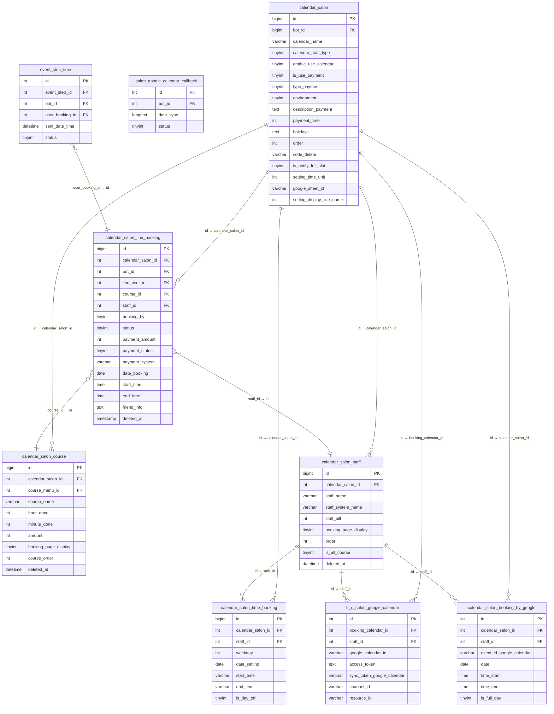

# FA-020 — Đặt lịch salon (「サロン・面談予約」)

> Tổng hợp bởi: spec-compiler agent | Ngày: 2026-06-04  
> Dựa trên: ui-spec.md, api-spec.md, logic-spec.md, job-spec.md, db-mapping.md, validation-report.md  
> Confidence tổng thể: **Cao** (75%) / Trung bình (20%) / Thấp (5%)

---

## 1. Tổng quan

### 1.1 Mục đích tính năng

Tính năng 「サロン・面談予約」 (Đặt lịch salon / Hẹn tư vấn) cho phép Admin LINE OA xây dựng hệ thống đặt lịch trực tuyến hoàn chỉnh tích hợp với LINE LIFF. LINE User có thể đặt lịch từ điện thoại qua LIFF URL, Admin quản lý toàn bộ lịch hẹn, nhân viên, khóa học, và tùy chọn bật thanh toán online (Stripe / UnivaPay).

### 1.2 Actors

| Actor | Phạm vi | Mô tả |
|-------|---------|-------|
| **Admin** | Toàn bộ | Tạo/quản lý salon calendars, cài đặt khóa học/nhân viên, cài đặt tin nhắn, bật thanh toán, xử lý booking requests |
| **Staff** | Tùy phân quyền | Xem và thao tác trên các salon được phân quyền (chi tiết phân quyền chưa fully-captured) |
| **LINE User** | Trang LIFF công khai | Đặt lịch, xem lịch sử đặt lịch qua LIFF URL. Không cần đăng nhập admin portal |

### 1.3 Phạm vi tổng thể

| Hạng mục | Số lượng |
|---------|---------|
| Màn hình chính | 5 (SCR-SLN-01 đến SCR-SLN-05) |
| Endpoints API | 63 (EP-01 đến EP-63) |
| Spring Boot Jobs | 4 task managers |
| Laravel Queue Jobs | 5 jobs |
| DB Tables | 20 |
| Controllers | 2 (CalendarSalonController + SettingPaymentCalendarSalonController) |
| Services | 14+ |

### 1.4 Hạn chế theo plan

| Plan | Số calendar tối đa | Số course/staff tối đa |
|------|-------------------|----------------------|
| free / plan_type=2 | 2 tổng (bất kỳ loại) | 2 mỗi loại per calendar |
| standard/enterprise mới (`flag_contract_new=1`) | 3 個人 + 3 スタッフ = 6 | 200 mỗi loại |
| standard cũ / pro / enterprise_pro | 10 個人 + 10 スタッフ = 20 | 200 mỗi loại |

---

## 2. Các màn hình + Luồng xử lý end-to-end

### 2.1 SCR-SLN-01: Danh sách lịch hẹn salon (「カレンダー一覧」)

**URL:** `/basic/calendar-salon`  
**Controller:** `CalendarSalonController@index`

#### Luồng tải trang

```
Admin vào menu 予約管理 > サロン・面談予約
  → GET /basic/calendar-salon (view render)
    → AJAX: GET /basic/calendar-salon/list-calendar-salon?staffTypeFilter=0
      → CalendarSalonController@getListCalendarSalon
        → kiểm tra bot hiện tại
        → SELECT calendar_salon WHERE bot_id = {botId} ORDER BY `order` ASC
        → checkMaxCalendarMayBeCreate() → trả về canCreate (bool) + enableTooltipCalendar
        → map từng calendar → CalendarSalonResource (kèm LIFF URL, Google Sheet icon...)
      → Response: { success: true, data: { calendar_salon: [...], canCreate: bool } }
    ← UI render grid các calendar cards
```

#### Thành phần UI chính

| Component | Mô tả | Endpoint liên quan |
|-----------|-------|-------------------|
| Nút 「新規作成」 | Tạo salon calendar mới. Nếu `canCreate=false` → alert upgrade plan | EP-03 |
| Dropdown 「カレンダータイプ」 | Lọc 全て / 個人 / スタッフ | EP-02 (tham số `staffTypeFilter`) |
| Đếm 「登録カレンダー数：{n}/{max}」 | Hiện số đã tạo / giới hạn plan | - |
| Nút 「並び替え」 | Drag-drop để sắp xếp thứ tự | EP-04 |
| Card mỗi salon | Xem chi tiết mục 2.1a | - |

#### Card salon (mỗi item)

- Badge loại 「スタッフ」 hoặc 「個人」 (từ `calendar_staff_type`)
- Toggle 「有効」/「無効」 — bật/tắt hoạt động calendar (`enable_use_calendar`)
- Ảnh thumbnail (`image_calendar`), Tên salon (`calendar_name`)
- Nút 「予約管理ページを開く」 → `/basic/calendar-salon/{id}`
- 「予約ページURL」: LIFF URL `https://liff.line.me/{liff_id}?calendar_salon_id={id}&ts={timestamp}` + nút copy
- 「予約履歴ページURL」: `...?calendar_salon_id={id}&tab=history&ts={timestamp}` + nút copy
- Icon Google Spreadsheet (nếu đã liên kết `google_sheet_id`)

#### Luồng tạo salon mới

```
Admin click 「新規作成」
  → POST /basic/calendar-salon/create-new-calendar-salon
    → Body: { calendar_name: "...", holidays: [] }
    → CalendarSalonController@createNewCalendarSalon
      → CalendarSalonService@createNewCalendarSalon()
        → checkMaxCalendarMayBeCreate() → nếu quá giới hạn → return error
        → xác định calendar_staff_type tự động theo plan
        → INSERT calendar_salon (enable_use_calendar=1, use_course=1, display_course_cost=1, ...)
        → INSERT calendar_salon_setting_time_free (mặc định)
      → Response: { success: true, data: {CalendarSalon} }
  ← UI thêm card mới vào danh sách
```

#### Luồng sắp xếp

```
Admin drag-drop calendar cards → nhả vào vị trí mới
  → POST /basic/calendar-salon/sort
    → Body: { ids: [377, 306, 376, ...] } (thứ tự mới)
    → CalendarSalonController@saveSort
      → UPDATE calendar_salon SET `order` = {index} WHERE id = {id}
  ← UI cập nhật thứ tự không reload
```

---

### 2.2 SCR-SLN-02: Trang quản lý đặt lịch chi tiết (「予約管理ページ」)

**URL:** `/basic/calendar-salon/{id}`  
**Controller:** `CalendarSalonController@detailCalendar`

#### Luồng tải trang

```
Admin click 「予約管理ページを開く」 (từ SCR-SLN-01)
  → GET /basic/calendar-salon/{id} (view render)
    → CalendarSalonController@detailCalendar
      → kiểm tra calendar thuộc bot hiện tại (checkCalendarBelongBot)
      → Nếu loại 個人 và chưa có staff → tự động tạo staff 「運営者」 + template tin nhắn mặc định
      → createSettingMessageDefault() nếu chưa có
      → createSettingFormDefault() nếu chưa có (tạo field tên + email)
      → createSettingLimitDefault() nếu chưa có
      → chuẩn bị Google Sheet auth URL nếu cần
    → AJAX: GET /basic/calendar-salon/{id}/detail → CalendarSalonController@detailCalendarSalon
  ← Render trang với 5 tab chính
```

#### Tab navigation

| Tab | Tiêu đề JP | Sub-tab / Nội dung |
|-----|------------|-------------------|
| 1 | 「本日／新着の予約」 | Sub-tab: 新着 / 本日 → bảng booking |
| 2 | 「予約カレンダー」 | Lịch dạng calendar (day/week/month view) |
| 3 | 「コース・スタッフ」 | Sub-menu: コース作成・編集 / 表示設定 / スタッフ作成・編集 / 表示設定 |
| 4 | 「予約設定」 | Sidebar menu nhiều mục cài đặt |
| 5 | 「決済連携」 | Cài đặt Stripe / UnivaPay |

---

#### SCR-SLN-02a: Tab「本日／新着の予約」— Danh sách booking

**API:** `GET /basic/calendar-salon/{id}/get-list-booking`

##### Luồng xem danh sách

```
Admin mở tab 「本日／新着の予約」
  → GET /basic/calendar-salon/{id}/get-list-booking?tab_query=new_booking&page=1&per_page=50
    → CalendarSalonController@getListBooking (dòng 660)
      → CalendarSalonLineBookingService@getListBooking()
        → SELECT calendar_salon_line_booking với filters + pagination
        → JOIN calendar_salon_course (course_name), calendar_salon_staff (staff_system_name)
        → map status → text JP (xem Enum §3.2)
        → xác định nextDay = (end_time < start_time)
        → format ngày: Y.m.d, giờ: H:i
      → Response: { data: [...], total, per_page, current_page }
  ← Hiển thị bảng phân trang
```

##### Cột bảng đặt lịch

| Cột | Label JP | DB Source |
|-----|---------|-----------|
| 1 | 「操作が行われた日時」 | `calendar_salon_line_booking.created_at` |
| 2 | 「来店予定日時」 | `date_booking` + `start_time` |
| 3 | 「ステータス」 | `status` → text JP |
| 4 | 「お名前」 | `name` hoặc `line_user_name` (theo `setting_display_line_name`) |
| 5 | 「コース」 | `course_id` → `calendar_salon_course.course_name` |
| 6 | 「スタッフ」 | `staff_id` → `calendar_salon_staff.staff_system_name` |
| 7 | 「決済金額」 | `payment_amount` (yên, INT) |
| 8 | Nút thao tác | - |

##### Bộ lọc sidebar (「絞り込み設定」)

| Filter | DB Column |
|--------|-----------|
| 「予約日」 (date range) | `date_booking BETWEEN date_start AND date_end` |
| 「予約開始時間」 | `start_time BETWEEN time_start AND time_end` |
| 「表示するコース」 | `course_id IN (course_ids)` |
| 「表示するスタッフ」 | `staff_id IN (staff_ids)` |
| 「予約ステータス」 | `status IN (booking_status)` |
| 「決済ステータス」 | `payment_status IN (payment_status)` |

##### Luồng thao tác hàng loạt (Modal「リクエスト一括操作」)

```
Admin chọn nhiều booking (checkbox) → click 「一括操作」
  → Modal hiện: chọn loại thao tác:
    - 新規予約リクエストを承認する / 否認する
    - キャンセルリクエストを承認する / 否認する
    - アクションの実行: 実行する / 実行しない
  → POST /basic/calendar-salon/{id}/booking/change-status
    → CalendarSalonController@changeStatusBooking (dòng 3525)
      → CalendarSalonLineBookingService@changeStatusBooking()
        → cập nhật status từng booking
        → nếu có thanh toán liên quan → kiểm tra paymentStatus
        → ghi CalendarSalonLineBookingHistoryAction
    → Response: { success: true }
  ← UI refresh bảng booking
```

##### Luồng export CSV (Modal「CSV管理」)

```
Admin click 「…」 → 「CSV管理」 → Tab エクスポート
  → Nhập khoảng ngày (開始日 ~ 終了日) + chọn staff
  → POST /basic/calendar-salon/{calendar_id}/export-csv-staff
    → Body: { staff_ids: [...], start_date, end_date, staff_type }
    → CalendarSalonController@exportCsvStaff (dòng 3404)
      → Tạo file CSV booking theo khoảng ngày và staff đã chọn
      → Ghi chú: mỗi course tạo 1 file CSV riêng
    → Response: file download
```

---

#### SCR-SLN-02b: Tab 「予約カレンダー」— Calendar view

**API:** `GET /basic/calendar-salon/{id}/booking-staff`

##### Luồng tải calendar

```
Admin click tab 「予約カレンダー」
  → GET /basic/calendar-salon/{id}/booking-staff?displayMode=day&date=2026-06-04
    → CalendarSalonController@getBookingStaff (dòng 2744)
      → theo displayMode:
        - day   → CalendarSalonStaffService@getStaffWithBookingInDay2()
        - week  → CalendarSalonLineBookingService@getBookingListWeek()
        - month → CalendarSalonLineBookingService@getBookingListMonth()
    → Response: danh sách staff + booking slots cho ngày/tuần/tháng
  ← Render calendar grid theo cột nhân viên
```

##### Luồng thêm ca làm việc (Modal「シフト追加」)

```
Admin click 「シフト追加」
  → Chọn nhân viên từ combobox
  → Chọn ngày (calendar widget) HOẶC thứ trong tuần
  → Nhập giờ bắt đầu / kết thúc (hỗ trợ "24:00" cho kết thúc nửa đêm)
  → Tùy chọn: 「休業日として設定する」
  → Cảnh báo: "Nếu đã có shift → sẽ bị overwrite"
  → POST /basic/calendar-salon/{calendar_id}/add-work-schedule
    → CalendarSalonController@addWorkScheduleForStaff
      → CalendarSalonTimeBookingService@addWorkScheduleForStaff()
        → INSERT/UPDATE calendar_salon_time_booking
          (staff_id, weekday OR date_setting, start_time, end_time, is_day_off)
    → Response: { status: true }
  ← Calendar refresh với shift mới
```

##### Luồng thêm đặt lịch thủ công (Modal「予約追加」)

```
Admin click ô trống trên calendar → Modal 「予約追加」
  → Tải danh sách:
    GET /basic/calendar-salon/{id}/get-staffs-active → CalendarSalonController@getListStaffActive
    GET /basic/calendar-salon/{id}/get-courses-active → CalendarSalonController@getListCourseActive
  → Admin điền:
    - Khách hàng: chọn từ LINE friends (line_user_id) HOẶC nhập thủ công (manual_name)
    - コース: course_id
    - スタッフ: staff_id (optional)
    - 予約日時: date_booking + start_time (end_time tự tính từ course duration)
    - 予約時アクションの実行: is_run_action (bool)
  → POST /basic/calendar-salon/{calendar_id}/create-booking
    → CalendarSalonController@createBooking (dòng 3545)
      → CalendarSalonLineBookingService@createBooking()
        → INSERT calendar_salon_line_booking (booking_by=1 = Admin)
        → dispatch CalendarSalonStaffAssignmentAdmin job (queue database)
    → Response: { success: true }
  ← Calendar refresh với booking mới
```

##### Luồng sửa/xóa shift

```
Admin click shift trên calendar → Modal 「シフト編集」
  → Sửa giờ làm việc
  → POST /basic/calendar-salon/{id}/staff/update-time-working → EP-58
  → HOẶC DELETE /basic/calendar-salon/{id}/staff/delete-time-working → EP-57
    → Kiểm tra trước: nếu còn booking 「予約確定」 trong timeline shift → từ chối xóa
    → Error: "シフトを削除する場合、全ての予約がキャンセルになっている必要があります"
```

##### Luồng phân công nhân viên

```
Admin click booking → Panel chi tiết → Link 「スタッフの割り当てを変更する」
  → POST /basic/calendar-salon/{id}/save-staff-assignment → EP-46
    → CalendarSalonController@saveStaffAssignment
      → UPDATE calendar_salon_line_booking SET staff_id = {newStaffId}
```

---

### 2.3 SCR-SLN-03: Tab 「コース・スタッフ」— Cài đặt khóa học và nhân viên

#### SCR-SLN-03a: 「コース作成・編集」

**API:** `GET /basic/calendar-salon/{id}/get-list-courses`

##### Luồng xem danh sách khóa học

```
Admin click 「コース作成・編集」
  → GET /basic/calendar-salon/{id}/get-list-courses?course_menu_id=
    → CalendarSalonController@listsCourse (dòng 762)
      → SELECT calendar_salon_course WHERE calendar_salon_id = {id} ORDER BY course_order
      → kiểm tra plan: nếu free/plan_type=2 và count >= 2 → isAdd=false + msg_plan
    → Response: { success: true, data: [...courses], isAdd: bool, msg_plan: null/string }
  ← Hiển thị bảng khóa học với drag handle để sắp xếp
```

##### Cột bảng khóa học

| Cột | Label JP | DB Source |
|-----|---------|-----------|
| drag handle | - | `course_order` / `order` (sau sắp xếp) |
| 「予約ページ表示」 | Toggle ON/OFF | `booking_page_display` (1=ON, 0=OFF) |
| 「イメージ」 | Thumbnail | `course_image` |
| 「コース名」 | Link → form edit | `course_name` |
| 「料金」 | Giá hoặc 「設定なし」 | `amount` (INT yên, NULL=設定なし) |
| Edit icon | Mở form sửa | - |

##### Luồng tạo/sửa khóa học

```
Admin click 「コース作成」 HOẶC click tên course
  → GET /basic/calendar-salon/api/course/{id}/edit (nếu sửa) → EP-24
  → Form edit với các fields:
    - コース名 (course_name, bắt buộc)
    - Hình ảnh (course_image)
    - Mô tả (course_description)
    - 所要時間: giờ (hour_done) + phút (minute_done)
    - 料金 (amount, có thể NULL)
    - Nhóm menu (course_menu_id)
    - Hiển thị trên trang booking (booking_page_display)
    - Cài đặt tin nhắn / action per-course
  → POST /basic/calendar-salon/{id}/salon-course/create (tạo mới) → EP-20
     HOẶC POST /basic/calendar-salon/api/course/{id}/update (sửa) → EP-25
```

##### Luồng sắp xếp và toggle hiển thị

```
Drag-drop course trong bảng
  → POST /basic/calendar-salon/api/course/sortable → EP-59
    → Body: { ids: [id1, id2, ...] }
    → UPDATE calendar_salon_course SET course_order = {index}

Toggle 「予約ページ表示」
  → POST /basic/calendar-salon/course/update-booking-page-display → EP-61
    → UPDATE calendar_salon_course SET booking_page_display = {0|1}
    → Khi ẩn: xóa booking sync từ Google liên quan
```

##### Luồng xóa khóa học

```
Admin click xóa course
  → POST /basic/calendar-salon/api/course/{id}/delete → EP-29
    → Kiểm tra: nếu còn booking active trong course menu → từ chối xóa
    → Force delete CalendarSalonCourse (kể cả soft-deleted records)
```

---

#### SCR-SLN-03b: 「コースの表示設定」

**API:** `GET /basic/calendar-salon/{id}/get-booking-setting-display` (EP-11)

| Cài đặt | Label JP | DB Column |
|---------|---------|-----------|
| Dùng chọn khóa học | 「コース選択の利用」 | `calendar_salon.use_course` (1=có, 0=không) |
| Hiển thị giá | 「コース料金の表示」 | `calendar_salon.display_course_cost` (1=hiện) |
| Hiển thị thời gian | 「コースの所要時間の表示」 | `calendar_salon.display_time_make_course` (1=hiện) |

Ghi chú: Khi bật thanh toán → giá tự động hiển thị bất kể cài đặt.

**Lưu:** `POST /basic/calendar-salon/{id}/setting-booking-display` (EP-12)

---

#### SCR-SLN-03 Staff: 「スタッフ作成・編集」và 「スタッフの表示設定」

**API danh sách:** `GET /basic/calendar-salon/{id}/get-list-staffs` (EP-28)

| Endpoint | Controller@method | Mô tả |
|----------|-------------------|-------|
| EP-21 | `createStaffSalon` | Tạo nhân viên mới |
| EP-23 | `editStaff` (view) | Mở form chỉnh sửa |
| EP-26 | `staff` (AJAX detail) | Lấy dữ liệu nhân viên |
| EP-27 | `updateStaff` | Cập nhật nhân viên |
| EP-30 | `deleteCalendarStaff` | Xóa nhân viên (force delete) |
| EP-60 | `updateCalendarStaffOrder` | Sắp xếp thứ tự |
| EP-62 | `updateBookingPageDisplayStaff` | Toggle hiển thị trên trang booking |

**Lưu ý quan trọng khi ẩn nhân viên (EP-62, status=0):**
- Xóa toàn bộ booking sync từ Google cho staff đó
- Xóa `b_c_salon_google_calendar` record cho staff đó

**Fields nhân viên (từ `calendar_salon_staff`):**
`staff_name`, `staff_system_name`, `staff_image`, `staff_bill` (phí bổ sung), `hour_done`, `minute_done`, `staff_description`, `booking_page_display`, `is_all_course`, `course_ids`, `setting_staff_limit`, `limited_quantity`

---

### 2.4 SCR-SLN-04: Tab 「予約設定」— Cài đặt đặt lịch

Sidebar menu với nhiều mục cài đặt. Chi tiết từng mục:

#### 2.4.1 「予約・キャンセルのメッセージ・リクエストと締切」

**API GET:** EP-15 `GET /basic/calendar-salon/{id}/setting-message`  
**API SAVE:** EP-16 `POST /basic/calendar-salon/{id}/save-setting-message`  
**DB:** `calendar_salon_setting_send_messages` (2 records per calendar: `moment='booking'` và `moment='cancel'`)

| Sub-tab | Cài đặt | DB Column |
|---------|---------|-----------|
| メッセージ | Tin nhắn xác nhận đặt | `message_send_booking`, `message_send_approve`, `message_send_deny`, `message_send_end` |
| アクション | Action khi booking/cancel (SC-004) | `setting_action_id`, `setting_action_request`, `setting_action_approve`, `setting_action_reject` |
| 各種設定 | Phương thức xác nhận | `approve_type` (1=自動, 2=Admin手動, 3=禁止キャンセル) |
| 各種設定 | Thời gian nhận booking | `start_receive_booking_type`, `before_booking_day/hour`, `booking_time_from/to` |
| 各種設定 | Giới hạn hủy | `deadline_cancel_booking_type`, `deadline_before_booking_day/hour` |
| 各種設定 | Giới hạn per-customer | `limit_book_each_customer`, `number_limit_booking`, `text_limit_book_each_customer` |

#### 2.4.2 「予約前後に送るリマインドメッセージ」

**API GET:** EP-39 `GET /ajax/calendar-salon/get-list-step-remind`  
**API SAVE:** EP-40 `POST /ajax/calendar-salon/save-setting/remind`

Logic sau khi lưu → `addActionRemindNew()` tính `sent_date_time` cho từng booking hiện tại và INSERT vào `event_step_time` → Spring Boot `NewEventRemindTask` gửi theo lịch.

Hai loại remind:
- **type_remind=1**: Ngày trước/sau ngày đặt lịch, gửi vào `time_send`
- **type_remind=2**: Đếm ngược từ giờ bắt đầu/kết thúc booking

Filter theo course_ids và staff_ids nếu bật `is_use_filter`.

#### 2.4.3 「前後の空き時間」

**API GET:** EP-35 `GET /ajax/calendar-salon/init-setting-free-time-before-after/{id}`  
**API SAVE:** EP-36 `POST /ajax/calendar-salon/save-setting-free-time`  
**DB:** `calendar_salon_setting_time_free` — `time_before`, `time_after` (phút), và `time_before_google`, `time_after_google` (cho Google Calendar blocks)

#### 2.4.4 「店舗とスタッフの受付上限」

**API GET:** EP-37 `GET /ajax/calendar-salon/init-setting-limit-booking/{id}`  
**API SAVE:** EP-38 `POST /ajax/calendar-salon/save-setting-limit-booking`  
**DB:** `calendar_salon_setting_limit_booking` — `limit` (0=unlimited, 1=limited), `limited_quantity`, `setting_staffs_limit` (JSON per-staff)

#### 2.4.5 Các cài đặt khác

| Mục | Endpoint GET | Endpoint SAVE | DB |
|-----|-------------|---------------|----|
| 「店舗・ビジネス情報」 | EP-49 | EP-51 | `calendar_salon` (image, description, store_name) |
| 「利用規約」 | EP-49 | EP-50 | `calendar_salon` (`show_policy`, `content_policy`) |
| 「システムワード変更」 | - | EP-52 | `calendar_salon` (`booking_setting_name`, `booking_setting_text_fee`, `booking_setting_text_staff`) |
| 「Googleカレンダー連携」 | EP-47 | EP-48 | `b_c_salon_google_calendar` (per-staff OAuth) |
| 「Googleスプレッドシート連携」 | - | - | `calendar_salon` (`google_sheet_id`, `google_sheet_access_token`) |
| 「受付上限の通知」 | EP-55 | EP-56 | `calendar_salon` (`is_notify_full_slot`, `message_notify_full_slot`) |

#### 2.4.6 「予約システムの削除」— Quy trình 2 bước xác thực

```
Admin click 「削除」
  → Bước 1: POST /ajax/calendar-salon/send-mail/delete → EP-43
    → Tạo code 10 ký tự ngẫu nhiên → lưu vào calendar_salon.code_delete
    → Gửi email xác thực đến Admin
  → Admin nhận email, nhập code
  → Bước 2: POST /ajax/calendar-salon/check-author/delete → EP-44
    → So sánh code
  → Nếu đúng: POST /ajax/calendar-salon/action/delete → EP-42
    → { id: {calendarId}, code: "..." }
    → Cascade delete toàn bộ: courses, staffs, bookings, shifts, settings, Google Calendar events...
    → (xem Business Rules BR-07 để biết danh sách đầy đủ)
```

---

### 2.5 SCR-SLN-05: Tab 「決済連携」— Cài đặt thanh toán

**API GET:** `GET /ajax/calendar-salon/init-data-setting-payment?calendar_id={id}` (EP-17)  
**API SAVE:** `POST /ajax/calendar-salon/save-setting-payment` (EP-18)  
**Controller:** `SettingPaymentCalendarSalonController`

#### Luồng tải dữ liệu

```
Admin click tab 「決済連携」
  → GET /ajax/calendar-salon/init-data-setting-payment?calendar_id={id}
    → SettingPaymentCalendarSalonController@initDataSettingPayment (dòng 17)
      → đọc CalendarSalon (cài đặt thanh toán)
      → kiểm tra StripBot record → checkLinkedStripe / checkLinkedUnivapay
      → kiểm tra BotContracts → contractType
      → kiểm tra calendar_salon_setting_send_forms: name (-1) + email (-3) enabled
        → checkEnableNameAndEmailDefault
      → lấy listHistoryPayment từ calendar_salon_history_change_setting_payment
    → Response: { status, checkLinkPayment, settingPayment, checkLinkedStripe,
                  checkLinkedUnivapay, listHistoryPayment, contractType,
                  checkEnableNameAndEmailDefault }
  ← Render form cài đặt thanh toán
```

**Giải thích `checkLinkPayment=true`:** Chưa liên kết Stripe/UnivaPay → hiển thị hướng dẫn liên kết.

#### Form cài đặt thanh toán

| Field | Label JP | DB Column |
|-------|---------|-----------|
| Toggle bật/tắt | 「決済機能の利用」 | `calendar_salon.is_use_payment` (1=有り) |
| Chọn nhà cung cấp | 「利用する決済システム」 | `calendar_salon.type_payment` (1=Stripe, 2=UnivaPay) |
| Môi trường | 「販売環境設定」 | `calendar_salon.environment` (0=テスト, 1=本番) |
| Phương thức thanh toán | 「予約時決済の選択」 | `calendar_salon.payment_time` (1=のみ, 2=選択可能) |
| Nội dung pháp lý | 「特定商取引法に基づく表記」 | `calendar_salon.description_payment` (TinyMCE HTML) |

**Ghi chú quan trọng:** Sau khi chọn nhà cung cấp (Stripe/UnivaPay) và lưu lần đầu → không thể thay đổi nhà cung cấp.

#### Luồng lưu cài đặt thanh toán

```
Admin điền form → click 「保存」
  → POST /ajax/calendar-salon/save-setting-payment
    → Body: { calendar_id, type_payment, environment, description_payment, payment_time, is_use_payment }
    → SettingPaymentCalendarSalonController@saveSettingPayment (dòng 152)
      → Điều kiện bật: đã liên kết Stripe/UnivaPay VÀ form booking có field tên + email bắt buộc
      → Nếu bật → tự động enable name (friend_information_id=-1) + email (friend_information_id=-3)
                  trong calendar_salon_setting_send_forms
      → Ghi lịch sử vào calendar_salon_history_change_setting_payment
        (from=trạng thái cũ, to=trạng thái mới, user_id=admin hiện tại)
      → UPDATE calendar_salon (is_use_payment, type_payment, environment, ...)
    → Response: { status: true }
```

#### Section「決済利用 変更履歴」

Bảng lịch sử từ `calendar_salon_history_change_setting_payment`:

| Cột | Label JP | DB Source |
|-----|---------|-----------|
| 「日時」 | Ngày giờ | `created_at` |
| 「操作した人」 | Tên admin | `user_id` JOIN `users` |
| 「内容」 | Mô tả thay đổi | `from` → `to` (dạng "停止 → 利用中(テスト環境)") |

---

### 2.6 Flow LINE User đặt lịch (qua LIFF)

LINE User không truy cập admin portal — chỉ qua LIFF URL:

```
LINE User click LIFF URL (trong tin nhắn LINE hoặc profile OA):
  https://liff.line.me/{liff_id}?calendar_salon_id={id}&ts={timestamp}
    → Trang chọn khóa học (nếu use_course=1)
    → Trang chọn nhân viên (nếu calendar_staff_type=2)
    → Trang chọn ngày + giờ (dựa trên calendar_salon_time_booking — shifts)
    → Form nhập thông tin (từ calendar_salon_setting_send_forms)
    → (Trang thanh toán nếu is_use_payment=1)
    → Xác nhận → INSERT calendar_salon_line_booking (status=0 hoặc 1 tùy approve_type)
      → dispatch CalendarSalonStaffAssignment job (phân công nhân viên tự động)
  ← Admin nhận thông báo booking mới (nếu cài đặt)
  ← LINE User nhận tin nhắn xác nhận (từ message_send_booking)
```

**URL lịch sử:** `...?calendar_salon_id={id}&tab=history&ts={timestamp}`

---

## 3. Data Model

### 3.1 Entities chính

| Thực thể | Table | SoftDelete | Ghi chú |
|----------|-------|-----------|---------|
| Salon Calendar | `calendar_salon` | Không | Bảng master, chứa cả cài đặt payment |
| Đặt lịch | `calendar_salon_line_booking` | Có | Booking chính + thông tin thanh toán |
| Khóa học | `calendar_salon_course` | Có | Dịch vụ/khóa học của salon |
| Nhóm khóa học | `calendar_salon_course_menu` | Có | Menu nhóm khóa học |
| Nhân viên | `calendar_salon_staff` | Có | Staff của salon |
| Ca làm việc | `calendar_salon_time_booking` | Không | Shift schedule của nhân viên |
| Cài đặt tin nhắn | `calendar_salon_setting_send_messages` | Có | 2 rows per calendar (booking/cancel) |
| Form câu hỏi | `calendar_salon_setting_send_forms` | Có | Câu hỏi khi đặt lịch |
| Thời gian trống | `calendar_salon_setting_time_free` | Không | Buffer trước/sau booking |
| Giới hạn booking | `calendar_salon_setting_limit_booking` | Không | Giới hạn slot |
| Lịch sử thay đổi payment | `calendar_salon_history_change_setting_payment` | Không | Audit log |
| Lịch sử action booking | `calendar_salon_line_booking_history_actions` | Không | Audit log |
| Lịch sử thanh toán booking | `calendar_salon_line_booking_payment_history` | Không | Payment status changes |
| Thông báo đầy slot | `calendar_salon_setting_notify_full_history` | Không | Audit log |
| OAuth Google Calendar | `b_c_salon_google_calendar` | Không | Per-staff, 1-to-1 với staff |
| Block time Google | `calendar_salon_booking_by_google` | Không | Slot bận từ Google Calendar |
| Lịch sử sync Google | `calendar_salon_sync_booking_google_calendar_histories` | Không | 11.4MB |

### 3.2 Queue Tables (trung gian)

| Table | Xử lý bởi | Mô tả |
|-------|----------|-------|
| `salon_google_calendar_callback` | Spring Boot `HandleSalonCalendarCallbackManager` | 18.1MB — queue Google webhook |
| `event_step_time` | Spring Boot `NewEventRemindTask` | Chung toàn hệ thống, remind theo lịch |
| `calendar_salon_download_csv_sync_google_calendar` | Spring Boot `HandleExportSalonCalendarManager` | Export CSV lịch sử sync |

### 3.3 ER Diagram



---

## 4. Field Traceability Matrix

| # | UI Element | Màn hình | DB Table.Column | Hướng | Validation | Business Rule |
|---|-----------|---------|-----------------|-------|-----------|---------------|
| 1 | Tên salon card | SCR-SLN-01 | `calendar_salon.calendar_name` | R/W | varchar(100), bắt buộc | - |
| 2 | Badge loại 「スタッフ」/「個人」 | SCR-SLN-01 | `calendar_salon.calendar_staff_type` | R | Enum: 1=個人, 2=スタッフ | BR-01 (auto-set khi tạo) |
| 3 | Toggle 「有効/無効」 | SCR-SLN-01 | `calendar_salon.enable_use_calendar` | R/W | 0/1 | - |
| 4 | Thứ tự card | SCR-SLN-01 | `calendar_salon.order` | R/W | int | EP-04 sortable |
| 5 | 予約ページURL | SCR-SLN-01 | `calendar_salon.id` + config liff_id | R (computed) | LIFF URL format | - |
| 6 | Google Sheet icon | SCR-SLN-01 | `calendar_salon.google_sheet_id` | R | NULL=không hiển thị | - |
| 7 | Số đã tạo / max | SCR-SLN-01 | COUNT(calendar_salon) / plan limit | R (computed) | - | BR-01 |
| 8 | 「操作が行われた日時」 | SCR-SLN-02a | `calendar_salon_line_booking.created_at` | R | timestamp | - |
| 9 | 「来店予定日時」 | SCR-SLN-02a | `calendar_salon_line_booking.date_booking` + `start_time` | R | date+time | - |
| 10 | 「ステータス」 booking | SCR-SLN-02a | `calendar_salon_line_booking.status` | R/W | Enum 0-7 | BR-12 (xóa shift check) |
| 11 | 「お名前」 khách | SCR-SLN-02a | `calendar_salon_line_booking.name` hoặc `line_user_name` | R | `setting_display_line_name` quyết định | - |
| 12 | 「コース」 | SCR-SLN-02a | `calendar_salon_line_booking.course_id` → `calendar_salon_course.course_name` | R | FK JOIN | - |
| 13 | 「スタッフ」 | SCR-SLN-02a | `calendar_salon_line_booking.staff_id` → `calendar_salon_staff.staff_system_name` | R | FK JOIN, NULL="指定なし" | - |
| 14 | 「決済金額」 | SCR-SLN-02a | `calendar_salon_line_booking.payment_amount` | R | INT (yên) | - |
| 15 | 「決済ステータス」 | SCR-SLN-02a | `calendar_salon_line_booking.payment_status` | R/W | Enum 0-3 (+4,5 chưa xác nhận) | BR-05 |
| 16 | Filter 「予約日」 | SCR-SLN-02a | `calendar_salon_line_booking.date_booking` | Filter | date BETWEEN | - |
| 17 | Nhân viên (Modal シフト) | SCR-SLN-02b | `calendar_salon_time_booking.staff_id` | W | FK bắt buộc | - |
| 18 | Ngày/thứ ca làm | SCR-SLN-02b | `calendar_salon_time_booking.weekday` hoặc `date_setting` | W | 0-6 weekday, hoặc date cụ thể | - |
| 19 | Giờ bắt đầu ca | SCR-SLN-02b | `calendar_salon_time_booking.start_time` | W | varchar "HH:MM", hỗ trợ "24:00" | - |
| 20 | Giờ kết thúc ca | SCR-SLN-02b | `calendar_salon_time_booking.end_time` | W | varchar "HH:MM" | BR-12 |
| 21 | Nghỉ 「休業日」 | SCR-SLN-02b | `calendar_salon_time_booking.is_day_off` | W | 0/1 | - |
| 22 | Chọn khách LINE | SCR-SLN-02b | `calendar_salon_line_booking.line_user_id` | W | FK → bot_line_user | - |
| 23 | Tên khách (nhập tay) | SCR-SLN-02b | `calendar_salon_line_booking.name` | W | khi line_user_id=NULL | - |
| 24 | Chọn khóa học (booking) | SCR-SLN-02b | `calendar_salon_line_booking.course_id` | W | FK bắt buộc | - |
| 25 | Chọn nhân viên (booking) | SCR-SLN-02b | `calendar_salon_line_booking.staff_id` | W | FK optional | - |
| 26 | Ngày đặt lịch | SCR-SLN-02b | `calendar_salon_line_booking.date_booking` | W | date YYYY-MM-DD | - |
| 27 | Giờ bắt đầu (booking) | SCR-SLN-02b | `calendar_salon_line_booking.start_time` | W | time HH:MM | - |
| 28 | Giờ kết thúc (booking) | SCR-SLN-02b | `calendar_salon_line_booking.end_time` | R (computed) | = start_time + course duration | - |
| 29 | Thực thi action khi đặt | SCR-SLN-02b | `calendar_salon_line_booking.do_action` | W | 0/1 | - |
| 30 | booking_by | SCR-SLN-02b | `calendar_salon_line_booking.booking_by` | W (auto) | 1=Admin, 0=LINE User | - |
| 31 | Toggle hiển thị course | SCR-SLN-03a | `calendar_salon_course.booking_page_display` | R/W | 0/1 | BR-10 (nếu ẩn xóa Google sync) |
| 32 | Tên khóa học | SCR-SLN-03a | `calendar_salon_course.course_name` | R/W | varchar(100), bắt buộc | - |
| 33 | Giá khóa học | SCR-SLN-03a | `calendar_salon_course.amount` | R/W | INT yên, NULL=設定なし | BR-02 (plan limit course) |
| 34 | Thời gian (giờ+phút) | SCR-SLN-03a | `calendar_salon_course.hour_done` + `minute_done` | R/W | int | - |
| 35 | Ảnh khóa học | SCR-SLN-03a | `calendar_salon_course.course_image` | R/W | file path | - |
| 36 | Dùng chọn course | SCR-SLN-03b | `calendar_salon.use_course` | R/W | 0/1 | - |
| 37 | Hiển thị giá | SCR-SLN-03b | `calendar_salon.display_course_cost` | R/W | 0/1 | Bắt buộc hiện khi bật payment |
| 38 | Hiển thị thời gian | SCR-SLN-03b | `calendar_salon.display_time_make_course` | R/W | 0/1 | - |
| 39 | Phương thức xác nhận | SCR-SLN-04a | `calendar_salon_setting_send_messages.approve_type` | R/W | Enum 1-3 | - |
| 40 | Thời gian nhận booking | SCR-SLN-04a | `calendar_salon_setting_send_messages.start_receive_booking_type` + `before_booking_day/hour` | R/W | Complex | - |
| 41 | Tin nhắn xác nhận đặt | SCR-SLN-04a | `calendar_salon_setting_send_messages.message_send_booking` | R/W | longtext | - |
| 42 | Tin nhắn khi duyệt | SCR-SLN-04a | `calendar_salon_setting_send_messages.message_send_approve` | R/W | longtext | - |
| 43 | Tin nhắn khi từ chối | SCR-SLN-04a | `calendar_salon_setting_send_messages.message_send_deny` | R/W | longtext | - |
| 44 | Thời gian trống trước | SCR-SLN-04 | `calendar_salon_setting_time_free.time_before` | R/W | int (phút) | Monitor job dùng để check conflict |
| 45 | Thời gian trống sau | SCR-SLN-04 | `calendar_salon_setting_time_free.time_after` | R/W | int (phút) | - |
| 46 | Giới hạn booking tổng | SCR-SLN-04 | `calendar_salon_setting_limit_booking.limited_quantity` | R/W | int | - |
| 47 | Câu hỏi form (type text) | SCR-SLN-04 | `calendar_salon_setting_send_forms.question` | R/W | text, bắt buộc | Tối đa 100 câu hỏi |
| 48 | Câu hỏi bắt buộc | SCR-SLN-04 | `calendar_salon_setting_send_forms.required` | R/W | 0/1 | Tên (-1) + email (-3) auto-enable khi bật payment |
| 49 | Bật/tắt thanh toán | SCR-SLN-05 | `calendar_salon.is_use_payment` | R/W | 0/1 | BR-05 (điều kiện bật) |
| 50 | Chọn Stripe/UnivaPay | SCR-SLN-05 | `calendar_salon.type_payment` | R/W | 1=Stripe, 2=UnivaPay | Lock sau khi lưu lần đầu |
| 51 | Môi trường 本番/テスト | SCR-SLN-05 | `calendar_salon.environment` | R/W | 0=テスト, 1=本番 | - |
| 52 | Phương thức thanh toán | SCR-SLN-05 | `calendar_salon.payment_time` | R/W | 1=のみ, 2=選択可能 | - |
| 53 | Nội dung 特定商取引法 | SCR-SLN-05 | `calendar_salon.description_payment` | R/W | text/HTML (TinyMCE SC-005) | - |
| 54 | Lịch sử thay đổi payment | SCR-SLN-05 | `calendar_salon_history_change_setting_payment.from/to/created_at` | R | Audit log | BR-06 |

---

## 5. Business Rules

### BR-01: Giới hạn số lượng calendar theo plan
**Nguồn:** `CalendarSalonService@checkMaxCalendarMayBeCreate()` (dòng 109)

- **free / plan_type=2**: Tối đa 2 calendars (tổng cộng, tối đa 1 mỗi loại)
- **standard/enterprise mới** (`flag_contract_new=1`): 3 個人 + 3 スタッフ
- **standard cũ / pro / enterprise_pro**: 10 個人 + 10 スタッフ
- Vượt giới hạn → lỗi: 「現在のプランは利用できない機能です。アップグレードが必要になります。」

### BR-02: Giới hạn course/staff theo plan
**Nguồn:** `CalendarSalonController` (dòng 419–452, 1175–1267)

- **free / plan_type=2**: Tối đa 2 courses, 2 staffs per calendar
- **Tất cả plans**: Hard limit 200 courses, 200 staffs per calendar
- Form questions: Tối đa 100 câu hỏi per calendar (dòng 1578)

### BR-03: Tự động tạo staff mặc định cho loại 個人
**Nguồn:** `CalendarSalonController@detailCalendar` (dòng 564–594)

Khi truy cập lần đầu calendar loại 個人 chưa có staff → tự động tạo staff tên 「運営者」 với template tin nhắn mặc định bằng tiếng Nhật.

### BR-04: Tự động khởi tạo settings khi lần đầu truy cập
**Nguồn:** `CalendarSalonController@detailCalendar` (dòng 597–599)

- `createSettingMessageDefault()` — tin nhắn booking/cancel mặc định
- `createSettingFormDefault()` — form hỏi mặc định (tên, email)
- `createSettingLimitDefault()` — giới hạn booking mặc định

### BR-05: Điều kiện bật thanh toán
**Nguồn:** `SettingPaymentCalendarSalonController@saveSettingPayment` (dòng 83–95)

Để bật thanh toán cần thỏa mãn đồng thời:
1. Đã liên kết Stripe hoặc UnivaPay (`StripBot` record với trạng thái kết nối đủ điều kiện)
2. Form booking phải có cả trường **tên** (`friend_information_id=-1`) **và email** (`friend_information_id=-3`) đều bật và bắt buộc

Khi bật → tự động bắt buộc enable 2 trường name và email trong `calendar_salon_setting_send_forms`.

### BR-06: Ghi lịch sử thay đổi cài đặt thanh toán
**Nguồn:** `SettingPaymentCalendarSalonController` (dòng 109–151)

Mỗi lần thay đổi trạng thái thanh toán → INSERT 1 record vào `calendar_salon_history_change_setting_payment`:
- Bật từ tắt: `from=STATUS_STOPED → to=STATUS_USING_PRODUCTION/TEST`
- Tắt từ bật: `from=STATUS_USING_* → to=STATUS_STOPED`
- Thay đổi môi trường: `from=STATUS_PRODUCTION → to=STATUS_TEST` (hoặc ngược lại)

### BR-07: Xóa calendar — quy trình 2 bước xác thực qua email
**Nguồn:** `CalendarSalonController` (dòng 2790–3017)

3 bước: gửi email mã → xác nhận mã → xóa cascade. Cascade delete bao gồm:
`CalendarSalon`, `CalendarSalonCourse`, `CalendarSalonCourseMenu`, `CalendarSalonLineBooking`, `CalendarSalonStaff`, `CalendarSalonTimeBooking`, `CalendarSalonSettingSendForms`, `CalendarSalonSettingSendMessage`, tất cả history tables, `Events` type=5, Google Calendar events, `MobileNotify` liên quan.

### BR-08: Logic tính thời gian gửi reminder
**Nguồn:** `CalendarSalonController@addActionRemindNew()` (dòng 2010–2141)

- **type_remind=1** (Ngày trước/sau): `sent_date_time = date_booking ± n_ngày`, giờ = `time_send`
- **type_remind=2** (Đếm ngược): `sent_date_time = start_time/end_time booking ± n_giờ/phút`

Filter remind theo `course_ids` và `staff_ids` nếu `is_use_filter` bật.

### BR-09: Google Calendar liên kết per-staff
**Nguồn:** `CalendarSalonController@changeGoogleLinkForStaff` (dòng 3040–3059)

- Mỗi nhân viên có thể liên kết Google Calendar riêng → 1 record trong `b_c_salon_google_calendar`
- Khi liên kết → dispatch `CalendarSalonSyncBookingFromGoogleToTool` (Laravel Job)
- Khi ngắt liên kết → xóa `CalendarSalonBookingByGoogle` + `BCSalonGoogleCalendar` records

### BR-10: Ẩn nhân viên khỏi trang booking
**Nguồn:** `CalendarSalonController@updateBookingPageDisplayStaff` (dòng 1138–1166)

Khi `status=0` (ẩn): xóa toàn bộ booking sync từ Google + `BCSalonGoogleCalendar` record.

### BR-11: Kiểm tra trước khi xóa course menu
**Nguồn:** `CalendarSalonController` (dòng 879–901)

Nếu còn booking chưa cancel trong các course thuộc menu → từ chối xóa.

### BR-12: Kiểm tra trước khi xóa shift
**Nguồn:** `CalendarSalonController` (dòng 3438–3455)

Không thể xóa shift nếu còn booking 「予約確定」 trong timeline của shift. Lỗi: 「削除するシフトの中に「ステータス：予約確定」の予約が1つ以上残っています...」

---

## 6. API Endpoints Summary

> Chi tiết đầy đủ (request params, response format, business logic) xem tại: `web/api-spec.md`

### 6.1 Nhóm SCR-SLN-01 — Danh sách calendar (4 endpoints)

| EP | Method | URL tóm tắt | Mô tả |
|----|--------|-------------|-------|
| EP-01 | GET | `/basic/calendar-salon` | Render view danh sách |
| EP-02 | GET | `.../list-calendar-salon` | AJAX lấy danh sách + canCreate |
| EP-03 | POST | `.../create-new-calendar-salon` | Tạo salon calendar mới |
| EP-04 | POST | `.../sort` | Lưu thứ tự sắp xếp |

### 6.2 Nhóm SCR-SLN-02 — Quản lý booking (18 endpoints)

| EP | Method | URL tóm tắt | Mô tả |
|----|--------|-------------|-------|
| EP-05 | GET | `/basic/calendar-salon/{id}` | Render view trang detail |
| EP-06 | GET | `.../detail` | AJAX load data detail |
| EP-07 | GET | `.../get-list-booking` | Danh sách booking có filter/pagination |
| EP-08 | GET | `.../get-staffs-active` | Danh sách staff active (cho modal) |
| EP-09 | GET | `.../get-courses-active` | Danh sách course active (cho modal) |
| EP-10 | POST | `.../create-booking` | Tạo booking thủ công (Admin) |
| EP-19 | POST | `.../add-work-schedule` | Thêm/sửa ca làm việc (shift) |
| EP-31 | POST | `.../booking/change-status` | Thay đổi trạng thái booking (hàng loạt) |
| EP-32 | DELETE | `.../booking/delete` | Xóa booking |
| EP-33 | POST | `.../export-csv-staff` | Export CSV booking |
| EP-34 | POST | `.../import-csv-staff` | Import CSV shift |
| EP-45 | GET | `.../booking-staff` | Dữ liệu calendar view (day/week/month) |
| EP-46 | POST | `.../save-staff-assignment` | Thay đổi nhân viên phụ trách booking |
| EP-53 | GET | `.../get-list-booking-delete` | Danh sách booking đã xóa |
| EP-54 | POST | `.../change-display-line-name` | Thay đổi hiển thị tên LINE/hệ thống |
| EP-57 | DELETE | `.../staff/delete-time-working` | Xóa ca làm việc |
| EP-58 | POST | `.../staff/update-time-working` | Cập nhật giờ ca làm việc |
| EP-63 | POST | `.../order-refund` | Hoàn tiền thanh toán |

### 6.3 Nhóm SCR-SLN-03 — Course & Staff (17 endpoints)

| EP | Method | URL tóm tắt | Mô tả |
|----|--------|-------------|-------|
| EP-11 | GET | `.../get-booking-setting-display` | Cài đặt hiển thị course |
| EP-12 | POST | `.../setting-booking-display` | Lưu cài đặt hiển thị |
| EP-13 | GET | `.../get-list-courses` | Danh sách khóa học |
| EP-14 | GET | `.../get-courses-menu` | Danh sách menu nhóm khóa học |
| EP-20 | POST | `.../salon-course/create` | Tạo khóa học mới |
| EP-21 | POST | `.../salon-staff/create` | Tạo nhân viên mới |
| EP-22 | GET | `.../edit-course/{id}` | View form sửa khóa học |
| EP-23 | GET | `.../edit-staff/{id}` | View form sửa nhân viên |
| EP-24 | GET | `.../api/course/{id}/edit` | AJAX lấy data khóa học |
| EP-25 | POST | `.../api/course/{id}/update` | Cập nhật khóa học |
| EP-26 | GET | `.../api/staff/{id}/edit` | AJAX lấy data nhân viên |
| EP-27 | POST | `.../api/staff/{id}/update` | Cập nhật nhân viên |
| EP-28 | GET | `.../get-list-staffs` | Danh sách nhân viên |
| EP-29 | POST | `.../api/course/{id}/delete` | Xóa khóa học |
| EP-30 | POST | `.../api/staff/{id}/delete` | Xóa nhân viên |
| EP-59 | POST | `.../api/course/sortable` | Sắp xếp thứ tự khóa học |
| EP-60 | POST | `.../api/staff/sortable` | Sắp xếp thứ tự nhân viên |
| EP-61 | POST | `.../course/update-booking-page-display` | Toggle hiển thị khóa học |
| EP-62 | POST | `.../staff/update-booking-page-display-staff` | Toggle hiển thị nhân viên |

### 6.4 Nhóm SCR-SLN-04 — Cài đặt đặt lịch (20 endpoints)

| EP | Method | URL tóm tắt | Mô tả |
|----|--------|-------------|-------|
| EP-15 | GET | `.../setting-message` | Cài đặt tin nhắn booking/cancel |
| EP-16 | POST | `.../save-setting-message` | Lưu cài đặt tin nhắn |
| EP-35 | GET | `/ajax/.../init-setting-free-time-before-after/{id}` | Thời gian trống trước/sau |
| EP-36 | POST | `/ajax/.../save-setting-free-time` | Lưu cài đặt thời gian trống |
| EP-37 | GET | `/ajax/.../init-setting-limit-booking/{id}` | Giới hạn booking |
| EP-38 | POST | `/ajax/.../save-setting-limit-booking` | Lưu giới hạn booking |
| EP-39 | GET | `/ajax/.../get-list-step-remind` | Danh sách remind step |
| EP-40 | POST | `/ajax/.../save-setting/remind` | Lưu cài đặt remind |
| EP-41 | GET | `/ajax/.../get-list-courses-by-calendar` | Danh sách course (cho remind filter) |
| EP-42 | POST | `/ajax/.../action/delete` | Xóa calendar (sau xác thực) |
| EP-43 | POST | `/ajax/.../send-mail/delete` | Gửi email mã xác thực xóa |
| EP-44 | POST | `/ajax/.../check-author/delete` | Xác nhận mã xóa |
| EP-47 | GET | `.../get-data-staff-google` | Cài đặt Google Calendar per-staff |
| EP-48 | POST | `.../change-google-link` | Cập nhật liên kết Google Calendar |
| EP-49 | GET | `/ajax/.../setting-reservation/get-data-setting-policy` | Thông tin shop + chính sách |
| EP-50 | POST | `/ajax/.../save/policy` | Lưu chính sách sử dụng |
| EP-51 | POST | `/ajax/.../save/info` | Lưu thông tin cửa hàng |
| EP-52 | POST | `.../save-system-word-change` | Lưu thay đổi system words |
| EP-55 | GET | `/ajax/.../get-data-setting-notify-full-slot/{id}` | Cài đặt thông báo đầy slot |
| EP-56 | POST | `/ajax/.../save-setting/notify-full-slot` | Lưu cài đặt thông báo đầy slot |

### 6.5 Nhóm SCR-SLN-05 — Cài đặt thanh toán (2 endpoints)

| EP | Method | URL tóm tắt | Mô tả |
|----|--------|-------------|-------|
| EP-17 | GET | `/ajax/.../init-data-setting-payment` | Khởi tạo dữ liệu cài đặt payment |
| EP-18 | POST | `/ajax/.../save-setting-payment` | Lưu cài đặt payment |

**Tổng cộng: 63 endpoints**

---

## 7. Background Jobs

### 7.1 Spring Boot Task Managers (4 tasks)

#### 7.1.1 `HandleSalonCalendarCallbackManager` — Đồng bộ Google Calendar Webhook
**File:** `src/job/linect-service/.../task/HandleSalonCalendarCallbackManager.java`  
**Feature flag:** `ENABLE_HANDLE_SALON_CALENDAR_CALLBACK` (mặc định: `false`)  
**Kiến trúc:** 1 producer + **5 consumer** threads (`HandleSalonCalendarCallbackTask`)  
**Queue table:** `salon_google_calendar_callback` (poll mỗi 2 giây, tối đa 100 records/lần)

**Luồng xử lý:**
```
Google Calendar thay đổi (nhân viên tạo/sửa/xóa event)
  → Google push notification → Laravel webhook → INSERT salon_google_calendar_callback (status=0)
    → HandleSalonCalendarCallbackManager poll status=0 → status=4 (IN_QUEUE)
      → HandleSalonCalendarCallbackTask (x5 consumer threads)
        → per-bot serialization (mapBotIdRunning — tránh race condition)
        → validateToken() → refresh nếu còn < 5 phút
        → syncEventBySyncToken() → gọi Google Calendar API GET /events?syncToken=...
          → Nếu event cancelled → xóa CalendarSalonBookingByGoogle
          → Nếu event active → upsert CalendarSalonBookingByGoogle
          → cập nhật sync_token_google_calendar
        → Nếu syncToken hỏng (410 Gone) → fallback syncEventToBlockTime() (query theo time range)
        → ghi CalendarSalonSyncBookingHistories → status=2 (DONE)
```

**Đặc điểm kỹ thuật:**
- Event multi-day được tách thành nhiều records, mỗi record 1 ngày (timezone Asia/Tokyo)
- Bỏ qua: event quá khứ > 30 ngày, tương lai > 2 năm, type="workingLocation"
- Per-bot serialization đảm bảo 1 luồng/bot tại 1 thời điểm

#### 7.1.2 `NewEventRemindTask` — Gửi tin nhắn nhắc lịch
**File:** `src/job/linect-service/.../threads/event_remind/NewEventRemindTask.java`  
**Feature flag:** `ENABLE_EVENT_REMIND` (mặc định: `false`)  
**Kiến trúc:** 1 scanner + **20 worker** threads (MAX_REMIND_THREAD)  
**Queue table:** `event_step_time` (poll mỗi 5 giây, filter `sentDateTime <= now AND status=0`)

**Luồng xử lý:**
```
event_step_time.sent_date_time <= now
  → NewEventRemindTask scanner → status=1 (SENDING)
    → Worker thread: actionTypeSalonCalendar()
      → load CalendarSalonLineBooking, CalendarSalonCourse, CalendarSalonStaff
      → kiểm tra filter: isUseFilter 0=luôn gửi / 1=filter course / 2=filter staff / 3=cả hai
      → thay token trong nội dung:
        {date_time} → "yyyy年MM月dd日（曜日）HH:mm-HH:mm"
        {course} → course_name
        {reservation_currency} → course.amount + staff.staffBill (format số)
        {url_cancel} → LIFF URL trang chi tiết booking
        {reservation_name} → CalendarSalon.storeName
        {staff_name} → staffName hoặc "指名なし"
      → RequestSentQueue.pushRequestToQueue() → LINE Messaging API
      → status=2 (SEND)
```

#### 7.1.3 `HandleExportSalonCalendarManager` — Export CSV lịch sử sync
**File:** `src/job/linect-service/.../threads/csv/HandleExportSalonCalendarManager.java`  
**Feature flag:** `ENABLE_HANDLE_EXPORT_SALON_CALENDAR` (mặc định: `false`)  
**Kiến trúc:** 1 producer + **5 worker** threads  
**Queue table:** `calendar_salon_download_csv_sync_google_calendar` (poll mỗi 2 giây)

**Output CSV:**
- Encoding: **SHIFT-JIS** (cho Excel tiếng Nhật)
- Path: `{PHP_PUBLIC_FOLDER}/csv/{bot_id}/calendar_salon_{id}_{timestamp}.csv`
- Type 1 (LME→Google): Lịch sử đẩy booking LME sang Google Calendar
- Type 2 (Google→LME): Lịch sử block time Google đồng bộ vào LME

#### 7.1.4 `MonitorCalendarBookingTask` — Giám sát tính nhất quán
**File:** `src/job/linect-service/.../task/MonitorCalendarBookingTask.java`  
**Feature flag:** `ENABLE_MONITOR_CALENDAR_BOOKING` (mặc định: `false`)  
**Tần suất:** Mỗi **60 giây**

**Cơ chế:** Duyệt tối đa 1000 records booking mới kể từ `salon_booking_last_id` (lưu trong `job_config_daily.id=1`). Phát hiện overlap giữa booking LME và block time Google Calendar (tính cả `time_before`/`time_after` từ `CalendarSalonSettingTimeFree`). Khi phát hiện → gửi Chatwork alert (room ID: 316148419). **Không tự sửa dữ liệu.**

---

### 7.2 Laravel Queue Jobs (Database queue)

Tất cả jobs dùng `onConnection('database').onQueue('default')`.

| Job | File | Dispatch từ | Mô tả |
|-----|------|-------------|-------|
| `CalendarSalonSyncBookingFromGoogleToTool` | `app/Jobs/` | `CalendarSalonController@changeGoogleLinkForStaff` | Sync booking từ Google khi Admin liên kết nhân viên |
| `CalendarSalonSyncBookingGoogle` | `app/Jobs/` | Chưa rõ (có thể Mobile/Spring Boot) | Sync booking LME → Google Calendar |
| `CalendarSalonStaffAssignment` | `app/Jobs/` | `CalendarSalonLineBookingService` (dòng 5069) | Phân công nhân viên tự động cho LINE User booking |
| `CalendarSalonStaffAssignmentAdmin` | `app/Jobs/` | `CalendarSalonLineBookingService` (dòng 3977) | Phân công nhân viên cho Admin booking |
| `HandleWebhookUnivapay` | `app/Jobs/` | `CalendarSalonLineBookingService` (dòng 5572) | Xử lý webhook thanh toán UnivaPay |

### 7.3 Error Handling Jobs

| Task | Lỗi | Xử lý |
|------|-----|-------|
| `HandleSalonCalendarCallbackTask` | SyncToken hỏng (410 Gone) | Fallback sang time-range sync |
| `HandleSalonCalendarCallbackTask` | Token refresh thất bại | status=3 (ERROR), skip |
| `HandleSalonCalendarCallbackTask` | Exception không xử lý | status=3, Chatwork alert, sleep 60s |
| `NewEventRemindTask` | Bot expired > 7 ngày | STATUS_SKIP_BOT_EXPIRED_PLAN |
| `NewEventRemindTask` | LineUser bị block | Không gửi |
| `HandleExportSalonCalendarTask` | Exception | status=40 (FAILURE), Chatwork alert, sleep 60s |
| `MonitorCalendarBookingTask` | Exception | Log error, Chatwork alert, task dừng |

**Recovery khi restart Spring Boot:**
- `HandleSalonCalendarCallbackManager`: Reset STATUS_RUNNING và STATUS_IN_QUEUE về queue
- `HandleExportSalonCalendarManager`: Reset STATUS_IN_QUEUE và STATUS_RUNNING về queue
- `NewEventRemindTask`: Load lại STATUS_SENDING vào queue

---

## 8. Phụ thuộc chéo (Cross-references)

### 8.1 Shared Components xác nhận

| Mã SC | Tên | Nơi sử dụng trong FA-020 | Trạng thái |
|-------|-----|--------------------------|-----------|
| SC-004 | Action Settings | SCR-SLN-04a sub-tab 「アクション」 trong 予約・キャンセル設定; Per-course action (`action_id_send_after_booking`, `action_id_send_approve_booking`); Per-staff action tương tự | Sử dụng (nghi ngờ cho tab アクション, xác nhận cho per-course/staff) |
| SC-005 | Rich Text Editor (TinyMCE) | SCR-SLN-05: 「特定商取引法に基づく表記」 (`description_payment`); Nội dung tin nhắn booking/cancel | Xác nhận — quan sát trực tiếp từ snapshot |

### 8.2 Pending Shared Components

| Component | Phát hiện tại | Tương tự | Trạng thái |
|-----------|--------------|---------|-----------|
| Drag-drop Sortable List | SCR-SLN-01 (calendar cards), SCR-SLN-03a (course table) | FA-041, FA-035, FA-015 (nghi ngờ) | Chờ xác nhận — 2+ tính năng dùng chung |

### 8.3 Tính năng liên quan

| Tính năng liên quan | Mối quan hệ |
|--------------------|-------------|
| FA-XXX Thanh toán (Stripe/UnivaPay) | Dùng chung `StripBot` table — cần liên kết trước khi bật payment |
| FA-XXX Lesson Calendar | Dùng chung `event_step_time` queue, `NewEventRemindTask` Spring Boot task |
| FA-XXX LINE LIFF | LIFF URL cho trang đặt lịch công khai (`calendar_salon.liff_id`) |
| FA-XXX Filter / Friend Info | `calendar_salon_setting_send_forms.friend_information_id` link đến `friend_information_setting` |
| Google Calendar (OAuth) | OAuth flow riêng per-staff, dùng `CalendarSalonGoogleCalendarService` |

---

## 9. Gaps và Unknowns

### 9.1 Vấn đề Trung bình (từ validation-report)

| # | Vấn đề | Mô tả | Tác động |
|---|--------|-------|---------|
| 1 | Payment status 「現地決済」 và 「現地（決済成功）」 | Xuất hiện trên UI SCR-SLN-02a nhưng không có constants trong source code (chỉ có SP_NOT_PAYMENT=0, SP_PAYMENT=1, SP_NO_PAYMENT=2, SP_REFUND=3). Không rõ giá trị DB thực tế. | Tester không thể tái hiện đầy đủ các trạng thái payment trên UI |
| 2 | Endpoint toggle 「有効/無効」 salon bị thiếu | 63 endpoints không có endpoint riêng để toggle `enable_use_calendar`. Có thể là PATCH endpoint chưa capture. | Tester cần tìm endpoint thực tế khi test flow bật/tắt salon |
| 3 | Form tạo salon mới EP-03 thiếu fields | API Spec có params `calendar_name` + `holidays` nhưng thiếu: loại calendar, ảnh, các fields khác (nếu có) | Dev cần xem source `createNewCalendarSalon()` để biết đầy đủ request body |

### 9.2 Vấn đề Nhẹ

| # | Vấn đề | Ghi chú |
|---|--------|---------|
| 4 | Tab 「スタッフ作成・編集」 chưa có snapshot UI | API spec có EP-21~30 nhưng thiếu mô tả form fields cụ thể |
| 5 | `job_config_daily` table chưa document | Dùng bởi `MonitorCalendarBookingTask` để lưu checkpoint `salon_booking_last_id` |
| 6 | `StripBot` model (bảng `strip_bot`) không có trong DB mapping | Bảng dùng chung toàn hệ thống — xử lý trong tính năng tích hợp thanh toán chung |
| 7 | `CalendarSalonSyncBookingGoogle` job chưa tìm thấy nơi dispatch | Có trong imports nhưng không thấy dispatch từ web controller |
| 8 | UnivaPay integration chi tiết | Cài đặt UnivaPay khác Stripe ở điểm nào? Form cài đặt riêng? |
| 9 | Phân quyền Staff chi tiết | Staff thấy được những tab nào? Có thể tạo/sửa booking không? |
| 10 | Format `ts` trong LIFF URL | Tham số `ts` là timestamp đổi theo session hay cố định? |

### 9.3 Điểm chưa capture được UI

- Form tạo salon calendar mới (「新規作成」) — do giới hạn plan trên tài khoản test
- Nội dung modal edit từng mục trong 「予約設定」 (リマインド, 質問項目, 前後の空き時間...)
- Calendar grid chi tiết (week/month view, slot display)
- Sub-tab 「アクション」 bên trong 予約時/キャンセル時 settings

---

## 10. Chất lượng Spec

| Chỉ số | Kết quả |
|--------|---------|
| Endpoints covered | **63 / ~63** (>95% coverage) |
| DB coverage | **85%** (20/~23 bảng liên quan; 3 bảng shared không đặc thù FA-020 là bình thường) |
| Model → Table mapping | **93%** (14/15 models; StripBot/BotContracts là shared models) |
| Spring Boot tasks documented | **4/4** |
| Laravel Queue Jobs documented | **5/5** |
| Confidence: Cao | **75%** |
| Confidence: Trung bình | **20%** |
| Confidence: Thấp | **5%** |
| Vấn đề Nghiêm trọng | **0** |
| Vấn đề Trung bình | **3** |
| Vấn đề Nhẹ | **7** |
| Open questions | **10** |

### Điểm mạnh

1. **API Spec xuất sắc**: 63 endpoints với đầy đủ Controller@method reference + số dòng code, request/response format cho tất cả endpoints quan trọng.
2. **Job Spec chi tiết**: Processing chain được trace đầy đủ từ trigger đến kết quả, bao gồm state machine, error handling, recovery mechanism — confidence Cao.
3. **DB Mapping toàn diện**: 20 bảng được document với schema chi tiết từ SQL, ER diagram Mermaid, 9 nhóm enum/status values.
4. **Cross-referencing tốt**: Logic Spec dẫn chiếu file + số dòng cho tất cả 12 business rules.
5. **Field Traceability Matrix đầy đủ**: 54 dòng mapping UI → DB, tất cả màn hình chính đều được cover.

### Khuyến nghị hành động tiếp theo

| Ưu tiên | Hành động |
|---------|----------|
| **Cao** | Xác nhận payment_status 「現地決済」 (4?) và 「現地（決済成功）」 (5?) từ data mẫu `db/data/tables/calendar_salon_line_booking.sql` |
| **Cao** | Tìm endpoint toggle `enable_use_calendar` trong `src/web/index/routes.md` |
| **Trung bình** | Capture snapshot tab 「スタッフ作成・編集」 để bổ sung form fields chi tiết |
| **Thấp** | Document `job_config_daily` table trong DB Mapping |
