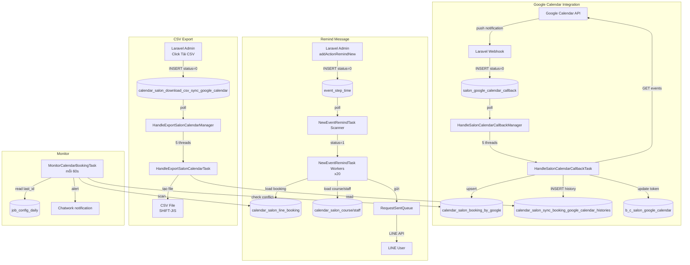

# FA-020 — Đặt lịch salon (「サロン・面談予約」) — Job Spec

> Tạo bởi: job-analyzer agent | Ngày: 2026-06-04 | Confidence tổng thể: Cao

---

## 1. Tổng quan

### 1.1 Tại sao cần background jobs

Tính năng đặt lịch salon có 4 nhóm xử lý nền chính:

| Nhóm | Mô tả |
|------|-------|
| **Google Calendar sync** | Đồng bộ block-time từ Google Calendar của nhân viên vào hệ thống để tránh đặt lịch trùng |
| **Reminder message** | Gửi tin nhắn nhắc lịch cho LINE user trước/sau ngày đặt lịch |
| **Export CSV** | Xuất file CSV lịch sử sync Google Calendar theo tháng |
| **Monitor** | Giám sát tính nhất quán dữ liệu booking / phát hiện bất thường |

### 1.2 Kiến trúc giao tiếp

**Database Polling Model** — không dùng Kafka, không dùng @Scheduled:

```
Laravel Web App
  ↓ INSERT vào queue tables (status = NEW/0)
Spring Boot Job
  ↓ while(true) loop, poll mỗi 2–5 giây
  ↓ SELECT records có status = NEW
  ↓ Xử lý → cập nhật status = DONE/2
```

### 1.3 Feature Flags (ConfigFile.java)

| Flag | Giá trị mặc định | Mô tả |
|------|-----------------|-------|
| `ENABLE_HANDLE_SALON_CALENDAR_CALLBACK` | `false` | Xử lý Google Calendar callback cho Salon |
| `ENABLE_HANDLE_EXPORT_SALON_CALENDAR` | `false` | Xuất CSV lịch sử sync Google Calendar |
| `ENABLE_MONITOR_CALENDAR_BOOKING` | `false` | Giám sát tính nhất quán booking |
| `ENABLE_EVENT_REMIND` | `false` | Gửi tin nhắn remind cho mọi loại event (bao gồm salon) |
| `MAX_REMIND_THREAD` | `20` | Số thread tối đa xử lý remind |

**Confidence:** Cao — Đọc trực tiếp từ `src/job/linect-service/src/main/java/sns/line/ConfigFile.java`

---

## 2. Queue Tables (Bảng trung gian)

### 2.1 `salon_google_calendar_callback` — Hàng đợi Google Calendar Callback

**Entity JPA:** `SalonGoogleCalendarCallback`
**File:** `src/job/linect-service/src/main/java/sns/line/models/linedb/entities/SalonGoogleCalendarCallback.java`

| Cột | Kiểu | Mô tả |
|-----|------|-------|
| `id` | Long | Primary key |
| `bot_id` | Long | ID bot sở hữu |
| `data_sync` | String | JSON chứa headers từ Google Calendar webhook (CalendarCallbackResponse) |
| `status` | Integer | Trạng thái xử lý (xem state machine) |
| `created_at` | String | Thời điểm tạo |

**State Machine:**
```
0 (STATUS_NEW)
  → 4 (STATUS_IN_QUEUE)    ← được Spring Boot đưa vào queue
  → 1 (STATUS_RUNNING)     ← đang xử lý
  → 2 (STATUS_DONE)        ← thành công
  → 3 (STATUS_ERROR)       ← thất bại
```

**Điều kiện poll:** `findTop100ByStatusOrderByIdAsc(STATUS_NEW)` — lấy tối đa 100 records mỗi lần, poll mỗi 2 giây.

**Ghi chú:** Laravel ghi record này khi nhận được webhook push notification từ Google Calendar API (Google gọi vào callback URL của hệ thống mỗi khi có sự thay đổi trên Google Calendar của nhân viên).

---

### 2.2 `event_step_time` — Hàng đợi gửi tin nhắn remind

**Entity JPA:** `EventStepTime`
**Ghi chú:** Đây là bảng chung dùng cho mọi loại remind/event, không riêng salon.

| Cột quan trọng | Mô tả |
|---------------|-------|
| `status` | Trạng thái: `STATUS_NOT_SEND_YET(0)`, `STATUS_SENDING(1)`, `STATUS_SEND(2)`, `STATUS_SKIP_*`, `STATUS_SEND_ERROR` |
| `sent_date_time` | Thời điểm cần gửi (datetime) |
| `event_step_id` | ID của EventStep (chứa nội dung tin nhắn, action) |
| `user_booking_id` | ID booking salon (`calendar_salon_line_booking.id`) khi type = salon |
| `bot_id` | ID bot |

**Điều kiện poll:** `findAllByStatusAndSentDateTimeLessThanEqual(STATUS_NOT_SEND_YET, LocalDateTime.now())` — tất cả records đến hạn, poll mỗi 5 giây.

**Liên kết với salon:** `EventStep.type == EventStep.EVENT_SALON_CALENDAR` → xử lý remind cho salon booking.

**Confidence:** Cao

---

### 2.3 `calendar_salon_download_csv_sync_google_calendar` — Hàng đợi export CSV

**Entity JPA:** `CalendarSalonDownloadCsvSync`
**File:** `src/job/linect-service/src/main/java/sns/line/models/linedb/entities/CalendarSalonDownloadCsvSync.java`

| Cột | Kiểu | Mô tả |
|-----|------|-------|
| `id` | Integer | Primary key |
| `bot_id` | Long | ID bot |
| `calendar_salon_id` | Long | ID calendar salon |
| `month` | String | Tháng cần export (format YYYY-MM) |
| `type` | Integer | Loại: 1=LME→Google, 2=Google→LME |
| `status` | Integer | Trạng thái xử lý |
| `file` | String | Đường dẫn file CSV đã tạo |
| `created_at` | String | Thời điểm tạo |

**Status constants:**
```
0 (STATUS_NEW) → 11 (STATUS_IN_QUEUE) → 1 (STATUS_RUNNING) → 2 (STATUS_DONE) / 40 (STATUS_FAILURE)
```

**Type constants:**
- `TYPE_LME_SYNC_GOOGLE = 1` — Export lịch sử LME đẩy sang Google Calendar
- `TYPE_GOOGLE_SYNC_LME = 2` — Export lịch sử Google Calendar đồng bộ vào LME

---

### 2.4 Bảng kết quả và lịch sử

| Bảng | Entity JPA | Mô tả |
|------|-----------|-------|
| `calendar_salon_booking_by_google` | `CalendarSalonBookingByGoogle` | Block time từ Google Calendar — giữ slot bận của nhân viên |
| `calendar_salon_sync_booking_google_calendar_histories` | `CalendarSalonSyncBookingHistories` | Lịch sử mỗi lần sync (add/delete/change) |
| `b_c_salon_google_calendar` | `BCSalonGoogleCalendar` | Cấu hình OAuth per-staff: token, syncToken, channelId, resourceId |

---

## 3. Task Managers

### 3.1 `HandleSalonCalendarCallbackManager` — Đồng bộ Google Calendar Callback

**File:** `src/job/linect-service/src/main/java/sns/line/task/HandleSalonCalendarCallbackManager.java`
**Feature flag:** `ENABLE_HANDLE_SALON_CALENDAR_CALLBACK`
**Khởi động:** `AppMain.run()` → `getExecutorService().submit(new HandleSalonCalendarCallbackManager())`

**Cơ chế:**
- Implements `Runnable`, chạy 1 producer thread + **5 consumer threads** (`HandleSalonCalendarCallbackTask`)
- Producer thread:
  - Khởi động: Reset các records `STATUS_RUNNING` và `STATUS_IN_QUEUE` về queue (recovery sau restart)
  - Loop: Poll `findTop100ByStatusOrderByIdAsc(STATUS_NEW)` → đưa vào `LinkedList<SalonGoogleCalendarCallback>`
  - Giới hạn queue: Nếu queue >= 2000 items thì sleep 1 giây
  - Khi queue rỗng: sleep 2 giây
- Dùng `Map<Long, Boolean> mapBotIdRunning` để đảm bảo mỗi bot chỉ có 1 thread xử lý tại một thời điểm (per-bot serialization)

**Confidence:** Cao

---

### 3.2 `NewEventRemindTask` — Gửi tin nhắn Remind

**File:** `src/job/linect-service/src/main/java/sns/line/threads/event_remind/NewEventRemindTask.java`
**Feature flag:** `ENABLE_EVENT_REMIND`
**Khởi động:** `AppMain.run()` → `newEventRemindTask.start()`

**Cơ chế:**
- Tạo `ExecutorService` với `MAX_REMIND_THREAD + 1` threads (mặc định 21 threads)
- 1 scanner thread: Poll `event_step_time` theo `sentDateTime <= now AND status = NOT_SEND_YET`, poll mỗi 5 giây
- `MAX_REMIND_THREAD` worker threads: Lấy từ queue và xử lý từng `EventStepTime`, sleep 500ms khi queue rỗng
- Recovery khi restart: Load lại tất cả records có `status = STATUS_SENDING`

**Confidence:** Cao

---

### 3.3 `HandleExportSalonCalendarManager` — Export CSV Sync

**File:** `src/job/linect-service/src/main/java/sns/line/threads/csv/HandleExportSalonCalendarManager.java`
**Feature flag:** `ENABLE_HANDLE_EXPORT_SALON_CALENDAR`
**Khởi động:** `AppMain.run()` → `startHandleExportSalonCalendarManager()`

**Cơ chế:**
- 1 producer thread + **5 worker threads** (`HandleExportSalonCalendarTask`)
- Poll `calendar_salon_download_csv_sync_google_calendar` với `status IN (STATUS_NEW)`, sleep 2 giây khi rỗng
- Recovery: Reset `STATUS_IN_QUEUE` và `STATUS_RUNNING` về queue khi restart

**Confidence:** Cao

---

### 3.4 `MonitorCalendarBookingTask` — Giám sát tính nhất quán

**File:** `src/job/linect-service/src/main/java/sns/line/task/MonitorCalendarBookingTask.java`
**Feature flag:** `ENABLE_MONITOR_CALENDAR_BOOKING`
**Khởi động:** `AppMain.run()` → `new MonitorCalendarBookingTask().startTask()`

**Cơ chế:**
- 1 thread duy nhất, chạy mỗi **60 giây**
- Đọc trạng thái từ `job_config_daily` (ID=1), giữ checkpoint `salon_booking_last_id`
- Mỗi lần duyệt tối đa **1000 records** mới kể từ `last_id`
- Phát hiện conflict: booking LME overlap với block time từ Google Calendar (tính thêm `time_before`/`time_after` từ `CalendarSalonSettingTimeFree`)
- Khi phát hiện bất thường → gửi thông báo Chatwork

**Không phải xử lý data** — chỉ giám sát và cảnh báo.

**Confidence:** Cao

---

## 4. Processing Chain

### 4.1 Google Calendar Callback → Sync Block Time

```
Google Calendar API (push notification)
  → Laravel webhook endpoint
    → INSERT INTO salon_google_calendar_callback (status=0)
      → HandleSalonCalendarCallbackManager (producer)
        → findTop100(status=0) → status=4 (IN_QUEUE)
          → HandleSalonCalendarCallbackTask (consumer x5)
            → status=1 (RUNNING)
            → parse data_sync → CalendarCallbackResponse
            → tìm BCSalonGoogleCalendar theo botId+googleCalendarId+channelId+resourceId
            → validateToken() → refresh access_token nếu gần hết hạn
            → syncEventBySyncToken()
              → gọi Google Calendar API: GET /calendars/{id}/events?syncToken=...
              → handleEventListResponse()
                → mỗi event:
                  → Nếu cancelled: xóa CalendarSalonBookingByGoogle
                  → Nếu active: upsert CalendarSalonBookingByGoogle (mergeBlockTime)
                → cập nhật sync_token_google_calendar trên BCSalonGoogleCalendar
            → Nếu syncToken lỗi → fallback: syncEventToBlockTime()
              → gọi Google Calendar API với timeMin/timeMax thay vì syncToken
            → ghi CalendarSalonSyncBookingHistories (lịch sử từng thay đổi)
            → status=2 (DONE)
```

**Confidence:** Cao

---

### 4.2 Remind Message → Gửi LINE

```
Laravel Web App
  → Admin cài đặt remind (addActionRemindNew)
    → tính sent_date_time cho từng booking
      → INSERT INTO event_step_time (status=0, sent_date_time=..., user_booking_id=booking_id)
        → NewEventRemindTask (scanner)
          → findAll(status=0, sentDateTime<=now)
            → status=1 (SENDING)
              → NewEventRemindTask (worker)
                → startEventStepTime()
                  → load EventStep → type = EVENT_SALON_CALENDAR
                  → load CalendarSalonLineBooking theo user_booking_id
                  → load LineUser → kiểm tra block
                  → actionTypeSalonCalendar()
                    → kiểm tra filter course/staff (isUseFilter 0/1/2/3)
                    → thay token trong nội dung tin nhắn:
                      - {date_time} → định dạng "yyyy年MM月dd日（曜日）HH:mm-HH:mm"
                      - {course} → tên khóa học
                      - {reservation_currency} → tổng tiền (course + staff bill)
                      - {url_cancel} → LIFF URL trang chi tiết booking
                      - {reservation_name} → tên salon (store_name)
                      - {staff_name} → tên nhân viên hoặc "指名なし"
                    → RequestSentQueue.pushRequestToQueue()
                      → gửi LINE message
                  → status=2 (SEND)
```

**Confidence:** Cao

---

### 4.3 Export CSV

```
Admin click "Tải CSV lịch sử sync"
  → INSERT INTO calendar_salon_download_csv_sync_google_calendar (status=0, type=1|2, month=YYYY-MM)
    → HandleExportSalonCalendarManager (producer)
      → status=11 (IN_QUEUE)
        → HandleExportSalonCalendarTask (worker)
          → status=1 (RUNNING)
          → đọc CalendarSalonSyncBookingHistories theo calendar_salon_id + month
          → tạo file CSV SHIFT-JIS tại {PHP_PUBLIC_FOLDER}/csv/{bot_id}/calendar_salon_{id}_{timestamp}.csv
          → Nếu type=TYPE_GOOGLE_SYNC_LME: header tiếng Nhật về sync từ Google vào LME
          → Nếu type=TYPE_LME_SYNC_GOOGLE: header tiếng Nhật về sync từ LME ra Google
          → cập nhật CalendarSalonDownloadCsvSync.file = đường dẫn file
          → status=2 (DONE)
```

**Confidence:** Cao

---

## 5. Services & Helpers

### 5.1 `HandleSalonCalendarCallbackTask` — Core Sync Logic

**File:** `src/job/linect-service/src/main/java/sns/line/task/HandleSalonCalendarCallbackTask.java`

| Method | Input | Output | Mô tả |
|--------|-------|--------|-------|
| `handle()` | `SalonGoogleCalendarCallback` | void | Entry point xử lý 1 callback |
| `syncEventBySyncToken()` | `BCSalonGoogleCalendar`, googleCalendarId, ... | int (1/2/3) | Sync dùng syncToken; return 1=ok, 2=token cũ, 3=API lỗi |
| `syncEventToBlockTime()` | callbackTime, googleCalendarId, gCalendar, ... | void | Fallback: sync theo time range |
| `handleEventListResponse()` | typeSync, callbackTime, events, gCalendar, ... | void | Xử lý danh sách events từ Google API |
| `handleCallbackEvent()` | typeSync, callbackTime, googleEvent, event | void | Xử lý 1 event: add/update/delete block time |
| `mergeBlockTime()` | condition, with, userBooking, event | void | Upsert `CalendarSalonBookingByGoogle` (tách multi-day thành nhiều records) |
| `updateSyncHistory()` | googleEvent, calendarByGoogle, userBooking, status | void | Ghi `CalendarSalonSyncBookingHistories` |
| `validateToken()` | `BCSalonGoogleCalendar` | boolean | Refresh access_token nếu còn < 5 phút |

**Xử lý booking multi-day:** Khi Google event kéo dài nhiều ngày, `mergeBlockTime()` tách thành nhiều `CalendarSalonBookingByGoogle` records, mỗi record 1 ngày với `timeStart/timeEnd` được tính từ timezone Asia/Tokyo.

**Filter sự kiện bỏ qua:**
- Event thuộc quá khứ > 30 ngày
- Event thuộc tương lai > 2 năm
- Event type = "workingLocation"

**Confidence:** Cao

---

### 5.2 `NewEventRemindTask` — `actionTypeSalonCalendar()`

**File:** `src/job/linect-service/src/main/java/sns/line/threads/event_remind/NewEventRemindTask.java` (dòng 443–589)

**Input:** `Bot`, `EventStepTime`, `EventStep`, `CalendarSalonLineBooking`, `List<LineUser>`

**Logic filter:**

| `EventStep.isUseFilter` | Điều kiện pass |
|------------------------|---------------|
| 0 | Luôn gửi |
| 1 | filterCourse = true (booking.courseId khớp EventStep.courseIds) |
| 2 | filterStaff = true (booking.staffId khớp EventStep.staffIds) |
| 3 | filterCourse AND filterStaff |

**Token thay thế trong nội dung tin nhắn:**

| Token | Giá trị thay thế |
|-------|----------------|
| `{date_time}` | "yyyy年MM月dd日（曜日）HH:mm-HH:mm" (múi giờ của booking) |
| `{course}` | `CalendarSalonCourse.courseName` |
| `{reservation_currency}` | `course.amount + staff.staffBill` (format với dấu phẩy) |
| `{url_cancel}` | `https://liff.line.me/{liffId}?calendar_salon_id={id}&tab=detail&booking_id={id}` |
| `{reservation_name}` | `CalendarSalon.storeName` |
| `{staff_name}` | `CalendarSalonStaff.staffName` hoặc "指名なし" nếu staffId=0 |

**Loại message:** `TYPE_MESSAGE_REMIND_SALON` (phân biệt với lesson calendar `TYPE_MESSAGE_REMIND_LESSON`)

**Confidence:** Cao

---

### 5.3 `HandleExportSalonCalendarTask` — CSV Export Logic

**File:** `src/job/linect-service/src/main/java/sns/line/threads/csv/HandleExportSalonCalendarTask.java`

| Loại CSV | Nội dung cột |
|----------|-------------|
| TYPE_GOOGLE_SYNC_LME (2) | 同期した日時, 連携された日, 連携された開始時間, 連携された終了時間, 情報が連携された媒体, 登録・削除, スケジュールタイトル, 終日フラグ, 繰り返しフラグ |
| TYPE_LME_SYNC_GOOGLE (1) | 同期した日時, 連携された日, 連携された開始時間, 連携された終了時間, 情報が連携された媒体 (+ các cột tương tự) |

- File encoding: **SHIFT-JIS** (cho Excel tiếng Nhật)
- File path: `{PHP_PUBLIC_FOLDER}/csv/{bot_id}/calendar_salon_{id}_{timestamp}.csv`

**Confidence:** Cao

---

## 6. External API Calls

### 6.1 Google Calendar API

| API | Method | URL | Mục đích |
|-----|--------|-----|---------|
| List Events (by syncToken) | GET | `https://www.googleapis.com/calendar/v3/calendars/{calendarId}/events?syncToken=...` | Lấy các thay đổi kể từ lần sync trước |
| List Events (by time range) | GET | `https://www.googleapis.com/calendar/v3/calendars/{calendarId}/events?timeMin=...&timeMax=...` | Fallback khi syncToken hỏng |
| Refresh Token | POST | `https://oauth2.googleapis.com/token` | Gia hạn access token |

**Tham số chung:**
- `timeZone=Asia/Tokyo`
- `singleEvents=true`
- `maxResults=1000`

**Credentials:** `ConfigFile.GG_API_CLIENT_ID`, `ConfigFile.GG_API_CLIENT_SECRET`
**Token lưu trữ:** JSON (`RefreshTokenResponse`) trong `b_c_salon_google_calendar.access_token`

**Confidence:** Cao

### 6.2 LINE Messaging API (gửi remind)

**Thực hiện bởi:** `RequestSentQueue` → `SentMessageService` (service chung)
**Message type:** `TYPE_MESSAGE_REMIND_SALON`
**Yêu cầu quote token:** `setNeedQuoteToken(true)` — bắt buộc dùng reply token

**Confidence:** Cao

### 6.3 UnivaPay Webhook (từ web app, không phải Spring Boot)

**Ghi chú quan trọng:** `HandleWebhookUnivapay` được đề cập trong `logic-spec.md` là Laravel Job (queue `default` trên database), **không phải** Spring Boot job. Spring Boot không xử lý trực tiếp UnivaPay webhook.

**Confidence:** Cao

---

## 7. Data Flow Diagram



**Confidence:** Cao

---

## 8. Error Handling

| Task | Lỗi | Xử lý |
|------|-----|-------|
| `HandleSalonCalendarCallbackTask` | Parse `data_sync` thất bại | status=3 (ERROR), skip |
| `HandleSalonCalendarCallbackTask` | Token refresh thất bại | status=3 (ERROR), skip |
| `HandleSalonCalendarCallbackTask` | Google API trả về lỗi | Fallback sang `syncEventToBlockTime()`, nếu vẫn lỗi → status=3 |
| `HandleSalonCalendarCallbackTask` | SyncToken hỏng (410 Gone) | Tự động fallback sang time-range sync |
| `HandleSalonCalendarCallbackTask` | Exception không xử lý được | status=3 (ERROR), gửi Chatwork alert, sleep 60 giây |
| `NewEventRemindTask` | Bot expired > 7 ngày | status=STATUS_SKIP_BOT_EXPIRED_PLAN, bỏ qua |
| `NewEventRemindTask` | EventStep null | status=STATUS_SEND (coi như done), log |
| `NewEventRemindTask` | LineUser bị block | Không thêm vào danh sách gửi |
| `NewEventRemindTask` | Exception khi xử lý | status=STATUS_SEND_ERROR, gửi Chatwork alert |
| `HandleExportSalonCalendarTask` | Exception | status=40 (FAILURE), sleep 60 giây, gửi Chatwork alert |
| `MonitorCalendarBookingTask` | Exception | Log error, gửi Chatwork alert, task dừng |

**Alert destination:** Chatwork room ID `316148419` (cho salon/google calendar tasks)

**Recovery sau restart:**
- `HandleSalonCalendarCallbackManager`: Reset STATUS_RUNNING và STATUS_IN_QUEUE về queue
- `HandleExportSalonCalendarManager`: Reset STATUS_IN_QUEUE và STATUS_RUNNING về queue
- `NewEventRemindTask`: Load lại STATUS_SENDING vào queue

**Confidence:** Cao

---

## 9. Liên kết với Web App

| Hành động Admin | Queue table | Task xử lý | Kết quả |
|----------------|-------------|-----------|---------|
| Liên kết Google Calendar cho nhân viên → Laravel dispatch `CalendarSalonSyncBookingFromGoogleToTool` | **Không phải Spring Boot** — đây là Laravel Job (queue database) | — | Sync booking từ Google vào LME (Laravel Queue Worker) |
| Google Calendar thay đổi (push từ Google API) | `salon_google_calendar_callback` | `HandleSalonCalendarCallbackTask` | Upsert `calendar_salon_booking_by_google` |
| Admin cài đặt remind (`addActionRemindNew`) | `event_step_time` | `NewEventRemindTask` | Gửi LINE message đến user đặt lịch |
| Admin click "Tải CSV lịch sử sync" | `calendar_salon_download_csv_sync_google_calendar` | `HandleExportSalonCalendarTask` | Tạo file CSV tại server |
| Booking mới được tạo (LINE User hoặc Admin) | — | `MonitorCalendarBookingTask` (giám sát) | Cảnh báo nếu phát hiện overlap |

### 9.1 Ghi chú về Laravel Jobs (không phải Spring Boot)

Các jobs sau được đề cập trong `logic-spec.md` là **Laravel Queue Jobs** chạy qua Laravel Queue Worker (`database` connection), **không phải** Spring Boot:

| Laravel Job | File | Mô tả |
|------------|------|-------|
| `CalendarSalonSyncBookingFromGoogleToTool` | `app/Jobs/CalendarSalonSyncBookingFromGoogleToTool.php` | Sync booking từ Google khi liên kết nhân viên |
| `CalendarSalonSyncBookingGoogle` | `app/Jobs/CalendarSalonSyncBookingGoogle.php` | Sync booking LME → Google |
| `CalendarSalonStaffAssignment` | `app/Jobs/CalendarSalonStaffAssignment.php` | Tự động phân công nhân viên (LINE user booking) |
| `CalendarSalonStaffAssignmentAdmin` | `app/Jobs/CalendarSalonStaffAssignmentAdmin.php` | Tự động phân công nhân viên (Admin booking) |
| `HandleWebhookUnivapay` | `app/Jobs/HandleWebhookUnivapay.php` | Xử lý webhook thanh toán UnivaPay |

**Confidence:** Cao — phân biệt rõ ràng qua `onConnection('database').onQueue('default')` trong Laravel dispatcher vs. Spring Boot `while(true)` polling.

---

## 10. Điểm cần chú ý

1. **Per-bot serialization trong Google Calendar sync:** `HandleSalonCalendarCallbackManager` dùng `mapBotIdRunning` để đảm bảo mỗi bot chỉ có 1 luồng xử lý callback tại 1 thời điểm — tránh race condition khi nhiều callback đến cùng lúc.

2. **SyncToken fallback mechanism:** Nếu `syncToken` của Google Calendar hỏng (thường do token quá cũ), task tự động fallback sang query theo time range (`timeMin = callbackTime - 1 ngày`, `timeMax = now + 2 năm`), chỉ lấy events được cập nhật trong vòng 2 phút của callback time.

3. **Multi-day event handling:** Một event Google Calendar kéo dài nhiều ngày được tách thành nhiều records `calendar_salon_booking_by_google`, mỗi record 1 ngày. Event lặp lại (`recurringEventId`) được xử lý riêng — xóa block time cũ trước khi thêm mới.

4. **Remind message dùng quote token:** `setNeedQuoteToken(true)` — tin nhắn remind salon yêu cầu reply/quote token, khác với remind lesson calendar ở cùng codebase (cũng `true`).

5. **Monitor task chỉ cảnh báo:** `MonitorCalendarBookingTask` chỉ phát hiện và thông báo Chatwork — không tự sửa dữ liệu.
