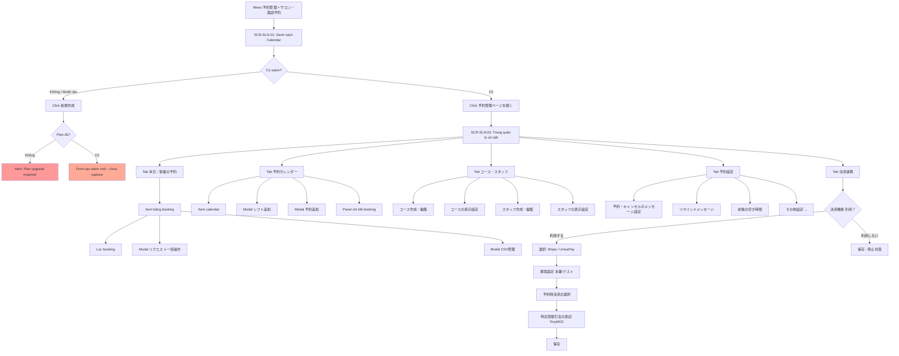

# FA-020 — Đặt lịch salon (「サロン・面談予約」) — UI Spec

> Tạo bởi: ui-parser agent | Ngày: 2026-06-04 | Confidence tổng thể: Trung bình–Cao

---

## 1. Tổng quan

Tính năng 「サロン・面談予約」 (Đặt lịch salon / Hẹn tư vấn) cho phép Admin quản lý hệ thống đặt lịch trực tuyến qua LINE LIFF.

Tính năng bao gồm:
- Quản lý nhiều lịch đặt (salon calendar) — tối đa 20 calendars theo plan
- Hai loại calendar: 「スタッフ」 (Staff — nhiều nhân viên) và 「個人」 (Cá nhân — không có nhân viên)
- Trang đặt lịch công khai dành cho LINE User qua LIFF URL
- Quản lý ca làm việc (シフト) của từng nhân viên
- Cài đặt khóa học (コース), nhân viên (スタッフ), tin nhắn, nhắc lịch, thanh toán online (Stripe / UnivaPay)
- Liên kết Google Spreadsheet để xuất dữ liệu đặt lịch

---

## 2. Actors

| Actor | Quyền truy cập | Mô tả |
|-------|---------------|-------|
| Admin | Toàn bộ | Tạo, quản lý, cài đặt salon calendars |
| Staff | Tùy phân quyền | Xem và thao tác trên các salon được phân quyền |
| LINE User | Trang LIFF công khai | Đặt lịch, xem lịch sử đặt lịch qua URL LIFF |

---

## 3. Màn hình

### SCR-SLN-01: Danh sách lịch hẹn salon (「カレンダー一覧」)

**URL:** `/basic/calendar-salon`
**API load:** `GET /basic/calendar-salon/list-calendar-salon?staffTypeFilter=0`

**Layout:** Tiêu đề trang + thanh công cụ + lưới thẻ calendar

#### Thanh công cụ trên cùng
| Component | Chi tiết |
|-----------|---------|
| Nút 「新規作成」 | Tạo salon calendar mới. Nếu plan không đủ → alert cảnh báo 「現在のプランは利用できない機能です。アップグレードが必要になります。」 |
| Dropdown filter 「カレンダータイプ」 | Lọc theo loại: 「全てのカレンダー」 / 「個人タイプ」 / 「スタッフタイプ」 |
| Đếm số lượng | 「登録カレンダー数：{n} / {max}」 (VD: 20/20) |
| Nút 「並び替え」 | Sắp xếp thứ tự calendar bằng drag-drop |

#### Card mỗi salon calendar
Mỗi card hiển thị:
- Badge loại: 「スタッフ」 (màu phân biệt) hoặc 「個人」
- Toggle 「有効」/ 「無効」 (checkbox checked = 有効 / unchecked = 無効) — bật/tắt hoạt động
- Icon Google Spreadsheet (link tới sheet liên kết, nếu có)
- Thumbnail ảnh đại diện salon
- Tên salon (clickable, link đến trang detail)
- Nút 「予約管理ページを開く」 → `/basic/calendar-salon/{id}`
- Field 「予約ページURL」: LIFF URL dạng `https://liff.line.me/...?calendar_salon_id={id}&ts={timestamp}` + nút copy
- Field 「予約履歴ページURL」: LIFF URL dạng `...?calendar_salon_id={id}&tab=history&ts={timestamp}` + nút copy

**Danh sách salon quan sát được:**

| ID | Tên | Loại | Trạng thái | Google Sheet |
|----|-----|------|-----------|-------------|
| 377 | limit v2 | スタッフ | 有効 | Không |
| 306 | limit 2 | スタッフ | 有効 | Có |
| 376 | test 22.10 | 個人 | 有効 | Có |
| 305 | test cmt | スタッフ | 有効 | Không |
| 93 | private 1 | 個人 | 有効 | Không |
| 100 | thanh test | スタッフ | 有効 | Không |
| 136 | lk google | スタッフ | 無効 | Không |
| 139 | lk google2 | 個人 | 無効 | Không |
| 153 | test nghi | スタッフ | 有効 | Không |
| 162 | time nghi2 | スタッフ | 有効 | Không |
| 164 | 2 staff | スタッフ | 有効 | Không |
| 170 | test 1 | 個人 | 有効 | Có |
| 288 | bug 1 | 個人 | 有効 | Không |
| 302 | mua vu | スタッフ | 有効 | Không |
| 380 | test | 個人 | 有効 | Không |
| 382 | test mới | 個人 | 有効 | Không |
| 405 | test info | 個人 | 有効 | Không |
| 422 | test | 個人 | 有効 | Không |
| 423 | bug staff | スタッフ | 有効 | Có |
| 449 | one | 個人 | 有効 | Không |

**Confidence:** Cao (đọc trực tiếp từ snapshot)

---

### SCR-SLN-02: Trang quản lý đặt lịch chi tiết (「予約管理ページ」)

**URL:** `/basic/calendar-salon/{id}` (VD: `/basic/calendar-salon/377`)
**Breadcrumb:** カレンダー一覧 > {tên salon}

#### Header trang
- Heading: Tên salon (VD: 「test màn top」)
- Nút 「予約カレンダーを見る」 — xem calendar dạng lịch
- Nút 「一覧ページに戻る」 — quay về danh sách
- Badge 「テスト環境」 (nếu đang ở môi trường test thanh toán)

#### Tab navigation (5 tabs chính)
| Tab | Tiêu đề JP | Sub-tabs / Nội dung |
|-----|------------|---------------------|
| Tab 1 | 「本日／新着の予約」 | Sub-tab: 新着の予約 / 本日の予約 |
| Tab 2 | 「予約カレンダー」 | Xem lịch dạng calendar |
| Tab 3 | 「コース・スタッフ」 | Sub-menu: コース / スタッフ |
| Tab 4 | 「予約設定」 | Sidebar menu nhiều mục cài đặt |
| Tab 5 | 「決済連携」 | Cài đặt thanh toán Stripe/UnivaPay |
| Badge | 「テスト環境」 | Nhãn trạng thái (không phải tab click) |

---

#### SCR-SLN-02a: Tab 「本日／新着の予約」

**API:** `GET /basic/calendar-salon/{id}/get-list-booking?page=1&tab_query=new_booking&per_page=50&date_booking={date}`

**Sub-tab:**
- 「新着の予約」: Đặt lịch mới trong 7 ngày
- 「本日の予約」: Đặt lịch hôm nay

**Toolbar bảng:**
- Chọn số hiển thị: `50件` / `100件`
- Đếm kết quả: `{from} - {to} / {total}行`
- Nút phân trang: Previous / Next

**Bảng danh sách đặt lịch:**

| Cột | Tiêu đề JP | Mô tả |
|-----|-----------|-------|
| 1 | 「操作が行われた日時」 | Ngày giờ thao tác |
| 2 | 「来店予定日時」 | Ngày giờ đến dự kiến |
| 3 | 「ステータス」 | Trạng thái đặt lịch |
| 4 | 「お名前」 | Tên khách hàng |
| 5 | 「コース」 | Khóa học / dịch vụ |
| 6 | 「スタッフ」 | Nhân viên phụ trách |
| 7 | 「決済金額」 | Số tiền thanh toán |
| 8 | (操作) | Nút thao tác |

**Sidebar bộ lọc (「絞り込み設定」):**

| Bộ lọc | Tiêu đề JP | Loại input |
|--------|-----------|-----------|
| Khoảng ngày đặt lịch | 「予約日」 | Date range picker (VD: 2026/06/04 ー 2026/06/11) |
| Khoảng giờ bắt đầu | 「予約開始時間」 | Time range (start/end, VD: 17:08 − 23:08) |
| Lọc theo khóa học | 「表示するコース」 | Multi-checkbox (全選択 + từng コース) |
| Lọc theo nhân viên | 「表示するスタッフ」 | Multi-checkbox (全選択 + từng スタッフ) |
| Trạng thái đặt lịch | 「予約ステータス」 | Checkbox: 全選択 / 予約確定 / 予約リクエスト中 / キャンセルリクエスト中 / キャンセル |
| Trạng thái thanh toán | 「決済ステータス」 | Checkbox: 全選択 / 未決済 / 決済成功 / 返金済み / 決済なし / 現地決済 / 現地（決済成功） |

Nút: 「絞り込み表示」 / 「閉じる」

**Thao tác hàng loạt — Modal 「リクエスト一括操作」:**

Tiêu đề: 「リクエスト一括操作」
Subtitle: 「操作したい内容を以下から1つだけ選択してください」
Counter: 「{n}人を選択中」

Section 「新規予約リクエスト」:
- Radio: 「新規予約リクエストを承認する」 (default checked)
- Radio: 「新規予約リクエストを否認する」

Section 「キャンセルリクエスト」:
- Radio: 「キャンセルリクエストを承認する」
- Radio: 「キャンセルリクエストを否認する」

Section 「承認/否認時 アクションの実行」:
- Radio: 「実行する」 (default checked) / 「実行しない」

Nút: 「リクエスト一括操作を実行する」 / 「閉じる」

**Menu thêm (「…」 More menu):**
- 「CSV管理」 → Sub-menu: エクスポート / インポート
- 「表示変更（LINE名/システム表示名）」
- 「削除済み予約」

**Modal 「CSV管理」 — Tab エクスポート:**
- 「エクスポートする期間」: 開始日 (date) + 終了日 (date)
- 「エクスポートするスタッフ」: Multi-checkbox + 全選択
- Ghi chú: 「コースごとにCSVが作成されます。」
- Nút: 「CSVダウンロード」 / Link 「CSVインポートはこちら」

---

#### SCR-SLN-02b: Tab 「予約カレンダー」 — Calendar view

**Tính năng quan sát:**

**Modal 「シフト編集」** (click ô trên calendar của nhân viên):
- Section 「出勤時間」: Nhập giờ làm việc (cho phép qua ngày hôm sau)
- Checkbox 「休日として設定する」: Đặt làm ngày nghỉ
- Nút 「+追加」: Thêm khung giờ
- Nút 「登録する」

**Modal 「シフト追加」** (thêm ca mới):
- Header: 「シフト追加」 | Link 「CSVでシフトを管理」
- Select 「シフトを追加したいスタッフを選択」: Combobox chọn nhân viên
- 「シフトを追加したい日程を選択」:
  - Mode 「カレンダーから選択」: Calendar widget tháng (日/月/火/水/木/金/土)
  - Mode 「曜日から選択」: Chọn theo thứ
- Section 「出勤時間」: Nhập giờ + 「+追加」 (có thể qua ngày, nhập 「24:00」 nếu kết thúc lúc nửa đêm)
- Checkbox 「休業日として設定する」: Đặt làm ngày nghỉ kinh doanh
- Cảnh báo: 「すでにシフトが登録されている場合は、登録内容が上書きされます。」
- Nút: 「登録する」

**Modal 「予約追加」** (thêm đặt lịch thủ công bởi Admin):
- 「予約を追加するお客様」:
  - Radio 「エルメ上に表示されている」 (default): Chọn từ combobox bạn bè + search box LINE名/システム表示名
  - Radio 「LINE公式アカウントに友だち追加していない または、エルメ上に表示されていない」: Nhập thủ công
- 「コース」: Combobox chọn khóa học
- 「スタッフ」: Combobox chọn nhân viên (VD: staff 1 / staff 2 / staff 3 / staff 4 / staff 5)
- 「予約日時」: Date (YYYY-MM-DD) + Giờ bắt đầu (HH:MM) − Giờ kết thúc (disabled, tự tính)
- Checkbox 「コース所要時間を基準に終了時間を設定」 (default checked)
- 「予約時の入力情報」: Checkbox 「すでに情報が登録されている場合、自動入力する」 (default checked)
- 「予約時アクションの実行」:
  - Radio 「実行する」 (default) / 「実行しない」
  - Ghi chú: 「※コース・スタッフ別の予約完了時アクションを設定している場合、全体設定の予約（リクエスト承認）時アクションは稼働しません。」
- Nút: 「登録する」 / Link 「< 戻る」

**Modal xem chi tiết đặt lịch (trên cell calendar):**
- Header: Ngày giờ đặt lịch + nút đóng
- Columns sortable: 「予約日時」 / 「ステータス」 / 「お客様」 / 「スタッフ」 / 「コース」
- Nút: 「閉じる」

**Modal thông báo không thể đặt (「予約が追加できない日時」):**
- Hiển thị ngày không thể đặt
- Lý do: 「予約受付可能なシフトが登録されていません」
- Hướng dẫn: 「シフト追加よりシフトの追加を行なってください。」

**Panel chi tiết đặt lịch (click booking item):**
- Ảnh khách hàng
- Nút 「予約履歴」: Xem lịch sử đặt lịch của khách
- Thông tin: Thời gian (~ phút, tên khóa học) / Tên nhân viên
- Link 「スタッフの割り当てを変更する」: Thay đổi nhân viên
- Sub-tabs: 「お客様情報」 / 「決済情報」
- Link 「お客様情報を編集」

**Modal Google Calendar (tooltip thông tin):**
- 「スケジュール同期履歴」: Lịch sử đồng bộ
- Thông tin hướng dẫn thay đổi hiển thị tiêu đề + xóa lịch

**Modal thời gian trống trước/sau đặt lịch:**
- 「予約前の空き時間（{n}分）」: Hiển thị ngày giờ đặt lịch có buffer trước
- 「予約後の空き時間（{n}分）」: Hiển thị ngày giờ đặt lịch có buffer sau
- Link đến 「予約設定 > 前後の空き時間」 để thay đổi

---

### SCR-SLN-03: Tab 「コース・スタッフ」 — Cài đặt khóa học và nhân viên

**Sub-menu (sidebar trái):**

**Section コース:**
- 「コース作成・編集」: Quản lý danh sách khóa học
- 「コースの表示設定」: Cài đặt hiển thị khóa học

**Section スタッフ:**
- 「スタッフ作成・編集」: Quản lý danh sách nhân viên
- 「スタッフの表示設定」: Cài đặt hiển thị nhân viên

---

#### SCR-SLN-03a: 「コース作成・編集」

**API:** `GET /basic/calendar-salon/{id}/get-list-courses?course_menu_id=`

**Layout:** Header + dropdown menu khóa học + nút tạo + bảng danh sách

**Header:**
- Heading: 「コース作成・編集」
- Dropdown 「メニュー」: Chọn menu nhóm khóa học (VD: 「メニューなし」)
- Nút 「コース作成」 (icon +)

**Bảng khóa học:**

| Cột | Tiêu đề JP | Mô tả |
|-----|-----------|-------|
| 1 | (drag handle) | Icon kéo để sắp xếp thứ tự |
| 2 | 「予約ページ表示」 | Toggle ON/OFF — hiển thị trên trang đặt lịch |
| 3 | 「イメージ」 | Thumbnail ảnh khóa học |
| 4 | 「コース名」 | Tên khóa học (link dẫn đến trang edit) |
| 5 | 「料金」 | Giá tiền (VD: ¥1,200- hoặc 「設定なし」) |
| 6 | (nút edit) | Nút chỉnh sửa |

**Dữ liệu mẫu:**

| Tên | Hiển thị | Giá |
|-----|---------|-----|
| test 1 | ON | 設定なし |
| course 2 | ON | 設定なし |
| course 1 | ON | ¥1,200- |
| test syste | OFF | 設定なし |
| new menu s | OFF | 設定なし |
| test cours | OFF | 設定なし |

**Confidence:** Cao

---

#### SCR-SLN-03b: 「コースの表示設定」

**API:** `GET /basic/calendar-salon/{id}/get-booking-setting-display`

**Nội dung form:**

| Cài đặt | Tiêu đề JP | Tùy chọn |
|---------|-----------|---------|
| Sử dụng chọn khóa học | 「コース選択の利用」 | Radio: 「コース選択を利用する」 (default) / 「コース選択を利用しない（予約時にコース選択ページをスキップします）」 |
| Hiển thị giá | 「コース料金の表示」 | Radio: 「表示する」 (default) / 「表示しない」 + icon preview |
| Hiển thị thời gian | 「コースの所要時間の表示」 | Radio: 「表示する」 (default) / 「表示しない」 + icon preview |

Ghi chú: 「※ 決済機能を利用している場合は、自動的にコース料金が表示されます。」

**Confidence:** Cao

---

### SCR-SLN-04: Tab 「予約設定」 — Cài đặt đặt lịch

**API load menu:** Sidebar-based navigation

**Sidebar menu (danh sách mục cài đặt):**

**Section メッセージ・予約の各種設定:**
- 「予約・キャンセルのメッセージ・リクエストと締切」
- 「予約前後に送るリマインドメッセージ」
- 「前後の空き時間」
- 「期間限定の営業」
- 「店舗とスタッフの受付上限」

**Section 予約画面:**
- 「お客様への質問項目」
- 「トップ画面設定」
- 「店舗・ビジネス情報」
- 「利用規約」
- 「システムワード変更 / 表示設定」

**Section 連携設定:**
- 「Googleカレンダー連携」
- 「Googleスプレッドシート連携」

**Section その他:**
- 「予約システムの削除」

---

#### SCR-SLN-04a: 「予約・キャンセルのメッセージ・リクエストと締切」

**API:** `GET /basic/calendar-salon/{id}/setting-message`

**Layout:** 2 Section song song (予約時 / キャンセル時)

**Mỗi section có:**
- Header section (VD: 「予約時」 / 「キャンセル時」) với badge trạng thái số + icon
- Sub-tabs: 「メッセージ」 / 「アクション」 / 「各種設定」
- Xem trước nội dung tin nhắn đã cài đặt (hoặc 「メッセージは設定されていません」)
- Nút 「予約時の設定をする」 / 「キャンセル時の設定をする」

**Confidence:** Trung bình (chỉ thấy danh sách sub-tabs, chưa thấy nội dung từng sub-tab)

**Lưu ý quan trọng:**
- Sub-tab 「アクション」 → Có thể sử dụng SC-004 (Action Settings) để cài đặt hành động khi đặt lịch / hủy lịch thành công. Cần xác nhận thêm.

---

### SCR-SLN-05: Tab 「決済連携」 — Cài đặt thanh toán

**API:** `GET /ajax/calendar-salon/init-data-setting-payment?calendar_id={id}`

**Layout chính:**

**Cảnh báo môi trường test** (nếu đang dùng テスト環境):
> 「テスト環境」が選択されています。（決済は行われません。メッセージ・アクションの確認に利用します）

**Section 「決済設定」:**

**Thông tin yêu cầu sử dụng thanh toán** (list):
- Cần tạo tài khoản Stripe hoặc UnivaPay trước
- Tài khoản cần qua xét duyệt, cần website giới thiệu doanh nghiệp
- Không can thiệp vào thời gian/nội dung xét duyệt
- Link đến 「決済システム連携設定」 (`/basic/list-items`) để liên kết với エルメ
- Hỗ trợ card: Visa / Master / Amex / JCB / Diners
- Chỉ hỗ trợ thẻ tín dụng (không hỗ trợ chuyển khoản, QR, tiện lợi...)

**Toggle 「決済機能の利用」:**
- Ghi chú: 「決済機能のご利用には 有料プラン契約が必要になります。」
- Link 「変更履歴」
- Toggle: 「利用しない」 ← → 「利用する」 (checkbox)

**Khi BẬT (利用する):**

| Cài đặt | Tiêu đề JP | Tùy chọn |
|---------|-----------|---------|
| Chọn hệ thống thanh toán | 「利用する決済システム ※保存後に決済システムの変更はできません」 | Button toggle: 「Stripe」 (expanded/active) hoặc UnivaPay |
| Môi trường bán | 「販売環境設定」 | 「本番環境」(実際に決済が行われます) / 「テスト環境」(決済は行われません) |
| | Link: 「テスト決済時のダミーカード番号一覧」 |
| Chọn phương thức thanh toán khi đặt | 「予約時決済の選択」 | Radio: 「予約時決済のみにする」 (default) / 「予約時決済か現地決済かを選択可能にする」 |
| Điều khoản thương mại | 「特定商取引法に基づく表記」 | TinyMCE rich text editor (toolbar: Undo/Redo, Text color, Bold, Italic, Align, More...) |

Nút: 「保存」

**Section 「決済利用 変更履歴」** (expandable):
| Cột | Tiêu đề JP |
|-----|-----------|
| 1 | 「日時」 |
| 2 | 「操作した人」 |
| 3 | 「内容」 (VD: 「停止 → 利用中(テスト環境) に変更」) |

**Confidence:** Cao (đọc trực tiếp từ snapshot)

---

## 4. User Flows

### Flow 1: Admin xem danh sách và truy cập salon
1. Admin vào menu 「予約管理」 → 「サロン・面談予約」
2. Hệ thống tải danh sách calendar → AJAX `GET /basic/calendar-salon/list-calendar-salon`
3. Admin lọc theo loại (filter dropdown) hoặc xem tất cả
4. Click 「予約管理ページを開く」 → vào trang quản lý chi tiết

### Flow 2: Admin tạo salon mới
1. Click 「新規作成」
2. Nếu plan không đủ → Alert cảnh báo upgrade plan
3. Nếu đủ → Form tạo mới (chưa capture được nội dung)

### Flow 3: Admin bật/tắt salon
1. Toggle 「有効/無効」 trên card → gọi API cập nhật trạng thái
2. Không cần reload trang

### Flow 4: Admin quản lý đặt lịch (Tab 本日／新着の予約)
1. Xem bảng đặt lịch mới / hôm nay
2. Lọc theo ngày, giờ, course, staff, trạng thái
3. Click vào booking → xem chi tiết (panel bên phải / popup)
4. Thao tác: Approve/Reject request → Modal 「リクエスト一括操作」
5. Export CSV → Modal 「CSV管理」

### Flow 5: Admin thêm đặt lịch thủ công
1. Trên tab 「予約カレンダー」 → click thêm mới hoặc click ngày
2. Modal 「予約追加」 xuất hiện
3. Chọn khách hàng (từ danh sách LINE friends hoặc nhập thủ công)
4. Chọn コース + スタッフ + 予約日時
5. Cài đặt hành động khi đặt
6. Click 「登録する」

### Flow 6: Admin thêm ca làm việc
1. Tab 「予約カレンダー」 → Click 「シフト追加」
2. Chọn スタッフ → chọn ngày (calendar hoặc weekday)
3. Nhập giờ làm việc → 「登録する」

### Flow 7: Admin cài đặt thanh toán Stripe
1. Tab 「決済連携」
2. Bật toggle 「利用する」
3. Chọn 「Stripe」
4. Chọn môi trường (本番 / テスト)
5. Chọn phương thức thanh toán khi đặt
6. Nhập 「特定商取引法に基づく表記」 (nội dung pháp lý)
7. Click 「保存」

### Flow 8: LINE User đặt lịch (qua LIFF)
1. LINE User click link LIFF URL (từ tin nhắn / profile OA)
2. Mở trang LIFF đặt lịch
3. Chọn コース → chọn スタッフ → chọn ngày giờ → nhập thông tin → (thanh toán nếu bật) → xác nhận
4. Admin nhận thông báo đặt lịch mới

---

## 5. Flow Diagram (Mermaid)

---

## 6. Điểm chưa rõ / Cần điều tra

| # | Điểm chưa rõ | Mức độ ưu tiên | Cách điều tra |
|---|-------------|---------------|---------------|
| 1 | Form tạo salon calendar mới (「新規作成」) — chưa capture được vì plan limit | Cao | Dùng account plan cao hơn hoặc tìm trong source code |
| 2 | Nội dung chi tiết của modal edit コース (click tên course trong bảng) | Cao | Capture thêm snapshot |
| 3 | Tab 「スタッフ作成・編集」 và 「スタッフの表示設定」 — chưa có snapshot | Cao | Capture thêm |
| 4 | Nội dung form edit bên trong mỗi mục 「予約設定」 (リマインド, 前後の空き時間, 質問項目...) | Trung bình | Capture từng sub-page |
| 5 | Tab 「予約カレンダー」 — UI chi tiết calendar grid (week/month view, slot display) | Trung bình | Capture snapshot riêng |
| 6 | Sub-tab 「アクション」 trong section 予約時 / キャンセル時 — có phải SC-004 không? | Trung bình | Xem source code hoặc click vào tab |
| 7 | Phân quyền Staff — Staff thấy được những tab nào? Có thể tạo booking không? | Trung bình | Đăng nhập Staff account |
| 8 | LIFF URL format: tham số `ts` có phải timestamp không? Có thay đổi theo session? | Thấp | Xem source code |
| 9 | UnivaPay integration — khác Stripe ở điểm nào? Có form cài đặt riêng? | Thấp | Capture snapshot tab 決済連携 khi chọn UnivaPay |
| 10 | Google Spreadsheet liên kết — cấu hình ở đâu? Format dữ liệu export? | Thấp | Xem 「Googleスプレッドシート連携」 trong 予約設定 |

---

## 7. Phụ thuộc Shared Components

| Shared Component | Mã SC | Nơi sử dụng trong FA-020 | Trạng thái |
|-----------------|-------|--------------------------|-----------|
| Drag-drop Sortable List | (pending) | SCR-SLN-01 (「並び替え」 calendar list), SCR-SLN-03a (course table drag handle) | Nghi ngờ — xác nhận tại FA-041, FA-035, FA-015 |
| Action Settings | SC-004 | SCR-SLN-04a sub-tab 「アクション」 trong 予約・キャンセル設定 (nghi ngờ) | Chưa xác nhận tại FA-020 |
| Rich Text Editor (TinyMCE) | SC-005 | SCR-SLN-05: 「特定商取引法に基づく表記」 | Có — xác nhận qua snapshot |
