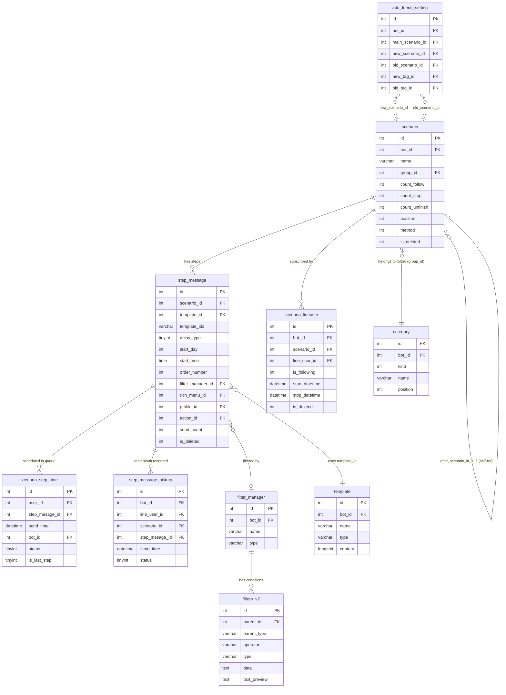

# DB Mapping — FA-009: Phát hành theo bước 「ステップ配信」

> Ngày tạo: 2026-05-19  
> Nguồn xác nhận: Schema `db/schema/tables/`, Models `src/web/sns-line/app/`, Data mẫu `db/data/`

---

## Primary Tables (trực tiếp liên quan)

### scenario

**Model**: `App\Scenario`  
**Bảng thực tế**: `scenario` (không phải `scenarios` — đã xác nhận qua `protected $table = 'scenario'`)  
**Vai trò**: Lưu thông tin kịch bản phát hành theo bước. Mỗi row là một scenario thuộc về một bot.

| Column | Type | Nullable | Default | Key | Mô tả |
|--------|------|----------|---------|-----|-------|
| `id` | int(11) | No | - | PK | ID scenario |
| `bot_id` | int(11) | No | - | FK→bots | ID bot sở hữu |
| `name` | varchar(200) | No | - | - | Tên quản lý scenario (UI: 管理名, max 20 ký tự) |
| `status` | int(11) | No | 0 | - | Trạng thái (xem bảng enum bên dưới) |
| `method` | int(11) | No | - | - | Phương thức: 0=emergency, 1=timer (config `scenario_type`) |
| `after_scenario_id_1` | int(11) | Yes | NULL | FK→scenario | Scenario tiếp theo sau khi kết thúc (slot 1) |
| `delay_type_1` | tinyint(4) | No | 0 | - | Kiểu delay cho kết nối sang scenario tiếp theo (slot 1) |
| `after_start_day_1` | int(11) | Yes | NULL | - | Số ngày sau khi bắt đầu sang scenario tiếp (slot 1) |
| `after_start_time_1` | time | Yes | NULL | - | Giờ chuyển sang scenario tiếp (slot 1) |
| `from_1` | date | Yes | NULL | - | Ngày bắt đầu hiệu lực slot 1 |
| `to_1` | date | Yes | NULL | - | Ngày kết thúc hiệu lực slot 1 |
| `after_scenario_id_2` | int(11) | Yes | NULL | FK→scenario | Scenario tiếp theo (slot 2) |
| `delay_type_2` | tinyint(4) | No | 0 | - | Kiểu delay (slot 2) |
| `after_start_day_2` | int(11) | Yes | NULL | - | Ngày delay (slot 2) |
| `after_start_time_2` | time | Yes | NULL | - | Giờ chuyển (slot 2) |
| `from_2` | date | Yes | NULL | - | Ngày bắt đầu hiệu lực slot 2 |
| `to_2` | date | Yes | NULL | - | Ngày kết thúc hiệu lực slot 2 |
| `after_scenario_id_3` | int(11) | Yes | NULL | FK→scenario | Slot 3 |
| `delay_type_3` | tinyint(4) | No | 0 | - | Slot 3 |
| `after_start_day_3` | int(11) | Yes | NULL | - | Slot 3 |
| `after_start_time_3` | time | Yes | NULL | - | Slot 3 |
| `from_3` | date | Yes | NULL | - | Slot 3 |
| `to_3` | date | Yes | NULL | - | Slot 3 |
| `after_scenario_id_4` | int(11) | Yes | NULL | FK→scenario | Slot 4 |
| `delay_type_4` | tinyint(4) | No | 0 | - | Slot 4 |
| `after_start_day_4` | int(11) | Yes | NULL | - | Slot 4 |
| `after_start_time_4` | time | Yes | NULL | - | Slot 4 |
| `from_4` | date | Yes | NULL | - | Slot 4 |
| `to_4` | date | Yes | NULL | - | Slot 4 |
| `after_scenario_id_5` | int(11) | Yes | NULL | FK→scenario | Slot 5 |
| `delay_type_5` | tinyint(4) | No | 0 | - | Slot 5 |
| `after_start_day_5` | int(11) | Yes | NULL | - | Slot 5 |
| `after_start_time_5` | time | Yes | NULL | - | Slot 5 |
| `from_5` | date | Yes | NULL | - | Slot 5 |
| `to_5` | date | Yes | NULL | - | Slot 5 |
| `position` | int(11) | Yes | NULL | - | Thứ tự hiển thị trong danh sách/folder |
| `is_deleted` | int(11) | Yes | 0 | - | Soft delete: 0=active, 1=đã xóa |
| `created_at` | timestamp | No | CURRENT_TIMESTAMP | - | Thời điểm tạo |
| `updated_at` | timestamp | Yes | NULL (ON UPDATE) | - | Thời điểm cập nhật |
| `group_id` | int(11) | No | 0 | FK→category | ID folder (category.id, kind=11). 0=Uncategorized (未分類) |
| `count_follow` | int(11) | Yes | 0 | - | Cache số bạn bè đang theo dõi (購読中の友だち) |
| `count_stop` | int(11) | Yes | 0 | - | Cache số bạn bè đã kết thúc (読了済の友だち) |
| `count_unfinish` | int(11) | No | 0 | - | Cache số bạn bè dừng giữa chừng (途中で終了した友だち) |
| `update_timestamp` | bigint(20) | Yes | NULL | - | Unix timestamp lần cập nhật gần nhất (dùng cho sync) |

**Lưu ý quan trọng**:
- Cột `group_id` là FK đến `category.id` (không phải `category_id`) — đây là cột lưu folder scenario
- `count_follow`, `count_stop`, `count_unfinish` là **cached counters** (không COUNT realtime từ `scenario_lineuser`) — được update bởi các process riêng
- 5 slot `after_scenario_id_X` cho phép cấu hình chuyển tiếp theo scenario khác sau khi kết thúc (logic mặc định theo date range)
- Model method `getScenarioBot()` map: `scenario_lineusers_reading_count = count_follow`, `scenario_lineusers_ended_count = count_stop`

---

### step_message

**Model**: `App\StepMessage`  
**Bảng thực tế**: `step_message` (không phải `step_messages`)  
**Vai trò**: Lưu thông tin từng bước (step) trong scenario — thời điểm gửi, template tin nhắn, filter đối tượng, rich menu.

| Column | Type | Nullable | Default | Key | Mô tả |
|--------|------|----------|---------|-----|-------|
| `id` | int(10) UNSIGNED | No | - | PK | ID step message |
| `scenario_id` | int(11) | No | - | FK→scenario | Thuộc scenario nào |
| `template_id` | int(11) | No | - | FK→template | Template chính (bộ nội dung 1) |
| `template_id_2` | int(11) | No | 0 | FK→template | Bộ nội dung 2 (0 = không dùng) |
| `template_id_3` | int(11) | No | 0 | FK→template | Bộ nội dung 3 (0 = không dùng) |
| `delay_type` | tinyint(1) | No | 0 | - | Kiểu thời điểm gửi: 0=ngày+giờ, 1=ngay lập tức, 2=sau N giờ phút |
| `start_day` | int(11) | Yes | NULL | - | Số ngày sau khi subscribe (khi delay_type=0) |
| `start_time` | time | Yes | NULL | - | Giờ gửi (khi delay_type=0); hoặc "HH:MM:00" biểu thị N giờ M phút (khi delay_type=2) |
| `order_number` | int(11) | Yes | NULL | - | Thứ tự bước trong scenario (N通目) |
| `tag_filter_method` | int(11) | No | 0 | - | Phương thức lọc theo tag: 0=không lọc, khác=có lọc |
| `category_id` | int(11) | Yes | NULL | FK→category | Folder của template (dùng trong UI tìm kiếm template) |
| `rich_menu_id` | int(11) | Yes | NULL | FK→rich_menus | Rich menu gắn với bước: NULL=không đổi, -1=hủy, >0=áp dụng |
| `delivery_tag` | varchar(500) | Yes | NULL | - | Tag IDs (CSV) chỉ gửi cho đối tượng CÓ tag này |
| `skip_tag` | varchar(500) | Yes | NULL | - | Tag IDs (CSV) bỏ qua đối tượng CÓ tag này |
| `is_stopped_after` | tinyint(4) | No | 0 | - | 1=dừng scenario sau bước này |
| `send_count` | int(11) | Yes | 0 | - | Số người đã nhận (到達人数 — cached counter) |
| `is_deleted` | int(11) | No | - | - | Soft delete: 0=active, 1=đã xóa |
| `created_at` | timestamp | No | CURRENT_TIMESTAMP | - | Thời điểm tạo |
| `updated_at` | timestamp | No | CURRENT_TIMESTAMP | - | Thời điểm cập nhật |
| `profile_id` | int(11) | Yes | NULL | FK→bots_profiles | Profile gửi (avatar + nickname) |
| `template_ids` | varchar(500) | Yes | NULL | - | Template IDs (CSV) trong bước — dùng cho v2 multi-template |
| `is_new` | tinyint(4) | No | 0 | - | 1=mới, 2=đã update (dùng cho sync) |
| `name` | varchar(255) | Yes | NULL | - | Tên bước (step.name trong UI) |
| `action_id` | int(10) | Yes | NULL | FK→t_actions | Elme Action gắn với bước |
| `filter_manager_id` | int(11) | Yes | NULL | FK→filter_manager | Điều kiện lọc đối tượng gửi |
| `update_timestamp` | bigint(20) | Yes | NULL | - | Unix timestamp sync |

**Lưu ý**:
- Bảng này đóng vai trò **kết hợp** cả "step" (bước/timing) và "template association" — không có bảng `scenario_steps` riêng
- `template_id`, `template_id_2`, `template_id_3`: cơ chế v1 (3 template cố định); `template_ids`: cơ chế v2 (CSV string nhiều template)
- `start_time` khi `delay_type=2`: giờ:phút biểu thị độ trễ (vd: "02:30:00" = sau 2 giờ 30 phút)
- `send_count` là cached counter, không realtime

---

### scenario_lineuser

**Model**: `App\ScenarioLineuser`  
**Bảng thực tế**: `scenario_lineuser` (không phải `scenario_lineusers`)  
**Vai trò**: Tracking trạng thái subscription của từng LINE user với scenario — ai đang theo dõi, ai đã dừng, ai đã hoàn thành.

| Column | Type | Nullable | Default | Key | Mô tả |
|--------|------|----------|---------|-----|-------|
| `id` | int(12) | No | - | PK | ID record |
| `bot_id` | int(12) | No | - | FK→bots | ID bot |
| `scenario_id` | int(12) | No | - | FK→scenario | Scenario đang theo dõi |
| `line_user_id` | int(12) | No | - | FK→line_user | LINE user đang theo dõi |
| `is_following` | int(12) | Yes | NULL | - | Trạng thái: 0=kết thúc/đọc xong, 1=đang theo dõi, 2=dừng giữa chừng/không theo dõi (xem chi tiết bên dưới) |
| `start_day` | int(12) | Yes | NULL | - | Ngày bắt đầu đăng ký (relative) |
| `start_time` | time | Yes | NULL | - | Giờ bắt đầu đăng ký |
| `sent_start_day` | int(11) | No | -1 | - | Ngày đã gửi gần nhất (-1=chưa gửi lần nào) |
| `sent_start_time` | time | No | - | - | Giờ đã gửi gần nhất |
| `delay_time` | bigint(20) | No | 0 | - | Thời gian delay tích lũy (milliseconds/seconds) |
| `last_time_send_delay_2` | bigint(20) | No | 0 | - | Timestamp lần gửi cuối (delay_type=2) |
| `start_datetime` | datetime | Yes | NULL | - | Datetime tuyệt đối bắt đầu theo dõi |
| `stop_datetime` | datetime | Yes | NULL | - | Datetime dừng theo dõi |
| `is_deleted` | tinyint(1) | Yes | 0 | - | Soft delete |
| `created_at` | timestamp | No | CURRENT_TIMESTAMP | - | Thời điểm tạo |
| `updated_at` | timestamp | Yes | NULL (ON UPDATE) | - | Thời điểm cập nhật |

**Lưu ý `is_following` values** (xác nhận từ source code `Scenario.php`):
- `is_following = 1`: Đang theo dõi (購読中) — dùng trong `scenario_lineusers_reading()`
- `is_following = 0` hoặc `is_following = 2`: Kết thúc — dùng trong `scenario_lineusers_ended()`
- Method `getListFriendUsers()`: `$userStatus == 1` → filter `is_following = 1` (đang theo dõi); khác → `is_following != 1` (không theo dõi)
- `count_unfinish` trong bảng `scenario` là cached counter cho trường hợp dừng giữa chừng — tương ứng subset của `is_following != 1`

---

### scenario_step_time

**Model**: `App\ScenarioStepTime`  
**Bảng thực tế**: `scenario_step_time`  
**Vai trò**: **Queue table** — Laravel ghi vào khi user subscribe, Spring Boot đọc để xác định thời điểm gửi từng bước. Records bị **DELETE** sau khi Spring Boot xử lý xong (không update status thành "done").

| Column | Type | Nullable | Default | Key | Mô tả |
|--------|------|----------|---------|-----|-------|
| `id` | int(10) UNSIGNED | No | - | PK | ID record |
| `user_id` | int(11) | No | - | FK→line_user | LINE user cần gửi |
| `step_mesage_id` | int(11) | No | - | FK→step_message | Bước cần gửi (typo trong schema: thiếu chữ 's') |
| `send_time` | datetime | No | - | - | Thời điểm dự kiến gửi |
| `bot_id` | int(11) | No | - | FK→bots | Bot sở hữu |
| `status` | tinyint(4) | No | - | - | Trạng thái xử lý: 0=chờ xử lý (Spring Boot query `status=0`) |
| `is_last_step` | tinyint(4) | Yes | NULL | - | 1=đây là bước cuối cùng của scenario |
| `is_same` | tinyint(4) | Yes | 0 | - | Flag kiểm tra duplicate: 1=trùng lịch với record khác cùng user+bot+send_time |
| `created_at` | timestamp | No | CURRENT_TIMESTAMP | - | Thời điểm tạo |
| `updated_at` | timestamp | No | CURRENT_TIMESTAMP (ON UPDATE) | - | Thời điểm cập nhật |

**Lưu ý quan trọng**:
- Tên cột `step_mesage_id` là **typo thực tế trong schema** (thiếu chữ 's' trong 'message') — đồng nhất giữa cả 3 bảng: `scenario_step_time`, `step_message_history`, và model
- Spring Boot đọc records có `status=0`, xử lý gửi tin, sau đó **DELETE** record (không update status)
- `is_same=1` flag được set khi có user cùng bot, cùng `send_time` — để tránh gửi trùng
- Method `getScenarioStepTimeIsSame()` query: `{user_id, bot_id, send_time, status=0}`

---

## Secondary Tables (liên quan gián tiếp)

### step_message_history

**Model**: `App\StepMessageHistory`  
**Bảng thực tế**: `step_message_history`  
**Connection**: `mysql_step_message` (database connection riêng — không phải connection mặc định)  
**Vai trò**: Lưu kết quả sau khi Spring Boot gửi tin xong. Dùng để thống kê "số người đã nhận bước X".

| Column | Type | Nullable | Default | Key | Mô tả |
|--------|------|----------|---------|-----|-------|
| `id` | int(10) UNSIGNED | No | - | PK | ID record |
| `bot_id` | int(11) | Yes | NULL | FK→bots | Bot sở hữu |
| `line_user_id` | int(11) | Yes | NULL | FK→line_user | LINE user đã nhận |
| `scenario_id` | int(11) | Yes | NULL | FK→scenario | Scenario liên quan |
| `step_mesage_id` | int(11) | Yes | NULL | FK→step_message | Bước đã gửi (typo: thiếu 's') |
| `send_time` | datetime | Yes | NULL | - | Thời điểm gửi thực tế |
| `status` | tinyint(4) | Yes | NULL | - | Kết quả: 2=gửi thành công, 3=gửi thất bại (từ data mẫu) |
| `is_last_step` | tinyint(4) | Yes | NULL | - | 1=bước cuối |
| `created_at` | timestamp | No | CURRENT_TIMESTAMP | - | Thời điểm ghi |
| `updated_at` | timestamp | No | CURRENT_TIMESTAMP (ON UPDATE) | - | Thời điểm cập nhật |

**Lưu ý**:
- Model dùng connection `mysql_step_message` — có thể là database tách riêng cho log/history
- `Scenario::getListFriendUsersByStepId()` query: `WHERE scenario_id=X AND step_mesage_id=Y AND status=2 AND bot_id=Z` → lấy danh sách user đã nhận thành công bước Y
- status=2 xác nhận là "gửi thành công", status=3 là "thất bại" (từ data mẫu)

---

### category

**Model**: `App\Category`  
**Bảng thực tế**: `category` (không phải `categories`)  
**Vai trò**: Quản lý folders trong giao diện — dùng chung cho nhiều loại object (tag, template, scenario, v.v.), phân biệt bằng `kind`.

| Column | Type | Nullable | Default | Key | Mô tả |
|--------|------|----------|---------|-----|-------|
| `id` | int(11) | No | - | PK | ID category/folder |
| `bot_id` | int(11) | No | - | FK→bots | Bot sở hữu |
| `kind` | int(11) | No | - | - | Loại object: **11=scenario** (config `category_kind.scenario`) |
| `name` | varchar(100) | No | - | - | Tên folder (フォルダ名, max 15 ký tự từ UI) |
| `position` | int(11) | Yes | NULL | - | Thứ tự hiển thị |
| `is_deleted` | int(11) | Yes | 0 | - | Soft delete |
| `created_at` | timestamp | No | CURRENT_TIMESTAMP | - | Thời điểm tạo |
| `updated_at` | timestamp | Yes | NULL (ON UPDATE) | - | Thời điểm cập nhật |
| `category_id_old` | int(11) | No | -1 | - | ID cũ trước khi migrate (dùng cho data transfer) |

**Lưu ý**:
- Relation: `Category::scenarios()` → `hasMany(Scenario::class, 'group_id', 'id')` — FK trong `scenario` là `group_id` (không phải `category_id`)
- Filter bởi `kind=11` khi lấy folder cho scenario: `config('sns-line.category_kind.scenario') = 11`
- Khi scenario chưa có folder: `group_id=0` (hiển thị là 「未分類」)

---

### filter_manager

**Model**: `App\FilterManager` (suy luận)  
**Bảng thực tế**: `filter_manager`  
**Vai trò**: Quản lý tập hợp điều kiện lọc đối tượng gửi — mỗi step message có thể gắn một filter_manager.

| Column | Type | Nullable | Default | Key | Mô tả |
|--------|------|----------|---------|-----|-------|
| `id` | int(10) UNSIGNED | No | - | PK | ID filter manager |
| `bot_id` | int(10) UNSIGNED | No | - | FK→bots | Bot sở hữu |
| `name` | varchar(255) | No | - | - | Tên filter (任意 — tên quản lý) |
| `type` | varchar(255) | No | - | - | Loại filter |
| `parent_id` | int(10) | No | - | - | ID object cha gắn filter này |
| `created_at` | timestamp | Yes | NULL | - | Thời điểm tạo |
| `updated_at` | timestamp | Yes | NULL | - | Thời điểm cập nhật |

---

### filters_v2

**Bảng thực tế**: `filters_v2`  
**Vai trò**: Chứa từng điều kiện lọc riêng lẻ thuộc về một `filter_manager`.

| Column | Type | Nullable | Default | Key | Mô tả |
|--------|------|----------|---------|-----|-------|
| `id` | int(10) UNSIGNED | No | - | PK | ID filter |
| `bot_id` | int(11) | Yes | NULL | FK→bots | Bot sở hữu |
| `parent_type` | varchar(255) | Yes | NULL | - | Loại object cha (vd: "step_message") |
| `parent_id` | int(11) | Yes | NULL | - | ID object cha |
| `operator` | varchar(100) | Yes | NULL | - | Toán tử: AND/OR |
| `type` | varchar(255) | Yes | NULL | - | Loại điều kiện (tag, friend_info, v.v.) |
| `data` | text | Yes | NULL | - | Dữ liệu điều kiện (JSON) |
| `text_preview` | text | Yes | NULL | - | Text hiển thị preview trên UI |
| `created_at` | timestamp | No | CURRENT_TIMESTAMP | - | Thời điểm tạo |
| `updated_at` | timestamp | No | CURRENT_TIMESTAMP (ON UPDATE) | - | Thời điểm cập nhật |
| `rich_menu_item_id` | int(11) | Yes | NULL | - | FK→rich_menu_items (cho rich menu filter) |
| `rich_menu_redirect_id` | int(11) | Yes | NULL | - | FK→rich_menus (redirect) |

---

### add_friend_setting

**Model**: `App\AddFriendSetting`  
**Bảng thực tế**: `add_friend_setting`  
**Vai trò**: Cài đặt auto-subscribe khi bạn bè mới/cũ add LINE — quyết định scenario nào được tự động đăng ký cho bạn bè. Màn hình SCR-SCE-05 (設定).

| Column | Type | Nullable | Default | Key | Mô tả |
|--------|------|----------|---------|-----|-------|
| `id` | int(11) | No | - | PK | ID |
| `bot_id` | int(11) | No | - | FK→bots | Bot |
| `main_scenario_id` | int(11) | Yes | NULL | FK→scenario | Scenario chính (main) |
| `new_scenario_id` | int(11) | Yes | NULL | FK→scenario | Scenario cho bạn bè MỚI |
| `new_delay_type` | tinyint(1) | No | 0 | - | Kiểu delay bạn bè mới: 0=từ đầu, 1=từ giữa chừng |
| `new_start_day` | int(11) | Yes | NULL | - | Ngày bắt đầu (khi new_delay_type=1) |
| `new_start_time` | time | Yes | NULL | - | Giờ bắt đầu (khi new_delay_type=1) |
| `new_tag_id` | int(11) | Yes | NULL | FK→tags | Tag gán cho bạn bè mới khi subscribe |
| `new_category_id` | int(11) | Yes | NULL | FK→category | Folder tag bạn bè mới |
| `old_scenario_id` | int(11) | Yes | NULL | FK→scenario | Scenario cho bạn bè CŨ (re-follow) |
| `old_delay_type` | tinyint(1) | No | 0 | - | Kiểu delay bạn bè cũ |
| `old_start_day` | int(11) | Yes | NULL | - | Ngày bắt đầu (bạn bè cũ) |
| `old_start_time` | time | Yes | NULL | - | Giờ bắt đầu (bạn bè cũ) |
| `old_category_id` | int(11) | Yes | NULL | FK→category | Folder tag bạn bè cũ |
| `old_tag_id` | int(11) | Yes | NULL | FK→tags | Tag gán cho bạn bè cũ |
| `created_at` | int(11) | No | - | - | Unix timestamp tạo (int, không phải timestamp) |
| `updated_at` | int(11) | Yes | NULL | - | Unix timestamp cập nhật |
| `sent_templates_new_friend` | varchar(500) | Yes | NULL | - | Template IDs (CSV) gửi ngay khi bạn mới add |
| `action_add_old_friend` | tinyint(4) | No | 0 | - | Hành động khi bạn cũ re-follow |
| `sent_templates_old_friend` | varchar(500) | Yes | NULL | - | Template IDs (CSV) gửi ngay khi bạn cũ re-follow |
| `action_new_id` | int(11) | Yes | NULL | FK→t_actions | Action cho bạn mới |
| `action_old_id` | int(11) | Yes | NULL | FK→t_actions | Action cho bạn cũ |
| `action_id_unblock` | int(11) | Yes | NULL | FK→t_actions | Action khi unblock |
| `template_add_new_id` | int(11) | Yes | NULL | FK→template | Template tin nhắn chào bạn mới |
| `template_add_old_id` | int(11) | Yes | NULL | FK→template | Template tin nhắn chào bạn cũ |
| `template_unblock_id` | int(11) | Yes | NULL | FK→template | Template tin nhắn khi unblock |

---

### template

**Bảng thực tế**: `template`  
**Vai trò**: Template tin nhắn — được tham chiếu từ `step_message` qua `template_id`, `template_id_2`, `template_id_3`, `template_ids`.

Chỉ liệt kê các cột liên quan trực tiếp đến FA-009:

| Column | Type | Ghi chú |
|--------|------|---------|
| `id` | int(11) PK | ID template |
| `bot_id` | int(11) | Bot sở hữu |
| `name` | varchar(255) | Tên template |
| `type` | varchar(30) | Loại: text/image/stamp/question/form/location/introduction/video/voice/group |
| `content` | longtext | Nội dung tin nhắn |
| `thumbnail_path` | text | Đường dẫn thumbnail (video/image) |
| `category_id` | int(11) | Folder template |
| `answer_type` | tinyint(1) | Loại trả lời: 0=không giới hạn, 1=panel 1 click, 2=carousel 1 click |
| `type_button` | tinyint(4) | 1=mặc định, 2=chỉnh màu, 3=dạng ảnh, 4=quick reply |

---

## UI ↔ DB Field Mapping

### SCR-SCE-01: Danh sách Scenario (Màn hình chính)

| UI Element | Label JP | DB Table | Column | Mapping Type | Confidence | Ghi chú |
|-----------|---------|---------|--------|--------------|-----------|---------|
| Modal input 管理名 | 管理名 | `scenario` | `name` | Direct | **Cao** | varchar(200), UI giới hạn 20 ký tự |
| Modal select フォルダ | フォルダ | `scenario` | `group_id` | FK→category.id | **Cao** | 0=未分類; kind=11 trong category |
| Modal checkbox 一番上 | フォルダ内の一番上に追加する | `scenario` | `position` | Derived | **Trung bình** | position=0 khi checked |
| Table col 管理名 | 管理名 | `scenario` | `name` | Direct | **Cao** | |
| Table col 購読中 | 購読中の友だち | `scenario` | `count_follow` | Cached counter | **Cao** | Mapped qua `scenario_lineusers_reading_count = count_follow` |
| Table col 途中終了 | 途中で終了した友だち | `scenario` | `count_unfinish` | Cached counter | **Cao** | Confirmed từ Vue prop `item.count_unfinish` |
| Table col 読了済 | 読了済の友だち | `scenario` | `count_stop` | Cached counter | **Cao** | Mapped qua `scenario_lineusers_ended_count = count_stop` |
| Folder name | フォルダ名 | `category` | `name` | Direct | **Cao** | max 15 ký tự (UI), kind=11 |
| Modal 移行先 | 移行先選択 | `scenario` | `group_id` | FK→category.id | **Cao** | Update group_id khi move folder |
| Row sort | (drag & drop) | `scenario` | `position` | Direct | **Trung bình** | UPDATE position khi reorder |

### SCR-SCE-02: Danh sách Step Message (v2)

| UI Element | Label JP | DB Table | Column | Mapping Type | Confidence | Ghi chú |
|-----------|---------|---------|--------|--------------|-----------|---------|
| Step timing | 配信日程 | `step_message` | `start_day`, `start_time`, `delay_type` | Composite | **Cao** | Hiển thị tùy delay_type |
| Step order | N通目 | `step_message` | `order_number` | Direct | **Cao** | |
| Step name | (tên bước) | `step_message` | `name` | Direct | **Cao** | |
| Số người nhận | 到達人数 | `step_message` | `send_count` | Cached counter | **Cao** | Hoặc COUNT từ step_message_history WHERE status=2 |
| Rich menu | リッチメニュー | `step_message` | `rich_menu_id` | FK→rich_menus | **Cao** | -1=hủy, NULL=không đổi |
| Profile gửi | (avatar/nickname) | `step_message` | `profile_id` | FK→bots_profiles | **Cao** | |
| Filter đối tượng | 対象者 | `step_message` | `filter_manager_id` | FK→filter_manager | **Cao** | NULL=gửi tất cả |
| Elme action | (action panel) | `step_message` | `action_id` | FK→t_actions | **Cao** | |
| Nội dung tin nhắn | 本文 | `template` | `type`, `content` | Via step_message.template_id | **Cao** | Lấy template theo template_ids hoặc template_id |
| step.has_filter | (boolean flag) | `step_message` | `filter_manager_id IS NOT NULL` | Derived | **Cao** | |

### SCR-SCE-03: Tạo/Sửa Step (Modal thêm thời điểm)

| UI Element | Label JP | DB Table | Column | Mapping Type | Confidence | Ghi chú |
|-----------|---------|---------|--------|--------------|-----------|---------|
| delay_type radio | 配信タイミング | `step_message` | `delay_type` | Direct | **Cao** | 0/1/2 |
| start_day input | N日後 | `step_message` | `start_day` | Direct | **Cao** | khi delay_type=0 |
| start_time input | 時刻 | `step_message` | `start_time` | Direct | **Cao** | khi delay_type=0 |
| time input (delay_type=2) | N時間M分後 | `step_message` | `start_time` | Encoded | **Cao** | HH=giờ, MM=phút |
| template picker | テンプレート選択 | `step_message` | `template_ids` (v2) / `template_id` (v1) | Direct/CSV | **Cao** | |
| filter picker | 対象者フィルター | `filter_manager` | `id`, `name` | Via filter_manager_id | **Cao** | |
| is_stopped_after | ここで配信を停止 | `step_message` | `is_stopped_after` | Direct | **Trung bình** | 1=dừng sau bước này |

### SCR-SCE-04: Tạo/Sửa Nội dung Tin nhắn

| UI Element | Label JP | DB Table | Column | Mapping Type | Confidence | Ghi chú |
|-----------|---------|---------|--------|--------------|-----------|---------|
| Loại tin nhắn | メッセージタイプ | `template` | `type` | Direct | **Cao** | text/image/stamp/... |
| Nội dung text | 本文 | `template` | `content` | Direct | **Cao** | |
| Media upload | 画像/動画 | `template` | `thumbnail_path`, `image_server` | Direct | **Cao** | |
| Rút gọn URL | URL短縮 | `template` | `is_shorten_url` | Direct | **Cao** | 1=rút gọn |
| Question answers | 選択肢 | `template` | `content` (JSON) | Embedded | **Trung bình** | Câu hỏi và postback data trong content JSON |
| Button type | ボタンタイプ | `template` | `type_button` | Direct | **Trung bình** | 1/2/3/4 |

### SCR-SCE-05: Cài đặt Scenario (設定)

| UI Element | Label JP | DB Table | Column | Mapping Type | Confidence | Ghi chú |
|-----------|---------|---------|--------|--------------|-----------|---------|
| Scenario bạn mới | 新規ご追加 | `add_friend_setting` | `new_scenario_id` | FK→scenario | **Cao** | |
| Kiểu delay mới | (từ đầu/từ giữa) | `add_friend_setting` | `new_delay_type` | Direct | **Cao** | |
| Ngày bắt đầu mới | 開始日 | `add_friend_setting` | `new_start_day` | Direct | **Cao** | khi new_delay_type=1 |
| Giờ bắt đầu mới | 開始時刻 | `add_friend_setting` | `new_start_time` | Direct | **Cao** | |
| Tag bạn mới | タグ付け(新規) | `add_friend_setting` | `new_tag_id` | FK→tags | **Cao** | |
| Scenario bạn cũ | 再ご追加 | `add_friend_setting` | `old_scenario_id` | FK→scenario | **Cao** | |
| Kiểu delay cũ | (từ đầu/từ giữa) | `add_friend_setting` | `old_delay_type` | Direct | **Cao** | |
| Ngày bắt đầu cũ | 開始日 | `add_friend_setting` | `old_start_day` | Direct | **Cao** | |
| Giờ bắt đầu cũ | 開始時刻 | `add_friend_setting` | `old_start_time` | Direct | **Cao** | |
| Tag bạn cũ | タグ付け(再) | `add_friend_setting` | `old_tag_id` | FK→tags | **Cao** | |

---

## Enum / Status Values

### step_message.delay_type (thời điểm gửi của bước)

| DB Value | UI Label JP | Mô tả |
|----------|------------|-------|
| `0` | 日時で指定 | Chỉ định ngày + giờ cụ thể (N ngày sau khi subscribe, vào lúc HH:MM) |
| `1` | ステップ開始直後 | Ngay khi bắt đầu step (không delay) |
| `2` | 経過時間で指定 | Sau N giờ M phút (encode vào `start_time` dạng HH:MM:00) |

*Xác nhận từ blade template: `v-if="step.delay_type == 1"` → "ステップ開始時", `delay_type == 0"` → "X日後HH:MM", `delay_type == 2"` → "X時間Y分後"*

### scenario_lineuser.is_following (trạng thái subscription)

| DB Value | UI Display JP | Mô tả |
|----------|--------------|-------|
| `1` | 購読中 | Đang theo dõi scenario (method `scenario_lineusers_reading()`) |
| `0` | 読了済 / 配信停止 | Đã kết thúc/đọc xong hoặc bị dừng |
| `2` | 途中で終了 | Không theo dõi nữa (method `scenario_lineusers_ended()` bắt cả `0` và `2`) |

*Xác nhận từ source `Scenario.php`: `reading = is_following=1`, `ended = is_following=0 OR is_following=2`*  
*Lưu ý: `count_unfinish` trong bảng `scenario` có thể tương ứng riêng với `is_following=2`, còn `count_stop` tương ứng với `is_following=0` — nhưng cần xác nhận thêm từ logic update counter*

### step_message_history.status (kết quả gửi)

| DB Value | Mô tả |
|----------|-------|
| `2` | Gửi thành công — dùng trong query thống kê |
| `3` | Gửi thất bại |

*Xác nhận từ data mẫu và query `WHERE status=2` trong `Scenario::getListFriendUsersByStepId()`*

### scenario_step_time.status (trạng thái queue)

| DB Value | Mô tả |
|----------|-------|
| `0` | Chờ xử lý (Spring Boot query `status=0` để lấy việc cần làm) |

*Records bị DELETE sau khi Spring Boot xử lý xong — không có value "đã xử lý"*

### category.kind (loại folder)

| DB Value | Config key | Dùng cho |
|----------|-----------|---------|
| `11` | `category_kind.scenario` | **Folder scenario** — dùng trong FA-009 |
| `0` | `category_kind.tag` | Folder tag |
| `1` | `category_kind.reply` | Folder autoreply |
| `2` | `category_kind.template` | Folder template |
| `3` | `category_kind.url` | Folder URL |
| `10` | `category_kind.landing` | Folder landing page |

### scenario.method

| DB Value | Config key | Mô tả |
|----------|-----------|-------|
| `0` | `scenario_type.emergency` | Loại khẩn cấp (emergency) |
| `1` | `scenario_type.timer` | Loại timer (phát hành theo thời gian) |

---

## Unmapped Items

### UI fields không tìm thấy DB match rõ ràng

| UI Field / Vue Prop | Vấn đề | Mức Confidence |
|--------------------|--------|---------------|
| `step.start_minute`, `step.start_second` | Không có cột riêng — encode vào `step_message.start_time` dạng HH:MM:00 | **Thấp** |
| `step.start_time_format_jp` | Computed từ start_day + start_time + delay_type — không lưu DB | **Cao** (computed) |
| `step.messages` (array) | Multi-template qua `template_ids` CSV, không có join table riêng | **Trung bình** |
| `filter.list_preview_filter` | Computed từ `filters_v2.text_preview` | **Trung bình** |
| `step.toggle_action` | UI state only — không lưu DB | **Cao** (UI state) |
| `option_add_template` (1=link, 2=copy) | Không tìm thấy cột lưu trạng thái này trong schema | **Thấp** |
| Thống kê "đã đọc" per step | Không có cột pre-computed — query từ `step_message_history WHERE status=2` | **Cao** (realtime) |

### DB columns không xuất hiện trực tiếp trên UI

| Bảng | Column | Mô tả |
|------|--------|-------|
| `scenario` | `after_scenario_id_1..5` | Cấu hình chuyển tiếp sang scenario khác — có thể là tính năng nâng cao ít dùng |
| `scenario` | `from_1..5`, `to_1..5` | Date range hiệu lực cho kết nối scenario |
| `scenario` | `delay_type_1..5`, `after_start_day_1..5`, `after_start_time_1..5` | Config timing chuyển scenario |
| `scenario` | `update_timestamp` | Dùng cho sync/cache |
| `scenario_lineuser` | `delay_time`, `last_time_send_delay_2` | Internal timing tracking của job |
| `scenario_lineuser` | `sent_start_day`, `sent_start_time` | Tracking ngày/giờ đã gửi gần nhất |
| `step_message` | `is_new`, `update_timestamp` | Dùng cho sync với Spring Boot |
| `step_message` | `tag_filter_method` | Phương thức lọc tag (khác với filter_manager) — chức năng chưa rõ |
| `category` | `category_id_old` | Dùng cho data migration |
| `add_friend_setting` | `action_id_unblock`, `template_unblock_id` | Hành động khi user unblock bot |
| `step_message_history` | `is_last_step` | Flag copied từ scenario_step_time |
| `scenario_step_time` | `is_same` | Anti-duplicate flag |

### Tables từ db-hint không tồn tại trong schema thực tế

| Tên dự đoán ban đầu | Tên thực tế | Ghi chú |
|--------------------|------------|---------|
| `scenarios` | `scenario` | Không có 's' |
| `scenario_steps` | Không tồn tại | Chức năng merge vào `step_message` |
| `scenario_lineusers` | `scenario_lineuser` | Không có 's' |
| `step_messages` | `step_message` | Không có 's' |
| `step_message_templates` | Không tìm thấy | Có thể là `template` table trực tiếp |
| `categories` | `category` | Không có 's' |
| `filter_managers` | `filter_manager` | Không có 's' |
| `add_friend_settings` | `add_friend_setting` | Không có 's' |

---

## ER Diagram

---

## Độ bao phủ (Coverage)

### Primary tables
| Bảng | Trạng thái | Confidence |
|------|-----------|-----------|
| `scenario` | Đã map đầy đủ | **Cao** |
| `step_message` | Đã map đầy đủ | **Cao** |
| `scenario_lineuser` | Đã map đầy đủ | **Cao** |
| `scenario_step_time` | Đã map đầy đủ | **Cao** |
| `step_message_history` | Đã map đầy đủ | **Cao** |

### Secondary tables
| Bảng | Trạng thái | Confidence |
|------|-----------|-----------|
| `category` | Đã map | **Cao** |
| `filter_manager` | Đã map cơ bản | **Cao** |
| `filters_v2` | Đã map cơ bản | **Cao** |
| `add_friend_setting` | Đã map đầy đủ | **Cao** |
| `template` | Đã map các cột liên quan | **Cao** |

### Tóm tắt
- **Primary tables**: 5/5 đã map
- **Secondary tables**: 5/5 đã map (mức độ khác nhau)
- **UI fields**: ~35/40 đã map — còn một số computed/UI-state fields không có DB column
- **Overall confidence**: **Cao** — toàn bộ schemas xác nhận từ source, models xác nhận tên bảng thực tế, data mẫu xác nhận enum values

### Điểm chú ý đặc biệt
1. **Tên bảng**: Tất cả đều số ít (không có 's') — khác với dự đoán ban đầu trong db-hint
2. **Không có bảng `scenario_steps` riêng**: Timing/step info được merge trực tiếp vào `step_message`
3. **Typo `step_mesage_id`**: Thiếu chữ 's' trong 'message' — đồng nhất ở cả 3 bảng, đây là typo thực tế trong production schema
4. **`StepMessageHistory` dùng connection khác**: `mysql_step_message` — có thể là database riêng cho log
5. **Counters cached trong `scenario`**: `count_follow`, `count_stop`, `count_unfinish` là cached values, không realtime JOIN
