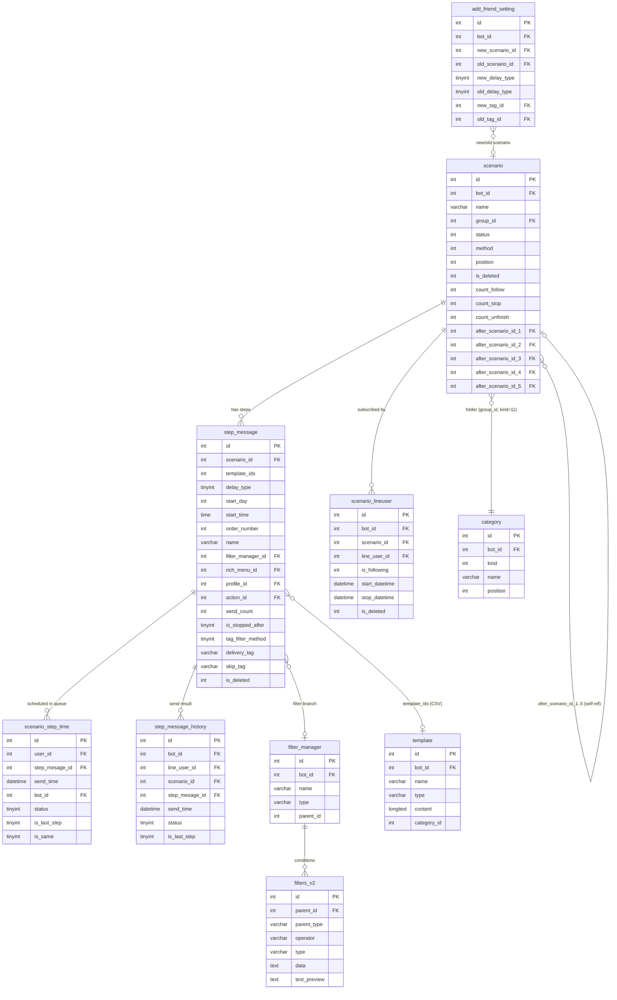

# FA-009: Phát hành theo bước 「ステップ配信」

> **Trạng thái**: HOÀN THÀNH  
> **Portal**: Admin  
> **URL chính**: /basic/scenario  
> **Nguồn**: Source code analysis (UI không truy cập được — subscription required)  
> **Ngày tạo**: 2026-05-19

---

## 1. Tổng quan

### Mục đích

「ステップ配信」 (Phát hành theo bước) cho phép Admin tạo các kịch bản gửi tin nhắn tự động đến bạn bè (LINE users) theo trình tự và thời gian định sẵn. Mỗi kịch bản (scenario) chứa nhiều bước (steps), mỗi bước cấu hình riêng thời điểm gửi và nội dung tin nhắn, cho phép xây dựng hành trình tự động hoàn toàn từ khi bạn bè add LINE OA cho đến khi kết thúc chuỗi nội dung.

### Actors

| Actor | Quyền |
|-------|-------|
| Admin (主管理者) | Tạo, sửa, xóa, xem tất cả scenario và step messages |
| Staff | Theo cấu hình quyền — blade không có `@can` rõ ràng, cần xác nhận thêm |

### Phạm vi tính năng

- Quản lý danh sách scenario (tạo, sửa tên, xóa, copy, sắp xếp, chuyển folder)
- Quản lý folder chứa scenario (tạo, sửa, xóa, sắp xếp)
- Thiết kế timeline step messages cho từng scenario (thêm, sửa, xóa, sắp xếp bước)
- Gắn tin nhắn (template) vào từng bước — hỗ trợ nhiều loại tin
- Cấu hình filter phân nhánh đối tượng nhận
- Cài đặt auto-subscribe khi bạn bè mới/cũ add LINE OA (「ステップ配信設定」)
- Xem danh sách bạn bè theo trạng thái (đang theo dõi / dừng giữa chừng / hoàn thành)
- Gửi test tin nhắn trước khi publish

---

## 2. Hai phiên bản giao diện (v1/v2)

> **Lưu ý quan trọng cho dev/tester**: Hệ thống tồn tại song song hai phiên bản giao diện. **v2 là giao diện chính** đang hoạt động.

| Phiên bản | View file | Endpoint chính | Trạng thái |
|-----------|-----------|----------------|-----------|
| v1 (cũ) | `basic.step_message.index` | EP-12: GET /step-message/list-message/{scenario} | Còn tồn tại, ít dùng |
| v2 (mới) | `basic.step_message.index_v2` | EP-12: `listMessage()` trả về `index_v2` | **Giao diện chính** |
| v2 scenario design | `basic.step_message.scenario_message` | EP-13: GET /step-message/scenario-message/{scenario} | Trang thiết kế step timeline |

---

## 3. Các màn hình và Luồng xử lý

### SCR-SCE-01: Danh sách Scenario 「ステップ配信（一覧）」

**URL**: `/basic/scenario`  
**Controller**: `Basic\ScenarioController@index`  
**View**: `basic.scenario.scenario_index`  
**Mức độ tin cậy**: **Cao**

#### Mô tả layout

Màn hình chia 2 cột (`.body_separate`):
- **Cột trái**: Danh sách folder (`.scenario_folder_list`) — với folder mặc định 「未分類」 và danh sách folder người dùng tạo
- **Cột phải**: Danh sách scenario trong folder đang chọn (`.scenario_item_list`)
- **Toolbar trên danh sách**: Nút 「新規作成」, 「並べ替え」, ô tìm kiếm theo 管理名
- **Thanh action dưới**: Toggle folder panel, 「一括フォルダ変更」, 「一括削除」, pagination

**Bảng danh sách Scenario**:

| Cột | Label JP | Mô tả |
|-----|----------|-------|
| Checkbox | — | Chọn nhiều để bulk action |
| Tên | 管理名 | Click → vào trang step messages |
| Đang đọc | 購読中の友だち | Số bạn đang theo dõi (N人) + nút 「表示」 |
| Chưa hoàn thành | 途中で終了した友だち | Số bạn dừng giữa chừng + nút 「表示」 |
| Đã đọc xong | 読了済の友だち | Số bạn đã hoàn thành + nút 「表示」 |
| Action | — | Menu 「...」 → コピー / 削除 |

#### Luồng end-to-end: Tạo Scenario mới

```
User → click 「新規作成」 → mở modal #modalCreateScen
  → Nhập 管理名 (max 20 ký tự, required)
  → Chọn フォルダ (dropdown, mặc định 未分類)
  → Chọn vị trí thêm (đầu/cuối, qua checkbox 「フォルダ内の一番上に追加する」)
  → Click 「メッセージの登録に進む」
  → POST /basic/scenario [EP-02]
    → ScenarioController@store()
    → Kiểm tra BackupHistory (chặn nếu đang backup/transfer)
    → Validate name: required, max:20
    → Tính position: flag_position có → min(position)-1 (đầu); không → max(position)+1 (cuối)
    → INSERT INTO scenario (name, bot_id, method=0, group_id, position, update_timestamp)
    → Response JSON: {success, folderId, scenarioId}
  → Redirect sang SCR-SCE-02/03 (trang step messages)
```

#### Actions khác tại SCR-SCE-01

| Action | Trigger | Endpoint |
|--------|---------|----------|
| Copy scenario | Menu 「...」→「コピー」 | EP-10: GET /basic/scenario/copy/{scenario} |
| Xóa scenario | Menu 「...」→「削除」 | EP-04: DELETE /basic/scenario/{scenario} |
| Sắp xếp scenario | Nút 「並べ替え」 | AJAX ajaxGetListScenario action=sortItem |
| Chuyển folder (bulk) | Nút 「一括フォルダ変更」 | AJAX ajaxGetListScenario action=moveItem |
| Xóa hàng loạt | Nút 「一括削除」 | AJAX ajaxGetListScenario action=deleteItems |
| Tạo folder | Nút 「フォルダ追加」 | AJAX |
| Sắp xếp folder | Nút 「並べ替え」(folder panel) | AJAX ajaxGetListScenario action=sortFolder |
| Xóa folder | Menu folder 「フォルダ削除」 | AJAX ajaxGetListScenario action=deleteFolderSelected |

---

### SCR-SCE-02/03: Danh sách Step Messages 「ステップ配信メッセージ」

**URL (v2)**: `/step-message/list-message/{scenario}` (EP-12, view index_v2)  
**URL (scenario design)**: `/step-message/scenario-message/{scenario}` (EP-13, view scenario_message)  
**Controller**: `Basic\StepMessageController@listMessage` / `@scenarioMessage`  
**Mức độ tin cậy**: **Cao**

#### Layout (v2 — giao diện chính)

- Tiêu đề: `【{tên scenario}】ステップ配信メッセージ`
- **Phần Filter/配信対象** (section-filter): chọn đối tượng nhận — mặc định 「ステップ購読者全員」; có thể thêm nhiều filter branch qua 「配信対象追加」
- **Toolbar**: Nút 「配信タイミング」 (thêm bước, max 100/filter), 「一括プレビュー」, selector số items/trang, pagination, 「一括操作」
- **Danh sách Step Items**: Mỗi step gồm header (số thứ tự, thời điểm gửi, tên step, số người đã nhận) + nội dung (tin nhắn + elme action)

#### Luồng end-to-end: Thêm Step mới

```
User → click 「配信タイミング」
  → Kiểm tra số step < 100/filter (nếu đủ: báo lỗi giới hạn)
  → Mở modal chọn thời điểm gửi (.modal-edit-step)
  → Chọn 1 trong 3 kiểu:
    - 「ステップ開始直後」 (delay_type=1)
    - 「日時で指定」 (delay_type=0): nhập số ngày + giờ
    - 「経過時間で指定」 (delay_type=2): nhập N giờ M phút
  → Click 「決定」
  → AJAX POST /basic/scenario/create-step
    → ScenarioController@createScenarioStep()
    → Kiểm tra trùng (delay_type + start_day + start_time + filter_manager_id)
    → INSERT INTO step_message (scenario_id, delay_type, start_day, start_time, order_number, filter_manager_id)
    → Reorder tất cả steps: ORDER BY start_day ASC, start_time ASC, id ASC
    → Response JSON
```

#### Luồng end-to-end: Thêm tin nhắn vào Step

```
User → click 「+ メッセージ」 hoặc 「+ テンプレート」

Cách 1 — Tạo tin nhắn mới:
  → Redirect sang /basic/template-v2/add-template?template_group_id={step_id}&action_type=scenario&scenario_id={id}
  → [Tạo nội dung, submit]
  → POST /basic/step-message/store/{scenario} [EP-18]
    → StepMessageController@store()
    → Với mỗi tmp_type[key]: handlerCreateTemplate() → tạo template (category_id=-111)
    → Append template_id vào step_message.template_ids (CSV)
    → Tạo template_mapping_table cho mỗi template

Cách 2 — Chọn từ thư viện template:
  → Modal #templateModal → chọn template → modal #confirmAddTemplate
  → Chọn: 「テンプレートをそのまま利用する」 (link) hoặc 「テンプレートを引用して編集する」 (copy)
  → AJAX POST /step-message/create-by-template hoặc /step-message/clone-by-template
    → StepMessageController@createStepMessageByTemplate() / @cloneStepMessageByTemplate()
    → Thêm template ID vào step_message.template_ids
```

---

### SCR-SCE-04: Tạo/Chỉnh sửa Nội dung Tin nhắn 「配信メッセージ登録」

**URL tạo mới**: `/basic/template-v2/add-template` (v2) hoặc `/step-message/create/{scenario}/{scenario_step_id}` (v1)  
**URL sửa**: `/step-message/edit/{step_message}/{template_id}`  
**Controller**: `Basic\StepMessageController@create` / `@edit` / `@store` / `@update`  
**View**: `basic.step_message.create`  
**Mức độ tin cậy**: **Cao**

#### Loại nội dung tin nhắn

| Tab | Loại | Điều kiện hiển thị |
|-----|------|--------------------|
| テキスト | text | Luôn hiển thị |
| 質問・ボタン | form | Chỉ khi bot_type == 0 |
| メディア | image/voice/video | Luôn hiển thị |
| スタンプ | stamp | Chỉ khi bot_type == 0 |
| 位置情報 | location | Chỉ khi bot_type == 0 |
| 紹介 | introduction | Chỉ khi bot_type == 0 |

#### Gửi thử (Tester mode)

Khi request có `is_tester` (không phải 'undefined') → tạo template tạm → gửi thử qua `ChatHelper::tester()` → xóa template. **Không lưu** vào `step_message.template_ids`.

---

### SCR-SCE-05: Cài đặt Auto-subscribe 「ステップ配信設定」

**URL**: GET `/scenario-setting`, POST `/basic/scenario-setting`  
**Controller**: `Basic\ScenarioController@setting` / `@updateSetting`  
**View**: `basic.scenario.setting`  
**Mức độ tin cậy**: **Cao**

#### Layout

Chia 2 cột:
- **「新規友だち」**: Bạn bè mới add LINE OA
- **「システム導入前からの友だち・アカウントへのブロックを解除した友だち」**: Bạn cũ hoặc vừa unblock

Mỗi cột cấu hình:
- **ステップ**: Dropdown chọn scenario để auto-subscribe (hoặc 「購読しない」)
- **Cách bắt đầu**: Radio 「最初から始める」 (từ đầu) hoặc 「途中から始める」 (từ giữa — nhập ngày + giờ)
- **タグ** (任意): Tag gán cho bạn bè khi subscribe

→ Submit → POST `/basic/scenario-setting` → `updateSetting()` → UPDATE `add_friend_setting`

---

### SCR-SCE-06: Danh sách Bạn bè theo Scenario/Step

**URL**: GET `/scenario-users?scenarioId={id}&stepId={id}`  
**Controller**: `Basic\ScenarioController@getListFriendByScenarioId`  
**View**: `basic.scenario.list_friend_user`  
**Mức độ tin cậy**: **Trung bình** (chỉ biết URL từ links trong blade, chưa có view file để phân tích layout)

#### Ba chế độ hiển thị

| type | Khi nào | Query |
|------|---------|-------|
| `type=1` | Click 「表示」 trên 到達人数 của step | `step_message_history` WHERE status=2, stepId, distinct line_user_id |
| `type=0` | Click 「表示」 trên 購読中/読了済 của scenario | `Scenario::getListFriendUsers()` theo userCount='start'/'stop', paginate 100 |
| `type=3` | Theo sender ID | `getListFriendUsersBySenderId()`, paginate 250 |

---

## 4. Data Model

### ER Diagram



### Bảng Primary Tables

| Bảng | Vai trò | Connection |
|------|---------|-----------|
| `scenario` | Kịch bản gửi tin — entity chính | default |
| `step_message` | Từng bước trong scenario (timing + template association) | default |
| `scenario_lineuser` | Tracking subscription của LINE user | default |
| `scenario_step_time` | **Queue table** — Laravel ghi, Spring Boot đọc và DELETE | default |
| `step_message_history` | Lịch sử gửi — ghi sau khi job xử lý xong | `mysql_step_message` (connection riêng) |

> **Lưu ý**: `step_message_history` dùng database connection `mysql_step_message` — có thể là database tách biệt dành cho log/history. Khi query thống kê từ Web app cần lưu ý điều này.

---

## 5. Field Traceability Matrix

### SCR-SCE-01 → DB

| UI Element | Label JP | DB Table | Column | Confidence | Ghi chú |
|-----------|---------|---------|--------|-----------|---------|
| 管理名 input (modal tạo) | 管理名 | `scenario` | `name` | **Cao** | varchar(200), UI max 20 ký tự, server: max:20 |
| フォルダ select | フォルダ | `scenario` | `group_id` → `category.id` | **Cao** | 0=未分類; category.kind=11 |
| Vị trí thêm (checkbox) | フォルダ内の一番上 | `scenario` | `position` | **Trung bình** | flag_position → tính min/max position |
| Số bạn đang đọc | 購読中の友だち | `scenario` | `count_follow` | **Cao** | Cached counter (không realtime) |
| Số bạn dừng giữa chừng | 途中で終了した友だち | `scenario` | `count_unfinish` | **Cao** | Cached counter |
| Số bạn đã hoàn thành | 読了済の友だち | `scenario` | `count_stop` | **Cao** | Cached counter |
| Tên folder | フォルダ名 | `category` | `name` | **Cao** | max 15 ký tự (UI), kind=11 |

### SCR-SCE-02/03 → DB

| UI Element | Label JP | DB Table | Column | Confidence | Ghi chú |
|-----------|---------|---------|--------|-----------|---------|
| Thời điểm gửi | 配信タイミング | `step_message` | `delay_type`, `start_day`, `start_time` | **Cao** | Composite: xem enum delay_type |
| Số thứ tự step | N通目 | `step_message` | `order_number` | **Cao** | Auto-reorder sau mỗi thêm/sửa |
| Tên bước | (step name) | `step_message` | `name` | **Cao** | |
| Số người đã nhận | 配信済 N人 | `step_message` | `send_count` | **Cao** | Cached; hoặc COUNT từ step_message_history WHERE status=2 |
| Profile gửi | (avatar + nickname) | `step_message` | `profile_id` → `bots_profiles` | **Cao** | NULL = dùng profile mặc định |
| Rich menu gắn theo step | リッチメニュー | `step_message` | `rich_menu_id` | **Cao** | NULL=không đổi, -1=hủy, >0=áp dụng |
| Filter đối tượng | 配信対象 | `step_message` | `filter_manager_id` → `filter_manager` | **Cao** | NULL=gửi tất cả subscriber |
| Elme action | エルメアクション | `step_message` | `action_id` → `t_actions` | **Cao** | |
| Điều kiện tag | (tag filter) | `step_message` | `tag_filter_method`, `delivery_tag`, `skip_tag` | **Cao** | method=0(không lọc), 1(chỉ gửi có tag), 2(bỏ qua có tag) |
| Nội dung tin nhắn | 本文 | `template` | `type`, `content` | **Cao** | Via step_message.template_ids (CSV) |

### SCR-SCE-05 → DB

| UI Element | Label JP | DB Table | Column | Confidence |
|-----------|---------|---------|--------|-----------|
| Scenario bạn mới | 新規友だち用ステップ | `add_friend_setting` | `new_scenario_id` | **Cao** |
| Cách bắt đầu bạn mới | 開始位置 | `add_friend_setting` | `new_delay_type` (0=từ đầu, 1=từ giữa) | **Cao** |
| Ngày/giờ bắt đầu bạn mới | 開始日時 | `add_friend_setting` | `new_start_day`, `new_start_time` | **Cao** |
| Tag bạn mới | タグ付け | `add_friend_setting` | `new_tag_id` | **Cao** |
| Scenario bạn cũ | 再追加用ステップ | `add_friend_setting` | `old_scenario_id` | **Cao** |
| Cách bắt đầu bạn cũ | 開始位置 | `add_friend_setting` | `old_delay_type` | **Cao** |
| Tag bạn cũ | タグ付け | `add_friend_setting` | `old_tag_id` | **Cao** |

---

## 6. Enum / Status Values

### step_message.delay_type

| Giá trị | Label JP | Mô tả | DB Storage |
|---------|---------|-------|-----------|
| `1` | ステップ開始直後 | Gửi ngay khi subscribe | start_day=null, start_time=null |
| `0` | 日時で指定 | N ngày sau khi subscribe, lúc HH:MM | start_day=N, start_time="HH:MM:00" |
| `2` | 経過時間で指定 | Sau N giờ M phút | start_day=null, start_time="HH:MM:00" (giờ=N, phút=M) |

### scenario_lineuser.is_following

| Giá trị | Ý nghĩa | Counter tương ứng |
|---------|---------|-----------------|
| `1` | 購読中 — đang theo dõi | `scenario.count_follow` |
| `0` | 読了済 — đã hoàn thành (đọc xong) | `scenario.count_stop` |
| `2` | 途中で終了 — dừng giữa chừng | `scenario.count_unfinish` |

### step_message_history.status

| Giá trị | Ý nghĩa |
|---------|---------|
| `2` | Gửi thành công — dùng trong query thống kê 到達人数 |
| `3` | Gửi thất bại |
| `4` | Skip — user không thỏa filter |
| `5` | Skip — bot hết hạn plan > 7 ngày |

### scenario_step_time.status

| Giá trị | Ý nghĩa |
|---------|---------|
| `0` | Chờ xử lý (Spring Boot query `status=0`) |

> **DELETE-on-done pattern**: Sau khi Spring Boot xử lý xong (thành công, thất bại, hoặc skip), record trong `scenario_step_time` bị **DELETE** (không update sang status khác). Kết quả được ghi vào `step_message_history`. Đây là điểm quan trọng khi maintain hệ thống.

---

## 7. Business Rules

1. **Folder scenario** (Cao): `scenario.group_id` là FK đến `category.id WHERE kind=11`. Khi `group_id=0` → hiển thị 「未分類」. Category.kind=11 là dành riêng cho scenario (config `category_kind.scenario`).

2. **Counter cached** (Cao): `scenario.count_follow`, `count_stop`, `count_unfinish` là counters được update bởi `countScenario($scenarioId)` — không JOIN realtime từ `scenario_lineuser`. Vue prop `item.scenario_lineusers_reading_count` là alias của `count_follow` trong method `getScenarioBot()`.

3. **Template CSV** (Cao): `step_message.template_ids` lưu danh sách template IDs dạng CSV (vd: "12,34,56"). Templates tạo cho step được gán `category_id=-111` (nội bộ, không xuất hiện trong thư viện). Template loại 'group' chứa template con trong `template.content` (cũng là CSV IDs).

4. **Typo production** (Cao): Cột `step_mesage_id` (thiếu chữ 's') xuất hiện đồng nhất ở cả 3 bảng: `scenario_step_time`, `step_message_history`, và model relationship. **Không sửa** để tránh breaking changes với production schema.

5. **Reorder sau mỗi thay đổi step** (Cao): Mỗi lần tạo/sửa/xóa step → `ScenarioController@createScenarioStep()` reorder lại toàn bộ `order_number` theo `(start_day ASC, start_time ASC, id ASC)`. Không cho phép 2 steps trùng cùng `(delay_type, start_day, start_time, filter_manager_id)`.

6. **Filter phân nhánh** (Cao): Một scenario có thể có nhiều `filter_manager` (mỗi branch gửi cho nhóm users khác điều kiện). `step_message.filter_manager_id` chỉ định branch nào step này thuộc về. Khi xóa filter_manager → cascade xóa toàn bộ steps và pending queue của branch đó.

7. **Cascade xóa scenario** (Cao): `deletedDataScenario()` xóa theo thứ tự: `scenario_step_time` → `step_message` → `scenario` → `scenario_lineuser` → `step_message_history` → cleanup `filters_v2` (type=scenario) → cleanup `action_detail` (type=scenario). Không có soft delete — xóa vĩnh viễn.

8. **Profile gửi tin** (Cao): Mỗi step có thể gán profile bot riêng (`step_message.profile_id`). Profile `is_default=1` → không lưu vào `profile_id` (để null) — dùng profile mặc định của bot. Khi xóa profile → cập nhật tất cả step_message đang dùng về null.

9. **Backup lock** (Cao): Khi bot đang backup/transfer (`BackupHistory` có record status 0 hoặc 1) → chặn toàn bộ thao tác ghi (create/update/delete). Lỗi: constant `MESSAGE_NOTIFY_BACKUP`.

10. **Bot cross-check** (Cao): Nhiều endpoints yêu cầu `botIdCurrent` trong request body phải khớp session hiện tại. Mục đích: ngăn race condition khi user mở nhiều tab với bot khác nhau. Lỗi: 「別のアカウントに切り替えたので、要求を処理できません。」

11. **Tối đa 100 steps/filter** (Cao): UI hiển thị cảnh báo 「1つの配信対象に登録できる配信タイミングは100までです。」 khi đạt giới hạn.

12. **Auto-next scenario** (Cao): Sau bước cuối cùng, job Spring Boot kiểm tra `afterScenarioId1`-`afterScenarioId5` trên entity `Scenario`. Nếu có scenario kế tiếp thỏa điều kiện date range (`from_X`, `to_X`) → schedule bắt đầu scenario mới qua `ActionLaterService`.

---

## 8. API Endpoints

| # | Method | URL | Mô tả | Controller@Method |
|---|--------|-----|-------|------------------|
| EP-01 | GET | /basic/scenario | Danh sách scenario | ScenarioController@index |
| EP-02 | POST | /basic/scenario | Tạo scenario mới | ScenarioController@store |
| EP-03 | PUT/PATCH | /basic/scenario/{scenario} | Cập nhật tên/folder/next scenario | ScenarioController@update |
| EP-04 | DELETE | /basic/scenario/{scenario} | Xóa scenario (cascade) | ScenarioController@destroy |
| EP-05 | GET | /basic/scenario/{scenario}/edit | Form edit scenario (cũ, ít dùng) | ScenarioController@edit |
| EP-06 | GET | /basic/scenario/pack-template/show/{scenario_id}/{pack_id} | Hiển thị template pack | ScenarioController@showPark |
| EP-07 | GET | /scenario-setting | Trang cài đặt scenario (cũ) | ScenarioController@setting |
| EP-08 | GET | /scenario-users | Danh sách LINE user theo scenario/step | ScenarioController@getListFriendByScenarioId |
| EP-09 | POST | /basic/scenario-check-delete | Kiểm tra trước khi xóa | ScenarioController@scenarioCheckDelete |
| EP-10 | GET | /basic/scenario/copy/{scenario} | Copy scenario (deep copy) | ScenarioController@copyScenario |
| EP-11 | POST | /basic/scenario-setting | Cập nhật cài đặt auto-subscribe | ScenarioController@updateSetting |
| EP-12 | GET | /step-message/list-message/{scenario} | Trang danh sách step messages (view v2) | StepMessageController@listMessage |
| EP-13 | GET | /step-message/scenario-message/{scenario} | Trang thiết kế step timeline | StepMessageController@scenarioMessage |
| EP-14 | GET | /step-message/preview-scenario-message/{scenario} | Preview step scenario | StepMessageController@previewScenarioMessage |
| EP-15 | GET | /step-message/create/{scenario}/{scenario_step_id} | Form tạo message trong step | StepMessageController@create |
| EP-16 | GET | /step-message/edit/{step_message}/{template_id} | Form sửa message trong step | StepMessageController@edit |
| EP-17 | GET | /step-message-template-child/{scenarioId}/{stepId}/{templateId} | Xem template con trong group | StepMessageController@templateChildStep |
| EP-18 | POST | /basic/step-message/store/{scenario} | Lưu (tạo) nội dung message | StepMessageController@store |
| EP-19 | POST | /scenario/delete-set-profile-bot | Xóa profile bot | StepMessageController@deleteProfilesBots |
| EP-20 | POST | /step-message/save-selected-profile-bot | Chọn profile gửi tin | StepMessageController@saveSelectedProfileBot |
| EP-21 | POST | /save-data-scenario | Lưu nhanh tên/folder/next scenario | StepMessageController@saveDataScenario |
| EP-22 | POST | /mark-close-alert | Đánh dấu đã xem alert | StepMessageController@markCloseAlert |
| EP-23 | POST | /add-friend/update-setting-message | Cập nhật tin nhắn add friend | ScenarioController@updateSettingMessage |
| EP-24 | GET | /add-friend/setting-message/{typeSetting} | Form tạo tin nhắn add-friend | ScenarioController@settingMessage |
| EP-25 | GET | /add-friend/edit-setting-message/{typeSetting} | Form sửa tin nhắn add-friend | ScenarioController@editSettingMessage |
| EP-26 | POST | /update-setting-add-friend | Cập nhật action khi thêm bạn | ScenarioController@updateSettingAddFriend |

**Middleware chung**: `['basic_access', 'https_protocol', 'is_expire', 'check_remember_token']`  
**Authorization**: `OwnerGetScenario` Form Request — kiểm tra `scenario.bot_id == getBotId()` (dùng cho EP-04, EP-10, EP-12, EP-15, EP-18)

**AJAX endpoints bổ sung** (~25 endpoints): Xem chi tiết trong [web/api-spec.md](web/api-spec.md)

---

## 9. Validation Rules

| Endpoint | Field | Rule | Thông báo lỗi |
|----------|-------|------|---------------|
| EP-02 (store scenario) | `name` | required, max:20 | 「ステップ名を入力して下さい。」 |
| EP-03 (update scenario) | `name_edit` | required | 「ステップ名を入力して下さい。」 |
| EP-18 (store step message) | `action_image_map[*].x/y` | >= 0, numeric | 「エリアN: 領域設定が間違っています。」 |
| EP-18 (store step message) | `action_image_map[*].width/height` | >= 1, numeric | (cùng message trên) |
| Tất cả write endpoints | `botIdCurrent` | == getBotId() session | 「別のアカウントに切り替えたので、要求を処理できません。」 |
| Tất cả write endpoints | BackupHistory | không có record status 0/1 | MESSAGE_NOTIFY_BACKUP constant |
| Ownership check | `scenario.bot_id` | == getBotId() | Redirect về /basic/scenario |
| Step timing | `(delay_type, start_day, start_time, filter_manager_id)` | Không trùng | 「設定した時間に配信するメッセージが既に存在しています。」 |
| Step limit | số steps | <= 100 / filter | 「1つの配信対象に登録できる配信タイミングは100までです。」 |

---

## 10. Background Job: NewScenarioTaskV3

### Tổng quan

| Thuộc tính | Giá trị |
|-----------|--------|
| Loại | Database Polling Model |
| Feature flag | `ENABLE_SCENARIO = true` (config.properties) |
| Queue table | `scenario_step_time` |
| Poll interval | 100ms (scanner) / 200ms (workers khi idle) |
| Thread pool | 201 threads: 1 scanner + 200 workers |
| Entry point | `AppMain.java` dòng 319 |

### Luồng gửi tin nhắn

```
1. Laravel Web
   → User subscribe scenario
   → INSERT scenario_step_time (status=0, send_time=T, step_mesage_id, bot_id, user_id)

2. PrepareFilterTask (song song, mỗi 60 giây)
   → SELECT WHERE status=0 AND send_time BETWEEN now+X AND now+Y
   → Pre-compute filter result cho từng ScenarioStepTime sắp đến giờ

3. PrepareTemplateTask (song song, định kỳ)
   → Pre-build MessageBuilder objects → MessageBuilderCacheManager

4. NewScenarioTaskV3 — Scanner thread (1 thread, liên tục)
   → SELECT WHERE status=0 AND send_time <= NOW()
   → UPDATE status=1 (SENDING) từng record song song
   → Group theo stepMessageId
   → Build SourceMessages (dùng StepMessageManager cache 10s)
   → Push vào in-memory scenarioStepQueue

5. Worker threads (200 threads song song)
   → Poll từ scenarioStepQueue
   → Kiểm tra bot hạn plan (>7 ngày → skip STATUS_SKIPPED_BY_BOT_EXPIRED_PLAN)
   → Kiểm tra filter (dùng cache; nếu chờ > 100s → gọi thẳng DB)
   → Nếu thỏa filter và có template → pushRequestToQueue(request) → SentMessageHelper

6. SentMessageHelper
   → Build LINE message objects (dùng MessageBuilderCacheManager hoặc build mới)
   → sendPushMessageV2() → LINE Messaging API (tối đa 5 messages/1 call)
   → INSERT step_message_history (status=2/3/4/5)
   → DELETE scenario_step_time WHERE id=?
   → updateRichMenu() nếu step có config rich menu
   → doAction() nếu step có actionId
   → addSendCount() cập nhật counter

7. Xử lý bước cuối (is_last_step=1)
   → UPDATE scenario_lineuser SET is_following=2 (hoàn thành)
   → decreaseFollowIncreaseStopCount(scenarioId)
   → Kiểm tra afterScenarioId1..5
   → Nếu có scenario kế tiếp thỏa date range → ActionLaterService.addNormalPriorityTask(startScenario)
```

### Error Handling

| Tình huống | Xử lý |
|-----------|-------|
| Exception trong scanner thread | Log + Chatwork alert (room 291087346) |
| Bot hết hạn plan > 7 ngày | History STATUS_SKIPPED_BY_BOT_EXPIRED_PLAN → DELETE record |
| StepMessage không tìm thấy | Log, history STATUS_SEND_FAILURE → DELETE record |
| Filter chờ > 100 giây | Bỏ qua cache → gọi trực tiếp `LineUserModel.isValidFilterV2()` |
| Scenario lặp vô hạn | `MonitorScenarioManager`: > 10 lần/giờ cho cùng scenarioId+userId → Chatwork alert |
| LINE API thất bại | History STATUS_SEND_FAILURE → DELETE record (không retry tự động) |
| Server restart giữa chừng | `recoverSending()` nạp lại records status=1 vào queue khi khởi động |

*Xem chi tiết trong [job/job-spec.md](job/job-spec.md)*

---

## 11. Phụ thuộc chéo (Cross-references)

### Shared Components liên quan

- **Filter Manager**: Cơ chế filter phân nhánh (`filter_manager_id`, `filters_v2`) dùng xuyên suốt nhiều tính năng
- **Template Editor**: Step message dùng templates qua `template_ids` — liên kết với tính năng quản lý template
- **Elme Action**: `step_message.action_id` → `t_actions` — action được thực thi sau khi gửi

### Tính năng liên quan

| Tính năng | Liên kết |
|-----------|---------|
| Quản lý bạn bè | Xem danh sách bạn đang theo dõi scenario (SCR-SCE-06) |
| Chi tiết bạn bè (My Page) | Gán/bỏ scenario từ trang chi tiết bạn bè |
| Mẫu tin nhắn (Templates) | Templates được gắn vào step messages qua `template_ids` |
| Tự động trả lời | Cùng dùng `action_detail`, `t_actions` cho action sau gửi |
| Rich Menu | `step_message.rich_menu_id` → đổi rich menu sau khi gửi bước |
| Đăng ký add-friend | `add_friend_setting` → trigger auto-subscribe khi bạn mới/cũ add LINE OA |

---

## 12. Gaps và Unknowns

### Không xác nhận được từ UI (subscription required)

1. Layout thực tế của trang step message v2 (`index_v2.blade.php`) — chỉ phân tích được từ source code
2. Giao diện filter branching visual (bao nhiêu filter được tạo, cách hiển thị song song)
3. URL chính xác của SCR-SCE-03 (trang thiết kế v2) — EP-12 (`listMessage`) và EP-13 (`scenarioMessage`) cùng trả về view v2, mối quan hệ chưa rõ
4. Preview scenario message flow thực tế (SCR-SCE-06 layout)

### Chưa xác nhận từ source code

5. **Quyền Staff**: Blade không có `@can` / `@if($user->hasRole(...))` rõ ràng — không xác định được giới hạn quyền Staff so với Admin
6. **`afterScenarioId1..5` UI**: Các cột này có UI để configure không, hay chỉ qua API/DB trực tiếp?
7. **`tag_filter_method` vs `filter_manager_id`**: Hai cơ chế filter song song — `saveFilterTag` (method=0/1/2 cho tag) vs filter_manager (điều kiện phức tạp). Quan hệ và ưu tiên giữa hai cơ chế chưa rõ
8. **`option_add_template` (1=link, 2=copy)**: Khi thêm template từ thư viện, user chọn "link" hoặc "copy" — không tìm thấy cột DB lưu lại lựa chọn này (có thể chỉ là UI-only state)

---

## 13. Chất lượng Spec

| Metric | Giá trị |
|--------|--------|
| Số màn hình | 6 (SCR-SCE-01 đến SCR-SCE-06) |
| Endpoints documented | 26 chính + ~25 AJAX |
| DB Tables mapped | 5 primary + 5 secondary |
| UI fields covered | ~35/40 (~87%) |
| Confidence distribution | Cao: ~65%, Trung bình: ~25%, Thấp: ~10% |
| Validation result | **ĐẠT** — 0 Nghiêm trọng, 5 Trung bình, 6 Nhẹ |
| Open questions | 8 |
| Nguồn | Source code analysis (UI không truy cập được) |

---

## 14. Sub-spec Files

| File | Mô tả |
|------|-------|
| [ui/ui-spec.md](ui/ui-spec.md) | Chi tiết layout, modals, user flows cho tất cả 6 màn hình |
| [web/api-spec.md](web/api-spec.md) | Chi tiết 26 endpoints + 25 AJAX endpoints |
| [web/logic-spec.md](web/logic-spec.md) | Controllers, Models, Services, Business Rules, Authorization |
| [job/job-spec.md](job/job-spec.md) | Spring Boot job — queue table, state machine, luồng xử lý, error handling |
| [db/db-mapping.md](db/db-mapping.md) | Schema chi tiết 10 bảng, UI↔DB mapping, ER diagram, enum values |
| [_internal/validation-report.md](_internal/validation-report.md) | Báo cáo kiểm tra chéo |
