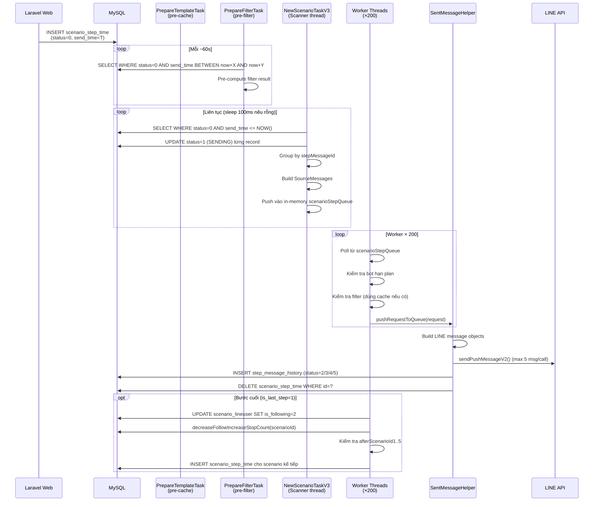

# Job Spec — FA-009: Phát hành theo bước (ステップ配信)

## Tổng quan

- **Mục đích**: Gửi tin nhắn tự động đến từng LINE user đúng theo lịch trình đã thiết lập trong scenario (step by step), bao gồm filter điều kiện nhận tin, xử lý bước cuối (kết nối sang scenario tiếp theo), và ghi lịch sử gửi.
- **Kiểu giao tiếp**: Database Polling — MySQL queue table (`scenario_step_time`)
- **Feature flag**: `ENABLE_SCENARIO = true` (đọc từ file config, mặc định bật)
- **Entry point khởi động**: `AppMain.java` dòng 319 — `if (ConfigFile.ENABLE_SCENARIO) { newScenarioTask.startScenarioTask(); }`

---

## Queue Table: `scenario_step_time`

### JPA Entity

**File**: `src/job/linect-service/src/main/java/sns/line/models/linedb/entities/ScenarioStepTime.java`

```java
@Entity
@Table(name = "scenario_step_time")
public class ScenarioStepTime {
    @Column(name = "id")            private long id;
    @Column(name = "user_id")       private long userId;        // LINE user ID
    @Column(name = "bot_id")        private long botId;          // Bot (LINE OA) ID
    @Column(name = "step_mesage_id") private long stepMessageId; // ID step message (typo trong DB: "mesage")
    @Column(name = "send_time")     private LocalDateTime sentTime; // Thời điểm dự kiến gửi
    @Column(name = "status")        private int status;
    @Column(name = "is_last_step")  private int isLastStep;     // 0=bình thường, 1=bước cuối, 2=test step, 3=test all
    @Column(name = "is_same")       private boolean isSame;

    @Transient  // KHÔNG lưu vào DB — chỉ dùng trong memory
    private SourceMessages sourceMessages;
}
```

> **Lưu ý**: Cột `step_mesage_id` trong DB có typo (thiếu chữ `s`), khớp với `@Column(name = "step_mesage_id")`. **Mức độ tin cậy: Cao** (đọc từ entity).

### State Machine — Trạng thái xử lý

| Giá trị | Tên hằng số | Ý nghĩa |
|---------|-------------|---------|
| `0` | `STATUS_WAIT_TO_SENT` | Chờ gửi — Laravel insert vào đây |
| `1` | `STATUS_SENDING` | Đang xử lý — Spring Boot đang gửi |
| `2` | `STATUS_SEND_SUCCESS` | Gửi thành công |
| `3` | `STATUS_SEND_FAILURE` | Gửi thất bại |
| `4` | `STATUS_SKIPPED_BY_FILTER` | Bỏ qua — user không thỏa filter |
| `5` | `STATUS_SKIPPED_BY_BOT_EXPIRED_PLAN` | Bỏ qua — bot hết hạn plan (>7 ngày) |

**Lưu ý về trạng thái cuối**: Sau khi xử lý xong (thành công, thất bại, hoặc skip), record trong `scenario_step_time` bị **DELETE** (không update status), không phải update sang 2/3/4/5. Các status 2-5 chỉ dùng cho bảng `step_message_history`.

### Điều kiện poll chính

```sql
-- Truy vấn trong ScenarioModelService.findListStepToSent()
SELECT * FROM scenario_step_time
WHERE send_time <= NOW()
  AND status = 0  -- STATUS_WAIT_TO_SENT
```

**File**: `src/job/linect-service/src/main/java/sns/line/models/linedb/services/ScenarioModelService.java`

### Recovery khi khởi động lại

Khi Job server khởi động, `recoverSending()` được gọi để lấy lại các record bị stuck ở trạng thái `SENDING` (status=1):

```sql
SELECT * FROM scenario_step_time
WHERE send_time <= NOW()
  AND status = 1  -- STATUS_SENDING — chưa xử lý xong trước khi restart
```

---

## Task Manager: `NewScenarioTaskV3`

**File**: `src/job/linect-service/src/main/java/sns/line/task/NewScenarioTaskV3.java`
**Feature flag**: `ConfigFile.ENABLE_SCENARIO`
**Thread pool**: `ExecutorService` với tối đa **201 threads** (1 thread scanner + 200 thread worker)

### Khởi động

```
AppMain.startScenarioTask()
├── recoverSending()          → Nạp lại records stuck status=1 vào in-memory queue
├── startJobScan() [1 thread] → Scanner loop: poll DB → nạp vào scenarioStepQueue
└── Worker loop × 200 threads → Lấy từ queue → doSentStepMessage()
```

### while(true) — Scanner thread (startJobScan)

```
while(true):
  1. Kiểm tra isPrepareStop() hoặc isNeedStop() → nếu có, dừng
  2. Gọi ScenarioModelService.findListStepToSent()
     → SELECT WHERE status=0 AND send_time <= NOW()
  3. Nếu có records:
     a. Cập nhật status → 1 (SENDING) từng record song song (parallelStream)
        UPDATE scenario_step_time SET status=1 WHERE id=?
     b. Group theo stepMessageId
     c. Với mỗi group: lấy StepMessage từ StepMessageManager (in-memory cache 10s)
        → buildSourceMessageForScenario() nếu có template
     d. Thêm tất cả vào scenarioStepQueue (in-memory LinkedList)
  4. Nếu không có records:
     → Thread.sleep(100ms)
  5. Catch Exception → log + notify Chatwork (room 291087346)
```

**Tần suất poll**: Liên tục với sleep 100ms khi không có record (không phải sleep cố định mỗi 5 giây).

### Worker threads (200 thread song song)

```
while(true):
  1. Kiểm tra dừng
  2. Lấy ScenarioStepTime từ scenarioStepQueue (poll)
  3. Nếu có → doSentStepMessage(sst)
  4. Nếu không có → Thread.sleep(200ms)
```

---

## Processing Chain (doSentStepMessage)

```
doSentStepMessage(ScenarioStepTime sst)
│
├── [1] Lấy Bot từ BotManager (cache)
│   → Kiểm tra bot.isExpiredOver7Day()
│   → Nếu hết hạn: lưu history STATUS_SKIPPED_BY_BOT_EXPIRED_PLAN → DELETE sst → return
│
├── [2] Kiểm tra quota gửi: BotModel.getAvailableSendCount(botId)
│
├── [3] Lấy StepMessage từ StepMessageManager (cache 10s, max 500 items)
│   → Nếu null: lưu history STATUS_SEND_FAILURE → DELETE sst → return
│
├── [4] Kiểm tra filter (nếu stepMessage.hasFilter()):
│   ├── FilterService.checkValidFilter(FILTER_TYPE_FILTER_MANAGER, filterManagerId, botId, userId)
│   ├── Nếu kết quả có sẵn → dùng ngay
│   ├── Nếu đang filter → wait tối đa 100 giây (sleep 1s/lần)
│   └── Nếu không tìm thấy → LineUserModel.isValidFilterV2() kiểm tra trực tiếp
│
├── [5a] Nếu user THỎA filter (isValid = true) VÀ có template/action:
│   ├── buildSourceMessageForScenario() — build source message
│   ├── Tạo MessagesV2s record
│   ├── GroupActionLaterService.pushActionUpdateCountStep(stepMessageId)  ← tăng send_count
│   └── RequestSentQueue.pushRequestToQueue(request)  → giao cho SentMessageHelper
│
├── [5b] Nếu user THỎA filter nhưng template RỖNG (không có nội dung):
│   ├── Lưu StepMessageHistory STATUS_SEND_SUCCESS
│   └── DELETE sst
│
├── [5c] Nếu user KHÔNG thỏa filter:
│   ├── Lưu StepMessageHistory STATUS_SKIPPED_BY_FILTER
│   ├── Nếu có MessagesV2s → update STATUS_ERROR_FILTER
│   └── DELETE sst
│
└── [6] Nếu là bước cuối (sst.isLastStep()):
    ├── Lấy ScenarioLineuser → update is_following = 2 (đã xong)
    ├── ScenarioRepository.decreaseFollowIncreaseStopCount(scenarioId)
    └── ScenarioModel.processLastStepMessage2()
        → Kiểm tra scenario kết nối (afterScenarioId1..5)
        → Nếu có → ActionLaterService.addNormalPriorityTask(PriorityTask.startScenario())
```

---

## Gửi tin nhắn — SentMessageHelper

**File**: `src/job/linect-service/src/main/java/sns/line/helper/SentMessageHelper.java`

Sau khi `NewScenarioTaskV3` push vào `RequestSentQueue`, một thread pool riêng (trong `SendingScheduleTask` / `BotTaskManager`) poll queue và gọi `SentMessageHelper.sentMessage(request)`:

```
SentMessageHelper.sentMessage(req)
├── Với mỗi templateId trong req.getTemplateIds():
│   ├── Thử lấy từ MessageBuilderCacheManager (pre-built cache)
│   └── Nếu miss → TemplateCacheManager.getTemplate() → new MessageBuilder(template, bot, lineUser)
│       → messageBuilder.build() → List<MessageSentLine>
├── callSentPushMessage() → chia tối đa 5 tin/lần (giới hạn LINE API)
│   └── LineModel.sendPushMessageV2() → Gọi LINE Messaging API
├── actionStepSend() → lưu StepMessageHistory, DELETE scenario_step_time, handle test step
├── RichMenuModel.updateRichMenu() → đổi rich menu nếu step có config
├── ActionModel.doAction() → thực thi action kèm theo (nếu có actionId)
└── BotModel.addSendCount() → cập nhật số tin đã gửi
```

**Giới hạn LINE API**: Tối đa 5 messages/1 push call. Nếu step có nhiều template, tự động chia batch.

---

## Line Message Building

| Class | File | Vai trò |
|-------|------|---------|
| `StepMessageManager` | `helper/cache/StepMessageManager.java` | Cache StepMessage entity (10s TTL, max 500 items) |
| `TemplateCacheManager` | `helper/TemplateCacheManager.java` | Cache Template entity |
| `MessageBuilderCacheManager` | `helper/MessageBuilderCacheManager.java` | Cache MessageBuilder đã build sẵn per user |
| `MessageBuilder` | `models/line/MessageBuilder.java` | Build LINE message objects từ Template + BotProfile + LineUser |
| `MessageModel.buildSourceMessageForScenario()` | `models/MessageModel.java` | Tạo SourceMessages record để tracking |

---

## Luồng Pre-processing song song

Ngoài luồng gửi chính, có 2 task chạy song song để chuẩn bị trước:

### PrepareFilterTask (startPrepareFilterScenario)

**File**: `src/job/linect-service/src/main/java/sns/line/task/PrepareFilterTask.java`
**Tần suất**: Mỗi 60 giây

```
Cứ mỗi 60 giây:
  findAllByStatusAndSentTimeBetween(STATUS_WAIT_TO_SENT, fromDate, toDate)
  → Với mỗi ScenarioStepTime sắp đến giờ:
    FilterService.pushValidFilterToQueue(FILTER_TYPE_SCENARIO, stepMessageId, botId, userId, sendTime)
```

Mục đích: Pre-compute filter result trước để khi đến giờ gửi không phải tính toán lại.

### PrepareTemplateTask (startPrepareScenario)

**File**: `src/job/linect-service/src/main/java/sns/line/task/PrepareTemplateTask.java`

```
Cứ định kỳ:
  findAllByStatusAndSentTimeBetween(STATUS_WAIT_TO_SENT, fromNow+X, fromNow+Y)
  → Với mỗi ScenarioStepTime sắp đến:
    Build MessageBuilder sẵn cho từng user → MessageBuilderCacheManager.addMessage()
```

Mục đích: Pre-build message objects để giảm latency khi đến giờ gửi.

---

## External API Calls

| API | Class gọi | Mục đích |
|-----|-----------|---------|
| LINE Messaging API (Push Message) | `LineModel.sendPushMessageV2()` | Gửi tin nhắn đến LINE user |
| Chatwork API | `NotifyUtils.sendReportChatwork()` / `sendMessageChatwork()` | Thông báo lỗi cho dev team (room 291087346) |

---

## Error Handling

| Tình huống | Xử lý |
|-----------|-------|
| Exception trong scanner thread | Log error + gửi Chatwork alert (room 291087346, tag [To:6395420][To:7907973]) |
| Bot hết hạn plan >7 ngày | Lưu history STATUS_SKIPPED_BY_BOT_EXPIRED_PLAN, DELETE record |
| StepMessage không tìm thấy | Log error, lưu history STATUS_SEND_FAILURE, DELETE record |
| Filter chờ quá 100 giây | Bỏ qua filter cache, gọi thẳng `LineUserModel.isValidFilterV2()` |
| LINE API rate limit | `LineModel.needRetryLimitExceeded()` → retry sau |
| Scenario lặp vô hạn | `MonitorScenarioManager` đếm số lần xử lý cùng 1 scenario+user, nếu > 10 lần/giờ → Chatwork alert |
| Template build lỗi | Log + lưu `RequestSentTemplateError` record vào DB |

---

## Monitoring: MonitorScenarioManager

**File**: `src/job/linect-service/src/main/java/sns/line/helper/cache/MonitorScenarioManager.java`

- Theo dõi số lần xử lý mỗi cặp `scenarioId_lineUserId`
- Nếu > 10 lần trong 1 giờ → cảnh báo Chatwork (dấu hiệu scenario bị loop vô hạn)
- Reset counter mỗi 1 giờ
- Thread riêng, sleep 10 giây giữa các lần check

---

## Bảng lịch sử gửi: `step_message_history`

**File entity**: `src/job/linect-service/src/main/java/sns/line/models/historydb/entities/StepMessageHistory.java`

| Cột | Ý nghĩa |
|-----|---------|
| `line_user_id` | LINE user nhận tin |
| `bot_id` | Bot gửi |
| `step_mesage_id` | ID step message (typo tương tự: "mesage") |
| `scenario_id` | ID scenario |
| `send_time` | Thời điểm thực tế xử lý |
| `status` | 2=thành công, 3=thất bại, 4=skip filter, 5=skip bot hết hạn |
| `is_last_step` | true nếu đây là bước cuối |

---

## Data Flow (Mermaid)



---

## Liên kết với Web App (Laravel)

| Action trên Web | Table ghi vào | Field quan trọng | Job xử lý |
|----------------|--------------|-----------------|-----------|
| User subscribe scenario (follow LINE OA / action) | `scenario_step_time` | `status=0`, `send_time` = thời điểm dự kiến, `step_mesage_id`, `bot_id`, `user_id` | `NewScenarioTaskV3` poll và gửi |
| Admin tạo/sửa step message | `step_messages` | `template_ids`, `filter_manager_id`, `rich_menu_id`, `action_id` | `StepMessageManager` cache và đọc khi xử lý |
| Admin kích hoạt/dừng scenario | `scenarios` | `is_active` | Ảnh hưởng đến việc tạo record mới (Laravel side) |
| Test send scenario | `scenario_step_time` | `is_last_step=2` (TEST_STEP_MESSAGE) hoặc `=3` (TEST_STEP_MESSAGE_ALL) | Job xử lý nhưng KHÔNG ghi lịch sử |

---

## Business Rules

1. **Xử lý song song theo user**: 200 worker threads xử lý đồng thời 200 ScenarioStepTime khác nhau.

2. **Group theo stepMessageId**: Scanner thread nhóm các records cùng `stepMessageId` để dùng chung `SourceMessages` (tối ưu build message một lần cho nhiều user).

3. **Filter wait loop**: Nếu filter đang được tính toán (trạng thái "filtering"), worker thread chờ tối đa 100 giây. Sau 100 giây vẫn chưa có kết quả → gọi thẳng DB để kiểm tra. **Mức độ tin cậy: Cao**.

4. **Test mode**: Record có `is_last_step = 2 (TEST_STEP_MESSAGE)` hoặc `3 (TEST_STEP_MESSAGE_ALL)` — xử lý gửi nhưng KHÔNG ghi vào `step_message_history`. Với `TEST_STEP_MESSAGE_ALL` → tự động chuyển sang step tiếp theo (`nextStepMessageSentTestScenario`).

5. **Bước cuối — chuyển scenario**: Khi `is_last_step = 1`, sau khi gửi xong:
   - `ScenarioLineuser.is_following` = 2 (hoàn thành)
   - Kiểm tra `afterScenarioId1..5` trên entity `Scenario`
   - Nếu có scenario kế tiếp thỏa điều kiện thời gian (from..to) → schedule bắt đầu scenario mới qua `ActionLaterService`.
   - **Mức độ tin cậy: Cao**.

6. **Quota gửi**: `BotModel.getAvailableSendCount()` kiểm tra số tin được phép gửi. Nếu `-1` = không giới hạn. Nếu `0` = đã hết quota → `isAvailableToSent = false` → tin vẫn được "gửi" nhưng flag này ảnh hưởng đến việc thực thi action kèm theo. **Mức độ tin cậy: Trung bình** (cần đọc thêm BotModel để hiểu đầy đủ).

7. **Recovery khi restart**: `recoverSending()` chạy khi khởi động — lấy tất cả record status=1 (bị interrupt) vào queue để xử lý lại. **Mức độ tin cậy: Cao**.

8. **Không retry tự động**: Khi LINE API thất bại (STATUS_SEND_FAILURE), record bị DELETE khỏi `scenario_step_time` và ghi vào `step_message_history` với status=3. Không có cơ chế tự retry trong luồng scenario này (khác với broadcast). **Mức độ tin cậy: Cao**.
