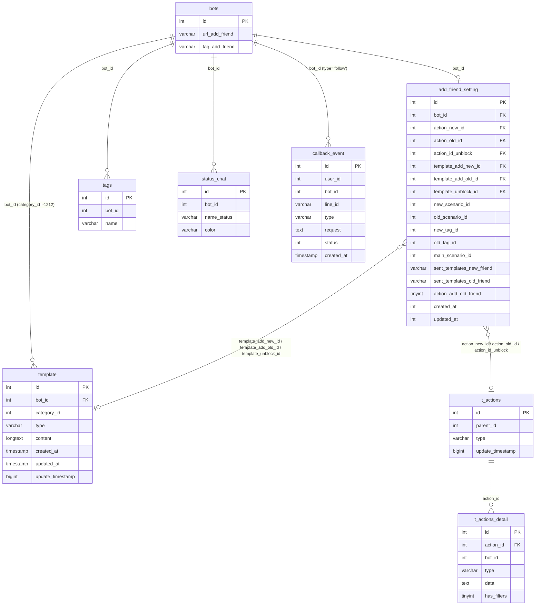

# FA-007 — DB Mapping: Tin nhắn chào mừng (「あいさつメッセージ」)

> Tài liệu này được tạo bởi db-mapper agent.
> Nguồn: `db-hint.md`, `api-spec.md`, `logic-spec.md`, `job-spec.md`, schema từ `db/schema/tables/`.

---

## Primary Tables

| # | Tên bảng | Vai trò | Ghi chú |
|---|----------|---------|---------|
| 1 | `add_friend_setting` | Bảng cấu hình chính — lưu toàn bộ setting cho 3 loại chào mừng | Mỗi bot có đúng 1 bản ghi |
| 2 | `template` | Lưu nội dung tin nhắn text | `category_id = -1212` là đặc trưng của FA-007 |
| 3 | `t_actions` | Nhóm action LME | FK từ `add_friend_setting.*_id` → `t_actions.id` |
| 4 | `t_actions_detail` | Chi tiết từng action item trong nhóm | FK từ `t_actions.id` → `t_actions_detail.action_id` |

---

## Secondary Tables

| # | Tên bảng | Vai trò | Ghi chú |
|---|----------|---------|---------|
| 5 | `bots` | Lưu URL bạn bè LINE, tên bot | `url_add_friend`, `tag_add_friend` |
| 6 | `tags` | Lookup tên tag khi action type='tag' | Được load on-the-fly khi response EP-04 |
| 7 | `status_chat` | Danh sách trạng thái chat cho modal action | Truyền vào view khi render trang |
| 8 | `callback_event` | Queue table webhook events từ LINE | Spring Boot đọc để xử lý; Laravel INSERT khi nhận webhook |

---

## Entity Details

---

### 1. `add_friend_setting`

**Schema**:

```sql
CREATE TABLE `add_friend_setting` (
  `id`                        int(11) NOT NULL,
  `bot_id`                    int(11) NOT NULL,
  `main_scenario_id`          int(11) DEFAULT NULL,
  `new_scenario_id`           int(11) DEFAULT NULL,
  `new_delay_type`            tinyint(1) NOT NULL DEFAULT '0',
  `new_start_day`             int(11) DEFAULT NULL,
  `new_start_time`            time DEFAULT NULL,
  `new_tag_id`                int(11) DEFAULT NULL,
  `new_category_id`           int(11) DEFAULT NULL,
  `old_scenario_id`           int(11) DEFAULT NULL,
  `old_delay_type`            tinyint(1) NOT NULL DEFAULT '0',
  `old_start_day`             int(11) DEFAULT NULL,
  `old_start_time`            time DEFAULT NULL,
  `old_category_id`           int(11) DEFAULT NULL,
  `old_tag_id`                int(11) DEFAULT NULL,
  `created_at`                int(11) NOT NULL,
  `updated_at`                int(11) DEFAULT NULL,
  `sent_templates_new_friend` varchar(500) DEFAULT NULL,
  `action_add_old_friend`     tinyint(4) NOT NULL DEFAULT '0',
  `sent_templates_old_friend` varchar(500) DEFAULT NULL,
  `action_new_id`             int(11) DEFAULT NULL,
  `action_old_id`             int(11) DEFAULT NULL,
  `action_id_unblock`         int(11) DEFAULT NULL,
  `template_add_new_id`       int(11) DEFAULT NULL,
  `template_add_old_id`       int(11) DEFAULT NULL,
  `template_unblock_id`       int(11) DEFAULT NULL
);
```

**Ghi chú**:
- Tổng 26 cột — mỗi bot chỉ có **một hàng duy nhất** (unique theo `bot_id`)
- `created_at` / `updated_at` kiểu `int(11)` — lưu dạng **Unix timestamp**, khác với timestamp thông thường
- Không có PRIMARY KEY / UNIQUE KEY / FOREIGN KEY định nghĩa ở schema level — ràng buộc được xử lý ở application level
- Cột `new_tag_id`, `old_tag_id`, `new_scenario_id`, `old_scenario_id`, v.v. là hệ thống cũ (V1 legacy)
- Cột `action_*_id` và `template_*_id` là hệ thống mới (V2 hiện tại)

**Ràng buộc quan trọng**:
- `bot_id` — application dùng `updateOrCreate(['bot_id' => $botId], ...)` → mỗi bot = 1 bản ghi
- Không có cột `type` riêng — 3 loại được phân biệt bởi **tên cột khác nhau** (new/old/unblock)

---

### 2. `template`

**Schema (rút gọn — chỉ cột liên quan FA-007)**:

```sql
CREATE TABLE `template` (
  `id`               int(11) NOT NULL,
  `bot_id`           int(11) NOT NULL,
  `name`             varchar(255) DEFAULT NULL,
  `category_id`      int(11) DEFAULT NULL,
  `type`             varchar(30) NOT NULL,
  `content`          longtext,
  `created_at`       timestamp NOT NULL DEFAULT CURRENT_TIMESTAMP,
  `updated_at`       timestamp NULL DEFAULT NULL ON UPDATE CURRENT_TIMESTAMP,
  `update_timestamp` bigint(20) DEFAULT NULL,
  ...
);
```

**Đặc trưng FA-007**:
- `category_id = -1212` — giá trị đặc biệt, phân biệt tin nhắn chào mừng với template thông thường
- `type = 'text'` — V2 chỉ hỗ trợ tin nhắn plain text
- `content` (longtext) — nội dung tin nhắn, tối đa 5,000 ký tự (giới hạn ở UI/application, không phải DB)
- `update_timestamp` — bigint Unix timestamp, được set bằng `time()` khi upsert

---

### 3. `t_actions`

**Schema**:

```sql
CREATE TABLE `t_actions` (
  `id`               int(10) UNSIGNED NOT NULL,
  `parent_id`        int(11) NOT NULL,
  `type`             varchar(255) NOT NULL,
  `update_timestamp` bigint(20) NOT NULL,
  `created_at`       timestamp NOT NULL DEFAULT CURRENT_TIMESTAMP,
  `updated_at`       timestamp NOT NULL DEFAULT CURRENT_TIMESTAMP ON UPDATE CURRENT_TIMESTAMP
);
```

**Ghi chú**:
- `parent_id` — suy luận là FK đến `bots.id` (bot sở hữu action này). **Mức độ tin cậy: Trung bình**
- `type` — loại action tổng thể (varchar, giá trị cụ thể chưa xác định từ schema)
- Bảng này thuộc **SC-004 Action Settings** — dùng chung nhiều tính năng

---

### 4. `t_actions_detail`

**Schema**:

```sql
CREATE TABLE `t_actions_detail` (
  `id`               int(10) UNSIGNED NOT NULL,
  `action_id`        int(11) NOT NULL,
  `bot_id`           int(11) DEFAULT NULL,
  `type`             varchar(255) NOT NULL,
  `data`             text NOT NULL,
  `embed_regex_text` varchar(255) DEFAULT NULL,
  `has_filters`      tinyint(4) NOT NULL DEFAULT '0',
  `update_timestamp` bigint(20) NOT NULL,
  `created_at`       timestamp NOT NULL DEFAULT CURRENT_TIMESTAMP,
  `updated_at`       timestamp NOT NULL DEFAULT CURRENT_TIMESTAMP ON UPDATE CURRENT_TIMESTAMP
);
```

**Ghi chú**:
- `action_id` — FK → `t_actions.id`
- `type` — loại action item: `'tag'`, `'scenario'`, `'text'`, `'template'`, `'richmenu'`, `'対応ステータス'`, v.v.
- `data` — JSON blob chứa tham số của action (vd: `{"ids": [1,2,3]}` cho loại tag)
- `has_filters` — flag có điều kiện lọc hay không
- Bảng này thuộc **SC-004 Action Settings**

---

### 5. `bots` (Secondary)

**Cột liên quan FA-007**:

| Cột | Kiểu | Mô tả |
|-----|------|-------|
| `id` | int(12) | PK — là `bot_id` tham chiếu từ `add_friend_setting` |
| `url_add_friend` | varchar(128) | URL bạn bè LINE: `https://line.me/R/ti/p/%40{handle}` |
| `tag_add_friend` | varchar(128) | Tag @handle của bot LINE OA |

---

### 6. `tags` (Secondary)

**Cột liên quan FA-007**:

| Cột | Kiểu | Mô tả |
|-----|------|-------|
| `id` | int(12) | PK — được dùng trong `t_actions_detail.data` (JSON) khi type='tag' |
| `bot_id` | int(12) | FK → `bots.id` |
| `name` | varchar(255) | Tên tag — hiển thị trong UI action settings |

---

### 7. `status_chat` (Secondary)

**Cột liên quan FA-007**:

| Cột | Kiểu | Mô tả |
|-----|------|-------|
| `id` | int(10) UNSIGNED | PK |
| `bot_id` | int(11) | FK → `bots.id` |
| `name_status` | varchar(255) | Tên trạng thái hiển thị trong modal action |
| `color` | varchar(255) | Màu sắc trạng thái |

---

### 8. `callback_event` (Secondary — Queue)

**Schema**:

```sql
CREATE TABLE `callback_event` (
  `id`            int(10) UNSIGNED NOT NULL,
  `user_id`       int(11) NOT NULL,
  `bot_id`        int(11) NOT NULL,
  `line_id`       varchar(255) DEFAULT NULL,
  `type`          varchar(255) DEFAULT 'follow',
  `request`       text,
  `status`        int(11) DEFAULT '0' COMMENT '0: chua xu li; 1: dang xu li; 2: da xu li; 3: xu li loi',
  `error_message` text,
  `created_at`    timestamp NULL DEFAULT NULL,
  `updated_at`    timestamp NULL DEFAULT CURRENT_TIMESTAMP ON UPDATE CURRENT_TIMESTAMP
);
```

**State machine `status`**:

| Giá trị | Tên trạng thái | Mô tả |
|---------|---------------|-------|
| `0` | STATUS_NEW | Mới nhận, chưa xử lý |
| `1` | STATUS_PROCESSING | Đang xử lý bởi Spring Boot job |
| `2` | STATUS_DONE | Đã xử lý xong |
| `3` | STATUS_ERROR | Xử lý lỗi |
| `6` | STATUS_NOT_FOUND_BOT | Bot không tìm thấy |
| `7` | STATUS_BLOCKED_BY_BOT | User bị block bởi bot |
| `8` | STATUS_EXPIRED_BOT | Bot đã hết hạn |

---

## UI ↔ DB Field Mapping per Screen

### Màn hình SCR-SAF-01/02/03 — Trang cấu hình tin nhắn chào mừng

| UI Element | Label JP | DB Table | Column | Mapping Type | Confidence | Ghi chú |
|-----------|---------|----------|--------|-------------|-----------|---------|
| Textarea nội dung tin nhắn | 「メッセージを入力」 | `template` | `content` | Direct | **Cao** | `category_id=-1212`, `type='text'`, tối đa 5,000 ký tự |
| Counter ký tự `x/5,000` | — | `template` | `content` (độ dài) | Computed | **Cao** | Tính `strlen($content)`, không lưu riêng |
| Loại trang (bạn mới) | 「新規友だち用」 | `add_friend_setting` | `template_add_new_id` | FK | **Cao** | Lưu ID bản ghi `template` cho bạn mới |
| Loại trang (bạn cũ) | 「既存友だち用」 | `add_friend_setting` | `template_add_old_id` | FK | **Cao** | Lưu ID bản ghi `template` cho bạn cũ |
| Loại trang (hủy chặn) | 「ブロック解除時用」 | `add_friend_setting` | `template_unblock_id` | FK | **Cao** | Lưu ID bản ghi `template` cho hủy chặn |
| Action LME (bạn mới) | 「エルメアクション」 | `add_friend_setting` | `action_new_id` | FK | **Cao** | FK → `t_actions.id` |
| Action LME (bạn cũ) | 「エルメアクション」 | `add_friend_setting` | `action_old_id` | FK | **Cao** | FK → `t_actions.id` |
| Action LME (hủy chặn) | 「エルメアクション」 | `add_friend_setting` | `action_id_unblock` | FK | **Cao** | FK → `t_actions.id` |
| Danh sách action items | (trong modal) | `t_actions_detail` | `type`, `data` | Direct | **Cao** | `action_id` → FK `t_actions.id` |
| Danh sách tag trong action | 「タグ」 | `tags` | `name` | FK Lookup | **Cao** | Khi `t_actions_detail.type='tag'`, load `tags.name` theo `data.ids` |
| URL bạn bè LINE | 「友だち追加URL」 | `bots` | `url_add_friend` | Direct | **Cao** | Đọc từ `bots` theo `bot_id` session |
| Ảnh QR code | 「QRコード」 | (file system) | — | Computed | **Cao** | `URL_SERVER_MEDIA + FOLDER_MEDIA + 'qr_image/qr_add_friend_bot_' + bot_id + '.png'` — không lưu trong DB |
| Danh sách trạng thái chat trong modal | 「対応ステータス」 | `status_chat` | `name_status`, `color` | Direct | **Cao** | Truyền vào view khi load trang, dùng trong modal action |
| Nút 「保存」 | 「保存」 | `add_friend_setting` | Nhiều cột | Computed | **Cao** | `updateOrCreate(['bot_id' => $botId], [...])` |
| Parameter `type` trong API request | — | `add_friend_setting` | Phân nhánh cột | Enum | **Cao** | `add_new` → `*_new_id`, `add_old` → `*_old_id`, `unblock` → `*_unblock` |

### Mapping `type` → cột DB (Business Rule BR-08)

| Giá trị `type` (API) | Cột action | Cột template |
|---------------------|------------|-------------|
| `add_new` | `action_new_id` | `template_add_new_id` |
| `add_old` | `action_old_id` | `template_add_old_id` |
| `unblock` | `action_id_unblock` | `template_unblock_id` |

---

## Enum / Status Values

### `callback_event.status`

| Giá trị | Constant | Ý nghĩa |
|---------|---------|---------|
| `0` | STATUS_NEW | Mới nhận từ LINE webhook |
| `1` | STATUS_PROCESSING | Đang xử lý bởi Spring Boot |
| `2` | STATUS_DONE | Xử lý xong thành công |
| `3` | STATUS_ERROR | Lỗi khi xử lý |
| `6` | STATUS_NOT_FOUND_BOT | Bot không tồn tại |
| `7` | STATUS_BLOCKED_BY_BOT | User bị bot block |
| `8` | STATUS_EXPIRED_BOT | Bot hết hạn (> 7 ngày) |

### `template.category_id` (đặc trưng FA-007)

| Giá trị | Ý nghĩa |
|---------|---------|
| `-1212` | Template tin nhắn chào mừng (FA-007) |
| `-1111` | Template gửi chat dạng text (hằng số `CATEGORY_SCHEDULE_SEND_CHAT_TEXT`) |
| Giá trị khác | Template thông thường của các tính năng khác |

### `t_actions_detail.type` (các loại action)

| Giá trị | Ý nghĩa |
|---------|---------|
| `'tag'` | Thêm/xóa tag cho user LINE |
| `'scenario'` | Kích hoạt scenario |
| `'template'` | Gửi template tin nhắn |
| `'text'` | Gửi tin nhắn text trực tiếp |
| `'richmenu'` | Cập nhật rich menu |
| `'対応ステータス'` | Cập nhật trạng thái chat |

### `add_friend_setting.new_delay_type` / `old_delay_type`

| Giá trị | Ý nghĩa |
|---------|---------|
| `0` | Không delay (mặc định) |
| Giá trị khác | Có delay gửi tin nhắn (legacy V1) |

### `add_friend_setting.action_add_old_friend`

| Giá trị | Ý nghĩa |
|---------|---------|
| `0` | Không kích hoạt action (mặc định) |
| `1` | Kích hoạt action cho bạn cũ (legacy V1) |

---

## Unmapped Items

Các thông tin từ UI/spec **chưa tìm thấy cột DB tương ứng rõ ràng**:

| Hạng mục | Lý do chưa map | Mức độ |
|---------|---------------|--------|
| Biến `{name}` trong message text | Được lưu inline trong `template.content` dạng `{name}` — không có cột riêng, xử lý tại runtime khi gửi | **Đã rõ — không cần cột riêng** |
| Biến `友だち情報` (custom field) trong message | Tương tự `{name}` — lưu inline trong `content`, placeholder được resolve khi gửi. Tên cột placeholder trong DB chưa xác định chính xác | **Trung bình** |
| `t_actions.parent_id` ý nghĩa cụ thể | Schema không có FK definition; suy luận là `bots.id` nhưng chưa xác nhận từ source code | **Trung bình** |
| `t_actions.type` giá trị hợp lệ | Schema varchar(255), không có ENUM constraint, chưa đọc data mẫu để xác định các giá trị thực tế | **Thấp** |
| `add_friend_setting.main_scenario_id` | Cột tồn tại trong schema nhưng không được đề cập trong logic-spec V2; suy luận là legacy V1 | **Trung bình** |
| `add_friend_setting.new_category_id` / `old_category_id` | Tồn tại trong schema nhưng không được đề cập trong logic-spec; không rõ ý nghĩa | **Thấp** |
| QR Code image file | Được tạo và lưu trên file system của media server (`qr_add_friend_bot_{id}.png`) — không có bản ghi trong DB. Không biết cơ chế tạo QR code trên media server | **Trung bình** |
| `template.name` khi category_id=-1212 | Source code upsert không set `name` → có thể NULL hoặc empty string cho FA-007 templates | **Trung bình** |

---

## ER Diagram



---

## Quan hệ giữa Web App và Spring Boot Job

```
[Admin lưu cấu hình qua EP-05]
    → Laravel UPSERT add_friend_setting (action_*_id, template_*_id)
    → Laravel UPSERT template (category_id=-1212, type='text', content=...)

[LINE webhook: follow event]
    → Laravel INSERT callback_event (type='follow', status=0)

[Spring Boot polling — mỗi ~500ms]
    → SELECT callback_event WHERE status=0
    → UPDATE status=1 (PROCESSING)
    → doHandleFollowEvent():
        → SELECT add_friend_setting WHERE bot_id=?
        → Phân loại: isNewFriend / isUnblock / isOldFriend
        → Lấy action_new_id / action_old_id / action_id_unblock
        → Lấy template_add_new_id / template_add_old_id / template_unblock_id
        → SELECT template WHERE id=? → lấy content
        → SELECT t_actions_detail WHERE action_id=?
        → Gửi LINE API (reply/push message)
    → UPDATE callback_event SET status=2 (DONE)
```

---

*Tài liệu tạo ngày 2026-05-22 bởi db-mapper agent — FA-007 Tin nhắn chào mừng.*
