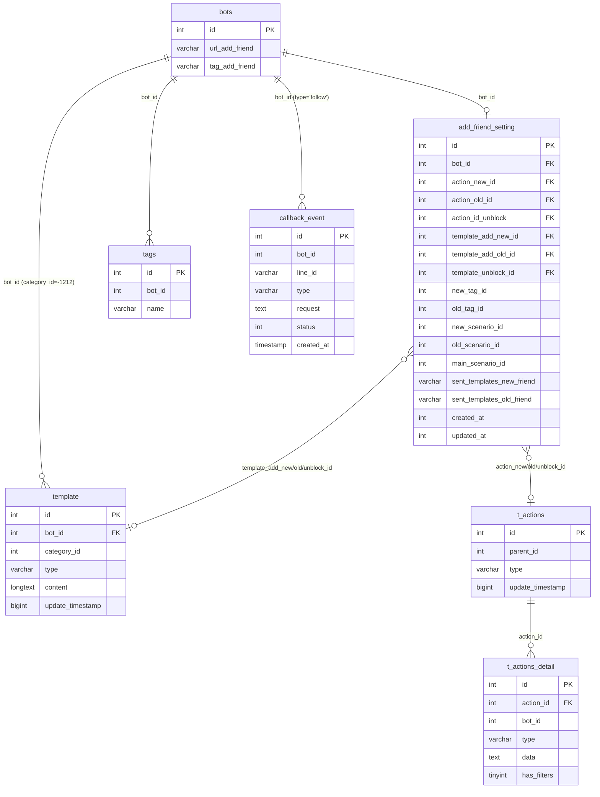

# FA-007 — Tin nhắn chào mừng (「あいさつメッセージ」)

> **Tài liệu tổng hợp** — được compile từ ui-spec, api-spec, logic-spec, job-spec, db-mapping, và validation-report.
> Ngày tạo: 2026-05-22 | Mức độ tin cậy chung: **Cao**

---

## 1. Tổng quan

### Mục đích

Tính năng cho phép Admin cấu hình **tin nhắn và action tự động** được gửi đến người dùng LINE trong 3 tình huống khác nhau khi có sự kiện bạn bè mới:

| Tình huống | Mô tả | Giá trị `type` |
|-----------|-------|---------------|
| **Bạn mới** (「新規友だち」) | Người dùng LINE thêm OA lần đầu tiên | `add_new` |
| **Bạn cũ** (「既存友だち」) | Người dùng từng là bạn (đã có trên hệ thống cũ hoặc đã unblock trước đó) | `add_old` |
| **Hủy chặn** (「ブロック解除時」) | Người dùng hủy block LINE OA | `unblock` |

### Actors

| Actor | Mô tả | Quyền |
|-------|-------|-------|
| **Admin** | Người quản lý LINE OA | Xem, chỉnh sửa, lưu toàn bộ cấu hình trên 3 trang |
| **Staff** | Nhân viên do Admin tạo | Có thể truy cập nếu được phân quyền (middleware `basic_access` kiểm tra quyền Staff) |
| **LINE User** | Người dùng cuối | Nhận tin nhắn và action tự động khi sự kiện follow/unblock xảy ra |

### Phạm vi

- **3 trang cấu hình** (SCR-SAF-01, 02, 03) — mỗi trang tương ứng 1 tình huống
- **1 tab hướng dẫn test** (SCR-SAF-04) — có trên mỗi trang
- **1 modal action** (SCR-SAF-05) — shared component SC-004, dùng chung cho cả 3 trang
- **URL pattern**: `/basic/setting-add-friend`, `/basic/setting-add-friend-old`, `/basic/setting-add-friend-unblock`

### Kiến trúc V2 (hiện tại) vs V1 (legacy)

> **Lưu ý quan trọng cho dev và tester**: Tính năng này tồn tại song song hai phiên bản trong cùng codebase.

| | V2 (hiện tại) | V1 (legacy) |
|--|---------------|-------------|
| Controller | `SettingAddFriendController` | `ScenarioController` |
| Endpoints | EP-01 → EP-05 | EP-06 → EP-09 |
| Hỗ trợ `unblock` | Có | Không |
| Tin nhắn | 1 text message per type | Tối đa 3 template messages per type |
| Lưu trữ action | `action_new_id` / `action_old_id` / `action_id_unblock` | `new_scenario_id` / `old_scenario_id` |
| Lưu trữ message | `template_add_new_id` / `template_add_old_id` / `template_unblock_id` | `sent_templates_new_friend` / `sent_templates_old_friend` (JSON array) |
| Trạng thái | **Đang dùng trong UI** | Routes vẫn tồn tại, không còn được gọi từ UI V2 |

---

## 2. Các màn hình và Luồng xử lý End-to-End

### 2.1 SCR-SAF-01: Trang bạn mới (「新規友だち用」)

**URL**: `/basic/setting-add-friend`

**Layout**:
- Sub-title: 「新規友だち用」
- Title chính: 「あいさつメッセージ設定」
- Info box: 「このページで設定したメッセージ・アクションは **新規友だち** のみ稼働します。」
- Khu vực URL/QR code bạn bè (「友だち追加URL」)
- Tab 1 (active): 「メッセージ・アクション設定」
- Tab 2: 「テスト方法」
- Block nhập tin nhắn (textarea, tối đa 5,000 ký tự, nút chèn 「＋ LINE名」/「＋ 友だち情報」)
- Block đăng ký action (5 shortcut buttons + nút 「アクション追加・編集」)
- Nút 「保存」

**Luồng end-to-end**:

```
Admin truy cập /basic/setting-add-friend
    → EP-01: GET /basic/setting-add-friend
        → SettingAddFriendController@settingAddFriendNew
        → Query StatusChat theo bot_id session
        → Render Blade template (type='add_new')
        → Vue mount, tự động gọi getAddFriend()

    → EP-04: GET /basic/get-setting-add-friend-v2?type=add_new
        → Tìm AddFriendSetting theo bot_id session
        → Nếu chưa có: tự động CREATE AddFriendSetting (BR-01)
        → Load Template theo template_add_new_id → lấy content (tin nhắn text)
        → Load ActionDetail[] theo action_new_id → kèm tag names nếu type='tag' (BR-07)
        → Load bots.url_add_friend
        → Tạo QR URL từ env config (BR-06)
        → Response JSON: { actionId, message, detailAction[], urlAddFriend, qrCode }

    [Admin chỉnh sửa và nhấn 「保存」]
    → EP-05: POST /basic/save-setting-add-friend-v2
        → Kiểm tra bot_id session == botIdCurrent (BR-02)
        → handleMessageTemplate(): upsert hoặc xóa bản ghi template (BR-03, BR-04)
        → updateOrCreate AddFriendSetting theo bot_id (BR-05)
            → cập nhật action_new_id, template_add_new_id
        → Response: { success: true }
        → UI hiển thị toast 「保存しました」

    [LINE User thêm bạn]
    → LINE Platform gửi webhook follow event đến Laravel
    → Laravel INSERT callback_event (type='follow', status=0)
    → Spring Boot HandlePostbackTask poll callback_event (mỗi ~500ms)
    → doHandleFollowEvent(): phân loại isNewFriend=true
    → Đọc add_friend_setting.action_new_id + template_add_new_id
    → Thực thi action, gửi template qua LINE Messaging API
    → UPDATE callback_event SET status=2 (DONE)
    → Độ trễ tổng: < 2-3 giây
```

---

### 2.2 SCR-SAF-02: Trang bạn cũ (「既存友だち用」)

**URL**: `/basic/setting-add-friend-old`

**Khác biệt so với SCR-SAF-01**:
- Info box có thêm lưu ý: 「認証済みアカウントを接続した時に、自動で取得される既存の友だちにはアクションは稼働しません。」 (Bạn bè cũ được auto-import khi kết nối tài khoản xác thực **sẽ không** nhận action)
- Không hiển thị khu vực URL/QR code (trang bạn cũ không cần deep link)
- type = `'add_old'` trong mọi API call
- Tin nhắn mẫu hỗ trợ biến: `{name} old friend`

**Luồng end-to-end**: Tương tự SCR-SAF-01, thay `add_new` → `add_old`, cột DB: `action_old_id`, `template_add_old_id`.

---

### 2.3 SCR-SAF-03: Trang hủy chặn (「ブロック解除時用」)

**URL**: `/basic/setting-add-friend-unblock`

**Khác biệt so với SCR-SAF-01**:
- Info box: 「このページで設定したメッセージ・アクションは **友だちのブロック解除時のみ** 稼働します。」
- Link phụ ở header khác: 「友だちのブロック解除経路を分析したい場合はこちら」
- type = `'unblock'` trong mọi API call
- Hiển thị URL/QR code (như SCR-SAF-01)

**Luồng end-to-end**: Tương tự SCR-SAF-01, thay `add_new` → `unblock`, cột DB: `action_id_unblock`, `template_unblock_id`.

---

### 2.4 SCR-SAF-04: Tab 「テスト方法」

**Trigger**: Click tab thứ 2 trên bất kỳ SCR-SAF-01/02/03 nào.

**Nội dung** (quan sát trực tiếp từ trang ブロック解除時用):
- Link video: 「テスト方法を動画で確認」 → `https://youtu.be/9TTugIBdQGs?si=tmu-rgxRz2wAy51z&t=354`
- Tiêu đề: 「すでにエルメに表示されているLINEアカウントの場合」
- Sơ đồ 2 bước:
  1. 「LINE公式アカウントをブロック & ブロック解除」
  2. 「設定したアクションが稼働すれば テスト成功」
- Lưu ý 「ご注意事項」:
  - LINE OA chính thức cũng có あいさつメッセージ riêng — nếu cả hai đều bật, **cả hai cùng được gửi**
  - Khuyến nghị: Tắt あいさつメッセージ của LINE OA chính thức để dùng riêng LME
  - Hướng dẫn tắt: Đăng nhập `account.line.biz` → 設定 → 応答設定 → Tắt 「あいさつメッセージ」

**Lưu ý**: Nút 「保存」 vẫn xuất hiện khi ở tab テスト方法.

> **Gap**: Nội dung tab テスト方法 cho 新規友だち用 và 既存友だち用 chưa được quan sát trực tiếp. Nội dung có thể khác nhau giữa 3 trang.

---

### 2.5 SCR-SAF-05: Modal 「アクション」

**Trigger**: Click nút 「アクション追加・編集」 hoặc một trong 5 shortcut buttons trên SCR-SAF-01/02/03.

**Component**: SC-004 Action Settings (variant V2 multi-action). Xem spec đầy đủ tại `features/shared/action-settings/shared-spec.md`.

**10 loại action trong modal**:

| # | Tab JP | Mô tả |
|---|--------|-------|
| 1 | 「ステップ」 | Bắt đầu/dừng ステップ配信 |
| 2 | 「テンプレート」 | Gửi template tin nhắn |
| 3 | 「テキスト」 | Gửi tin nhắn text tùy chỉnh |
| 4 | 「リマインド」 | Gửi tin nhắn nhắc nhở |
| 5 | 「タグ」 | Gắn/gỡ thẻ tag |
| 6 | 「リッチメニュー」 | Hiển thị rich menu |
| 7 | 「ブックマーク」 | Đánh dấu bookmark |
| 8 | 「友だち情報」 | Cập nhật thông tin bạn bè |
| 9 | 「対応ステータス」 | Cập nhật trạng thái xử lý |
| 10 | 「ブロック」 | Block người dùng |

**Shortcut buttons**: 5 nút nhanh trên mỗi trang (suy luận: mở modal SC-004 với tab tương ứng pre-selected):
1. 「ステップ配信を開始・停止する」→ tab ステップ
2. 「リッチメニューを表示する」→ tab リッチメニュー
3. 「テンプレートを送信する」→ tab テンプレート
4. 「タグを付け・外しする」→ tab タグ
5. 「その他のアクションをみる」→ toàn bộ modal

> **Gap**: Behavior chính xác của shortcut buttons chưa được xác nhận bằng click trực tiếp.

---

## 3. Data Model

### Entities chính

| Entity | Bảng DB | Vai trò |
|--------|---------|---------|
| `AddFriendSetting` | `add_friend_setting` | Bảng cấu hình chính — 1 hàng per bot, chứa FK đến cả 3 loại action và template |
| `Template` | `template` | Lưu nội dung tin nhắn text chào mừng (`category_id = -1212`) |
| `Actions` | `t_actions` | Nhóm action LME (thuộc SC-004) |
| `ActionDetail` | `t_actions_detail` | Chi tiết từng action item trong nhóm (thuộc SC-004) |
| `Bots` | `bots` | URL và thông tin LINE OA |
| `Tag` | `tags` | Tên tag cho action type='tag' |
| `StatusChat` | `status_chat` | Danh sách trạng thái cho modal action |
| `CallbackEvent` | `callback_event` | Queue table webhook events (Laravel INSERT, Spring Boot poll) |

### Điểm quan trọng: 3 cấu hình trong 1 hàng

Toàn bộ cấu hình cho bạn mới, bạn cũ, và hủy chặn được lưu trong **một hàng duy nhất** của bảng `add_friend_setting`, phân biệt bởi tên cột:

```
add_friend_setting (1 row per bot)
├── action_new_id       → t_actions.id  (action bạn mới)
├── template_add_new_id → template.id   (tin nhắn bạn mới)
├── action_old_id       → t_actions.id  (action bạn cũ)
├── template_add_old_id → template.id   (tin nhắn bạn cũ)
├── action_id_unblock   → t_actions.id  (action hủy chặn)
└── template_unblock_id → template.id   (tin nhắn hủy chặn)
```

Không có cột `type` riêng — loại cấu hình được phân biệt bằng **tên cột khác nhau**.

### ER Diagram



### Đặc trưng lưu trữ

| Bảng | Giá trị đặc biệt | Ý nghĩa |
|------|-----------------|---------|
| `template` | `category_id = -1212` | Phân biệt template chào mừng FA-007 với template thông thường |
| `template` | `type = 'text'` | V2 chỉ hỗ trợ plain text (không hỗ trợ image, carousel trong V2) |
| `add_friend_setting` | `created_at`, `updated_at` dạng `int(11)` | Unix timestamp, **khác với** các bảng dùng MySQL timestamp thông thường |
| `add_friend_setting` | Không có UNIQUE constraint ở DB level | Ràng buộc 1-per-bot được đảm bảo ở application level qua `updateOrCreate` |

---

## 4. Field Traceability Matrix

| # | UI Element | Màn hình | DB Table | Column | Hướng | Confidence | Business Rule |
|---|-----------|---------|----------|--------|-------|-----------|---------------|
| 1 | Textarea nội dung tin nhắn | SCR-SAF-01/02/03 | `template` | `content` | Read/Write | **Cao** | BR-03: upsert với `category_id=-1212`; BR-04: xóa khi empty |
| 2 | Counter ký tự `x/5,000` | SCR-SAF-01/02/03 | `template` | `content` (computed) | Read | **Cao** | Giới hạn 5,000 ký tự enforced ở UI/app, không phải DB |
| 3 | Trạng thái action (bạn mới) | SCR-SAF-01 | `add_friend_setting` | `action_new_id` | Read/Write | **Cao** | FK → `t_actions.id` |
| 4 | Trạng thái action (bạn cũ) | SCR-SAF-02 | `add_friend_setting` | `action_old_id` | Read/Write | **Cao** | FK → `t_actions.id` |
| 5 | Trạng thái action (hủy chặn) | SCR-SAF-03 | `add_friend_setting` | `action_id_unblock` | Read/Write | **Cao** | FK → `t_actions.id` |
| 6 | Template tin nhắn (bạn mới) | SCR-SAF-01 | `add_friend_setting` | `template_add_new_id` | Read/Write | **Cao** | FK → `template.id`; set null khi message rỗng |
| 7 | Template tin nhắn (bạn cũ) | SCR-SAF-02 | `add_friend_setting` | `template_add_old_id` | Read/Write | **Cao** | FK → `template.id` |
| 8 | Template tin nhắn (hủy chặn) | SCR-SAF-03 | `add_friend_setting` | `template_unblock_id` | Read/Write | **Cao** | FK → `template.id` |
| 9 | Danh sách action items | SCR-SAF-05 | `t_actions_detail` | `type`, `data` | Read/Write | **Cao** | Thuộc SC-004; `data` là JSON blob |
| 10 | Tên tag trong action | SCR-SAF-05 | `tags` | `name` | Read | **Cao** | BR-07: load khi `t_actions_detail.type='tag'` |
| 11 | URL bạn bè LINE | SCR-SAF-01/03 | `bots` | `url_add_friend` | Read only | **Cao** | Được set khi kết nối LINE OA, không edit từ trang này |
| 12 | Ảnh QR code | SCR-SAF-01/03 | (file system) | — | Read only | **Cao** | BR-06: `URL_SERVER_MEDIA + FOLDER_MEDIA + 'qr_image/qr_add_friend_bot_{id}.png'` |
| 13 | Danh sách trạng thái trong modal | SCR-SAF-05 | `status_chat` | `name_status`, `color` | Read only | **Cao** | Truyền vào view lúc render, cho action type 「対応ステータス」 |
| 14 | Nút 「保存」 | SCR-SAF-01/02/03 | `add_friend_setting` | Nhiều cột | Write | **Cao** | EP-05 POST → `updateOrCreate(['bot_id' => $botId], ...)` |

---

## 5. Business Rules

### BR-01: Tự động tạo AddFriendSetting nếu chưa có

**Mức độ tin cậy**: Cao | **Nguồn**: Source code EP-04 controller

Khi `getSettingAddFriend` được gọi cho bot chưa có bản ghi, hệ thống tự động `CREATE AddFriendSetting(['bot_id' => $botId])`. Bot mới không bao giờ bị lỗi "không tìm thấy cấu hình".

---

### BR-02: Bảo vệ Bot-Switch (Bot-Switch Protection)

**Mức độ tin cậy**: Cao | **Nguồn**: Source code EP-05 controller

Khi lưu (EP-05), kiểm tra `bot_id` từ session == `botIdCurrent` từ request body. Nếu không khớp → trả về lỗi JSON:
```json
{ "success": false, "message": "別のアカウントに切り替えたので、要求を処理できません。" }
```
Tránh tình huống Admin mở nhiều tab, đổi bot trên tab khác, rồi nhấn Save → ghi nhầm sang bot sai.

---

### BR-03: Lưu tin nhắn vào `template` với `category_id = -1212`

**Mức độ tin cậy**: Cao | **Nguồn**: Source code `handleMessageTemplate()`

```php
Template::updateOrCreate(
    ['id' => $templateId],
    ['bot_id' => $botId, 'category_id' => -1212, 'type' => 'text', 'content' => $message, 'update_timestamp' => time()]
);
```
- Mỗi type (bạn mới/cũ/unblock) có **tối đa 1 bản ghi template** riêng
- Chỉ hỗ trợ `type = 'text'` trong V2

---

### BR-04: Xóa template khi tin nhắn rỗng

**Mức độ tin cậy**: Cao | **Nguồn**: Source code `handleMessageTemplate()`

Khi Admin xóa toàn bộ nội dung textarea và nhấn 「保存」:
- Bản ghi `template` bị DELETE
- `template_*_id` trong `add_friend_setting` được set về `null`

---

### BR-05: Một bản ghi per bot (`updateOrCreate` theo `bot_id`)

**Mức độ tin cậy**: Cao | **Nguồn**: Source code `saveSettingAddFriend()`

Toàn bộ 3 loại cấu hình (bạn mới, bạn cũ, hủy chặn) nằm trong **cùng một hàng** của bảng `add_friend_setting`. `updateOrCreate(['bot_id' => $botId], [...])` đảm bảo không tạo trùng.

---

### BR-06: QR Code đọc từ file system qua media server

**Mức độ tin cậy**: Cao | **Nguồn**: Source code EP-04

```
URL = env('URL_SERVER_MEDIA') + env('FOLDER_MEDIA') + 'qr_image/qr_add_friend_bot_' + botId + '.png?v=' + time()
```
- QR code **không** được tạo on-the-fly trong PHP — chỉ đọc file ảnh đã tạo sẵn
- Tham số `?v=` (timestamp) là cache-busting
- Không có bản ghi QR trong DB

---

### BR-07: Tự động load tên tag khi action type='tag'

**Mức độ tin cậy**: Cao | **Nguồn**: Source code `getActionDetailByActionId()`

Khi load chi tiết action (EP-04), nếu có `ActionDetail` với `type='tag'`:
```php
$value->list_tags = Tag::whereIn('id', $data->ids)->get()->toArray();
```
Trả về tên tag đầy đủ để hiển thị trong UI thay vì chỉ ID.

---

### BR-08: Mapping `type` request → cột DB

**Mức độ tin cậy**: Cao | **Nguồn**: Source code controller

| Giá trị `type` (API) | Cột action | Cột template |
|---------------------|-----------|-------------|
| `add_new` | `action_new_id` | `template_add_new_id` |
| `add_old` | `action_old_id` | `template_add_old_id` |
| `unblock` | `action_id_unblock` | `template_unblock_id` |

---

### BR-09: Phân quyền theo Middleware

**Mức độ tin cậy**: Cao | **Nguồn**: Source code middleware

Tất cả endpoints của FA-007 đều qua middleware: `basic_access`, `https_protocol`, `is_expire`, `check_remember_token`.

- `basic_access`: Kiểm tra đăng nhập, role (0/1/-1/2), bot trong session, phân quyền Staff
- `is_expire`: Gói dịch vụ chưa hết hạn (nếu `ENABLE_PAYPAL=true`) — quá hạn redirect sang `/basic/point-settings`

---

### BR-10: Fallback V1 khi không có V2 action (Legacy)

**Mức độ tin cậy**: Trung bình | **Nguồn**: Job spec (doHandleFollowEvent)

Khi `action_new_id` hoặc `action_old_id` = null, Spring Boot job fallback sang:
- `new_tag_id` / `old_tag_id` — gán tag trực tiếp (V1 behavior)
- `new_scenario_id` / `old_scenario_id` — khởi động scenario (V1 behavior)

Đây là backward compatibility behavior — chưa được expose trên UI V2.

---

## 6. API Endpoints

### Danh sách

| Mã | Method | URL | Mô tả | Phiên bản |
|----|--------|-----|-------|-----------|
| EP-01 | GET | `/basic/setting-add-friend` | Trang cấu hình bạn mới | V2 |
| EP-02 | GET | `/basic/setting-add-friend-old` | Trang cấu hình bạn cũ | V2 |
| EP-03 | GET | `/basic/setting-add-friend-unblock` | Trang cấu hình hủy chặn | V2 |
| EP-04 | GET | `/basic/get-setting-add-friend-v2` | Load cấu hình (JSON, AJAX) | V2 |
| EP-05 | POST | `/basic/save-setting-add-friend-v2` | Lưu cấu hình (JSON, AJAX) | V2 |
| EP-06 | POST | `/basic/update-setting-add-friend` | Cập nhật action_new/old (JSON) | V1 Legacy |
| EP-07 | POST | `/ajax/init-data-setting-add-friend` | Load action data cũ (JSON) | V1 Legacy |
| EP-08 | GET | `/ajax/setting-add-friend/get-message-preview/{typeSetting}` | Preview messages cũ | V1 Legacy |
| EP-09 | GET | `/ajax/setting-add-friend/remove-message/{typeSetting}` | Xóa message cũ | V1 Legacy |

### EP-04 — Chi tiết: GET `/basic/get-setting-add-friend-v2`

**Query param**: `type` (bắt buộc) = `add_new` / `add_old` / `unblock`

**Response JSON**:
```json
{
  "actionId": 123,
  "message": "Nội dung tin nhắn text (hoặc null)",
  "detailAction": [
    {
      "id": 1,
      "action_id": 123,
      "type": "tag",
      "data": { "ids": [10, 11] },
      "list_tags": [{ "id": 10, "name": "VIP" }],
      "is_edit_content": false
    }
  ],
  "urlAddFriend": "https://line.me/R/ti/p/%40573thndt",
  "qrCode": "https://media.server.com/ext-media/qr_image/qr_add_friend_bot_456.png?v=1716345600"
}
```

### EP-05 — Chi tiết: POST `/basic/save-setting-add-friend-v2`

**Request body**:
| Field | Bắt buộc | Kiểu | Mô tả |
|-------|---------|------|-------|
| `type` | Có | string | `add_new` / `add_old` / `unblock` |
| `message` | Không | string | Tối đa 5,000 ký tự |
| `actionId` | Không | int/null | ID action LME |
| `botIdCurrent` | Có | int | Bot-switch protection |

**Response thành công**: `{ "success": true }`

**Response lỗi bot-switch**: `{ "success": false, "message": "別のアカウントに切り替えたので、要求を処理できません。" }`

### Mapping Endpoint ↔ Màn hình

| Màn hình | Endpoints được gọi (theo thứ tự) |
|----------|--------------------------------|
| SCR-SAF-01 | EP-01 (page load) → EP-04 (`?type=add_new`) → EP-05 (`type=add_new`) |
| SCR-SAF-02 | EP-02 (page load) → EP-04 (`?type=add_old`) → EP-05 (`type=add_old`) |
| SCR-SAF-03 | EP-03 (page load) → EP-04 (`?type=unblock`) → EP-05 (`type=unblock`) |
| SCR-SAF-04 | Không có API riêng — tab trên cùng trang |
| SCR-SAF-05 | Endpoint của SC-004 Action Settings |

---

## 7. Background Jobs

### Kiến trúc tổng thể

Tính năng tin nhắn chào mừng **không có job riêng** — được xử lý trong luồng xử lý webhook chung của Spring Boot:

```
LINE Platform
    → (webhook follow event)
Laravel Web App
    → INSERT callback_event (type='follow', status=0)
MySQL callback_event table (Queue)
    ← Spring Boot HandlePostbackTask polls mỗi ~500ms
Spring Boot HandlePostbackTask
    → doHandleFollowEvent()
    → Đọc add_friend_setting, gửi tin nhắn qua LINE Messaging API
    → UPDATE callback_event SET status=2 (DONE)
```

### Entry Point: `HandlePostbackTask`

**File**: `src/job/linect-service/src/main/java/sns/line/task/HandlePostbackTask.java`

**Feature Flag**: `ENABLE_POSTBACK = true` (mặc định)

**Cơ chế polling 2 tầng**:
1. **Scanner Thread**: Poll `callback_event WHERE status=0` → UPDATE status=1 → đẩy vào in-memory queue
2. **Processing Thread Pool (30 threads)**: Poll in-memory queue → dispatch theo `type` field → `doHandleFollowEvent()` cho FA-007

### State Machine: `callback_event.status`

```
0 (STATUS_NEW)
    ↓ Spring Boot Scanner Thread lấy
1 (STATUS_PROCESSING)
    ↓ doHandleFollowEvent() xử lý
2 (STATUS_DONE)        ← thành công
3 (STATUS_ERROR)       ← lỗi xử lý
6 (STATUS_NOT_FOUND_BOT)   ← bot không tồn tại
7 (STATUS_BLOCKED_BY_BOT)  ← user bị bot block
8 (STATUS_EXPIRED_BOT)     ← bot hết hạn > 7 ngày
```

### Luồng `doHandleFollowEvent()` — 8 bước

```
Bước 1: Parse webhook → xác định loại bạn
    lineUser = NULL → isNewFriend = true
    botLineUser.isBlocked == 1 → isUnblock = true
    Còn lại → isOldFriend

Bước 2: Ghi lịch sử vào messages_v2s (INSERT với msg_kind tương ứng)

Bước 3: Kiểm tra Landing QR (ưu tiên CAO HƠN add_friend_setting!)
    → Nếu có Landing QR hợp lệ: add_friend_setting = null (bị ghi đè hoàn toàn)

Bước 4: Đọc add_friend_setting (khi không có Landing QR)
    → Phân nhánh theo loại bạn → lấy actionId + templateId tương ứng

Bước 5: Thực thi action (doAction()) nếu có actionId
    → template, scenario, tag, richmenu, text, v.v.

Bước 6: Gửi template (RequestSentQueue → SentMessageService → LINE API)
    → replyMessage (nếu còn trong 30 giây) hoặc pushMessage

Bước 7: Khởi động Scenario nếu có scenarioIdStart

Bước 8: Gửi Push Notification cho Admin nếu bật isNotifyAddFriend
    → UPDATE callback_event SET status=2 (DONE)
```

### Hành vi Landing QR — Điểm quan trọng

> **Cảnh báo cho PM/tester**: Khi người dùng LINE click vào **Landing QR** trước khi thêm bạn, toàn bộ cấu hình `add_friend_setting` bị **bỏ qua hoàn toàn**. Thay vào đó, action của Landing QR được thực thi.

| Tình huống | Hành vi |
|-----------|---------|
| Không có Landing QR | Dùng `add_friend_setting` bình thường |
| Có Landing QR hợp lệ | `add_friend_setting` bị bỏ qua → chạy action Landing QR |
| Landing QR đã action 2 lần (`action_type=1`) | Cả Landing QR lẫn `add_friend_setting` đều bị bỏ qua |

### Độ trễ xử lý

| Giai đoạn | Thời gian |
|----------|----------|
| LINE webhook → INSERT `callback_event` | < 1 giây (Laravel synchronous) |
| Spring Boot polling interval | ~500ms (khi có event) |
| Tổng từ LINE event → gửi tin nhắn | **thường < 2–3 giây** |

### Các trường hợp đặc biệt (Edge Cases)

| Trường hợp | Xử lý |
|-----------|-------|
| Bot hết hạn > 7 ngày | status=8, bỏ qua xử lý |
| Bot không tìm thấy | status=6, bỏ qua |
| User bị block bởi bot | status=7, bỏ qua |
| `add_friend_setting` không tồn tại | Không gửi tin, chỉ ghi lịch sử vào `messages_v2s` |
| Không có `action_*_id` (V2) | Fallback sang `new_tag_id`/`old_tag_id` (V1 legacy) |

### Feature Flags liên quan

| Flag | Mặc định | Ý nghĩa |
|------|---------|---------|
| `ENABLE_POSTBACK` | `true` | Bật xử lý toàn bộ callback events kể cả `follow` |
| `ENABLE_ACTION_SERVICE` | `true` | Bật service thực thi `action_line_user` |
| `ENABLE_SCENARIO` | `false` | Bật xử lý scenario sau khi gán |

---

## 8. Phụ thuộc chéo

### Shared Components

| Mã | Tên | Nơi dùng |
|----|-----|---------|
| **SC-004** | Action Settings | SCR-SAF-05 — modal 「アクション」trên cả 3 trang. 10 action types, lưu vào `t_actions` / `t_actions_detail` |

### Tính năng liên quan

| Tính năng | Mối liên hệ |
|----------|-------------|
| **FA-009** Scenario/Step (「ステップ配信」) | Action type 「ステップ」 trong SC-004 có thể kích hoạt/dừng scenario. Spring Boot `scenarioIdStart` được đặt khi doAction() xử lý action type 'scenario' |
| **FA-004** Rich Menu (「リッチメニュー」) | Action type 「リッチメニュー」 trong SC-004 cập nhật rich menu hiển thị cho user khi thêm bạn |
| **FA-010** Template (「テンプレート」) | Action type 「テンプレート」 gửi template tin nhắn đã tạo sẵn. Bảng `template` dùng chung (phân biệt bởi `category_id`) |
| **FA-012** Tag (「タグ」) | Action type 「タグ」 gắn/gỡ tag cho user mới. Bảng `tags` dùng chung |
| **Landing QR** (tính năng chưa spec) | Override hoàn toàn add_friend_setting khi user đến qua Landing QR link |

---

## 9. Gaps và Unknowns

| # | Hạng mục | Mức độ | Nguồn | Gợi ý giải quyết |
|---|---------|--------|-------|-----------------|
| 1 | Tab テスト方法 (SCR-SAF-04) cho 新規友だち用 và 既存友だち用 chưa được quan sát trực tiếp | **Nhẹ** | VĐ-NHE-01 | Chụp screenshot khi có session active |
| 2 | Behavior chính xác của 5 shortcut buttons khi click | **Nhẹ** | VĐ-NHE-04 | Click trực tiếp và snapshot khi có session |
| 3 | `t_actions.parent_id` ý nghĩa cụ thể (suy luận là FK → `bots.id`) | **Nhẹ** | VĐ-NHE-02 | Xác nhận khi làm spec SC-004 |
| 4 | `t_actions.type` — giá trị enum chưa đầy đủ | **Nhẹ** | VĐ-NHE-03 | Đọc data mẫu `db/data/tables/t_actions.sql` khi làm SC-004 |
| 5 | Fallback `new_tag_id`/`old_tag_id` trong logic-spec chưa được document | **Trung bình** | VĐ-TBC-01 | Bổ sung vào logic-spec khi có thời gian |
| 6 | `add_friend_setting.main_scenario_id` và `*_category_id` — ý nghĩa chưa rõ | **Thấp** | Unmapped items | Có thể là legacy V1 — ít ưu tiên |
| 7 | Cơ chế tạo QR code file trên media server — ai tạo, khi nào | **Thấp** | Unmapped items | Nằm ngoài scope FA-007; tìm trong codebase hoặc Spring Boot |
| 8 | Phân quyền Staff cụ thể cho tính năng này | **Thấp** | ui-spec điểm chưa rõ #5 | Kiểm tra Staff role khi làm spec phân quyền tổng thể |

---

## 10. Chất lượng Spec

### DB Coverage

| Hạng mục | Số lượng | Ghi chú |
|---------|---------|---------|
| Primary tables mapped | 4/4 (100%) | add_friend_setting, template, t_actions, t_actions_detail |
| Secondary tables mapped | 4/4 (100%) | bots, tags, status_chat, callback_event |
| UI elements → DB columns | 14/14 fields | Bảng Traceability Matrix đầy đủ |
| Unmapped items | 7 hạng mục | Phần lớn là SC-004 hoặc legacy; đã ghi nhận lý do |

### Confidence Distribution

| Mức độ | Tỷ lệ | Ghi chú |
|--------|-------|---------|
| **Cao** | ~85% | Phần lớn spec — phân tích trực tiếp từ source code và DB schema |
| **Trung bình** | ~12% | Validation rules (chủ yếu ở frontend), fallback V1 behavior, `t_actions.parent_id` |
| **Thấp** | ~3% | `t_actions.type` enum values, legacy columns ít dùng |

### Validation

Kết quả từ validation-report (2026-05-22):
- **0 vấn đề Nghiêm trọng**
- **1 vấn đề Trung bình** (VĐ-TBC-01 — fallback tag V1 chưa document đủ)
- **4 vấn đề Nhẹ** (chủ yếu liên quan SC-004 hoặc UI details bổ sung sau)
- **Kết luận: ĐẠT** — sẵn sàng dùng làm tài liệu tham chiếu cho PM, tester, dev

### Open Questions

1. Nội dung tab テスト方法 của 新規友だち用 và 既存友だち用 có giống trang ブロック解除時用 không?
2. 5 shortcut buttons có thực sự pre-select tab trong modal SC-004 không?
3. Trang 既存友だち用 (SCR-SAF-02) — xác nhận không có URL/QR code block?
4. `t_actions.parent_id` — có phải FK → `bots.id` không?
5. Cơ chế tạo file QR code trên media server là gì?

---

## Screenshots tham khảo

| File | Mô tả |
|------|-------|
| `ui/screenshots/main-new-friend.png` | SCR-SAF-01 — Trang 新規友だち用 |
| `ui/screenshots/main-existing-friend.png` | SCR-SAF-02 — Trang 既存友だち用 |
| `ui/screenshots/main-unblock-friend.png` | SCR-SAF-03 — Trang ブロック解除時用 |
| `ui/screenshots/test-method-tab.png` | SCR-SAF-04 — Tab テスト方法 (trang unblock) |
| `ui/screenshots/action-modal.png` | SCR-SAF-05 — Modal アクション |

---

*Tài liệu tổng hợp FA-007 tạo ngày 2026-05-22 bởi spec-compiler agent.*
*Nguồn: ui-spec.md, api-spec.md, logic-spec.md, job-spec.md, db-mapping.md, validation-report.md*
