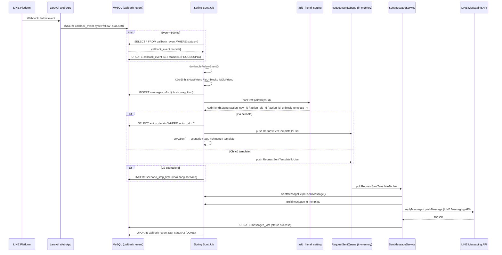

# FA-007 — Tin nhắn chào mừng: Job Spec

## Tổng quan

| Thuộc tính | Giá trị |
|-----------|---------|
| Mã tính năng | FA-007 |
| Tên tính năng | Tin nhắn chào mừng (「あいさつメッセージ」) |
| Kiến trúc Job | Database Polling (Queue Table: `callback_event`) |
| Feature Flag | `ENABLE_POSTBACK` (mặc định: `true`) |
| Mức độ tin cậy chung | **Cao** — phân tích trực tiếp từ source code Spring Boot |

---

## 1. Bối cảnh — Kiến trúc tổng thể

Tính năng tin nhắn chào mừng **không** có riêng một job polling bảng `add_friend_setting`. Thay vào đó, nó được xử lý **trong luồng xử lý LINE Webhook Event** của job Spring Boot:

1. LINE Platform gửi webhook event (follow/unblock) đến Laravel web app.
2. Laravel web app **INSERT** record vào bảng `callback_event` với `status = 0` (STATUS_NEW) và `type = 'follow'`.
3. Spring Boot job poll bảng `callback_event`, phát hiện record mới → xử lý → đọc cấu hình từ `add_friend_setting` → gửi tin nhắn về LINE API.

---

## 2. Queue Table — Trigger điểm

### Bảng `callback_event`

Bảng trung gian nhận webhook events từ Laravel và đưa vào queue xử lý cho Spring Boot.

| Cột | Ý nghĩa |
|-----|---------|
| `id` | Primary key |
| `user_id` | ID người dùng Admin |
| `bot_id` | ID bot (LINE Official Account) |
| `line_id` | LINE User ID của người dùng cuối |
| `type` | Loại event: `'follow'` (bạn mới/cũ/unblock), `'unfollow'`, `'postback'`, `'message'`, v.v. |
| `request` | JSON payload đầy đủ của webhook từ LINE |
| `status` | State machine: `0`=NEW, `1`=PROCESSING, `2`=DONE, `3`=ERROR, `6`=NOT_FOUND_BOT, `7`=BLOCKED_BY_BOT, `8`=EXPIRED_BOT |
| `error_message` | Thông báo lỗi nếu có |
| `created_at` | Thời điểm nhận webhook |

**Trigger điểm cho FA-007**: Record với `type = 'follow'` được INSERT bởi Laravel khi LINE gửi sự kiện `follow`.

---

## 3. Task Manager — Entry Point

### Class: `HandlePostbackTask`

**File**: `src/job/linect-service/src/main/java/sns/line/task/HandlePostbackTask.java`

**Feature Flag**: `ConfigFile.ENABLE_POSTBACK` (mặc định: `true`)

**Khởi tạo trong AppMain** (dòng 276):
```java
if (ConfigFile.ENABLE_POSTBACK) {
    handlePostbackTask.startHandleCallbackEvent();
}
```

### Cơ chế Polling

`HandlePostbackTask` gồm 2 tầng song song:

#### Tầng 1: Job Scanner Thread (startJobGetEvent)

```
while(true) {
    newEvents = callbackEventRepository.findAllByStatus(STATUS_NEW)  // status = 0
    → UPDATE status = 1 (PROCESSING) cho tất cả records tìm được
    → addAll(callbackEventQueue)  // đẩy vào in-memory queue
    → nếu rỗng: sleep(500ms)
}
```

#### Tầng 2: Processing Thread Pool (30 threads)

```
while(true) {
    callbackEvent = getCallbackEvent()  // poll từ in-memory queue
    switch(callbackEvent.getType()):
        case "follow"    → doHandleFollowEvent(callbackEvent)   ← FA-007
        case "unfollow"  → doHandleUnFollowEvent(callbackEvent)
        case "postback"  → doHandlePostbackEvent(callbackEvent)
        case "message"   → doHandleMessage(callbackEvent)
        ...
}
```

---

## 4. Processing Chain — Luồng xử lý FA-007

### Method: `doHandleFollowEvent(CallbackEvent event)`

**File**: `HandlePostbackTask.java` — dòng ~2034–2796

#### Bước 1: Parse và xác định loại bạn

```java
lineUser = lineUserRepository.findFirstByLineId(lineId)
if (lineUser == null) → isNewFriend = true  // Bạn hoàn toàn mới
botLineUser = botLineUserRepository.findFirstByLineUserIdAndBotId(...)
if (botLineUser.getIsBlocked() == 1) → isUnblock = true  // Hủy chặn
```

Kết quả phân loại:
| Điều kiện | Phân loại | msgKind |
|-----------|-----------|---------|
| `isNewFriend = true` | Bạn mới | `KIND_MESSAGE_ADD_NEW_FRIEND` |
| `isUnblock = true` | Hủy chặn | `KIND_MESSAGE_FRIEND_UNBLOCK` |
| Còn lại | Bạn cũ | `KIND_MESSAGE_ADD_OLD_FRIEND` |

#### Bước 2: Ghi nhận lịch sử tin nhắn chào mừng

```java
MessagesV2s messagesFollow = addMessageFollow(bot, conversation.getId(), msgKindAddFriend, null)
// INSERT vào bảng messages_v2s với msg_kind tương ứng (không gửi nội dung thực)
```

#### Bước 3: Kiểm tra Landing QR (ưu tiên cao hơn add_friend_setting)

```java
detailLandingClick = detailLandingClickRepository.findFirstByLineIdAndBotIdAndDeletedAtIsNullAndCreatedAtGreaterThan(...)
landingQR = landingQRRepository.findByIdAndDeletedAtIsNull(detailLandingClick.getLandingId())
if (landingQR != null) → addFriendSetting = null  // Landing QR override hoàn toàn add_friend_setting
```

#### Bước 4: Đọc cấu hình từ `add_friend_setting` (khi không có Landing QR)

```java
AddFriendSetting addFriendSetting = addFriendSettingRepository.findFirstByBotId(bot.getId())
```

Sau đó phân nhánh theo loại bạn:

**Trường hợp Bạn Mới (`isNewFriend = true`)**:
```java
actionAddFriend = addFriendSetting.getActionIdNewFriend()  // action_new_id
sentTemplateIds.add(addFriendSetting.getTemplateAddNew())   // template_add_new_id
// Nếu không có action: dùng newFriendScenario, newFriendTagId
```

**Trường hợp Hủy Chặn (`isUnblock = true`)**:
```java
actionAddFriend = addFriendSetting.getActionIdUnblock()    // action_id_unblock
sentTemplateIds.add(addFriendSetting.getTemplateUnblock())  // template_unblock_id
```

**Trường hợp Bạn Cũ (else)**:
```java
actionAddFriend = addFriendSetting.getActionIdOldFriend()   // action_old_id
sentTemplateIds.add(addFriendSetting.getTemplateAddOld())   // template_add_old_id
// Nếu không có action: dùng olfFriendScenarioId, oldFriendTagId
```

#### Bước 5: Thực thi action và gửi template

**Nếu có `actionAddFriend`** → gọi `doAction()`:
```java
StartActionInfo startActionInfo = new StartActionInfo(
    TYPE_ADD_FRIEND_NEW|OLD|UNBLOCK, actionAddFriend
)
doAction(botId, lineUser, conversation, replyToken, scenarioIdStart, ..., actionIds, ...)
```

Bên trong `doAction()`, xử lý từng `ActionDetail` theo `type`:
- `"template"` → thêm templateId vào danh sách gửi
- `"scenario"` → set `scenarioIdStart`
- `"tag"` → thêm/xóa tag cho user
- `"richmenu"` → cập nhật rich menu
- `"text"` → gửi text message trực tiếp

**Nếu chỉ có `sentTemplateIds`** (không có action) → tạo `RequestSentTemplateToUser` và đẩy vào `RequestSentQueue`:
```java
RequestSentTemplateToUser rqSent = new RequestSentTemplateToUser(listMessageToSave, botId, sentTemplateIds, lineUser.getId(), TYPE_MESSAGE_CALLBACK)
rqSent.setReplyToken(callback.getReplyToken())
RequestSentQueue.pushRequestToQueue(rqSent)
```

#### Bước 6: Khởi động Scenario (nếu có)

```java
if (scenarioIdStart != null && scenarioIdStart >= 0) {
    ScenarioModel.startScenarioWithCreatedSentNow(botId, replyToken, lineUser, conversationId, scenarioIdStart, ...)
}
```

#### Bước 7: Thông báo Push Notification

```java
NotifySetting notifySetting = notifySettingRepository.findFirstByBotId(bot.getId())
if (notifySetting.getIsNotifyAddFriend() == 1) {
    ActionLaterService.addLowPriorityTask(
        PriorityTask.checkAddNotifyTask(bot, lineUser, conversation, TYPE_ADD_FRIEND, notifyValue, content, notify)
    )
}
```

#### Bước 8: Hoàn tất

```java
event.setStatus(CallbackEvent.STATUS_DONE)  // status = 2
callbackEventRepository.save(event)
```

---

## 5. LINE API Call — Gửi Tin Nhắn

### Service: `SentMessageService` → `SentMessageHelper`

**File**: `src/job/linect-service/src/main/java/sns/line/helper/SentMessageService.java`
**File**: `src/job/linect-service/src/main/java/sns/line/helper/SentMessageHelper.java`

Luồng gửi:
1. `RequestSentQueue.pushRequestToQueue(RequestSentTemplateToUser)` — đẩy vào in-memory queue
2. `SentMessageService` poll queue liên tục (thread pool `MAX_SENT_MESSAGE_THREAD` threads)
3. `SentMessageHelper.sentMessage(req)` được gọi:
   - Build message từ template (via `MessageBuilder`)
   - Gọi LINE API `replyMessage` (nếu có `replyToken`) hoặc `pushMessage`
   - Lưu kết quả vào DB

**Loại LINE API** dùng cho tin chào mừng: **Reply Message** (sử dụng `replyToken` từ webhook event) khi còn trong thời hạn reply (30 giây), sau đó fallback sang **Push Message**.

---

## 6. Data Flow Diagram



---

## 7. Liên kết với Web App

### Khi Admin lưu cấu hình trong trang 「あいさつメッセージ」

1. **Laravel** gọi `SettingAddFriendController@saveSettingAddFriend` → `UPSERT add_friend_setting`
2. Các cột quan trọng được lưu:
   | Cột DB | Ý nghĩa |
   |--------|---------|
   | `action_new_id` | Action thực thi khi có bạn mới (FK → `t_actions.id`) |
   | `action_old_id` | Action thực thi khi có bạn cũ (FK → `t_actions.id`) |
   | `action_id_unblock` | Action thực thi khi hủy chặn (FK → `t_actions.id`) |
   | `template_add_new_id` | Template tin nhắn bạn mới (FK → `template.id`) |
   | `template_add_old_id` | Template tin nhắn bạn cũ (FK → `template.id`) |
   | `template_unblock_id` | Template tin nhắn hủy chặn (FK → `template.id`) |
   | `new_scenario_id` | Scenario tự động khi bạn mới (legacy, FK → `scenario.id`) |
   | `old_scenario_id` | Scenario tự động khi bạn cũ (legacy, FK → `scenario.id`) |
   | `new_tag_id` | Tag tự động gán khi bạn mới (FK → `tags.id`) |
   | `old_tag_id` | Tag tự động gán khi bạn cũ (FK → `tags.id`) |

3. **Spring Boot job** đọc `add_friend_setting` khi có sự kiện `follow` → thực thi logic tương ứng.

### Độ trễ xử lý

- Webhook từ LINE → INSERT `callback_event`: < 1 giây (Laravel synchronous)
- Polling interval: ~500ms (khi có event); sleep 500ms khi rỗng
- Tổng độ trễ thực tế từ LINE event → gửi tin: **thường < 2–3 giây**

---

## 8. Feature Flags liên quan

| Flag | Mặc định | Ý nghĩa |
|------|---------|---------|
| `ENABLE_POSTBACK` | `true` | Bật xử lý toàn bộ callback events kể cả `follow` |
| `ENABLE_ACTION_SERVICE` | `true` | Bật service thực thi `action_line_user` records |
| `ENABLE_SCENARIO` | `false` | Bật xử lý scenario sau khi gán cho user |

---

## 9. Các trường hợp đặc biệt

| Trường hợp | Xử lý |
|-----------|-------|
| Bot hết hạn trên 7 ngày | `status = STATUS_EXPIRED_BOT` (8), bỏ qua xử lý |
| Bot không tìm thấy | `status = STATUS_NOT_FOUND_BOT` (6), bỏ qua |
| User bị block bởi bot | `status = STATUS_BLOCKED_BY_BOT` (7), bỏ qua |
| Có Landing QR | `add_friend_setting` bị bỏ qua, chạy action của Landing QR thay thế |
| Có Landing QR nhưng đã action 2 lần (action_type=1) | Cả Landing QR lẫn `add_friend_setting` đều bị bỏ qua |
| `add_friend_setting` không tồn tại | Không gửi tin, chỉ ghi nhận lịch sử vào `messages_v2s` |

---

## 10. Luồng xử lý Bạn Cũ (Old Friend) trong join group

Ngoài `doHandleFollowEvent`, có một code path thứ hai tại dòng ~860 trong `HandlePostbackTask.java` xử lý trường hợp join group (partial/old friend logic). Code path này cũng đọc `add_friend_setting.getActionIdOldFriend()` nhưng trong context `doHandleJoinGroup`. **Mức độ tin cậy**: **Trung bình** — code path này có phần bị comment out.
