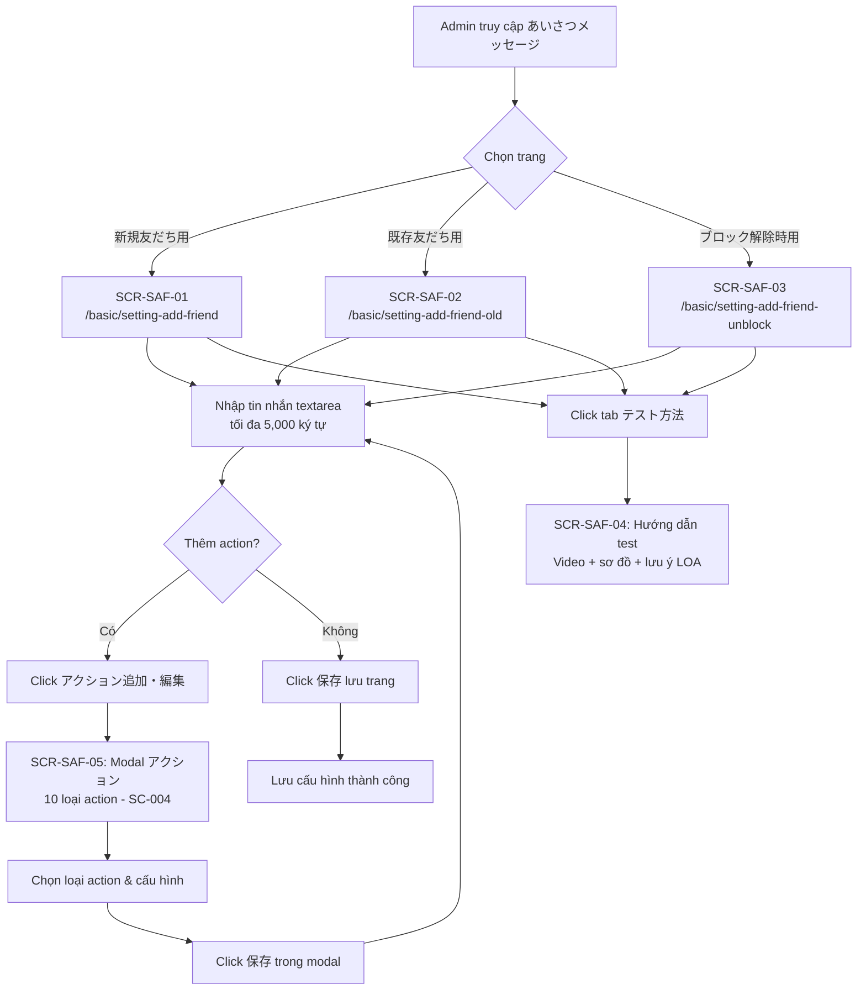

# FA-007 — Tin nhắn chào mừng (「あいさつメッセージ」)

## Tổng quan

| Thuộc tính | Giá trị |
|-----------|---------|
| Mã tính năng | FA-007 |
| Tên tính năng | Tin nhắn chào mừng |
| Tên JP | 「あいさつメッセージ」 |
| Portal | Admin |
| URL chính | `/basic/setting-add-friend` |
| Phân loại | Cấu hình tự động — Tin nhắn/action kích hoạt khi bạn bè thêm/quay lại/hủy chặn |
| Mức độ tin cậy chung | **Cao** — phân tích từ accessibility tree YAML đầy đủ |

### Mô tả

Tính năng cho phép Admin cấu hình tin nhắn và action tự động được gửi đến người dùng LINE trong 3 tình huống:
1. **Bạn mới** (「新規友だち」): Khi người dùng thêm bạn LINE OA lần đầu
2. **Bạn cũ** (「既存友だち」): Khi người dùng đã từng là bạn (ví dụ: đã unblock trước đó trên hệ thống cũ)
3. **Hủy chặn** (「ブロック解除時」): Khi người dùng hủy block LINE OA

Mỗi sub-page có cùng cấu trúc: khu vực nhập tin nhắn văn bản + khu vực cấu hình action LME (エルメアクション).

---

## Actors

| Actor | Mô tả | Quyền |
|-------|-------|-------|
| Admin | Người quản lý LINE OA | Xem, chỉnh sửa, lưu toàn bộ cấu hình |
| Staff | Nhân viên do Admin tạo | Có thể xem/chỉnh sửa nếu được phân quyền (chưa xác nhận rõ phạm vi) |

---

## Màn hình

### SCR-SAF-01: Tin nhắn chào mừng bạn mới (「新規友だち用」)

**URL**: `/basic/setting-add-friend`

**Breadcrumb / Page title**:
- Sub-title: 「新規友だち用」
- Title chính: 「あいさつメッセージ設定」
- Link phụ: 「友だちの流入経路を分析したい場合はこちら」 (javascript:void(0) — mở modal/link phân tích nguồn)

**Thông báo info box**:
- Icon + text: 「このページで設定したメッセージ・アクションは」**「新規友だち」**「のみ稼働します。」
- Nghĩa: Cài đặt trên trang này chỉ hoạt động với bạn mới

**Khu vực URL bạn bè**:
- Label: 「友だち追加URL」
- Giá trị hiển thị: `https://line.me/R/ti/p/%40573thndt` (URL dạng LINE deep link)
- Icon copy (nút click để copy URL)
- Link giải thích: 「LINE公式アカウントの友だち追加URLとの違い」
- QR code image (hiển thị QR của URL)
- Icon download QR (nút tải QR image)

**Tabs điều hướng**:
- Tab 1 (đang active): 「メッセージ・アクション設定」
- Tab 2: 「テスト方法」 → xem SCR-SAF-04

**Khu vực nội dung chính — Section: 「新規友だち追加時メッセージ・アクション設定」**

**Block 1 — Gửi tin nhắn (「送信するメッセージを登録」)**:
- Label: 「送信するメッセージを登録」
- Nút chèn biến:
  - 「＋ LINE名」 — chèn tên LINE của bạn bè vào tin nhắn
  - 「＋ 友だち情報」 — chèn thông tin bạn bè (custom field)
- Textarea (textbox):
  - Placeholder/giá trị mẫu: `new friend`
  - Counter ký tự: `10/5,000` (hiện tại 10 ký tự, tối đa 5.000 ký tự)
  - Loại: plain text, multi-line

**Block 2 — Đăng ký action (「上記メッセージ送信以外のアクション登録」)**:
- Label: 「上記メッセージ送信以外のアクション登録」
- Mô tả: 「友だち追加時の」**「ステップ配信の開始やリッチメニュー表示」**「などのアクションをこちらで設定します。」
- 5 shortcut buttons (quick action shortcuts):
  1. 「ステップ配信を開始・停止する」
  2. 「リッチメニューを表示する」
  3. 「テンプレートを送信する」
  4. 「タグを付け・外しする」
  5. 「その他のアクションをみる」
- Nút chính: 「アクション追加・編集」 (button, mở modal アクション — xem SCR-SAF-05)
- Trạng thái hiện tại: 「エルメアクションは登録されていません」 (không có action nào được đăng ký)

**Nút lưu**: 「保存」 (button, màu accent, đặt cuối trang, clickable)

---

### SCR-SAF-02: Tin nhắn chào mừng bạn cũ (「既存友だち用」)

**URL**: `/basic/setting-add-friend-old`

**Breadcrumb / Page title**:
- Sub-title: 「既存友だち用」
- Title chính: 「あいさつメッセージ設定」
- Link phụ: 「友だちの流入経路を分析したい場合はこちら」

**Thông báo info box**:
- Dòng 1: 「このページで設定したメッセージ・アクションは」**「既存友だち」**「のみ稼働します。」
- Dòng 2 (lưu ý thêm): 「認証済みアカウントを接続した時に、自動で取得される既存の友だちにはアクションは稼働しません。」
  - Nghĩa: Bạn bè cũ được tự động import khi kết nối tài khoản xác thực sẽ không nhận action

**Lưu ý khác biệt so với SCR-SAF-01**: Trang 既存友だち用 **không** hiển thị khu vực URL/QR code trong snapshot quan sát được.

**Tabs điều hướng**:
- Tab 1 (đang active): 「メッセージ・アクション設定」
- Tab 2: 「テスト方法」

**Khu vực nội dung chính — Section: 「既存友だちに対するメッセージ・アクション設定」**

**Block 1 — Gửi tin nhắn**:
- Label: 「送信するメッセージを登録」
- Nút chèn biến: 「＋ LINE名」 , 「＋ 友だち情報」
- Textarea:
  - Giá trị mẫu: `{name} old friend` (có dùng biến `{name}`)
  - Counter: `17/5,000`

**Block 2 — Đăng ký action**:
- Cùng cấu trúc như SCR-SAF-01:
  - 5 shortcut buttons giống hệt
  - Nút 「アクション追加・編集」
  - Trạng thái: 「エルメアクションは登録されていません」

**Nút lưu**: 「保存」

---

### SCR-SAF-03: Tin nhắn ứng với hủy chặn (「ブロック解除時用」)

**URL**: `/basic/setting-add-friend-unblock`

**Breadcrumb / Page title**:
- Sub-title: 「ブロック解除時用」
- Title chính: 「あいさつメッセージ設定」
- Link phụ: 「友だちのブロック解除経路を分析したい場合はこちら」 (khác với 2 trang kia — nội dung phân tích "ブロック解除経路")

**Thông báo info box**:
- Text: 「このページで設定したメッセージ・アクションは 友だちのブロック解除時のみ 稼働します。」
- Nghĩa: Chỉ hoạt động khi bạn bè hủy block

**Khu vực URL bạn bè** (hiển thị trên cả tab テスト方法):
- Label: 「友だち追加URL」
- Giá trị: `https://line.me/R/ti/p/%40573thndt`
- Icon copy
- Link: 「LINE公式アカウントの友だち追加URLとの違い」
- QR code image + icon download

**Tabs điều hướng**:
- Tab 1 (đang active): 「メッセージ・アクション設定」
- Tab 2: 「テスト方法」 → xem SCR-SAF-04

**Khu vực nội dung chính — Section: 「ブロック解除時のメッセージ・アクション設定」**

**Block 1 — Gửi tin nhắn**:
- Label: 「送信するメッセージを登録」
- Nút chèn biến: 「＋ LINE名」 , 「＋ 友だち情報」
- Textarea:
  - Giá trị mẫu: `action fr unblock`
  - Counter: `17/5,000`

**Block 2 — Đăng ký action**:
- Mô tả: 「ブロック解除時の」**「ステップ配信の開始やリッチメニュー表示」**「などのアクションをこちらで設定します。」
- 5 shortcut buttons (giống SCR-SAF-01/02)
- Nút 「アクション追加・編集」
- Trạng thái: 「エルメアクションは登録されていません」

**Nút lưu**: 「保存」

---

### SCR-SAF-04 (chung): Tab 「テスト方法」

**Áp dụng cho**: SCR-SAF-01, SCR-SAF-02, SCR-SAF-03 (tab thứ 2 trên mỗi trang)

**Snapshot quan sát được**: Lấy từ trang ブロック解除時用 (test-method-tab-snapshot.yml)

**Nội dung tab テスト方法 cho 「ブロック解除時用」**:

**Khu vực URL/QR** (hiển thị cùng với tab):
- Label: 「友だち追加URL」
- URL: `https://line.me/R/ti/p/%40573thndt`
- Icon copy URL
- Link: 「LINE公式アカウントの友だち追加URLとの違い」
- QR code image + nút download

**Block hướng dẫn test** — Section 「ブロック解除時用アクションのテスト方法」:
- Link video hướng dẫn: 「テスト方法を動画で確認」 → `https://youtu.be/9TTugIBdQGs?si=tmu-rgxRz2wAy51z&t=354`
- Header: 「すでにエルメに表示されているLINEアカウントの場合」
- Sơ đồ minh họa 2 bước (image với label số 1, 2):
  - Bước 1: 「LINE公式アカウントをブロック&ブロック解除」
  - Bước 2: 「設定したアクションが稼働すれば テスト成功」

**Block lưu ý** — 「ご注意事項」:
- Text: 「LINE公式アカウント管理画面のあいさつメッセージが設定されている場合は、どちらも送信されます。」
- Text phụ: 「(エルメのあいさつメッセージのみご利用いただくことを推奨しています。)」
- Hướng dẫn tắt あいさつメッセージ của LINE OA:
  - Tiêu đề: 「LOAのあいさつメッセージをオフにする方法」
  - Các bước:
    1. Đăng nhập tại link: `LINE公式アカウント管理画面` (link đến `https://account.line.biz/login?...`)
    2. 「> 設定」
    3. 「> 応答設定」
    4. 「> 応答機能「あいさつメッセージ」をオフにする」

**Nút lưu**: 「保存」 (xuất hiện ở cuối trang kể cả khi ở tab テスト方法)

---

### SCR-SAF-05 (chung): Modal 「アクション」

**Trigger**: Click nút 「アクション追加・編集」 trên bất kỳ trang nào (SCR-SAF-01, 02, 03)

**Loại**: Dialog/Modal (dialog element với role dialog, title 「アクション」)

**Nút đóng**: Button X ở góc trên phải modal

**Tham chiếu Shared Component**: SC-004 (Action Settings) — đã có spec đầy đủ tại `features/shared/action-settings/shared-spec.md`

**10 loại action** (tab buttons trong modal):

| # | Nhãn JP | Mô tả |
|---|---------|-------|
| 1 | 「ステップ」 | Bắt đầu/dừng ステップ配信 |
| 2 | 「テンプレート」 | Gửi template tin nhắn |
| 3 | 「テキスト」 | Gửi tin nhắn text tùy chỉnh |
| 4 | 「リマインド」 | Gửi tin nhắn nhắc nhở |
| 5 | 「タグ」 | Gắn/gỡ thẻ (tag) |
| 6 | 「リッチメニュー」 | Hiển thị rich menu |
| 7 | 「ブックマーク」 | Đánh dấu/lưu bookmark |
| 8 | 「友だち情報」 | Cập nhật thông tin bạn bè |
| 9 | 「対応ステータス」 | Cập nhật trạng thái xử lý |
| 10 | 「ブロック」 | Block người dùng |

**Nút lưu trong modal**: 「保存」

> Ghi chú: Đây là SC-004 Action Settings — variant V2 multi-action (10 action types). Xem spec đầy đủ tại `features/shared/action-settings/shared-spec.md`.

---

## User Flows

### Flow 1: Cấu hình tin nhắn chào mừng bạn mới

```
Admin truy cập /basic/setting-add-friend
    → Trang SCR-SAF-01 hiển thị (tab メッセージ・アクション設定 active)
    → Admin đọc thông báo info box (phạm vi áp dụng)
    → Admin nhập tin nhắn vào textarea (có thể chèn LINE名 / 友だち情報)
    → [Tùy chọn] Admin click shortcut button hoặc「アクション追加・編集」
        → Modal SCR-SAF-05 mở
        → Admin chọn loại action → cấu hình → click「保存」trong modal
        → Modal đóng, trạng thái action cập nhật
    → Admin click「保存」(lưu toàn trang)
        → POST request lưu cấu hình
        → Thông báo thành công
```

### Flow 2: Cấu hình tin nhắn chào mừng bạn cũ

```
Admin truy cập /basic/setting-add-friend-old
    → Trang SCR-SAF-02 hiển thị
    → Tương tự Flow 1 nhưng áp dụng cho「既存友だち」
```

### Flow 3: Cấu hình tin nhắn khi hủy chặn

```
Admin truy cập /basic/setting-add-friend-unblock
    → Trang SCR-SAF-03 hiển thị
    → Tương tự Flow 1 nhưng áp dụng cho「ブロック解除時」
```

### Flow 4: Xem hướng dẫn test

```
Admin ở bất kỳ SCR-SAF-01/02/03
    → Click tab「テスト方法」
    → Trang SCR-SAF-04 hiển thị
    → Admin xem hướng dẫn test (video link, sơ đồ các bước)
    → Admin có thể đọc lưu ý tắt あいさつメッセージ của LINE OA chính thức
```

---

## Flow Diagram (mermaid)



---

## Screenshots

| File | Mô tả |
|------|-------|
| `screenshots/main-new-friend.png` | SCR-SAF-01 — Trang 新規友だち用 |
| `screenshots/main-existing-friend.png` | SCR-SAF-02 — Trang 既存友だち用 |
| `screenshots/main-unblock-friend.png` | SCR-SAF-03 — Trang ブロック解除時用 |
| `screenshots/test-method-tab.png` | SCR-SAF-04 — Tab テスト方法 (trang unblock) |
| `screenshots/action-modal.png` | SCR-SAF-05 — Modal アクション |

---

## Shared Components được sử dụng

| Mã | Tên | Mô tả | Nơi dùng |
|----|-----|-------|----------|
| SC-004 | Action Settings | Modal 「アクション」với 10 loại action | SCR-SAF-05 — trigger từ nút「アクション追加・編集」trên cả 3 trang |

---

## Điểm chưa rõ

| # | Điểm chưa rõ | Mức độ | Ghi chú |
|---|-------------|--------|---------|
| 1 | Tab テスト方法 cho 新規友だち用 và 既存友だち用 | **Thấp** | Snapshot chỉ có tab テスト方法 của trang unblock. Có thể nội dung hướng dẫn test khác nhau giữa 3 trang — cần xem thêm. |
| 2 | Trang 既存友だち用 có hiển thị URL/QR không? | **Thấp** | Snapshot SCR-SAF-02 không thấy khu vực URL/QR. Có thể trang này không cần (vì không dùng deep link). |
| 3 | Trạng thái khi đã đăng ký action | **Trung bình** | Snapshot hiển thị trạng thái 「エルメアクションは登録されていません」. Cần xem cách hiển thị khi có action (có thể là danh sách action hiển thị). |
| 4 | Nội dung shortcut button khi click | **Trung bình** | 5 shortcut button có action gì khi click? Có thể mở modal SC-004 với tab được pre-select sẵn (ví dụ click「ステップ配信を開始・停止する」→ mở modal tab ステップ). |
| 5 | Phân quyền Staff | **Thấp** | Chưa xác nhận Staff có quyền chỉnh sửa trang này không. |
| 6 | API endpoint cho 既存友だち用 | **Trung bình** | Network log chỉ ghi nhận `?type=add_new` và `?type=unblock`. Type cho 既存友だち có thể là `?type=old` — cần xác nhận qua web-analyzer. |
