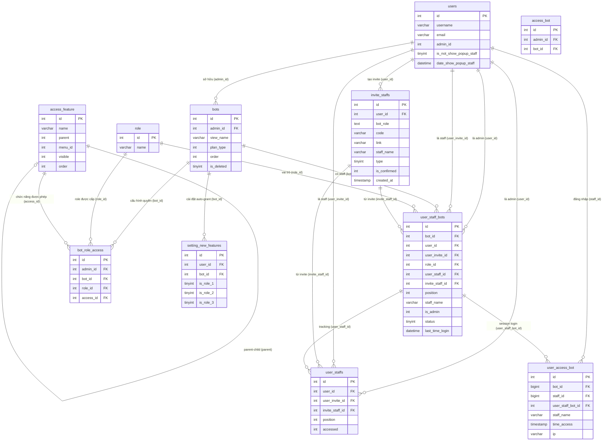

# DB Mapping — FA-035: Quản lý nhân viên (スタッフ管理)

**Tính năng:** FA-035  
**Portal:** Admin  
**Ngày tạo:** 2026-05-07  
**Mức độ tin cậy tổng thể:** Cao (schema xác nhận trực tiếp, data mẫu khớp với logic-spec)

---

## 1. Primary Tables (Bảng trực tiếp liên quan)

| Bảng | Model Eloquent | Vai trò |
|------|---------------|---------|
| `user_staff_bots` | `UserStaffBot` | Quan hệ nhiều-nhiều Staff ↔ Bot + role per-bot. Bảng trung tâm của tính năng |
| `invite_staffs` | `InviteStaff` | Lưu invitation URL — lifecycle từ tạo đến chấp nhận |
| `user_staffs` | `UserStaff` | Tracking quan hệ Admin ↔ Staff (không phân theo bot) |
| `user_access_bot` | `UserAccessBot` | Lịch sử đăng nhập của staff vào bot context |
| `bot_role_access` | `BotRoleAccess` | Cấu hình quyền thao tác: role × access_feature × bot |
| `access_feature` | `AccessFeature` | Danh mục các chức năng có thể phân quyền |
| `setting_new_features` | `SettingNewFeature` | Cài đặt tự động cấp quyền tính năng mới cho role |
| `role` | `Role` | Danh sách loại quyền (副管理人, 運用者, サポート) |

---

## 2. Secondary Tables (Bảng gián tiếp)

| Bảng | Vai trò | Liên kết |
|------|---------|---------|
| `bots` | Tài khoản LINE OA — hiển thị tên bot, lọc theo plan_type | FK từ `user_staff_bots.bot_id`, `invite_staffs.bot_role[].bot_id` |
| `users` | Account LME — email, username của staff | FK từ `user_staff_bots.user_invite_id`, `user_access_bot.staff_id` |
| `access_bot` | Legacy: tracking staff-bot cho flow cũ (addEmployee) | `admin_id`, `bot_id` — không dùng trong invite flow |
| `bot_life_cycles` | Log sự kiện ADD_STAFF / DELETE_STAFF | Ghi khi accept/delete staff (BR-010) |
| `user_firebase_tokens` | Token Firebase push notification của staff | Dùng khi xóa staff để hủy đăng ký (BR-011) |

---

## 3. Entity Details

---

### 3.1 Bảng `user_staff_bots`

**Vai trò:** Bảng trung tâm lưu mối quan hệ Staff ↔ Bot. Mỗi bản ghi = một staff thuộc một bot với một role cụ thể.

#### Columns

| Cột | Kiểu | Nullable | Default | Key | Mô tả |
|-----|------|---------|---------|-----|-------|
| `id` | int(10) UNSIGNED | NO | — | PK | Primary key |
| `bot_id` | int(10) UNSIGNED | NO | — | FK | Bot thuộc về → `bots.id` |
| `last_time_login` | datetime | YES | NULL | — | Thời điểm chọn bot context lần cuối (cập nhật qua `setBotInvite`) |
| `role_id` | int(10) UNSIGNED | NO | — | FK | Loại quyền → `role.id` (0=admin owner, 1=副管理人, 2=運用者, 3=サポート) |
| `user_staff_id` | int(10) UNSIGNED | YES | NULL | FK | Liên kết → `user_staffs.id` |
| `user_invite_id` | int(10) UNSIGNED | YES | NULL | FK | ID của người được mời (staff) → `users.id`. NULL khi chưa accept |
| `user_id` | int(10) UNSIGNED | NO | — | FK | Admin owner của bot → `users.id` |
| `position` | int(11) | NO | — | — | Vị trí hiển thị — sắp xếp theo `position DESC` (admin luôn cao nhất) |
| `staff_name` | varchar(255) | YES | NULL | — | Tên hiển thị của staff (snapshot tại thời điểm invite) |
| `created_at` | timestamp | YES | NULL | — | Thời điểm tạo |
| `updated_at` | timestamp | YES | NULL | — | Thời điểm cập nhật |
| `is_admin` | int(11) | NO | 0 | — | 1 = Admin owner (chủ bot), 0 = Staff được mời |
| `invite_staff_id` | int(11) | YES | NULL | FK | Liên kết → `invite_staffs.id` |
| `status` | tinyint(4) | NO | 1 | — | 0=NO_ACTION (pending), 1=ACCEPT (active), 2=REJECT |

**Ghi chú về `status`:**
- Default trong DB là `1` (ACCEPT), nhưng logic code tạo bản ghi pending với `STATUS_NO_ACTION = 0`
- Sau khi staff accept → cập nhật thành `1`

#### Sample Data

```sql
-- Staff thông thường (role_id=3, status=ACCEPT)
(10, 1029, NULL, 3, 17, 513, 506, 1, 'NgoThuyNgan', '2024-10-11 08:32:42', '2024-10-11 08:32:42', 0, NULL, 1)
-- is_admin=0, user_invite_id=513, role_id=3 (サポート)

-- Admin owner (is_admin=1) — tự động tạo
-- Ví dụ: (id=X, bot_id=46607, is_admin=1, role_id=0, user_id=adminId, position=maxPos+1)
```

---

### 3.2 Bảng `invite_staffs`

**Vai trò:** Lưu thông tin lần phát hành invite URL. Một bản ghi = một lần click「招待用URLを発行」.

#### Columns

| Cột | Kiểu | Nullable | Default | Key | Mô tả |
|-----|------|---------|---------|-----|-------|
| `id` | int(10) UNSIGNED | NO | — | PK | Primary key |
| `user_id` | int(10) UNSIGNED | NO | — | FK | Admin tạo invite → `users.id` |
| `bot_role` | text | NO | — | — | JSON array `[{bot_id, role_id}]` — danh sách bot và quyền được mời |
| `link` | varchar(255) | NO | — | — | Full URL invite (có thể rỗng trong data cũ) |
| `code` | varchar(20) | NO | — | UNIQUE | Mã ngẫu nhiên 8 ký tự — dùng trong URL `/admin/access-link-invite-staff/{code}` |
| `staff_name` | varchar(255) | YES | NULL | — | Tên staff đặt khi tạo invite |
| `type` | tinyint(4) | NO | 1 | — | 1 = invite staff, 2 = change bot owner |
| `created_at` | timestamp | YES | NULL | — | Thời điểm tạo — dùng để tính hết hạn 24h |
| `updated_at` | timestamp | YES | NULL | — | Thời điểm cập nhật |
| `is_confirmed` | int(11) | YES | NULL | — | NULL/0 = chưa dùng, 1 = đã dùng (URL vô hiệu hóa) |

#### Sample Data (trích)

```sql
-- Invite với 1 bot, role=2 (運用者)
(5, 115, '[{"bot_id":"1246","role_id":"2"}]', '', 'g9b8wVeQ', 'staff_name_here', 1, '2024-10-09 06:36:51', ...)
-- Invite nhiều bots
(7, 115, '[{"bot_id":"300","role_id":"1"},{"bot_id":"451","role_id":"1"},...]', '', '54nXq5GV', 'case 58', 1, ...)
```

**Quan sát:** `bot_role` lưu dạng JSON với các key `bot_id` và `role_id` là string (không phải int).

---

### 3.3 Bảng `user_staffs`

**Vai trò:** Tracking mối quan hệ Admin ↔ Staff ở cấp độ toàn admin (không phân theo bot). Dùng để kiểm tra đã truy cập link lần 2.

#### Columns

| Cột | Kiểu | Nullable | Default | Key | Mô tả |
|-----|------|---------|---------|-----|-------|
| `id` | int(10) UNSIGNED | NO | — | PK | Primary key |
| `user_id` | int(10) UNSIGNED | NO | — | FK | Admin owner → `users.id` |
| `user_invite_id` | int(10) UNSIGNED | NO | — | FK | Staff được mời → `users.id` |
| `invite_staff_id` | int(10) UNSIGNED | NO | — | FK | Invite liên quan → `invite_staffs.id` |
| `position` | int(11) | NO | — | — | Vị trí trong danh sách staff của admin |
| `accessed` | int(11) | NO | — | — | 0 = chưa truy cập link lần 2, 1 = đã truy cập |
| `created_at` | timestamp | YES | NULL | — | Thời điểm tạo |
| `updated_at` | timestamp | YES | NULL | — | Thời điểm cập nhật |

#### Sample Data

```sql
(1, 115, 223, 16, 1, 1, '2024-10-09 09:42:34', '2024-10-09 09:56:05')
-- admin=115, staff=223, invite_staff=16, accessed=1 (đã truy cập)
```

---

### 3.4 Bảng `user_access_bot`

**Vai trò:** Ghi lịch sử mỗi lần staff đăng nhập vào bot context. Hiển thị trong màn hình SCR-EMP-04.

#### Columns

| Cột | Kiểu | Nullable | Default | Key | Mô tả |
|-----|------|---------|---------|-----|-------|
| `id` | int(10) UNSIGNED | NO | — | PK | Primary key |
| `bot_id` | bigint(20) | NO | — | FK | Bot được truy cập → `bots.id` |
| `staff_id` | bigint(20) | NO | — | FK | User đăng nhập → `users.id` |
| `staff_name` | varchar(255) | NO | — | — | Tên staff tại thời điểm đăng nhập (snapshot) |
| `time_access` | timestamp | YES | NULL | — | Thời điểm đăng nhập. Accessor PHP: format `Y/m/d H:i` |
| `ip` | varchar(255) | YES | NULL | — | Địa chỉ IP (IPv4 hoặc IPv6) |
| `user_staff_bot_id` | int(11) | YES | NULL | FK | Liên kết → `user_staff_bots.id` |
| `created_at` | timestamp | YES | NULL | — | Timestamp tạo |
| `updated_at` | timestamp | YES | NULL | — | Timestamp cập nhật |

#### Sample Data

```sql
(2, 541, 513, 'staff bot server form 1', '2024-09-15 07:10:26', '104.28.254.74', 14, ...)
-- bot=541, staff_id=513, tên snapshot, ip, liên kết user_staff_bots.id=14
```

---

### 3.5 Bảng `bot_role_access`

**Vai trò:** Lưu cấu hình quyền thao tác. Mỗi bản ghi = một role được cấp quyền với một access_feature trong một bot cụ thể.

#### Columns

| Cột | Kiểu | Nullable | Default | Key | Mô tả |
|-----|------|---------|---------|-----|-------|
| `id` | int(10) UNSIGNED | NO | — | PK | Primary key |
| `admin_id` | int(11) | NO | — | FK | Admin owner của bot → `users.id` |
| `bot_id` | int(11) | NO | — | FK | Bot áp dụng → `bots.id` |
| `role_id` | int(11) | NO | — | FK | Loại quyền → `role.id` (1, 2, hoặc 3) |
| `access_id` | int(11) | NO | — | FK | Chức năng được phép → `access_feature.id` |
| `created_at` | timestamp | NO | CURRENT_TIMESTAMP | — | Thời điểm tạo |
| `updated_at` | timestamp | NO | CURRENT_TIMESTAMP | ON UPDATE | Thời điểm cập nhật |

**Ghi chú quan trọng:** Khi lưu quyền mới (EP-11), toàn bộ bản ghi cũ của `bot_id` bị **xóa hoàn toàn** rồi insert batch mới. Không có soft-delete hay history.

#### Sample Data

```sql
-- Bot 503: role_id=1 (副管理人) có quyền access_feature 42, 121, 122...
(1, 12, 503, 1, 42, '2024-11-01 02:48:11', ...)
(11, 12, 503, 2, 42, '2024-11-01 02:48:11', ...)
-- Cùng bot_id=503, role_id=2 (運用者) cũng có quyền access_id=42
```

---

### 3.6 Bảng `access_feature`

**Vai trò:** Danh mục các chức năng hệ thống có thể phân quyền. Cấu trúc cây (parent → children).

#### Columns

| Cột | Kiểu | Nullable | Default | Key | Mô tả |
|-----|------|---------|---------|-----|-------|
| `id` | int(10) UNSIGNED | NO | — | PK | Primary key |
| `name` | varchar(255) | NO | — | — | Tên chức năng (tiếng Nhật). Rỗng cho sub-items |
| `url` | varchar(255) | NO | — | — | URL tương ứng |
| `parent` | int(11) | NO | — | — | 0 = menu item gốc; >0 = FK tự tham chiếu (sub-item) |
| `route` | varchar(255) | NO | — | — | Tên route Laravel |
| `visible` | int(11) | NO | 1 | — | 1 = hiển thị trong bảng quyền, 0 = ẩn |
| `order` | int(11) | NO | 0 | — | Thứ tự hiển thị |
| `menu_id` | int(11) | YES | NULL | — | Nhóm menu (map với config `sns-line.access_feature`) |

#### Sample Data (trích)

```sql
(2, '友だちリスト', '/basic/friendlist', 0, 'friendlistHome', 1, 11, 4)  -- menu item gốc
(3, '', '/basic/friendlist/block', 2, 'friendlistBlock', 1, 0, NULL)       -- sub-item của id=2
(22, 'メッセージ配信', '/basic/message-send-all', 0, 'broadcast.index', 1, 5, 3) -- menu item gốc
```

---

### 3.7 Bảng `setting_new_features`

**Vai trò:** Cài đặt tự động cấp quyền khi có tính năng mới thêm vào hệ thống. Per bot (hoặc toàn admin khi `bot_id = NULL`).

#### Columns

| Cột | Kiểu | Nullable | Default | Key | Mô tả |
|-----|------|---------|---------|-----|-------|
| `id` | int(10) UNSIGNED | NO | — | PK | Primary key |
| `user_id` | int(11) | NO | — | FK | Admin owner → `users.id` |
| `is_role_1` | tinyint(1) | NO | 0 | — | Tự động cấp quyền cho role 1 (副管理人) khi có tính năng mới |
| `is_role_2` | tinyint(1) | NO | 0 | — | Tự động cấp quyền cho role 2 (運用者) |
| `is_role_3` | tinyint(1) | NO | 0 | — | Tự động cấp quyền cho role 3 (サポート) |
| `created_at` | timestamp | YES | NULL | — | Thời điểm tạo |
| `updated_at` | timestamp | YES | NULL | — | Thời điểm cập nhật |
| `bot_id` | int(11) | YES | NULL | FK | Bot áp dụng → `bots.id`. NULL = áp dụng cho toàn admin (legacy) |

#### Sample Data

```sql
-- Bot 451: chỉ role_1 được auto-grant
(17, 115, 1, 0, 0, '2024-10-31 05:01:46', '2026-03-23 03:02:23', 451)
-- Bot 541: cả 3 role đều được auto-grant
(19, 115, 1, 1, 1, '2024-11-01 02:22:20', '2024-11-21 02:08:49', 541)
-- NULL bot_id: legacy (trước khi có per-bot setting)
(12, 115, 0, 0, 0, '2024-10-16 08:39:16', ..., NULL)
```

---

### 3.8 Bảng `role`

**Vai trò:** Danh sách loại quyền của staff.

#### Columns

| Cột | Kiểu | Nullable | Default | Key | Mô tả |
|-----|------|---------|---------|-----|-------|
| `id` | int(10) UNSIGNED | NO | — | PK | Primary key |
| `name` | varchar(255) | NO | — | — | Tên quyền (tiếng Nhật) |

#### Sample Data (đầy đủ)

```sql
(1, '副管理人')
(2, '運用者')
(3, 'サポート')
```

**Lưu ý:** Không có bản ghi `id=0` trong bảng `role`. Giá trị `role_id=0` trong `user_staff_bots` (cho Admin owner) không tham chiếu đến bảng `role` mà được xử lý đặc biệt trong code — hiển thị là「主管理者」.

---

### 3.9 Bảng `access_bot` (Legacy)

**Vai trò:** Bảng cũ — tracking staff-bot trong flow `addEmployee` (legacy). Không sử dụng trong invite URL flow (flow hiện tại).

#### Columns

| Cột | Kiểu | Nullable | Default | Key | Mô tả |
|-----|------|---------|---------|-----|-------|
| `id` | int(10) UNSIGNED | NO | — | PK | Primary key |
| `admin_id` | int(11) | NO | — | FK | Staff user ID |
| `bot_id` | int(11) | NO | — | FK | Bot ID |
| `created_at` | datetime | NO | — | — | Thời điểm tạo |
| `updated_at` | datetime | NO | — | — | Thời điểm cập nhật |

---

## 4. UI ↔ DB Field Mapping

---

### 4.1 SCR-EMP-01: Danh sách Staff

**Bảng dữ liệu chính:** `user_staff_bots` JOIN `users` JOIN `role`  
**Query cơ bản:** `user_staff_bots WHERE bot_id = ? ORDER BY position DESC`

| UI Element | Label JP | DB Table | Column | Mapping Type | Confidence | Ghi chú |
|-----------|---------|----------|--------|-------------|-----------|---------|
| Cột「スタッフ名」 | スタッフ名 | `user_staff_bots` | `staff_name` | Direct | **Cao** | Snapshot tên tại thời điểm invite. Nếu `is_admin=1` → lấy từ `users.username` |
| Cột「エルメユーザー名」 | エルメユーザー名 | `users` | `username` | FK | **Cao** | JOIN qua `user_staff_bots.user_invite_id = users.id` |
| Cột「操作権限」 | 操作権限 | `user_staff_bots` + `role` | `role_id` → `role.name` | FK + Enum | **Cao** | role_id=0 hiển thị「主管理者」(hard-coded), role_id=1,2,3 lấy từ `role.name` |
| Cột「メールアドレス」 | メールアドレス | `users` | `email` | FK | **Cao** | JOIN qua `user_staff_bots.user_invite_id = users.id` |
| Cột「最終ログイン」 | 最終ログイン | `user_staff_bots` | `last_time_login` | Direct | **Cao** | Cập nhật khi `setBotInvite` được gọi. NULL nếu chưa từng đăng nhập |
| Dropdown chọn bot | (account selector) | `bots` | `id`, `view_name`, `bot_image`, `plan_type` | FK | **Cao** | Lọc qua `getListBotIdStaffManagement()` → chỉ bot của admin, `is_deleted=0` |
| Phân trang | (pagination) | — | LIMIT/OFFSET | Computed | **Cao** | `per_page` default 50 |
| Badge「フリープラン」 | — | `bots` | `plan_type`, `created_at` | Computed | **Cao** | `plan_type=2` AND `created_at > '2021-07-01'` → `freePlan=1` |

---

### 4.2 SCR-EMP-02: Thêm Staff mới (Invite URL Flow)

**Bảng chính:** `invite_staffs`, `user_staff_bots`

| UI Element | Label JP | DB Table | Column | Mapping Type | Confidence | Ghi chú |
|-----------|---------|----------|--------|-------------|-----------|---------|
| Input tên staff | 「追加するスタッフ名を入力してください」 | `invite_staffs` | `staff_name` | Direct | **Cao** | Lưu vào invite_staffs và user_staff_bots.staff_name |
| Combobox quyền per bot | (role selector) | `user_staff_bots` | `role_id` | FK | **Cao** | role_id 1=副管理人, 2=運用者, 3=サポート → `role.id` |
| Checkbox chọn bot | (bot checkbox) | `invite_staffs` | `bot_role` (JSON) | Computed | **Cao** | `{bot_id, role_id}` → serialize thành JSON, lưu vào `bot_role` field |
| Danh sách bot với role | (bot list) | `bots` | `id`, `view_name`, `bot_image`, `plan_type` | FK | **Cao** | Loại bỏ `plan_type=2` (free plan) |
| URL mời được tạo | (generated link) | `invite_staffs` | `link`, `code` | Direct | **Cao** | `code` = 8 ký tự random unique; `link` = full URL |
| Thời hạn URL (24h) | — | `invite_staffs` | `created_at` | Computed | **Cao** | Tính: `strtotime(created_at) + 86400 < time()` |
| Trạng thái đã dùng | — | `invite_staffs` | `is_confirmed` | Direct | **Cao** | NULL/0 = chưa dùng; 1 = đã xác nhận |

---

### 4.3 SCR-EMP-03: Cài đặt quyền thao tác

**Bảng chính:** `bot_role_access`, `access_feature`, `setting_new_features`

| UI Element | Label JP | DB Table | Column | Mapping Type | Confidence | Ghi chú |
|-----------|---------|----------|--------|-------------|-----------|---------|
| Dropdown chọn bot | 「対象のアカウント」 | `bots` | `id`, `view_name` | FK | **Cao** | Danh sách bots của admin |
| Tên nhóm chức năng | (menu group header) | config `sns-line` + `access_feature` | `menu_id` → config key | Computed | **Cao** | Map `menu_id` với config `access_feature` → tên nhóm |
| Tên chức năng | (feature name) | `access_feature` | `name`, `id` | Direct | **Cao** | Chỉ hiển thị khi `visible=1` và `parent=0` |
| Checkbox「副管理者」 | 副管理者 | `bot_role_access` | EXISTS(role_id=1, access_id=feature.id) | Aggregated | **Cao** | Tồn tại bản ghi = checked; không tồn tại = unchecked |
| Checkbox「運用者」 | 運用者 | `bot_role_access` | EXISTS(role_id=2, access_id=feature.id) | Aggregated | **Cao** | Tương tự role 1 |
| Checkbox「サポート」 | サポート | `bot_role_access` | EXISTS(role_id=3, access_id=feature.id) | Aggregated | **Cao** | Tương tự role 1 |
| Toggle「新機能追加時に自動でチェック」 (副管理者) | 副管理者 row | `setting_new_features` | `is_role_1` | Direct | **Cao** | tinyint(1): 0=off, 1=on |
| Toggle「新機能追加時に自動でチェック」 (運用者) | 運用者 row | `setting_new_features` | `is_role_2` | Direct | **Cao** | tinyint(1): 0=off, 1=on |
| Toggle「新機能追加時に自動でチェック」 (サポート) | サポート row | `setting_new_features` | `is_role_3` | Direct | **Cao** | tinyint(1): 0=off, 1=on |
| 「機能を全選択／全解除」 | — | `bot_role_access` | (bulk) | Computed | **Cao** | Xóa toàn bộ + insert hoặc không insert gì |

---

### 4.4 SCR-EMP-04: Lịch sử đăng nhập

**Bảng chính:** `user_access_bot` JOIN `user_staff_bots`

| UI Element | Label JP | DB Table | Column | Mapping Type | Confidence | Ghi chú |
|-----------|---------|----------|--------|-------------|-----------|---------|
| Cột「アクセス日時」 | アクセス日時 | `user_access_bot` | `time_access` | Direct | **Cao** | Accessor PHP format `Y/m/d H:i`. Kiểu DB: timestamp |
| Cột「スタッフ名」 | スタッフ名 | `user_access_bot` | `staff_name` | Direct | **Cao** | Nếu `is_admin=1` → lấy tên thật từ `users` |
| Cột「IPアドレス」 | IPアドレス | `user_access_bot` | `ip` | Direct | **Cao** | VARCHAR(255) — hỗ trợ IPv4 và IPv6 |
| Datepicker「開始日」 | — | `user_access_bot` | `time_access` | Computed | **Cao** | WHERE `time_access >= start_time` |
| Datepicker「終了日」 | — | `user_access_bot` | `time_access` | Computed | **Cao** | WHERE `time_access <= end_time 23:59:59` |
| Input「スタッフ名・IPアドレスを入力」 | keyword | `user_access_bot` + `users` | `staff_name LIKE`, `ip LIKE`, `users.username LIKE` | Computed | **Cao** | OR search trên nhiều cột |
| Checkbox「スタッフ」(side panel) | — | `user_access_bot` | `user_staff_bot_id` → `user_staff_bots.id` | FK | **Cao** | Lọc theo `user_staff_bots.id IN (...)` |
| Dropdown chọn bot | — | `bots` | `id`, `view_name` | FK | **Cao** | Lọc theo `user_access_bot.bot_id` |
| Phân trang | — | — | LIMIT/OFFSET | Computed | **Cao** | `limit` mặc định 100 |
| Param `now` | — | `user_access_bot` | `time_access` | Computed | **Trung bình** | Có giá trị → lọc chỉ ngày hôm nay. Cơ chế chính xác chưa rõ |

---

### 4.5 SCR-EMP-05: Modal sắp xếp thứ tự Staff

**Bảng chính:** `user_staff_bots`

| UI Element | Label JP | DB Table | Column | Mapping Type | Confidence | Ghi chú |
|-----------|---------|----------|--------|-------------|-----------|---------|
| Danh sách drag-drop | (staff list) | `user_staff_bots` | `id`, `staff_name`, `position` | Direct | **Cao** | Sắp xếp theo `position DESC` hiện tại |
| Thứ tự sau drag | — | `user_staff_bots` | `position` | Direct | **Cao** | UPDATE batch: phần tử đầu danh sách = position cao nhất |
| Position Admin | — | `user_staff_bots` | `position` | Computed | **Cao** | Admin luôn = `count(ids) + 1` (cao nhất) |

---

## 5. Enum / Status Values

### 5.1 `user_staff_bots.status`

| Giá trị DB | Hằng số PHP | Hiển thị UI | Ý nghĩa |
|-----------|------------|------------|---------|
| `0` | `STATUS_NO_ACTION` | (không hiển thị) | Invite đã tạo, staff chưa accept |
| `1` | `STATUS_ACCEPT` | (hiển thị trong danh sách) | Staff đang hoạt động |
| `2` | `STATUS_REJECT` | (không hiển thị) | Đã từ chối / link bị đánh dấu visited |

**Ghi chú:** Default trong DB schema là `1`, nhưng khi tạo bản ghi pending (EP-09 step 5), code set `status=0` rồi update lên `1` sau khi accept.

---

### 5.2 `user_staff_bots.role_id` và `user_staff_bots.is_admin`

| role_id | is_admin | Hiển thị UI (JP) | Hiển thị UI (VI) | Nguồn |
|---------|---------|-----------------|-----------------|-------|
| `0` | `1` | 「主管理者」 | Chủ quản lý | Hard-coded trong code (không có trong bảng `role`) |
| `1` | `0` | 「副管理人」 | Phụ quản lý | `role.name` WHERE id=1 |
| `2` | `0` | 「運用者」 | Vận hành | `role.name` WHERE id=2 |
| `3` | `0` | 「サポート」 | Hỗ trợ | `role.name` WHERE id=3 |

---

### 5.3 `invite_staffs.is_confirmed`

| Giá trị DB | Hiển thị UI | Ý nghĩa |
|-----------|------------|---------|
| `NULL` | URL còn hợp lệ | Chưa được dùng |
| `0` | URL còn hợp lệ | Chưa được dùng (tương đương NULL) |
| `1` | 「招待されたURLはすでに無効となっています」 | Đã sử dụng — URL vô hiệu |

---

### 5.4 `invite_staffs.type`

| Giá trị DB | Ý nghĩa |
|-----------|---------|
| `1` | Invite staff thông thường |
| `2` | Chuyển quyền bot owner |

---

### 5.5 `bots.plan_type`

| Giá trị DB | Ý nghĩa | Ảnh hưởng đến staff management |
|-----------|---------|-------------------------------|
| `1` | Standard plan | Cho phép thêm staff |
| `2` | Free plan | Không thể thêm staff (ẩn khỏi form invite) |

---

### 5.6 `access_feature.visible`

| Giá trị DB | Ý nghĩa |
|-----------|---------|
| `0` | Ẩn — không hiển thị trong bảng phân quyền |
| `1` | Hiển thị trong bảng phân quyền SCR-EMP-03 |

---

### 5.7 `setting_new_features.is_role_1/2/3`

| Giá trị DB | Hiển thị UI | Ý nghĩa |
|-----------|------------|---------|
| `0` | Checkbox bỏ chọn | Không tự động cấp quyền tính năng mới |
| `1` | Checkbox chọn | Tự động cấp quyền khi tính năng mới được thêm vào hệ thống |

---

## 6. Unmapped Items

### 6.1 UI Fields không tìm thấy DB column tương ứng

| Màn hình | UI Element | Mô tả | Lý do chưa map |
|---------|-----------|-------|----------------|
| SCR-EMP-01 | Trạng thái popup hướng dẫn | Popup hiển thị lần đầu khi vào trang | Logic kiểm tra `users.is_not_show_popup_staff` và `users.date_show_popup_staff` — 2 cột này nằm trong bảng `users` nhưng cụ thể tên cột chưa xác nhận trong schema |
| SCR-EMP-03 | Sub-features (children của menu item) | Bảng quyền có thể có sub-row | `access_feature.parent > 0` — sub-items với `parent > 0` được phân nhóm nhưng UI rendering chưa rõ |
| SCR-EMP-04 | Param `now` trong filter | Lọc theo ngày hôm nay | Logic filter cụ thể cho `now` chưa xác nhận từ code |

---

### 6.2 DB Columns không xuất hiện trực tiếp trên UI

| Bảng | Column | Lý do không hiển thị |
|------|--------|---------------------|
| `user_staff_bots` | `user_staff_id` | ID kỹ thuật — FK tracking nội bộ |
| `user_staff_bots` | `invite_staff_id` | ID kỹ thuật — FK nội bộ |
| `user_staff_bots` | `user_id` | Admin owner ID — không hiển thị trực tiếp |
| `user_staff_bots` | `created_at`, `updated_at` | Timestamp kỹ thuật |
| `invite_staffs` | `type` | Chỉ dùng internally để phân loại invite (1=staff, 2=owner) |
| `invite_staffs` | `user_id` | Admin tạo invite — không hiển thị trong modal |
| `user_staffs` | `accessed` | Flag nội bộ — ngăn dùng link 2 lần |
| `user_staffs` | `position` | Position ở cấp admin-wide — không hiển thị trực tiếp |
| `access_feature` | `url` | URL mapping nội bộ — không hiển thị trong bảng quyền |
| `access_feature` | `route` | Route name nội bộ |
| `access_feature` | `order` | Thứ tự hiển thị — không thấy trên UI trực tiếp |
| `bot_role_access` | `admin_id` | Admin ID nội bộ — redundant với `bots.admin_id` |
| `user_access_bot` | `user_staff_bot_id` | FK kỹ thuật — không hiển thị |
| `setting_new_features` | `user_id` khi `bot_id=NULL` | Row legacy — không dùng cho bot cụ thể |

---

## 7. Entity Relationships (ER Diagram)



---

## 8. Tổng hợp Mapping Confidence

| Bảng | Confidence | Bằng chứng |
|------|-----------|-----------|
| `user_staff_bots` | **Cao** | Model khai báo rõ `protected $table = 'user_staff_bots'`, constants STATUS_*, data mẫu khớp |
| `invite_staffs` | **Cao** | Model `InviteStaff`, schema khớp với logic (code, bot_role JSON, is_confirmed) |
| `user_staffs` | **Cao** | Model `UserStaff`, schema đủ cột (accessed, position, invite_staff_id) |
| `user_access_bot` | **Cao** | Model `UserAccessBot`, schema và data mẫu khớp với EP-12 response |
| `bot_role_access` | **Cao** | Model `BotRoleAccess`, data mẫu khớp (admin_id, bot_id, role_id, access_id) |
| `access_feature` | **Cao** | Model `AccessFeature`, data mẫu đầy đủ |
| `setting_new_features` | **Cao** | Schema xác nhận có `bot_id` (per-bot setting) — khớp với logic EP-10/EP-11 |
| `role` | **Cao** | Data mẫu: id=1,2,3 khớp với tên role trong UI |
| `access_bot` | **Cao** | Schema đơn giản, data mẫu tồn tại — xác nhận là bảng legacy |

---

*Tài liệu được tạo tự động bởi agent db-mapper — FA-035 Quản lý nhân viên (スタッフ管理)*
