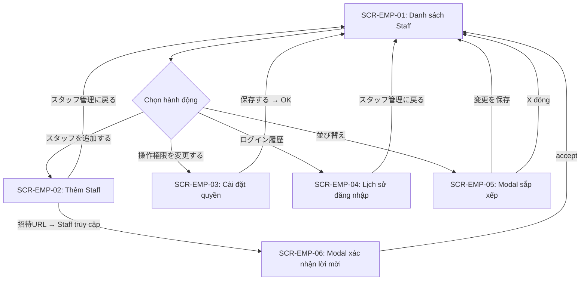
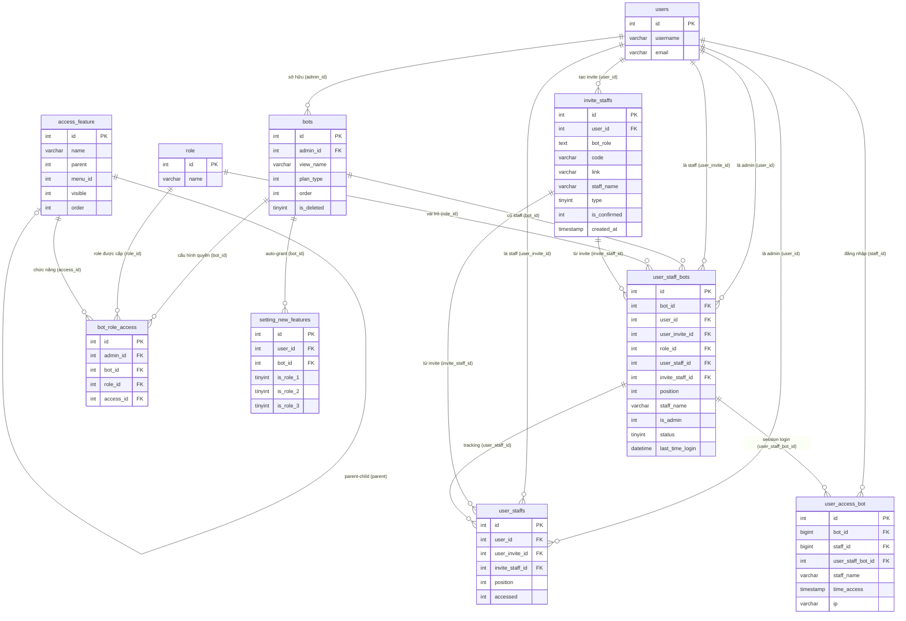

# Feature Spec — FA-035: Quản lý nhân viên (スタッフ管理)

**Mã tính năng:** FA-035  
**Portal:** Admin  
**URL gốc:** `/admin/employees-management`  
**Ngày tổng hợp:** 2026-05-07  
**Phiên bản:** 1.0  
**Trạng thái spec:** Hoàn thành (Validation: ĐẠT — không có vấn đề Nghiêm trọng)  
**Mức độ tin cậy tổng thể:** **Cao** (dựa trên source code + DB schema + UI trực tiếp)

---

## Mục lục

1. [Tổng quan](#1-tổng-quan)
2. [Các màn hình và Luồng xử lý end-to-end](#2-các-màn-hình-và-luồng-xử-lý-end-to-end)
3. [Data Model](#3-data-model)
4. [Field Traceability Matrix](#4-field-traceability-matrix)
5. [Business Rules](#5-business-rules)
6. [API Endpoints](#6-api-endpoints)
7. [Phụ thuộc chéo (Cross-references)](#7-phụ-thuộc-chéo-cross-references)
8. [Gaps và Unknowns](#8-gaps-và-unknowns)
9. [Chất lượng Spec](#9-chất-lượng-spec)

---

## 1. Tổng quan

### 1.1 Mục đích

Tính năng 「スタッフ管理」 (Quản lý nhân viên) cho phép Admin quản lý đội ngũ nhân viên (staff) trong từng tài khoản LINE OA. Đây là tính năng **Admin-only** — staff không có quyền truy cập.

Phạm vi đầy đủ:
- Xem danh sách staff đang được gán cho từng bot (tài khoản LINE OA)
- Mời staff mới bằng invite URL có thời hạn 24 giờ
- Cài đặt quyền thao tác (操作権限) per-bot cho từng loại staff
- Sắp xếp thứ tự hiển thị staff (drag-drop)
- Xem và export lịch sử đăng nhập (アクセス履歴) của staff

### 1.2 Actors

| Actor | Vai trò | Quyền |
|-------|---------|-------|
| **Admin** (主管理者) | Chủ tài khoản LINE OA | Toàn quyền: xem, thêm, xóa staff; cài quyền; xem lịch sử |
| **Staff** (副管理者 / 運用者 / サポート) | Nhân viên được Admin mời | Không truy cập được tính năng này |
| **LINE User** | — | Không liên quan trực tiếp |

### 1.3 Phạm vi tính năng

Tính năng nằm trong nhóm cài đặt Admin-level. Dữ liệu được lọc theo từng `bot_id` — mỗi bot có danh sách staff và cấu hình quyền riêng biệt.

**Hai flow song song tồn tại trong code:**

| Tiêu chí | Legacy Flow (cũ) | Invite URL Flow (hiện tại) |
|---------|-----------------|--------------------------|
| Endpoint | POST `/employees-management/add` | POST `/ajax/generate-link-invite-staff` |
| Model tạo | `User` (tài khoản mới trực tiếp) | `InviteStaff` + `UserStaffBot` (pending) |
| Staff có tài khoản chưa | Chưa cần | Phải có tài khoản LME trước |
| Xác thực | Admin nhập thông tin | Staff tự đăng nhập qua invite URL |
| Quyền per bot | Bảng `access_bot` | Bảng `user_staff_bots` |
| UI hiện tại | Không có (có thể không còn truy cập) | SCR-EMP-02 (đang dùng) |

> **Lưu ý:** Tài liệu này mô tả chủ yếu **Invite URL Flow** (flow hiện tại). Legacy flow vẫn có route nhưng không còn giao diện UI.

---

## 2. Các màn hình và Luồng xử lý end-to-end

### Sơ đồ điều hướng tổng thể



---

### SCR-EMP-01: Danh sách Staff (スタッフ管理一覧)

**URL:** `/admin/employees-management`  
**Render:** Server-side (Blade view `admin.employee.employees_management_v2`)

#### Layout và thành phần UI

| Vùng | Mô tả |
|------|-------|
| Header | Tiêu đề「スタッフ管理」+ nút「マニュアル」 |
| Toolbar | Nút「スタッフを追加する」(primary) + 「操作権限を変更する」(secondary) |
| Bộ lọc tài khoản | Nhãn「対象のアカウント」+ combobox chọn bot + nút「ログイン履歴」và「並び替え」 |
| Bảng「スタッフ一覧」 | Danh sách staff với phân trang |

**Cột bảng dữ liệu:**

| Cột (JP) | Nguồn dữ liệu | Ghi chú |
|---------|--------------|---------|
| 「スタッフ名」 | `user_staff_bots.staff_name` | Tên snapshot tại thời điểm invite; nếu `is_admin=1` → lấy từ `users.username` |
| 「エルメユーザー名」 | `users.username` | JOIN qua `user_staff_bots.user_invite_id` |
| 「操作権限」 | `user_staff_bots.role_id` → `role.name` | `role_id=0` hard-code thành「主管理者」|
| 「メールアドレス」 | `users.email` | JOIN qua `user_staff_bots.user_invite_id` |
| 「最終ログイン」 | `user_staff_bots.last_time_login` | Cập nhật khi staff `setBotInvite` |
| 「操作」 | — | Nút xóa staff (trigger EP-15). Nội dung visual chưa xác nhận đầy đủ |

#### Luồng end-to-end: Tải danh sách

```
User truy cập /admin/employees-management
    │
    ▼
EP-01 GET /admin/employees-management
    │   Server kiểm tra popup hướng dẫn (users.is_not_show_popup_staff)
    │   Lấy employees, roles, bots của admin
    │   Kiểm tra freePlan (plan_type=2 AND created_at > 2021-07-01)
    ▼
HTML view render với bot đầu tiên
    │
    ▼
EP-05 GET /admin/ajax/get-list-bot-ownership
    │   Lấy bots có quyền employeesManagement
    │   Lọc is_deleted=0, sắp xếp order ASC, id DESC
    ▼
Dropdown bot được điền
    │
    ▼
EP-06 GET /admin/ajax/get-list-staff-by-bot?bot_id=X&per_page=50&page=1
    │   JOIN user_staff_bots ↔ users ↔ role
    │   Tự động tạo UserStaffBot cho Admin nếu chưa có (BR-007)
    │   Sắp xếp position DESC, phân trang per_page
    ▼
Bảng staff hiển thị
```

#### Luồng end-to-end: Xóa Staff

```
Admin click nút xóa trong cột「操作」
    │
    ▼
EP-15 POST /admin/ajax/delete-staff-bot
    Body: { staff_bot_id, user_invite_id }
    │
    ├─ Lấy thông tin UserStaffBot
    ├─ Xóa bản ghi UserStaffBot
    ├─ Nếu user_invite_id == Auth::id() → xóa session current_bot_id
    ├─ Hủy Firebase topic (BR-011)
    └─ Ghi log BotLifeCycle type=25 (DELETE_STAFF) (BR-010)
    ▼
Response: {"status": true}
    │
    ▼
UI cập nhật danh sách (xóa dòng staff)
```

---

### SCR-EMP-02: Thêm Staff mới — Invite URL Flow (スタッフを追加する)

**URL:** `/admin/invite-staff?bot_id=...`  
**Render:** Server-side (Blade view `admin.employee.invite_staft`)

#### Layout — Form 3 bước

**Bước ①: Nhập tên staff**

| Field | Loại | Bắt buộc | DB Target |
|-------|------|---------|-----------|
| Tên staff | textbox | Có | `invite_staffs.staff_name`, `user_staff_bots.staff_name` |

**Bước ②: Chọn tài khoản và quyền**

| Thành phần | Loại | Mô tả |
|-----------|------|-------|
| 「全てを選択／解除」 | Button/Checkbox | Toggle chọn/bỏ tất cả bot |
| Checkbox per bot | Checkbox | Chọn bot muốn cấp quyền cho staff |
| Combobox quyền per bot | Select | 「副管理人」/ 「運用者」/ 「サポート」. Disabled nếu bot chưa chọn |

> **Cảnh báo free plan:** 「※ フリープラン場合、スタッフの追加はできません。」— Bot `plan_type=2` bị ẩn khỏi danh sách.

**Bước ③: Phát hành URL mời**

| Thành phần | Mô tả |
|-----------|-------|
| Thông báo thời hạn | "URLは、24時間有効で招待後は無効となります。" |
| Nút「招待用URLを発行」 | Tạo invite URL → hiển thị URL + nút copy |
| Hướng dẫn đăng ký | Hướng dẫn staff truy cập URL bằng tài khoản LME |

#### Luồng end-to-end: Phát hành Invite URL

```
Admin truy cập SCR-EMP-02
    │
    ▼
EP-02 GET /admin/invite-staff?bot_id=X
    │   checkBotHasPermission('staff-management.inviteStaff', bot_id)
    │   Nếu không có quyền → redirect adminIndex với lỗi
    ▼
EP-08 GET /admin/get-data-invite-staff
    │   Lấy danh sách bots (loại bỏ is_deleted=1 và plan_type=2)
    │   Gán selected=0, role_id=1 mặc định cho mỗi bot
    ▼
Form hiển thị với danh sách bot
    │
Admin nhập tên staff (①)
Admin chọn bot + quyền (②)
Admin click「招待用URLを発行」
    │
    ▼
EP-09 POST /admin/ajax/generate-link-invite-staff
    Body (JSON): { staff_name, bot_role: [{id, selected, role_id}] }
    │
    ├─ 1. Sinh code 8 ký tự random, unique trong invite_staffs
    ├─ 2. Lọc bot có selected=true/1/'1'/'true'
    ├─ 3. Lấy admin_id của từng bot từ bảng bots
    ├─ 4. Tạo bản ghi InviteStaff {code, bot_role (JSON), link, staff_name}
    ├─ 5. Với mỗi bot: tạo UserStaffBot status=STATUS_NO_ACTION(0)
    └─ 6. Cập nhật position admin lên maxPosition+1 (BR-008)
    ▼
Response: { success: true, link: "https://.../admin/access-link-invite-staff/AbCdEfGh" }
    │
    ▼
URL hiển thị + nút copy clipboard
Admin gửi URL cho staff
```

---

### SCR-EMP-06: Landing page và Modal xác nhận lời mời (phía Staff)

> **Ghi chú:** Màn hình này chưa được quan sát trực tiếp qua UI (xem [Gaps](#8-gaps-và-unknowns)). Thông tin dựa trên source code (EP-17, EP-18, EP-19).

#### Luồng end-to-end: Staff chấp nhận lời mời

```
Staff nhận URL từ Admin
Staff truy cập URL: /admin/access-link-invite-staff/{code}
    │
    ▼
EP-17 GET /admin/access-link-invite-staff/{code}
    │   Tìm InviteStaff theo code
    │   ├─ Không tồn tại → redirect adminIndex
    │   ├─ is_confirmed=1 → lỗi "URLは無効"
    │   ├─ user_id == currentUser (chính admin) → redirect adminIndex
    │   ├─ Hết hạn 24h → lỗi "有効期限を超えました" (BR-001)
    │   └─ Đã truy cập lần 2 → lỗi "既に操作しました" (BR-002)
    ▼
Redirect adminIndex với session: user_access_link_invite=true, code_invite=code
    │
    ▼
EP-18 GET /admin/ajax/get-detail-invite-staff-by-code?code=...
    │   Lấy InviteStaff theo code
    │   Tìm bots chưa thuộc về user hiện tại
    │   Tạo UserStaff nếu chưa có
    ▼
Modal hiển thị: thông tin invite + danh sách bots được mời
    │
Staff xác nhận (click đồng ý)
    │
    ▼
EP-19 POST /admin/ajax/accept-invite-staff
    Body (JSON): { bots: [...], code: "AbCdEfGh" }
    │
    ├─ 1. Kiểm tra InviteStaff tồn tại, chưa confirmed, chưa hết hạn 24h
    ├─ 2. Xóa session user_access_link_invite, code_invite
    ├─ 3. Với mỗi bot:
    │      ├─ Nếu đã accept → skip
    │      └─ Cập nhật UserStaffBot: status=STATUS_ACCEPT(1), user_invite_id, staff_name
    │         Ghi log BotLifeCycle type=24 (ADD_STAFF) (BR-010)
    ├─ 4. Kiểm tra không có user khác đã accept cùng invite (BR-003)
    ├─ 5. Đăng ký Firebase topic cho bots mới (BR-011)
    └─ 6. Cập nhật InviteStaff.is_confirmed=1 (BR-002)
    ▼
Response: {"success": true}
    │
    ▼
Staff trở thành thành viên chính thức của bot(s)
Xuất hiện trong SCR-EMP-01
```

---

### SCR-EMP-03: Cài đặt quyền thao tác (操作権限を変更する)

**URL:** `/admin/setting-role-access?bot_id=...`  
**Render:** Server-side (Blade view `admin.setting_role_access_v2`)

#### Layout — Bảng Matrix quyền

| Cột 1 | Cột 2 | Cột 3 | Cột 4 |
|-------|-------|-------|-------|
| Tên chức năng | 「副管理者」 | 「運用者」 | 「サポート」 |

Hàng đặc biệt:
- 「機能を全選択／全解除」 — checkbox toggle tất cả, 3 checkbox riêng
- 「新機能追加時に自動でチェックを入れる」 — auto-grant tính năng mới, 3 checkbox riêng
- (Các hàng chức năng từ `access_feature`) — mỗi chức năng 1 hàng với 3 checkbox

#### Luồng end-to-end: Cài đặt quyền

```
Admin ở SCR-EMP-01 → click「操作権限を変更する」với bot đã chọn
    │
    ▼
EP-03 GET /admin/setting-role-access?bot_id=X
    │   checkBotHasPermission('settingRoleAccess', botId)
    │   Nếu không có quyền → redirect adminIndex
    ▼
EP-10 GET /ajax/get-setting-role-access?bot_id=X
    │   Lấy danh sách bots (loại bỏ free plan tạo sau 2024-11-11)
    │   Đọc cấu trúc menu từ config('sns-line.access_feature')
    │   Với mỗi menu → lấy AccessFeature (parent=0)
    │   Với mỗi feature: lấy BotRoleAccess theo access_id+bot_id → map role_1/2/3
    │   Lấy SettingNewFeature cho bot (tạo mới nếu chưa có)
    ▼
Response JSON: { listFeature: {...}, newFeature: {...}, listBot: [...], bot_id }
    │
    ▼
Bảng quyền render với checkbox state hiện tại
    │
Admin tick/bỏ tick các checkbox
Admin click「保存する」
    │
    ▼
EP-11 POST /admin/setting-role-access/edit
    Body (Form): { bot_id, access1[access_id]=1, access2[access_id]=1, access3[access_id]=1 }
    │   Key=0 trong mỗi access array = toggle toàn bộ (không phải access_id)
    │
    ├─ 1. Kiểm tra bot_id thuộc về admin hiện tại
    ├─ 2. Cập nhật SettingNewFeature (is_role_1/2/3 từ key=0)
    ├─ 3. XÓA TOÀN BỘ BotRoleAccess cũ của bot (xóa rồi insert lại — BR-009)
    └─ 4. Batch insert BotRoleAccess mới theo từng role
    ▼
Response: {"status": true}
    │
    ▼
UI hiển thị thông báo thành công → redirect SCR-EMP-01
```

---

### SCR-EMP-04: Lịch sử đăng nhập (アクセス履歴)

**URL:** `/admin/access-histories?bot_id=...`  
**Render:** Server-side (Blade view `admin.employee.access_histories`)

#### Layout

| Vùng | Thành phần |
|------|-----------|
| Toolbar | 「絞り込み」(side panel) + 「CSV」(export) |
| Bộ lọc thời gian | 「今月」+ datepicker range + 「表示」 |
| Bộ lọc keyword | Textbox「スタッフ名・IPアドレスを入力」+ 「検索」 |
| Thông tin lọc | Text "選択中期間: …" + link「クリア」 |
| Bảng dữ liệu | 3 cột: 「アクセス日時」 / 「スタッフ名」 / 「IPアドレス」 |

**Side panel lọc nâng cao:**
- Datepicker range
- Checkbox list staff cụ thể
- Nút「絞り込み検索」

#### Luồng end-to-end: Xem và lọc lịch sử

```
Admin ở SCR-EMP-01 → click「ログイン履歴」với bot đã chọn
    │
    ▼
EP-04 GET /admin/access-histories?bot_id=X
    │   Lấy danh sách bots để điền dropdown
    ▼
EP-12 GET /admin/get-access-histories
    Params: { bot_id, start_time, end_time, keyword, staffs[], now, limit, page }
    │
    │   JOIN user_access_bot ↔ user_staff_bots (chỉ lấy record có user_staff_bots.id NOT NULL)
    │   Áp dụng filter theo from/to, keyword (LIKE trên staff_name, ip, users.username)
    │   Nếu is_admin=1 → lấy tên thật từ bảng users
    │   Sắp xếp id DESC, phân trang limit (default 100)
    ▼
Response JSON: { success: true, data: { data: [...], current_page, per_page, total } }
    │
    ▼
Bảng lịch sử hiển thị (time_access format Y/m/d H:i)
```

#### Luồng end-to-end: Export CSV

```
Admin click nút「CSV」
    │
    ▼
EP-13 GET /admin/export-csv-access-history
    Params: tương tự EP-12 (dùng now_export thay now)
    │
    │   Cùng query logic EP-12 nhưng KHÔNG phân trang (lấy toàn bộ)
    │   Tạo file CSV tại public/msg_template/access-histories-bot/{timestamp}.csv
    │   Header CSV: アクセス日時 / スタッフ名 / IPアドレス
    │   Encode sang Shift-JIS (mb_convert_encoding)
    ▼
Response: { status: true, file: "msg_template/access-histories-bot/xxx.csv" }
    │
    ▼
Browser download file CSV
```

> **Lưu ý kỹ thuật:** Khi ghi lịch sử truy cập, nếu session `is_login_from_admin` đang active (system admin impersonation) → KHÔNG tạo bản ghi `UserAccessBot` (BR-013).

---

### SCR-EMP-05: Modal sắp xếp thứ tự Staff (並べ替え)

**Trigger:** Click「並び替え」trên SCR-EMP-01  
**Loại:** Dialog modal

#### Layout

| Thành phần | Mô tả |
|-----------|-------|
| Header | Tiêu đề「並べ替え」+ nút X đóng |
| Danh sách staff | Drag-drop sortable list (icon handle + tên staff) |
| Footer | Nút「変更を保存」 |

#### Luồng end-to-end: Sắp xếp thứ tự

```
Admin click「並び替え」
    │
    ▼
EP-07 GET /admin/ajax/get-list-staff-all-by-bot?bot_id=X
    │   Lọc user_staff_bots: bot_id=X AND status=1 (STATUS_ACCEPT)
    │   Sắp xếp position DESC
    ▼
Modal mở với danh sách staff theo thứ tự hiện tại
    │
Admin kéo thả để sắp xếp lại
Admin click「変更を保存」
    │
    ▼
EP-14 POST /admin/ajax/save-sort-staff
    Body (Form): { ids: "id1,id2,id3,...", bot_id }
    │
    │   Parse ids thành array
    │   UPDATE position theo thứ tự đảo ngược (phần tử đầu = position = total)
    │   Admin (is_admin=1) luôn = count(ids)+1 (cao nhất) (BR-008)
    ▼
Response: {"status": true}
    │
    ▼
Modal đóng, danh sách SCR-EMP-01 cập nhật thứ tự mới
```

---

## 3. Data Model

### 3.1 Entities chính

| Entity | Bảng DB | Vai trò |
|--------|---------|---------|
| **UserStaffBot** | `user_staff_bots` | **Bảng trung tâm** — quan hệ nhiều-nhiều Staff ↔ Bot với role per-bot |
| **InviteStaff** | `invite_staffs` | Invite URL — lifecycle từ tạo đến chấp nhận |
| **UserStaff** | `user_staffs` | Tracking quan hệ Admin ↔ Staff (không phân theo bot) |
| **UserAccessBot** | `user_access_bot` | Lịch sử đăng nhập của staff vào bot context |
| **BotRoleAccess** | `bot_role_access` | Cấu hình quyền thao tác: role × chức năng × bot |
| **AccessFeature** | `access_feature` | Danh mục chức năng có thể phân quyền (cấu trúc cây) |
| **SettingNewFeature** | `setting_new_features` | Cài đặt tự động cấp quyền tính năng mới cho role |
| **Role** | `role` | Danh sách loại quyền (id=1,2,3) |

### 3.2 Schema các bảng chính

**Bảng `user_staff_bots` (trung tâm):**

| Cột | Kiểu | Mô tả |
|-----|------|-------|
| `id` | int UNSIGNED PK | Primary key |
| `bot_id` | int UNSIGNED FK | Bot thuộc về → `bots.id` |
| `user_id` | int UNSIGNED FK | Admin owner → `users.id` |
| `user_invite_id` | int UNSIGNED FK | Staff được mời → `users.id`. NULL khi chưa accept |
| `role_id` | int UNSIGNED FK | 0=admin owner, 1=副管理人, 2=運用者, 3=サポート |
| `user_staff_id` | int FK | FK → `user_staffs.id` |
| `invite_staff_id` | int FK | FK → `invite_staffs.id` |
| `staff_name` | varchar(255) | Tên snapshot tại thời điểm invite |
| `is_admin` | int | 1=Admin owner, 0=Staff được mời |
| `position` | int | Thứ tự hiển thị — sắp xếp `DESC` (cao hơn = hiện trước) |
| `status` | tinyint | 0=NO_ACTION, 1=ACCEPT, 2=REJECT |
| `last_time_login` | datetime | Thời điểm chọn bot context lần cuối |

**Bảng `invite_staffs`:**

| Cột | Kiểu | Mô tả |
|-----|------|-------|
| `id` | int UNSIGNED PK | Primary key |
| `user_id` | int FK | Admin tạo invite → `users.id` |
| `code` | varchar(20) UNIQUE | Mã 8 ký tự random |
| `bot_role` | text | JSON array `[{bot_id, role_id}]` — lưu dạng string |
| `link` | varchar(255) | Full URL invite |
| `staff_name` | varchar(255) | Tên staff đặt khi tạo |
| `type` | tinyint | 1=invite staff, 2=change bot owner |
| `is_confirmed` | int | NULL/0=chưa dùng, 1=đã dùng (single-use) |
| `created_at` | timestamp | Dùng để tính hết hạn 24h |

**Bảng `user_access_bot`:**

| Cột | Kiểu | Mô tả |
|-----|------|-------|
| `id` | int UNSIGNED PK | Primary key |
| `bot_id` | bigint FK | Bot được truy cập |
| `staff_id` | bigint FK | User đăng nhập → `users.id` |
| `staff_name` | varchar(255) | Tên tại thời điểm đăng nhập (snapshot) |
| `time_access` | timestamp | Thời điểm đăng nhập. Accessor: format `Y/m/d H:i` |
| `ip` | varchar(255) | Địa chỉ IP (IPv4 hoặc IPv6) |
| `user_staff_bot_id` | int FK | FK → `user_staff_bots.id` |

**Bảng `bot_role_access`:**

| Cột | Kiểu | Mô tả |
|-----|------|-------|
| `id` | int UNSIGNED PK | Primary key |
| `admin_id` | int FK | Admin owner → `users.id` |
| `bot_id` | int FK | Bot áp dụng → `bots.id` |
| `role_id` | int FK | 1=副管理人, 2=運用者, 3=サポート |
| `access_id` | int FK | Chức năng → `access_feature.id` |

### 3.3 ER Diagram



### 3.4 Enum / Status Values

**`user_staff_bots.status`:**

| Giá trị | Hằng số PHP | Ý nghĩa |
|---------|------------|---------|
| `0` | `STATUS_NO_ACTION` | Invite đã tạo, staff chưa accept — ẩn khỏi UI |
| `1` | `STATUS_ACCEPT` | Staff đang hoạt động — hiển thị trong danh sách |
| `2` | `STATUS_REJECT` | Đã từ chối — ẩn khỏi UI |

**`user_staff_bots.role_id` (kết hợp `is_admin`):**

| role_id | is_admin | Hiển thị UI | Mô tả |
|---------|---------|------------|-------|
| `0` | `1` | 「主管理者」 | Admin owner — hard-coded, không có trong bảng `role` |
| `1` | `0` | 「副管理人」 | Sub-admin |
| `2` | `0` | 「運用者」 | Operator |
| `3` | `0` | 「サポート」 | Support |

> **Lưu ý chính tả:** Bảng `role` lưu「副管理**人**」(nin), UI spec hiển thị「副管理**者**」(sha). Sự khác biệt 1 ký tự này cần xác nhận bằng Blade template thực tế (xem VM-001 trong Gaps).

**`invite_staffs.is_confirmed`:**

| Giá trị | Ý nghĩa |
|---------|---------|
| `NULL` hoặc `0` | URL còn hợp lệ |
| `1` | URL đã được dùng — vô hiệu hóa |

**`bots.plan_type` (ảnh hưởng đến staff management):**

| Giá trị | Ý nghĩa | Ảnh hưởng |
|---------|---------|-----------|
| `1` | Standard plan | Cho phép thêm staff |
| `2` | Free plan | Không thể thêm staff (ẩn khỏi form invite) |

---

## 4. Field Traceability Matrix

### SCR-EMP-01: Danh sách Staff

| # | UI Element | Màn hình | DB Table.Column | Hướng | Validation | Business Rule |
|---|-----------|----------|----------------|-------|-----------|--------------|
| 1 | Cột「スタッフ名」 | SCR-EMP-01 | `user_staff_bots.staff_name` | Read | — | Nếu is_admin=1 → lấy `users.username` |
| 2 | Cột「エルメユーザー名」 | SCR-EMP-01 | `users.username` | Read | — | JOIN qua `user_staff_bots.user_invite_id` |
| 3 | Cột「操作権限」 | SCR-EMP-01 | `user_staff_bots.role_id` → `role.name` | Read | — | role_id=0 hard-code thành「主管理者」 |
| 4 | Cột「メールアドレス」 | SCR-EMP-01 | `users.email` | Read | — | JOIN qua `user_staff_bots.user_invite_id` |
| 5 | Cột「最終ログイン」 | SCR-EMP-01 | `user_staff_bots.last_time_login` | Read | — | Format YYYY/MM/DD HH:mm; NULL = chưa từng login |
| 6 | Dropdown chọn bot | SCR-EMP-01 | `bots.id`, `bots.view_name` | Read | — | Lọc is_deleted=0, sắp xếp order ASC |
| 7 | Badge「フリープラン」 | SCR-EMP-01 | `bots.plan_type`, `bots.created_at` | Computed | — | plan_type=2 AND created_at > 2021-07-01 |

### SCR-EMP-02: Thêm Staff

| # | UI Element | Màn hình | DB Table.Column | Hướng | Validation | Business Rule |
|---|-----------|----------|----------------|-------|-----------|--------------|
| 8 | Input tên staff | SCR-EMP-02 | `invite_staffs.staff_name`, `user_staff_bots.staff_name` | Write | Bắt buộc | Snapshot tên tại thời điểm invite |
| 9 | Checkbox chọn bot | SCR-EMP-02 | `invite_staffs.bot_role` (JSON) | Write | Phải chọn ít nhất 1 | Serialize `{bot_id, role_id}` → JSON |
| 10 | Combobox quyền per bot | SCR-EMP-02 | `user_staff_bots.role_id` | Write | Default role_id=1 | Disabled khi bot chưa chọn; không áp dụng cho free plan |
| 11 | URL mời được tạo | SCR-EMP-02 | `invite_staffs.link`, `invite_staffs.code` | Read | — | code = 8 ký tự random unique |
| 12 | Thời hạn URL (text) | SCR-EMP-02 | `invite_staffs.created_at` | Computed | — | Hết hạn sau 24h (BR-001) |

### SCR-EMP-03: Cài đặt quyền

| # | UI Element | Màn hình | DB Table.Column | Hướng | Validation | Business Rule |
|---|-----------|----------|----------------|-------|-----------|--------------|
| 13 | Dropdown chọn bot | SCR-EMP-03 | `bots.id`, `bots.view_name` | Read | — | Loại bỏ free plan tạo sau 2024-11-11 |
| 14 | Tên nhóm chức năng | SCR-EMP-03 | `access_feature.menu_id` → config | Computed | — | Map menu_id với config `sns-line.access_feature` |
| 15 | Tên chức năng | SCR-EMP-03 | `access_feature.name`, `access_feature.id` | Read | — | Chỉ visible=1 và parent=0 |
| 16 | Checkbox「副管理者」 | SCR-EMP-03 | `bot_role_access` (EXISTS role_id=1, access_id) | Read/Write | — | Xóa toàn bộ cũ rồi insert batch mới (BR-009) |
| 17 | Checkbox「運用者」 | SCR-EMP-03 | `bot_role_access` (EXISTS role_id=2, access_id) | Read/Write | — | Tương tự role 1 |
| 18 | Checkbox「サポート」 | SCR-EMP-03 | `bot_role_access` (EXISTS role_id=3, access_id) | Read/Write | — | Tương tự role 1 |
| 19 | Toggle「新機能追加時」(副管理者) | SCR-EMP-03 | `setting_new_features.is_role_1` | Read/Write | — | tinyint 0/1 |
| 20 | Toggle「新機能追加時」(運用者) | SCR-EMP-03 | `setting_new_features.is_role_2` | Read/Write | — | tinyint 0/1 |
| 21 | Toggle「新機能追加時」(サポート) | SCR-EMP-03 | `setting_new_features.is_role_3` | Read/Write | — | tinyint 0/1 |

### SCR-EMP-04: Lịch sử đăng nhập

| # | UI Element | Màn hình | DB Table.Column | Hướng | Validation | Business Rule |
|---|-----------|----------|----------------|-------|-----------|--------------|
| 22 | Cột「アクセス日時」 | SCR-EMP-04 | `user_access_bot.time_access` | Read | — | Accessor PHP format Y/m/d H:i |
| 23 | Cột「スタッフ名」 | SCR-EMP-04 | `user_access_bot.staff_name` | Read | — | Nếu is_admin=1 → lấy tên thật từ `users` |
| 24 | Cột「IPアドレス」 | SCR-EMP-04 | `user_access_bot.ip` | Read | — | VARCHAR(255) — IPv4 và IPv6 |
| 25 | Datepicker range | SCR-EMP-04 | `user_access_bot.time_access` | Filter | Format YYYY-MM-DD | WHERE time_access >= start AND <= end 23:59:59 |
| 26 | Input keyword | SCR-EMP-04 | `user_access_bot.staff_name`, `user_access_bot.ip`, `users.username` | Filter | — | OR LIKE search trên nhiều cột |
| 27 | Checkbox staff (side panel) | SCR-EMP-04 | `user_access_bot.user_staff_bot_id` | Filter | — | WHERE user_staff_bots.id IN (...) |

### SCR-EMP-05: Sắp xếp thứ tự

| # | UI Element | Màn hình | DB Table.Column | Hướng | Validation | Business Rule |
|---|-----------|----------|----------------|-------|-----------|--------------|
| 28 | Danh sách drag-drop | SCR-EMP-05 | `user_staff_bots.id`, `user_staff_bots.staff_name`, `position` | Read/Write | — | Sắp xếp position DESC hiện tại |
| 29 | Thứ tự sau drag | SCR-EMP-05 | `user_staff_bots.position` | Write | — | Phần tử đầu = position cao nhất; Admin luôn = count+1 (BR-008) |

---

## 5. Business Rules

### BR-001: Invite URL hết hạn sau 24 giờ
**Mức độ tin cậy:** Cao | **Source:** `StaffManagementController.php:213`

Invite URL chỉ hợp lệ trong 86.400 giây (24 giờ) tính từ `invite_staffs.created_at`.

```
if (strtotime(created_at) + 86400 < time()) → lỗi "有効期限を超えました"
```

Nếu hết hạn → staff thấy thông báo: 「有効期限を超えました。再度招待をしてもらってください。」

---

### BR-002: Invite URL chỉ dùng được 1 lần (single-use)
**Mức độ tin cậy:** Cao | **Source:** `StaffManagementController.php:508`

Sau khi staff accept:
- `invite_staffs.is_confirmed` được set thành `1`
- Mọi truy cập tiếp theo → lỗi: 「招待されたURLはすでに無効となっています」
- `user_staffs.accessed = 1` cũng ngăn người đã truy cập link lần 2

---

### BR-003: Một invite URL chỉ được chấp nhận bởi đúng một người
**Mức độ tin cậy:** Cao | **Source:** `StaffManagementController.php:472-488`

Khi staff A đang accept, hệ thống kiểm tra:
```
UserStaffBot WHERE user_invite_id != currentUser AND invite_staff_id = X EXISTS
```
Nếu người khác đã accept cùng invite → xóa bản ghi vừa tạo và trả lỗi.

---

### BR-004: Chỉ Admin mới truy cập được tính năng quản lý staff
**Mức độ tin cậy:** Cao | **Source:** `StaffManagementController.php:40-43`

```
checkBotHasPermission('staff-management.inviteStaff', bot_id) = false → redirect adminIndex
```

Staff (role > 0) không có quyền truy cập các trang quản lý staff.

---

### BR-005: Free plan không thể thêm staff
**Mức độ tin cậy:** Trung bình | **Source:** `StaffManagementController.php:85-87`

- Bot `plan_type = 2` bị **loại bỏ** khỏi form invite (không hiển thị)
- Bots free tạo **trước** `2021-07-01` là ngoại lệ — vẫn cho phép staff (legacy)
- UI hiển thị cảnh báo: 「※ フリープラン場合、スタッフの追加はできません。」

---

### BR-006: Standard plan giới hạn 10 staff per bot
**Mức độ tin cậy:** Cao | **Source:** `UserController.php:3428-3438`

Áp dụng cho legacy flow (`addEmployee`):
- Bot có `flag_contract_new = 1` AND `contract_type = 'standard'`
- Đếm `access_bot WHERE bot_id = X`, nếu >= 10 → lỗi: 「スタンダードプランの上限に達しています。プロプランへの変更が必要...」

> **Lưu ý:** Giới hạn này áp dụng qua `access_bot` (legacy). Chưa xác nhận có áp dụng cho invite URL flow qua `user_staff_bots` hay không.

---

### BR-007: Admin tự động được tạo bản ghi UserStaffBot
**Mức độ tin cậy:** Cao | **Source:** `StaffManagementController.php:527-546`

Khi `getStaffByBot` được gọi, nếu admin chưa có bản ghi `UserStaffBot` cho bot đó:
```
UserStaffBot.create({bot_id, user_id, is_admin=1, role_id=0, status=1})
```
Đảm bảo admin luôn xuất hiện trong danh sách staff với quyền「主管理者」.

---

### BR-008: Admin luôn có position cao nhất trong danh sách
**Mức độ tin cậy:** Cao | **Source:** `StaffManagementController.php:173-181`

- Khi thêm staff mới (EP-09): `admin.position = maxPosition + 1`
- Khi sort (EP-14): `admin.position = count(ids) + 1`
- Danh sách sắp xếp `position DESC` → admin xuất hiện ở vị trí cuối trong mảng (hoặc đầu tùy UI rendering)

---

### BR-009: Cấu hình quyền theo từng bot, xóa-insert khi lưu
**Mức độ tin cậy:** Cao | **Source:** `UserController.php:3817-3866`

- Mỗi bot có `bot_role_access` độc lập
- Khi lưu (EP-11): xóa toàn bộ `bot_role_access WHERE bot_id = X` → batch insert mới
- **Không có transaction** bao bọc batch insert (rủi ro nếu insert bị lỗi giữa chừng)

---

### BR-010: Ghi log BotLifeCycle khi thêm/xóa staff
**Mức độ tin cậy:** Cao | **Source:** `StaffManagementController.php:411-422, 676-689`

| Sự kiện | Log type | Dữ liệu ghi log |
|--------|---------|----------------|
| Staff accept invite | `24` (ADD_STAFF) | `staff_id`, `staff_name`, `staff_email` |
| Admin xóa staff | `25` (DELETE_STAFF) | `staff_id`, `staff_name`, `staff_email` |

---

### BR-011: Firebase notification khi thêm/xóa staff
**Mức độ tin cậy:** Cao | **Source:** `StaffManagementController.php:663-668`

- Khi staff accept → đăng ký Firebase topic cho bots mới (`FirebaseService.subscribeTopic`)
- Khi xóa staff → hủy đăng ký cho tất cả thiết bị của staff (`FirebaseService.unSubscribeTopic`)
- Token lấy từ `user_firebase_tokens.firebase_token` theo `user_id`

---

### BR-012: Cập nhật `last_time_login` khi chọn bot context
**Mức độ tin cậy:** Cao | **Source:** `StaffManagementController.php:977-984`

Mỗi khi `setBotInvite` được gọi (staff chọn bot để làm việc):
```
UserStaffBot.update({last_time_login: now()}) WHERE bot_id = X AND user_invite_id = currentUser
```
Giá trị này hiển thị trong cột「最終ログイン」.

---

### BR-013: Không ghi access history khi đăng nhập từ admin panel
**Mức độ tin cậy:** Cao | **Source:** `StaffManagementController.php:985-994`

```
if (!session('is_login_from_admin')) { UserAccessBot.create({...}) }
```
System Admin impersonating Admin → không tạo bản ghi `UserAccessBot`.

---

## 6. API Endpoints

### 6.1 Tổng hợp

| EP | Method | URL | Controller@Action | Màn hình | Loại |
|----|--------|-----|------------------|----------|------|
| EP-01 | GET | `/admin/employees-management` | `UserController@employeesManagement` | SCR-EMP-01 | Render |
| EP-02 | GET | `/admin/invite-staff` | `StaffManagementController@inviteStaff` | SCR-EMP-02 | Render |
| EP-03 | GET | `/admin/setting-role-access` | `UserController@settingRoleAccess` | SCR-EMP-03 | Render |
| EP-04 | GET | `/admin/access-histories` | `UserController@accessHistories` | SCR-EMP-04 | Render |
| EP-05 | GET | `/admin/ajax/get-list-bot-ownership` | `StaffManagementController@getListBotOwnership` | SCR-EMP-01 | AJAX |
| EP-06 | GET | `/admin/ajax/get-list-staff-by-bot` | `StaffManagementController@getStaffByBot` | SCR-EMP-01 | AJAX |
| EP-07 | GET | `/admin/ajax/get-list-staff-all-by-bot` | `StaffManagementController@getStaffAllByBot` | SCR-EMP-05 | AJAX |
| EP-08 | GET | `/admin/get-data-invite-staff` | `StaffManagementController@getDataInviteStaff` | SCR-EMP-02 | AJAX |
| EP-09 | POST | `/admin/ajax/generate-link-invite-staff` | `StaffManagementController@generateLinkInviteStaff` | SCR-EMP-02 | AJAX |
| EP-10 | GET | `/ajax/get-setting-role-access` | `UserController@getSettingRoleAccess` | SCR-EMP-03 | AJAX |
| EP-11 | POST | `/admin/setting-role-access/edit` | `UserController@addSettingRoleAccess` | SCR-EMP-03 | Form |
| EP-12 | GET | `/admin/get-access-histories` | `UserController@getAccessHistories` | SCR-EMP-04 | AJAX |
| EP-13 | GET | `/admin/export-csv-access-history` | `UserController@exportCsvAccessHistory` | SCR-EMP-04 | Export |
| EP-14 | POST | `/admin/ajax/save-sort-staff` | `StaffManagementController@saveSortStaff` | SCR-EMP-05 | AJAX |
| EP-15 | POST | `/admin/ajax/delete-staff-bot` | `StaffManagementController@deleteStaffBot` | SCR-EMP-01 | AJAX |
| EP-16 | POST | `/admin/ajax/edit-list-bot-of-staff` | `StaffManagementController@editListBotOfStaff` | SCR-EMP-02 | AJAX |
| EP-17 | GET | `/admin/access-link-invite-staff/{code}` | `StaffManagementController@userAccessLinkInviteStaff` | SCR-EMP-06 | Redirect |
| EP-18 | GET | `/admin/ajax/get-detail-invite-staff-by-code` | `StaffManagementController@getDetailInviteStaffByCode` | SCR-EMP-06 | AJAX |
| EP-19 | POST | `/admin/ajax/accept-invite-staff` | `StaffManagementController@acceptInviteStaff` | SCR-EMP-06 | AJAX |
| EP-20 | POST | `/ajax/employees-management/get-list-bot-access` | `UserController@getListBotAccess` | SCR-EMP-02 | AJAX |
| EP-21 | POST | `/admin/employees-management/add` | `UserController@addEmployee` | (Legacy) | Form |
| EP-22 | POST | `/admin/employees-management/delete/{id}` | `UserController@deleteEmployee` | (Legacy) | Form |

**Middleware chung cho tất cả endpoints:** `admin_access`, `https_protocol`, `check_remember_token`  
(Trừ EP-10 và EP-20 thuộc ajax group với middleware khác nhau)

### 6.2 Endpoints quan trọng — Chi tiết

#### EP-09: Phát hành Invite URL

```
POST /admin/ajax/generate-link-invite-staff
Content-Type: application/json

{
  "staff_name": "田中太郎",
  "bot_role": "[{\"id\":46607,\"selected\":true,\"role_id\":1}]"
}

→ Response 200:
{
  "success": true,
  "link": "https://lme.jp/admin/access-link-invite-staff/AbCdEfGh"
}

→ Response (lỗi):
{
  "success": false,
  "error_message": "..."
}
```

#### EP-11: Lưu cài đặt quyền

```
POST /admin/setting-role-access/edit
Content-Type: application/x-www-form-urlencoded

bot_id=46607
&access1[42]=1&access1[121]=1   (副管理者 có quyền access_id 42, 121)
&access2[42]=1                   (運用者 có quyền access_id 42)
&access3[0]=1                    (key=0 = toggle toàn bộ cho サポート)

→ Response 200: {"status": true}
→ Response 500: lỗi server
```

#### EP-12: Lịch sử đăng nhập

```
GET /admin/get-access-histories
    ?bot_id=46607
    &start_time=2026-05-01
    &end_time=2026-05-31
    &keyword=
    &now=          (có giá trị → lọc chỉ ngày hôm nay)
    &staffs[]=123  (lọc theo user_staff_bots.id cụ thể)
    &limit=100
    &page=1

→ Response:
{
  "success": true,
  "data": {
    "data": [{
      "id": 1,
      "bot_id": 46607,
      "staff_name": "テスト：ゴー・トゥイ・ガン",
      "time_access": "2026/05/01 10:00",
      "ip": "192.168.1.1"
    }],
    "current_page": 1,
    "per_page": 100,
    "total": 0
  }
}
```

#### EP-19: Staff chấp nhận lời mời

```
POST /admin/ajax/accept-invite-staff
Content-Type: application/json

{
  "bots": [46607, 12345],
  "code": "AbCdEfGh"
}

→ Response 200 (thành công):
{"success": true}

→ Response 200 (lỗi nghiệp vụ):
{"success": false, "error_message": "招待されたURLはすでに無効となっています。..."}
```

---

## 7. Phụ thuộc chéo (Cross-references)

### Shared Components phát hiện

| Component | Phát hiện tại | Tương tự với | Ghi chú |
|-----------|-------------|-------------|---------|
| **Drag-drop Sortable List** (「並べ替え」) | SCR-EMP-05 (modal sắp xếp staff) | FA-041 (対応ステータス) | Pattern 「並べ替え」được confirm là shared component |

> **Xem thêm:** `features/shared/pending-refs.md` — có thể cần thêm entry cho Drag-drop Sortable List nếu chưa có.

### Tính năng liên quan

| Tính năng | Liên kết | Mô tả |
|-----------|---------|-------|
| Quản lý Bot | `bots` table | Bot là đơn vị phân quyền cho staff |
| Firebase Push Notification | `user_firebase_tokens` | Subscribe/unsubscribe khi thêm/xóa staff |
| BotLifeCycle Log | `bot_life_cycles` | Log ADD_STAFF / DELETE_STAFF (type 24/25) |
| System Admin | `is_login_from_admin` session | Không ghi access history khi SA impersonate |

---

## 8. Gaps và Unknowns

Dựa trên validation report — không có vấn đề Nghiêm trọng. Các vấn đề cần theo dõi:

### VM-001: Sự khác biệt chính tả「副管理者」vs「副管理人」
**Mức độ:** Trung bình  
**Mô tả:** UI spec dùng「副管理**者**」, bảng `role` trong DB lưu「副管理**人**」(khác 1 ký tự). Nếu UI render từ `role.name`, text thực tế sẽ là「副管理人」.  
**Hành động đề xuất:** Kiểm tra Blade template view hoặc chạy UI thực tế để xác nhận text hiển thị chính xác.

---

### VM-002: `SettingNewFeature` — mức tin cậy chưa cập nhật trong Logic Spec
**Mức độ:** Trung bình  
**Mô tả:** Logic spec ghi mức "Trung bình" cho `SettingNewFeature.table`, nhưng DB mapping đã xác nhận tên bảng là `setting_new_features` (Cao).  
**Hành động đề xuất:** Cập nhật `logic-spec.md` mục 2.8 → mức tin cậy thành **Cao**.

---

### VN-001: Danh sách đầy đủ các chức năng trong bảng quyền (SCR-EMP-03)
**Mức độ:** Nhẹ  
**Mô tả:** Bảng quyền SCR-EMP-03 hiển thị toàn bộ chức năng từ `access_feature` (visible=1), nhưng snapshot bị truncate — chưa có danh sách đầy đủ trong spec.  
**Hành động đề xuất:** Đọc `db/data/tables/access_feature.sql` để lấy danh sách đầy đủ.

---

### VN-002: Logic tham số `now` trong EP-12
**Mức độ:** Nhẹ  
**Mô tả:** Parameter `now` trong `GET /admin/get-access-histories` khi có giá trị → lọc chỉ ngày hôm nay, nhưng cơ chế chính xác chưa xác nhận từ source code. Khác với `now_export` trong EP-13.  
**Hành động đề xuất:** Đọc `UserController@getAccessHistories` source code để xác nhận logic xử lý `now`.

---

### VN-003: Cột「操作」trong SCR-EMP-01 — visual chưa rõ
**Mức độ:** Nhẹ  
**Mô tả:** Cột「操作」trong bảng staff hiển thị trống trong snapshot. API spec đã xác nhận có EP-15 (xóa staff), nhưng UI visual (icon? dropdown? button text?) chưa mô tả được.  
**Hành động đề xuất:** Điều hướng UI với account có nhiều staff để load đầy đủ cột「操作」, chụp lại screenshot.

---

### VN-004: Modal xác nhận lời mời (SCR-EMP-06) — chưa có màn hình riêng trong UI spec
**Mức độ:** Nhẹ  
**Mô tả:** EP-17, EP-18, EP-19 (landing page + modal xác nhận phía Staff) đã có đầy đủ trong API spec nhưng UI spec không có SCR-EMP-06. Flow phía Staff chỉ mô tả qua source code analysis.  
**Hành động đề xuất:** Thêm SCR-EMP-06 vào `ui-spec.md` dựa trên response của EP-18 (danh sách bots, thông tin invite).

---

### Rủi ro kỹ thuật (từ Logic Spec)

| # | Vấn đề | Mức độ | Ghi chú |
|---|--------|--------|---------|
| 1 | `deleteEmployee` (legacy) xóa hẳn user khỏi DB | Cao | `DB::table('users')->delete()` — không soft-delete |
| 2 | `addSettingRoleAccess` xóa toàn bộ rồi insert mới không có transaction | Trung bình | Race condition nếu insert bị lỗi giữa chừng |
| 3 | `acceptInviteStaff` kiểm tra "user khác đã accept" sau khi đã insert | Trung bình | Race condition nhỏ khi 2 người cùng click cùng lúc |
| 4 | CSV export encode Shift-JIS hardcode | Thấp | Không flexible nếu cần UTF-8 CSV |

---

## 9. Chất lượng Spec

### Coverage Metrics

| Spec thành phần | Items | Documented | Coverage |
|----------------|-------|-----------|---------|
| Màn hình (SCR) | 6 (EMP-01~05 + modal invite) | 5 đầy đủ + 1 qua source code | 83% |
| API Endpoints | 22 | 22 | **100%** |
| Controllers | 2 | 2 | **100%** |
| Models / Entities | 8 | 8 | **100%** |
| Business Rules | 13 | 13 | **100%** |
| DB Tables (Primary) | 8 | 8 | **100%** |
| DB Tables (Secondary) | 5 | 5 | **100%** |
| Enum/Status definitions | 7 | 7 | **100%** |
| UI ↔ DB Mappings | 29 fields across 5 screens | 29 | **100%** |
| ER Diagram | 1 | 1 | **100%** |

### Confidence Distribution

| Mức độ | Số items | Tỷ lệ |
|--------|---------|-------|
| **Cao** | ~95% items | DB schema xác nhận trực tiếp, source code đọc được, UI trực tiếp |
| **Trung bình** | ~5% items | BR-005 (free plan cutoff date), VN-002 (param `now` logic) |
| **Thấp** | 0 | Không có |

### Validation Result

**Kết quả tổng thể: ĐẠT**
- Không có vấn đề Nghiêm trọng
- 2 vấn đề Trung bình (VM-001, VM-002) — không block
- 4 vấn đề Nhẹ (VN-001 đến VN-004) — có thể cải thiện sau

### Open Questions

1. Text hiển thị thực tế trong UI:「副管理者」hay「副管理人」? (VM-001)
2. Logic đầy đủ của param `now` trong EP-12? (VN-002)
3. Giới hạn 10 staff (BR-006) có áp dụng cho invite URL flow không?
4. Danh sách đầy đủ các chức năng trong `access_feature` visible=1 là gì? (VN-001)

---

*Tài liệu được tổng hợp bởi agent spec-compiler — FA-035 Quản lý nhân viên (スタッフ管理)*  
*Ngày: 2026-05-07*  
*Nguồn: ui-spec.md + api-spec.md + logic-spec.md + db-mapping.md + validation-report.md*
