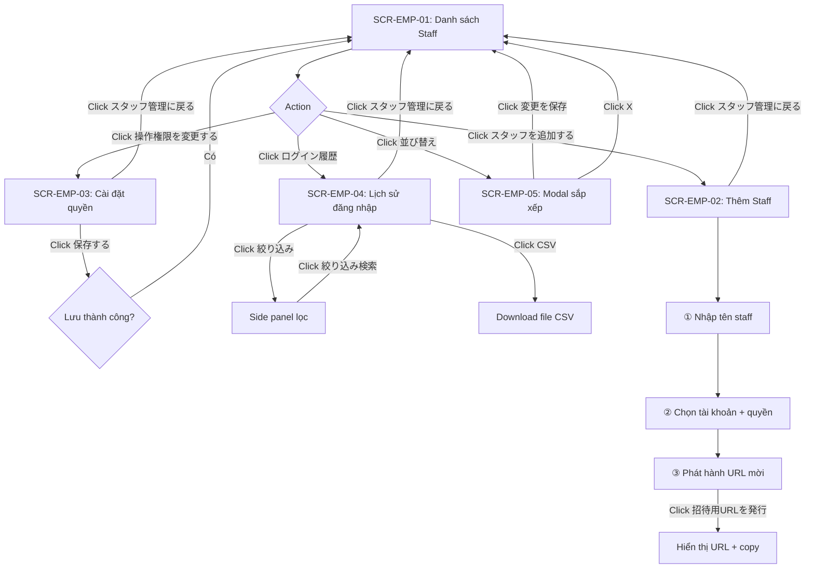

# UI Spec — FA-035: Quản lý nhân viên (スタッフ管理)

**Mã tính năng:** FA-035  
**Portal:** Admin  
**URL gốc:** `/admin/employees-management`  
**Ngày phân tích:** 2026-05-07  
**Mức độ tin cậy tổng thể:** Cao (dựa trên accessibility tree + screenshots trực tiếp)

---

## 1. Tổng quan tính năng

Tính năng 「スタッフ管理」 (Quản lý nhân viên) cho phép Admin quản lý nhân viên (staff) trong từng tài khoản LINE OA. Admin có thể:

- Xem danh sách staff đang được gán cho từng tài khoản (bot)
- Thêm staff mới bằng cách phát hành URL mời (invite URL)
- Cài đặt quyền thao tác (操作権限) cho từng loại staff theo từng tài khoản
- Sắp xếp thứ tự hiển thị staff
- Xem lịch sử đăng nhập (アクセス履歴) của staff, lọc theo khoảng thời gian, tên, IP

Tính năng này nằm trong nhóm cài đặt Admin-level (không phải bot-level), nhưng dữ liệu được lọc theo từng `bot_id`.

**Giới hạn plan:** Với free plan, không thể thêm staff mới. Thông báo: 「フリープラン場合、スタッフの追加はできません」

---

## 2. Actors liên quan

| Actor | Vai trò |
|-------|---------|
| Admin (主管理者) | Toàn quyền: xem, thêm, xóa staff; cài quyền; xem lịch sử đăng nhập |
| Staff (副管理者 / 運用者 / サポート) | Không truy cập được tính năng này (chỉ Admin có quyền) |

---

## 3. Màn hình chi tiết

---

### SCR-EMP-01: Danh sách Staff (スタッフ管理一覧)

**URL:** `/admin/employees-management`  
**Screenshot:** `screenshots/SCR-EMP-01-main.png`  
**Mức độ tin cậy:** Cao

#### Layout

| Vùng | Mô tả |
|------|-------|
| Header | Tiêu đề「スタッフ管理」(h2) + nút「マニュアル」ở góc phải |
| Toolbar trên | 2 nút hành động chính: 「スタッフを追加する」 và 「操作権限を変更する」, mỗi nút có mô tả phụ |
| Bộ lọc tài khoản | Nhãn「対象のアカウント」+ combobox chọn bot; bên phải có 2 nút: 「ログイン履歴」và「並び替え」 |
| Bảng danh sách | Nhãn「スタッフ一覧」+ bảng dữ liệu staff |

#### Action Buttons

| Label (JP) | Vị trí | Loại | Hành vi |
|-----------|--------|------|---------|
| 「マニュアル」 | Header — góc phải | Button | Mở trang hướng dẫn sử dụng |
| 「スタッフを追加する」 | Toolbar trên — trái | Button (primary) | Chuyển đến trang SCR-EMP-02 (thêm staff) |
| 「操作権限を変更する」 | Toolbar trên — phải | Button (secondary) | Chuyển đến trang SCR-EMP-03 (cài đặt quyền) |
| 「ログイン履歴」 | Bộ lọc tài khoản — phải | Button | Chuyển đến SCR-EMP-04 (lịch sử đăng nhập) với `bot_id` hiện tại |
| 「並び替え」 | Bộ lọc tài khoản — phải | Button | Mở modal SCR-EMP-05 (sắp xếp thứ tự staff) |

#### Bộ lọc tài khoản

| Thành phần | Loại | Mô tả |
|-----------|------|-------|
| 「対象のアカウント」 | Label | Nhãn phần chọn tài khoản |
| Dropdown chọn bot | Combobox (button) | Chọn tài khoản bot để xem danh sách staff. Giá trị mẫu: "N booking standard Y". Dữ liệu load từ API `GET /admin/ajax/get-list-bot-ownership` |

#### Bảng dữ liệu Staff (スタッフ一覧)

| Cột (JP) | Kiểu dữ liệu | Ghi chú |
|---------|-------------|---------|
| 「スタッフ名」 | Text | Tên hiển thị của staff |
| 「エルメユーザー名」 | Text | Tên đăng nhập trong hệ thống LME (thường trùng với スタッフ名) |
| 「操作権限」 | Enum text | Loại quyền: 「主管理者」 / 「副管理者」 / 「運用者」 / 「サポート」 |
| 「メールアドレス」 | Email | Địa chỉ email của staff |
| 「最終ログイン」 | Datetime | Lần đăng nhập cuối, format `YYYY/MM/DD HH:mm` |
| 「操作」 | Buttons | Các nút thao tác với từng staff (xóa, v.v. — nội dung cell không load đầy đủ trong snapshot) |

**Data mẫu từ snapshot:**
- Tên staff: "テスト：ゴー・トゥイ・ガン"
- Quyền: 「主管理者」
- Email: ngothuyngan123@gmail.com
- Lần đăng nhập cuối: 2026/04/21 19:47

#### Observations

- Staff với quyền「主管理者」là chủ tài khoản (Admin gốc), không phải staff được mời
- Cột「操作」có thể chứa nút xóa/chỉnh sửa nhưng không hiển thị rõ trong snapshot (cell trống — có thể là dropdown hoặc icon button)
- Danh sách staff được tải theo `bot_id` qua API `GET /admin/ajax/get-list-staff-by-bot?bot_id=...&per_page=50&page=1`
- API thứ 2 `GET /admin/ajax/get-list-staff-all-by-bot?bot_id=...` có thể dùng để lấy tất cả staff (không phân trang) cho dropdown/sort

---

### SCR-EMP-02: Thêm Staff mới (スタッフを追加する)

**URL:** `/admin/invite-staff?bot_id=...`  
**Screenshot:** `screenshots/SCR-EMP-02-add-staff.png`  
**Mức độ tin cậy:** Cao

#### Layout

| Vùng | Mô tả |
|------|-------|
| Header | Tiêu đề「スタッフを追加する」(h2) + nút「マニュアル」 |
| Form 3 bước | Wizard dạng tuần tự: ①Tên → ②Quyền & tài khoản → ③URL mời |
| Footer | Link「スタッフ管理に戻る」quay về SCR-EMP-01 |

#### Form Fields — 3 bước

**Bước ①: Nhập tên staff**

| Nhãn (JP) | Input type | Bắt buộc | Placeholder | Ghi chú |
|-----------|-----------|---------|------------|---------|
| 「追加するスタッフ名を入力してください」 | textbox | Có (*) | 「新しいスタッフ名を入力してください」 | Tên hiển thị của staff mới |

**Bước ②: Chọn tài khoản và quyền**

| Thành phần | Loại | Mô tả |
|-----------|------|-------|
| 「全てを選択／解除」 | Button/Checkbox | Toggle chọn/bỏ chọn tất cả tài khoản |
| Combobox quyền (mặc định: disabled) | Select | Chọn loại quyền cho mỗi tài khoản. Các option: 「副管理人」, 「運用者」, 「サポート」. Mặc định: 「副管理人」. **Trạng thái disabled** khi chưa có tài khoản được chọn. |

**Lưu ý quan trọng:**
- Combobox quyền xuất hiện theo từng tài khoản (bot) — mỗi tài khoản có combobox riêng
- Trạng thái `[disabled]` nghĩa là tài khoản chưa được chọn → quyền không áp dụng
- Có thể chọn nhiều tài khoản với các mức quyền khác nhau trong 1 lần mời
- Cảnh báo free plan: 「※ フリープラン場合、スタッフの追加はできません。」

**Bước ③: Phát hành URL mời**

| Thành phần | Loại | Mô tả |
|-----------|------|-------|
| Mô tả URL mời | Text | "URLは、24時間有効で招待後は無効となります。" (URL có hiệu lực 24 giờ, vô hiệu sau khi dùng) |
| 「招待用URLを発行」 | Button (primary) | Tạo invitation URL → hiển thị URL + nút copy |
| Icon copy (img) | Button | Copy URL mời vào clipboard |
| Hướng dẫn đăng ký | Text block | "招待を受けるユーザーは上記URLから既存のエルメアカウントでログインするか新規エルメアカウント登録を行なってください。" |

#### Observations

- Form hoạt động theo dạng wizard 3 bước, nhưng không có navigation giữa các bước — UI hiển thị tất cả liên tiếp
- URL mời được phát hành sau khi click 「招待用URLを発行」 — cần điền ① và ② trước
- Staff mới phải có tài khoản LME (đăng nhập hoặc đăng ký mới) để nhận lời mời

---

### SCR-EMP-03: Cài đặt quyền thao tác (操作権限を変更する)

**URL:** `/admin/setting-role-access?bot_id=...`  
**Screenshot:** `screenshots/SCR-EMP-03-permission-settings.png`  
**Mức độ tin cậy:** Cao

#### Layout

| Vùng | Mô tả |
|------|-------|
| Header | Tiêu đề「操作権限を変更する」(h2) + nút「マニュアル」 |
| Bộ lọc tài khoản | Nhãn「対象のアカウント」 + combobox chọn bot |
| Bảng quyền | Bảng matrix: hàng = chức năng, cột = loại quyền staff |
| Footer | Nút「保存する」+ link「スタッフ管理に戻る」 |

#### Bộ lọc tài khoản

| Thành phần | Loại |
|-----------|------|
| 「対象のアカウント」 | Label |
| Combobox chọn bot | Select — dữ liệu từ API `GET /ajax/get-setting-role-access?bot_id=...` |

#### Bảng quyền — Matrix

**Cấu trúc header:**

| Cột 1 | Cột 2 | Cột 3 | Cột 4 |
|-------|-------|-------|-------|
| (Tên chức năng) | 「副管理者」 | 「運用者」 | 「サポート」 |

**Các hàng đặc biệt:**

| Hàng | Mô tả |
|------|-------|
| 「機能を全選択／全解除」 | Checkbox toggle tất cả chức năng — 3 checkbox riêng cho 3 loại quyền |
| 「新機能追加時に自動でチェックを入れる」 | Tự động cấp quyền cho chức năng mới — 3 checkbox riêng |
| (Các hàng chức năng) | Mỗi chức năng 1 hàng với 3 checkbox — **snapshot không hiển thị đầy đủ** vì bảng bị truncate |

**Lưu ý:** Bảng quyền chỉ hiển thị 2 hàng đặc biệt trong snapshot — các hàng chức năng cụ thể (menu items) không xuất hiện vì có thể cần scroll hoặc bảng load động sau khi chọn bot.

#### Action Buttons

| Label (JP) | Vị trí | Loại | Hành vi |
|-----------|--------|------|---------|
| 「保存する」 | Bên dưới bảng | Button (primary) | Lưu cài đặt quyền |
| 「スタッフ管理に戻る」 | Footer | Link | Quay về SCR-EMP-01 |
| 「マニュアル」 | Header — góc phải | Button | Mở trang hướng dẫn |

#### Observations

- 3 loại quyền staff (副管理者, 運用者, サポート) được cấu hình độc lập — mỗi loại có checkbox riêng cho từng chức năng
- API `GET /ajax/get-setting-role-access?bot_id=...` trả về cấu hình quyền hiện tại
- Phạm vi: quyền được thiết lập per-bot (mỗi tài khoản LINE OA có cài đặt quyền riêng)

---

### SCR-EMP-04: Lịch sử đăng nhập (アクセス履歴)

**URL:** `/admin/access-histories?bot_id=...`  
**Screenshot:** `screenshots/SCR-EMP-04-login-history.png`  
**Mức độ tin cậy:** Cao

#### Layout

| Vùng | Mô tả |
|------|-------|
| Header | Tiêu đề「スタッフ管理」(h2) + nút「マニュアル」 |
| Sub-header | Tiêu đề con「アクセス履歴」(h3) |
| Bộ lọc tài khoản | 「対象のアカウント」 + combobox + nút「絞り込み」+ nút「CSV」 |
| Bộ lọc thời gian | Nút「今月」+ datepicker range + nút「表示」 |
| Bộ lọc keyword | Textbox tìm kiếm + nút「検索」|
| Thông tin lọc hiện tại | Text "選択中期間: YYYY年M月D日~YYYY年M月D日" + link「クリア」 |
| Bảng dữ liệu | Bảng lịch sử đăng nhập |
| Footer | Link「スタッフ管理に戻る」|
| Side panel | Panel「絞り込み」(slide in từ phải) |

#### Action Buttons

| Label (JP) | Vị trí | Loại | Hành vi |
|-----------|--------|------|---------|
| 「マニュアル」 | Header | Button | Mở trang hướng dẫn |
| 「絞り込み」 | Toolbar | Button | Mở side panel lọc nâng cao |
| 「CSV」 | Toolbar — phải | Button (with icon) | Export lịch sử đăng nhập ra file CSV |
| 「今月」 | Bộ lọc thời gian | Button | Set khoảng thời gian = tháng hiện tại |
| 「表示」 | Bộ lọc thời gian | Button | Áp dụng bộ lọc thời gian đã chọn |
| 「検索」 | Bộ lọc keyword | Button | Tìm kiếm theo keyword |
| 「クリア」 | Thông tin lọc | Link | Xóa bộ lọc thời gian |

#### Form Fields — Bộ lọc

| Nhãn (JP) | Input type | Mặc định | Ghi chú |
|-----------|-----------|---------|---------|
| Datepicker range | Text range | Tháng hiện tại (vd: "2026-05-01 - 2026-05-31") | Format: `YYYY-MM-DD - YYYY-MM-DD`. Có calendar picker |
| 「スタッフ名・IPアドレスを入力」 | Textbox (search) | Rỗng | Tìm kiếm theo tên staff hoặc IP address |

#### Bảng dữ liệu Lịch sử đăng nhập

| Cột (JP) | Kiểu dữ liệu | Ghi chú |
|---------|-------------|---------|
| 「アクセス日時」 | Datetime | Thời điểm đăng nhập |
| 「スタッフ名」 | Text | Tên staff đã đăng nhập |
| 「IPアドレス」 | IP string | Địa chỉ IP của thiết bị đăng nhập |

**Lưu ý:** Snapshot hiển thị bảng trống (không có data trong khoảng thời gian đã chọn)

#### Side Panel Lọc nâng cao (「絞り込み」panel)

| Thành phần | Loại | Mô tả |
|-----------|------|-------|
| 「表示期間」 | Label + datepicker | Khoảng thời gian lọc (giống main page) |
| 「スタッフ」 | Label + checkbox list | Chọn staff cụ thể để lọc. Hiển thị danh sách staff. Mẫu: "テスト：ゴー・トゥイ・ガン" |
| 「絞り込み検索」 | Button (primary) | Áp dụng bộ lọc |
| Nút đóng | Button (X) | Đóng side panel |

#### API Parameters đã quan sát

```
GET /admin/get-access-histories?bot_id=46607&start_time=2026-05-01&end_time=2026-05-31&keyword=&now=&limit=100&page=1
```

| Tham số | Giá trị mẫu | Mô tả |
|---------|-----------|-------|
| `bot_id` | 46607 | ID tài khoản LINE OA |
| `start_time` | 2026-05-01 | Ngày bắt đầu (format YYYY-MM-DD) |
| `end_time` | 2026-05-31 | Ngày kết thúc (format YYYY-MM-DD) |
| `keyword` | (rỗng) | Tìm theo tên staff hoặc IP |
| `now` | (rỗng) | Không rõ mục đích — có thể là timestamp |
| `limit` | 100 | Số bản ghi mỗi trang |
| `page` | 1 | Số trang |

#### Observations

- Tính năng export CSV cho phép tải xuống lịch sử đăng nhập
- Bộ lọc nâng cao (side panel) cho phép lọc theo staff cụ thể (checkbox)
- Datepicker có 2 phiên bản: trên main area và trong side panel — cùng dữ liệu

---

### SCR-EMP-05: Modal sắp xếp thứ tự Staff (並べ替え)

**Trigger:** Click nút「並び替え」trên SCR-EMP-01  
**Screenshot:** `screenshots/SCR-EMP-05-sort-modal.png`  
**Mức độ tin cậy:** Cao

#### Layout

Dialog modal xuất hiện đè lên trang danh sách:

| Thành phần | Mô tả |
|-----------|-------|
| Header | Tiêu đề「並べ替え」(h2) + nút X đóng modal |
| Danh sách staff | Danh sách có thể kéo thả (drag-drop) các item staff |
| Footer | Nút「変更を保存」lưu thứ tự mới |

#### Action Buttons

| Label (JP) | Loại | Hành vi |
|-----------|------|---------|
| X (đóng) | Button | Đóng modal, hủy thay đổi |
| 「変更を保存」 | Button (primary) | Lưu thứ tự staff mới |

#### Danh sách staff trong modal

Mỗi item staff gồm:
- Icon drag handle (ký hiệu kéo) ở bên trái
- Tên staff (text)

Data mẫu trong snapshot:
- "テスト：ゴー・トゥイ・ガン" (item duy nhất hiển thị)
- Item thứ 2 hiển thị trống (có thể là placeholder)

#### Observations

- Đây là **Drag-drop Sortable List pattern** — đã được phát hiện tại FA-041 (「並べ替え」 pattern trong 対応ステータス)
- Modal này xác nhận pattern shared component: Drag-drop Sortable List (「並べ替え」)

---

## 4. User Flows

### Happy Path: Mời staff mới

```
Admin ở SCR-EMP-01
    → Click「スタッフを追加する」
    → SCR-EMP-02 mở ra
    → Nhập tên staff (① text input)
    → Chọn tài khoản + quyền (② checkboxes + combobox)
    → Click「招待用URLを発行」
    → URL được tạo + hiển thị
    → Copy URL → gửi cho nhân viên
    → Nhân viên truy cập URL → đăng nhập LME → xác nhận
    → Staff xuất hiện trong danh sách SCR-EMP-01
```

### Happy Path: Cài đặt quyền

```
Admin ở SCR-EMP-01
    → Chọn bot từ combobox「対象のアカウント」
    → Click「操作権限を変更する」
    → SCR-EMP-03 mở với bot đã chọn
    → Tick/bỏ tick checkbox cho từng chức năng
    → Click「保存する」
    → Hiển thị thông báo thành công
    → Redirect về SCR-EMP-01
```

### Happy Path: Xem lịch sử đăng nhập

```
Admin ở SCR-EMP-01
    → Chọn bot từ combobox
    → Click「ログイン履歴」
    → SCR-EMP-04 mở với bot đã chọn + tháng hiện tại
    → Xem bảng lịch sử
    → (Tùy chọn) Thay đổi khoảng thời gian → Click「表示」
    → (Tùy chọn) Nhập keyword → Click「検索」
    → (Tùy chọn) Click「CSV」để export
```

### Happy Path: Sắp xếp thứ tự staff

```
Admin ở SCR-EMP-01
    → Chọn bot từ combobox
    → Click「並び替え」
    → Modal SCR-EMP-05 mở ra
    → Kéo thả item staff để sắp xếp lại
    → Click「変更を保存」
    → Modal đóng, thứ tự cập nhật trong bảng
```

### Error Case: Free plan

```
Admin dùng free plan
    → Click「スタッフを追加する」
    → SCR-EMP-02 hiển thị cảnh báo:
      「※ フリープラン場合、スタッフの追加はできません。」
    → Combobox quyền bị disabled
    → Nút phát hành URL có thể bị disabled (cần xác nhận)
```

---

## 5. Flow Diagram



---

## 6. Điểm chưa rõ / Cần điều tra

| # | Điểm chưa rõ | Ưu tiên | Ghi chú |
|---|-------------|---------|---------|
| 1 | Cột「操作」trong bảng staff (SCR-EMP-01) chứa gì? | Cao | Cell trống trong snapshot — có thể dropdown hoặc icon button xóa/sửa |
| 2 | Quy trình Staff chấp nhận lời mời (landing page phía Staff) | Cao | Chỉ quan sát được phía Admin — cần xác nhận flow phía Staff |
| 3 | Danh sách đầy đủ chức năng trong bảng quyền (SCR-EMP-03) | Cao | Bảng bị truncate trong snapshot — cần scroll hoặc chọn bot để load |
| 4 | Nút「招待用URLを発行」có bị disabled trên free plan không? | Trung bình | Chỉ biết có warning text, không rõ nút có disabled |
| 5 | API endpoint cho save quyền (POST/PUT) | Trung bình | Chỉ thấy GET endpoint trong snapshot |
| 6 | API endpoint cho sắp xếp thứ tự staff | Trung bình | POST đến đâu khi click「変更を保存」|
| 7 | Tham số `now` trong API access-histories là gì? | Thấp | Giá trị rỗng trong URL đã quan sát |
| 8 | Có thể xóa staff từ SCR-EMP-01 không? | Cao | Cột「操作」chưa rõ nội dung |
| 9 | Thứ tự sort staff có lưu per-bot hay toàn admin? | Trung bình | Cần xác nhận qua source code |
| 10 | URL mời có thể phát hành lại không? | Thấp | Tài liệu nói 24h — có thể phát hành lại URL mới |
