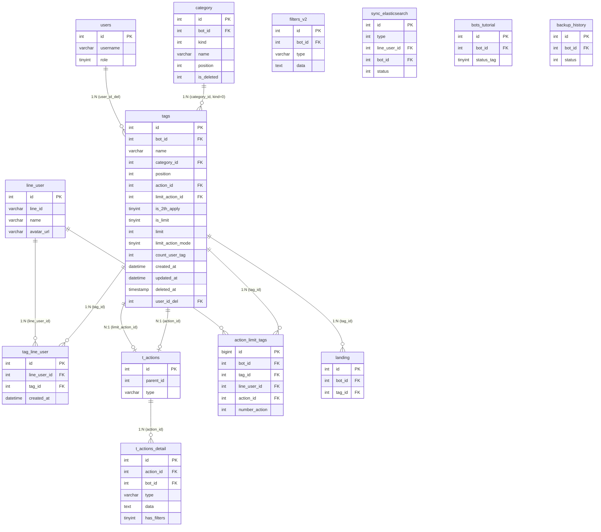

# FA-012 Quản lý thẻ「タグ管理」 — DB Mapping

> Mapping giữa giao diện, API, logic với cơ sở dữ liệu.
> Nguồn: DB schema (`db/schema/tables/`), sample data (`db/data/tables/`), cross-reference với ui-spec, api-spec và logic-spec.
> Confidence tổng thể: **Cao** — xác nhận qua Model declarations, controller code, và sample data.

---

## 1. Bảng dữ liệu liên quan

### Bảng chính (Primary Tables)

| Bảng | Mô tả | Data Size | Model Laravel |
|------|-------|-----------|---------------|
| `tags` | Bảng chính lưu thông tin tag | 245KB (~1100 records) | `App\Tags`, `App\Tag` (alias) |
| `category` | Bảng folder/nhóm dùng chung nhiều loại (tag, template, auto-reply...) — phân biệt bởi `kind` | 509KB | `App\Category` |
| `tag_line_user` | Bảng pivot liên kết tag ↔ LINE user | 134KB | `App\tagLineUser` |

### Bảng phụ (Secondary Tables)

| Bảng | Mô tả | Kiểu | Liên kết chính |
|------|-------|------|---------------|
| `t_actions` | Bảng action chung — nhóm các action details | FK (action_id) | `tags.action_id`, `tags.limit_action_id` → `t_actions.id` |
| `t_actions_detail` | Chi tiết từng action (template, tag, friend info, step, v.v.) | 1:N từ t_actions | `t_actions_detail.action_id` → `t_actions.id` |
| `action_limit_tags` | Tracking số lần trigger limit action cho mỗi tag-user | Log/Tracking | `action_limit_tags.tag_id` → `tags.id` |
| `filters_v2` | Bộ lọc v2 — có thể chứa tham chiếu đến tag IDs | Config | Cập nhật khi xoá tag (`deletedDataTag`) |
| `users` | Bảng user/admin/staff — lấy tên người xoá tag | FK | `tags.user_id_del` → `users.id` |
| `line_user` | Bảng LINE user — thông tin bạn bè | FK | `tag_line_user.line_user_id` → `line_user.id` |
| `bots_tutorial` | Tracking trạng thái tutorial của bot | Config | `bots_tutorial.status_tag` cập nhật khi tạo tag đầu tiên |
| `backup_history` | Lịch sử backup bot — kiểm tra trước CUD operations | Lock check | `backup_history.bot_id` match bot hiện tại |
| `landing` | Landing page — có FK tới tag | FK | `landing.tag_id` → `tags.id` (set null khi xoá tag) |
| `sync_elasticsearch` | Queue đồng bộ Elasticsearch | Log/Queue | Insert khi thay đổi tag-user (DB connection khác: `mysql_step_message`) |
| `form_answer_details` | Chi tiết form trả lời — chứa tham chiếu đến tên tag | Side effect | Cập nhật khi đổi tên tag (field `name='select2_5'`) |

---

## 2. Chi tiết từng bảng

### Bảng: `tags`
- **Model Laravel**: `App\Tags` (legacy) / `App\Tag` (v2) — cả hai map vào cùng bảng `tags`
- **Traits**: `SoftDeletes` (sử dụng `deleted_at`)
- **Guarded**: `[]` (tất cả cột đều fillable)
- **Timestamps**: Có (`created_at`, `updated_at`)

#### Columns
| # | Cột | Kiểu | Nullable? | Default | Mô tả | Confidence |
|---|-----|------|----------|---------|-------|-----------|
| 1 | `id` | int(12) | Không | AUTO_INCREMENT | Khoá chính | **Cao** |
| 2 | `bot_id` | int(12) | Có | NULL | FK → bot sở hữu tag. Mỗi tag thuộc 1 LINE Official Account | **Cao** |
| 3 | `name` | varchar(255) | Không | — | Tên quản lý tag (「管理名」). UI giới hạn 50 ký tự nhưng DB cho phép 255 | **Cao** |
| 4 | `category_id` | int(12) | Không | — | FK → `category.id`. Giá trị 0 = folder「未分類」(không FK thực, xử lý bằng logic) | **Cao** |
| 5 | `rich_menu_id` | int(11) | Có | NULL | FK → Rich Menu liên kết (legacy — dùng trong action cũ) | **Cao** |
| 6 | `position` | int(12) | Không | — | Thứ tự sắp xếp trong folder. Giá trị = index + 1 khi sort | **Cao** |
| 7 | `add_template_id` | int(12) | Có | NULL | FK → template gửi tin khi gán tag (legacy — thay thế bởi action system) | **Cao** |
| 8 | `scenario_id` | int(12) | Có | NULL | FK → scenario/step delivery liên kết (legacy) | **Cao** |
| 9 | `scenario_day` | int(12) | Có | NULL | Ngày bắt đầu scenario (legacy). Giá trị -1 = không kích hoạt | **Cao** |
| 10 | `scenario_time` | time | Có | NULL | Giờ bắt đầu scenario (legacy) | **Cao** |
| 11 | `is_2th_apply` | tinyint(1) | Có | NULL | Chế độ kích hoạt action: 0 = chỉ lần đầu, 1 = mỗi lần gán tag | **Cao** |
| 12 | `max_users_number` | int(12) | Có | NULL | Số người tối đa (legacy — thay thế bởi `is_limit` + `limit`) | **Trung bình** |
| 13 | `ins_add_template_id` | int(11) | Có | NULL | Template cho instant action (legacy) | **Thấp** |
| 14 | `ins_scenario_id` | int(11) | Có | NULL | Scenario cho instant action (legacy) | **Thấp** |
| 15 | `ins_scenario_day` | int(11) | Có | NULL | Ngày scenario instant (legacy) | **Thấp** |
| 16 | `ins_scenario_time` | time | Có | NULL | Giờ scenario instant (legacy) | **Thấp** |
| 17 | `ins_is_2th_apply` | int(11) | Có | NULL | Chế độ kích hoạt instant (legacy) | **Thấp** |
| 18 | `ins_tag_id` | int(11) | Có | NULL | Tag liên kết instant (legacy — self-ref) | **Thấp** |
| 19 | `action_mode` | int(11) | Có | 0 | Chế độ action: 0 = chỉ lần đầu, 1 = mỗi lần. Truyền qua EP-30 `action_mode` | **Cao** |
| 20 | `action_id` | int(11) | Có | NULL | FK → `t_actions.id`. Action chính khi gán tag cho user | **Cao** |
| 21 | `created_at` | datetime | Không | — | Ngày tạo tag | **Cao** |
| 22 | `updated_at` | datetime | Có | CURRENT_TIMESTAMP ON UPDATE | Ngày cập nhật cuối | **Cao** |
| 23 | `count_user_tag` | int(11) | Có | 0 | Số bạn bè đã gán tag (denormalized counter, sync với `tag_line_user` count) | **Cao** |
| 24 | `is_limit` | tinyint(4) | Không | 0 | Bật/tắt giới hạn số người: 0 = không giới hạn, 1 = giới hạn | **Cao** |
| 25 | `limit` | int(11) | Không | 0 | Số người giới hạn (chỉ có ý nghĩa khi `is_limit=1`) | **Cao** |
| 26 | `limit_action_id` | int(11) | Có | NULL | FK → `t_actions.id`. Action khi đạt giới hạn số người | **Cao** |
| 27 | `limit_action_mode` | tinyint(4) | Không | 0 | Chế độ limit action: 0 = chỉ trigger 1 lần/user | **Cao** |
| 28 | `deleted_at` | timestamp | Có | NULL | Soft delete timestamp (SoftDeletes trait). NULL = active | **Cao** |
| 29 | `user_id_del` | int(11) | Có | NULL | FK → `users.id`. ID người đã xoá tag | **Cao** |

#### Indexes (suy luận từ schema — không có khai báo INDEX rõ trong dump)
| Tên Index | Cột | Kiểu | Mô tả | Confidence |
|----------|-----|------|-------|-----------|
| PRIMARY | `id` | Primary | Khoá chính | **Cao** |
| (implicit) | `bot_id` | Index | Filter theo bot — mọi query đều WHERE `bot_id` | **Trung bình** |
| (implicit) | `category_id` | Index | Filter theo folder | **Trung bình** |
| (implicit) | `deleted_at` | Index | SoftDeletes scope | **Trung bình** |

#### Foreign Keys (logic, không khai báo ràng buộc trong schema)
| Cột | Tham chiếu | Mô tả | Confidence |
|-----|-----------|-------|-----------|
| `bot_id` | — (không có bảng `bots` trong dump) | Bot sở hữu tag | **Cao** |
| `category_id` | `category.id` (giá trị 0 = ảo, không FK thực) | Folder chứa tag | **Cao** |
| `action_id` | `t_actions.id` | Action chính khi gán tag | **Cao** |
| `limit_action_id` | `t_actions.id` | Action khi đạt giới hạn | **Cao** |
| `rich_menu_id` | `rich_menus.id` (legacy) | Rich menu liên kết | **Trung bình** |
| `add_template_id` | `templates.id` (legacy) | Template tin nhắn liên kết | **Trung bình** |
| `scenario_id` | `scenarios.id` (legacy) | Step delivery liên kết | **Trung bình** |
| `user_id_del` | `users.id` | Người xoá tag | **Cao** |

#### Sample Data (bot_id=542 — khớp UI quan sát)
| id | bot_id | name | category_id | position | action_id | is_2th_apply | count_user_tag | is_limit | limit | deleted_at | user_id_del |
|----|--------|------|-------------|----------|-----------|-------------|----------------|----------|-------|------------|------------|
| 24926 | 542 | nga test sv mơi | 0 | 2260 | NULL | NULL | 0 | 0 | 0 | NULL | NULL |
| 22206 | 542 | test scen 2 | 0 | 2259 | NULL | 0 | 16 | 0 | 0 | NULL | NULL |
| 18424 | 542 | abc | 0 | 584 | 27494 | 0 | 10 | 0 | 0 | NULL | NULL |
| 18399 | 542 | filter 2 | 0 | 579 | 41652 | 0 | 10 | 0 | 0 | NULL | NULL |
| 18433 | 542 | タグ | 0 | 593 | 45616 | 0 | 0 | 0 | 0 | 2026-01-17 10:08:01 | 130 |

**Ghi chú mẫu**:
- Tag `18433` (タグ) có `deleted_at` không null → đã bị soft delete, `user_id_del=130` → tra `users.id=130` để lấy tên người xoá
- Tag `24926` (nga test sv mơi) là tag mới nhất (`created_at: 2026-03-18`), chưa có action
- Tags `18424` (abc) và `18399` (filter 2) có `action_id` → đã cấu hình action settings

---

### Bảng: `category`
- **Model Laravel**: `App\Category`
- **Guarded**: `[]`
- **Timestamps**: Có
- **Ghi chú**: Bảng dùng chung cho nhiều loại category. Tag folders có `kind=0`

#### Columns
| # | Cột | Kiểu | Nullable? | Default | Mô tả | Confidence |
|---|-----|------|----------|---------|-------|-----------|
| 1 | `id` | int(11) | Không | AUTO_INCREMENT | Khoá chính | **Cao** |
| 2 | `bot_id` | int(11) | Không | — | FK → bot sở hữu folder | **Cao** |
| 3 | `kind` | int(11) | Không | — | Loại category: 0 = tag, 1 = auto-reply, 2 = template, 3 = URL shortener, 10 = friend info, 13 = bookmark, 14 = conversion, 15 = conversion tracking | **Cao** |
| 4 | `name` | varchar(100) | Không | — | Tên folder | **Cao** |
| 5 | `position` | int(11) | Có | NULL | Thứ tự sắp xếp | **Cao** |
| 6 | `is_deleted` | int(11) | Có | 0 | Soft delete flag: 0 = active, 1 = đã xoá | **Cao** |
| 7 | `created_at` | timestamp | Không | CURRENT_TIMESTAMP | Ngày tạo | **Cao** |
| 8 | `updated_at` | timestamp | Có | ON UPDATE CURRENT_TIMESTAMP | Ngày cập nhật | **Cao** |
| 9 | `category_id_old` | int(11) | Không | -1 | ID category cũ (dùng cho migration/backup). Giá trị -1 = không áp dụng | **Trung bình** |

#### Foreign Keys (logic)
| Cột | Tham chiếu | Mô tả | Confidence |
|-----|-----------|-------|-----------|
| `bot_id` | — | Bot sở hữu folder | **Cao** |

#### Sample Data (bot_id=542, kind=0 — folders tag khớp UI)
| id | bot_id | kind | name | position | is_deleted |
|----|--------|------|------|----------|-----------|
| 978 | 542 | 0 | 絞り込み条件 | 3 | 0 |
| 1720 | 542 | 0 | 最終編集 | 4 | 0 |
| 2348 | 542 | 0 | タグ 管理 | 6 | 0 |
| 3860 | 542 | 0 | ntest | 234 | 0 |
| 3861 | 542 | 0 | nga test | 235 | 0 |
| 801 | 542 | 0 | test | 1 | 1 (đã xoá) |
| 802 | 542 | 0 | test 2 | 2 | 1 (đã xoá) |

**Ghi chú**: Folder「未分類」không có record trong bảng `category`. Khi `tags.category_id=0`, logic code coi đó là folder mặc định「未分類」.

---

### Bảng: `tag_line_user`
- **Model Laravel**: `App\tagLineUser`
- **Guarded**: `[]`
- **Timestamps**: Có
- **Mô tả**: Bảng pivot liên kết tag ↔ LINE user. Mỗi record = 1 user đã được gán 1 tag.

#### Columns
| # | Cột | Kiểu | Nullable? | Default | Mô tả | Confidence |
|---|-----|------|----------|---------|-------|-----------|
| 1 | `id` | int(12) | Không | AUTO_INCREMENT | Khoá chính | **Cao** |
| 2 | `line_user_id` | int(12) | Có | NULL | FK → `line_user.id` | **Cao** |
| 3 | `tag_id` | int(12) | Có | NULL | FK → `tags.id` | **Cao** |
| 4 | `is_deleted` | tinyint(1) | Có | NULL | Flag xoá (không dùng SoftDeletes, hard delete trực tiếp trong code) | **Trung bình** |
| 5 | `created_at` | datetime | Không | — | Ngày gán tag cho user | **Cao** |
| 6 | `updated_at` | datetime | Có | NULL | Ngày cập nhật | **Cao** |

#### Foreign Keys (logic)
| Cột | Tham chiếu | Mô tả | Confidence |
|-----|-----------|-------|-----------|
| `line_user_id` | `line_user.id` | LINE user được gán tag | **Cao** |
| `tag_id` | `tags.id` | Tag được gán | **Cao** |

#### Sample Data
| id | line_user_id | tag_id | is_deleted | created_at | updated_at |
|----|-------------|--------|-----------|------------|------------|
| 205 | 54 | 216 | 0 | 2020-03-12 17:58:56 | 2020-03-12 18:11:57 |
| 207 | 54 | 219 | 1 | 2020-03-12 18:04:36 | 2020-03-12 18:11:46 |
| 209 | 140 | 220 | 0 | 2020-03-12 18:13:03 | 2020-03-12 18:13:03 |

**Ghi chú**: Khi xoá tag → tất cả records `tag_line_user` có `tag_id` tương ứng bị **hard delete** (`DB::table('tag_line_user')->where('tag_id', $id)->delete()`). Cột `is_deleted` có tồn tại nhưng code chủ yếu hard delete thay vì dùng flag.

---

### Bảng: `t_actions`
- **Model Laravel**: `App\Actions`
- **Mô tả**: Bảng nhóm action — mỗi record là 1 "action set" chứa nhiều action details

#### Columns
| # | Cột | Kiểu | Nullable? | Default | Mô tả | Confidence |
|---|-----|------|----------|---------|-------|-----------|
| 1 | `id` | int(10) unsigned | Không | AUTO_INCREMENT | Khoá chính | **Cao** |
| 2 | `parent_id` | int(11) | Không | — | ID đối tượng sở hữu action (ví dụ: tag_id, broadcast_id, v.v.) | **Trung bình** |
| 3 | `type` | varchar(255) | Không | — | Loại parent: phân biệt action thuộc tag, broadcast, landing, v.v. | **Trung bình** |
| 4 | `update_timestamp` | bigint(20) | Không | — | Timestamp update (Unix milliseconds) | **Trung bình** |
| 5 | `created_at` | timestamp | Không | CURRENT_TIMESTAMP | Ngày tạo | **Cao** |
| 6 | `updated_at` | timestamp | Không | ON UPDATE CURRENT_TIMESTAMP | Ngày cập nhật | **Cao** |

#### Foreign Keys (logic)
| Cột | Tham chiếu | Mô tả | Confidence |
|-----|-----------|-------|-----------|
| (referenced by) | `tags.action_id` → `t_actions.id` | Action chính gắn với tag | **Cao** |
| (referenced by) | `tags.limit_action_id` → `t_actions.id` | Action khi đạt giới hạn | **Cao** |

---

### Bảng: `t_actions_detail`
- **Model Laravel**: `App\ActionDetail`
- **Mô tả**: Chi tiết từng action bên trong 1 action set

#### Columns
| # | Cột | Kiểu | Nullable? | Default | Mô tả | Confidence |
|---|-----|------|----------|---------|-------|-----------|
| 1 | `id` | int(10) unsigned | Không | AUTO_INCREMENT | Khoá chính | **Cao** |
| 2 | `action_id` | int(11) | Không | — | FK → `t_actions.id` | **Cao** |
| 3 | `bot_id` | int(11) | Có | NULL | FK → bot | **Cao** |
| 4 | `type` | varchar(255) | Không | — | Loại action: `template`, `tag`, `friend_info`, `step`, `other` | **Cao** |
| 5 | `data` | text | Không | — | JSON chứa cấu hình chi tiết action (template_id, tag_ids, field_id, v.v.) | **Cao** |
| 6 | `embed_regex_text` | varchar(255) | Có | NULL | Regex text nhúng (dùng cho personalized messages) | **Thấp** |
| 7 | `has_filters` | tinyint(4) | Không | 0 | Có filter điều kiện không: 0 = không, 1 = có | **Trung bình** |
| 8 | `update_timestamp` | bigint(20) | Không | — | Timestamp update | **Trung bình** |
| 9 | `created_at` | timestamp | Không | CURRENT_TIMESTAMP | Ngày tạo | **Cao** |
| 10 | `updated_at` | timestamp | Không | ON UPDATE CURRENT_TIMESTAMP | Ngày cập nhật | **Cao** |

#### Foreign Keys (logic)
| Cột | Tham chiếu | Mô tả | Confidence |
|-----|-----------|-------|-----------|
| `action_id` | `t_actions.id` | Action set chứa detail này | **Cao** |

---

### Bảng: `action_limit_tags`
- **Model Laravel**: `App\ActionLimitTag`
- **Guarded**: `[]`
- **Mô tả**: Tracking số lần trigger limit action cho mỗi cặp tag-user. Dùng để đảm bảo limit action chỉ fire 1 lần/user (khi `limit_action_mode=0`)

#### Columns
| # | Cột | Kiểu | Nullable? | Default | Mô tả | Confidence |
|---|-----|------|----------|---------|-------|-----------|
| 1 | `id` | bigint(20) unsigned | Không | AUTO_INCREMENT | Khoá chính | **Cao** |
| 2 | `bot_id` | int(11) | Không | — | FK → bot | **Cao** |
| 3 | `tag_id` | int(11) | Không | — | FK → `tags.id` | **Cao** |
| 4 | `line_user_id` | int(11) | Không | — | FK → `line_user.id` | **Cao** |
| 5 | `action_id` | int(11) | Không | — | FK → `t_actions.id` (limit action đã trigger) | **Cao** |
| 6 | `number_action` | int(11) | Không | 1 | Số lần đã trigger action. Mặc định = 1 khi tạo | **Cao** |
| 7 | `created_at` | timestamp | Có | NULL | Ngày tạo | **Cao** |
| 8 | `updated_at` | timestamp | Có | NULL | Ngày cập nhật | **Cao** |

#### Foreign Keys (logic)
| Cột | Tham chiếu | Mô tả | Confidence |
|-----|-----------|-------|-----------|
| `tag_id` | `tags.id` | Tag liên quan | **Cao** |
| `line_user_id` | `line_user.id` | User đã trigger limit | **Cao** |
| `action_id` | `t_actions.id` | Action đã được trigger | **Cao** |

#### Sample Data
| id | bot_id | tag_id | line_user_id | action_id | number_action | created_at |
|----|--------|--------|-------------|-----------|--------------|------------|
| 2 | 46302 | 22664 | 26053563 | 55075 | 1 | 2025-04-24 03:22:45 |
| 4 | 46302 | 22688 | 26053532 | 55751 | 1 | 2025-04-29 09:07:24 |
| 29 | 542 | 23337 | 26053539 | 60558 | 1 | 2025-09-10 03:28:01 |

---

### Bảng: `users`
- **Model Laravel**: `App\User`
- **Vai trò trong tính năng**: Lấy tên người xoá tag (cột `username`) qua FK `tags.user_id_del`

#### Columns liên quan
| # | Cột | Kiểu | Mô tả | Confidence |
|---|-----|------|-------|-----------|
| 1 | `id` | int(11) | Khoá chính | **Cao** |
| 2 | `username` | varchar(255) | Tên hiển thị — dùng làm「操作者」trên SCR-TAG-04 | **Cao** |
| 3 | `role` | tinyint(1) | Vai trò: -1 = admin, 0 = user, 2 = staff | **Cao** |

---

### Bảng: `line_user`
- **Model Laravel**: `App\LineUser`
- **Vai trò trong tính năng**: Lấy thông tin bạn bè (tên, avatar) khi hiển thị danh sách users có tag

#### Columns liên quan
| # | Cột | Kiểu | Mô tả | Confidence |
|---|-----|------|-------|-----------|
| 1 | `id` | int(12) | Khoá chính | **Cao** |
| 2 | `line_id` | varchar(128) | LINE user ID | **Cao** |
| 3 | `name` | varchar(128) | Tên hiển thị LINE | **Cao** |
| 4 | `avatar_url` | varchar(256) | URL avatar | **Cao** |

---

### Bảng: `bots_tutorial`
- **Model Laravel**: `App\BotsTutorial`
- **Vai trò trong tính năng**: Cập nhật `status_tag=1` khi tạo tag đầu tiên (BR-17)

#### Columns liên quan
| # | Cột | Kiểu | Mô tả | Confidence |
|---|-----|------|-------|-----------|
| 1 | `id` | int(10) unsigned | Khoá chính | **Cao** |
| 2 | `bot_id` | int(11) | FK → bot | **Cao** |
| 3 | `status_tag` | tinyint(4) | 0 = chưa tạo tag, 1 = đã tạo tag đầu tiên | **Cao** |

---

### Bảng: `backup_history`
- **Model Laravel**: `App\BackupHistory`
- **Vai trò trong tính năng**: Kiểm tra trước mọi thao tác CUD — nếu status IN (0,1) thì chặn

#### Columns liên quan
| # | Cột | Kiểu | Mô tả | Confidence |
|---|-----|------|-------|-----------|
| 1 | `id` | int(10) unsigned | Khoá chính | **Cao** |
| 2 | `bot_id` | int(11) | FK → bot | **Cao** |
| 3 | `code` | varchar(255) | Transfer code (match với `bot.transfer_code`) | **Cao** |
| 4 | `status` | int(11) | 0 = Waiting, 1 = Doing, 2 = Done, 3 = Failure | **Cao** |

---

### Bảng: `filters_v2`
- **Model Laravel**: `App\FilterV2`
- **Vai trò trong tính năng**: Khi xoá tag → tìm filter type='tag' chứa tag ID → gỡ khỏi `data.tags_search`

#### Columns liên quan
| # | Cột | Kiểu | Mô tả | Confidence |
|---|-----|------|-------|-----------|
| 1 | `id` | int(10) unsigned | Khoá chính | **Cao** |
| 2 | `bot_id` | int(11) | FK → bot | **Cao** |
| 3 | `type` | varchar(255) | Loại filter — `tag` = filter theo tag | **Cao** |
| 4 | `data` | text | JSON chứa filter config (ví dụ: `{"tags_search": [123, 456]}`) | **Cao** |
| 5 | `text_preview` | text | Text preview cho hiển thị | **Trung bình** |

---

### Bảng: `sync_elasticsearch`
- **Model Laravel**: `App\SyncElasticsearch`
- **DB Connection**: `mysql_step_message` (DB khác)
- **Vai trò trong tính năng**: Insert record để background job đồng bộ tag data sang Elasticsearch

#### Columns liên quan
| # | Cột | Kiểu | Mô tả | Confidence |
|---|-----|------|-------|-----------|
| 1 | `id` | int(10) unsigned | Khoá chính | **Cao** |
| 2 | `type` | int(11) | Loại sync: 0=BOT_LINE_USER, 1=LINE_USER, 2=CONVERSATION, **3=TAG**, 4=FRIEND_INFO, 5=LANDING, 6=SCENARIO, 7=CONVERSION | **Cao** |
| 3 | `line_user_id` | int(11) | FK → line_user bị ảnh hưởng | **Cao** |
| 4 | `bot_id` | int(11) | FK → bot | **Cao** |
| 5 | `status` | int(11) | 0=WAIT_SYNC, 1=SYNCHRONIZING, 2=SYNC_SUCCESS, 3=SYNC_ERROR | **Cao** |
| 6 | `data_sync` | text | JSON dữ liệu cần sync | **Trung bình** |

---

### Bảng: `landing`
- **Model Laravel**: `App\Landing`
- **Vai trò trong tính năng**: Khi xoá tag → set `landing.tag_id = NULL` cho landing pages liên kết

#### Columns liên quan
| # | Cột | Kiểu | Mô tả | Confidence |
|---|-----|------|-------|-----------|
| 1 | `id` | int(10) unsigned | Khoá chính | **Cao** |
| 2 | `tag_id` | int(11) | FK → `tags.id`. Set NULL khi xoá tag | **Cao** |
| 3 | `bot_id` | int(11) | FK → bot | **Cao** |

---

## 3. Mapping UI ↔ Database

### SCR-TAG-01: Danh sách tag「タグ管理（一覧）」

#### Bảng tag chính
| UI Element | Label JP | DB Table | Column | Mapping Type | Confidence | Ghi chú |
|-----------|---------|----------|--------|-------------|-----------|---------|
| Cột tên tag | 「管理名」 | `tags` | `name` | Direct | **Cao** | varchar(255), UI giới hạn 50 ký tự. Click → navigate EP-02 |
| Cột action setting | 「アクション設定」 | `tags` | `action_id` → `t_actions` → `t_actions_detail` | Computed | **Cao** | Hiển thị「なし」khi `action_id IS NULL` hoặc không có details, 「あり」khi có action details. Eager load `action.details` relationship |
| Cột giới hạn người | 「人数制限」 | `tags` | `is_limit`, `limit` | Computed | **Cao** | Hiển thị「人数制限なし」khi `is_limit=0`. Hiển thị số khi `is_limit=1` (giá trị từ `limit`) |
| Cột ngày tạo | 「作成日」 | `tags` | `created_at` | Direct (format) | **Cao** | DB: datetime → UI: YYYY/MM/DD |
| Cột ngày sửa cuối | 「最終編集日」 | `tags` | `updated_at` | Direct (format) | **Cao** | DB: datetime → UI: YYYY/MM/DD |
| Cột số bạn bè | 「友だち数」 | `tags` | `count_user_tag` | Direct | **Cao** | Denormalized counter. UI format: "{n} 人". Đồng bộ với COUNT(`tag_line_user`) |
| Checkbox chọn tag | — | `tags` | `id` | Direct | **Cao** | Dùng cho bulk actions (xoá, chuyển folder) |
| Thứ tự hiển thị | — | `tags` | `position` | Direct | **Cao** | Sort theo `position` (default DESC) hoặc cột khác |

#### Sidebar folder
| UI Element | Label JP | DB Table | Column | Mapping Type | Confidence | Ghi chú |
|-----------|---------|----------|--------|-------------|-----------|---------|
| Tên folder | — | `category` | `name` | Direct | **Cao** | WHERE `kind=0`, `is_deleted=0`, `bot_id=current` |
| Số tag trong folder | "(N)" | `category` + `tags` | COUNT(`tags` WHERE `category_id`=folder.id) | Aggregated | **Cao** | Tính bằng `Category::getListCategoryTag()` — count tags per category |
| Folder「未分類」| 「未分類」 | — | — | Computed | **Cao** | Không có record trong `category`. Hardcoded name. Count = `tags` WHERE `category_id=0` |
| Thứ tự folder | — | `category` | `position` | Direct | **Cao** | Sort DESC |

#### Filter & Sort
| UI Action | DB Query | Confidence |
|-----------|---------|-----------|
| Chọn folder sidebar | `WHERE category_id = {selected_id}` (0 cho 未分類) | **Cao** |
| Tìm kiếm keyword | `WHERE name LIKE '%keyword%'` (bỏ qua category_id filter) | **Cao** |
| Sort theo cột | `ORDER BY {column} {dir}`. Column: `created_at`, `position`, `name`, `updated_at` | **Cao** |
| Phân trang | `LIMIT {limit} OFFSET {(page-1)*limit}`. Default limit=15, UI set 100 | **Cao** |

---

### SCR-TAG-02: Modal tạo tag mới「タグ新規作成」

| UI Element | Label JP | DB Table | Column | Mapping Type | Confidence | Ghi chú |
|-----------|---------|----------|--------|-------------|-----------|---------|
| Dropdown folder | 「フォルダ」 | `tags` (insert) | `category_id` | FK | **Cao** | Options từ `category` WHERE `kind=0, is_deleted=0`. Giá trị 0 = 「未分類」 |
| Input tên tag | 「タグ管理名」 | `tags` (insert) | `name` | Direct | **Cao** | Max 50 ký tự (UI), max 255 (DB). Batch insert tối đa 20 tags |
| (implicit) | — | `tags` (insert) | `bot_id` | Direct | **Cao** | Từ session `getBotId()` |
| (implicit) | — | `tags` (insert) | `position` | Computed | **Cao** | max(position) trong folder + 1 |
| (implicit) | — | `tags` (insert) | `count_user_tag` | Direct | **Cao** | Default = 0 |
| (implicit) | — | `tags` (insert) | `created_at` | Direct | **Cao** | Current timestamp |

---

### SCR-TAG-03: Chỉnh sửa tag「タグ編集」

#### Form fields cơ bản
| UI Element | Label JP | DB Table | Column | Mapping Type | Confidence | Ghi chú |
|-----------|---------|----------|--------|-------------|-----------|---------|
| Input tên | 「管理名」 | `tags` | `name` | Direct | **Cao** | Max 50 ký tự (UI) |
| Dropdown folder | 「フォルダ」 | `tags` | `category_id` | FK | **Cao** | Options từ `category` WHERE `kind=0, is_deleted=0` |
| Radio chế độ action | 「アクションの稼働回数」 | `tags` | `is_2th_apply` | Enum | **Cao** | 「何度でもアクション稼働」= `is_2th_apply=1`, 「1度のみアクション稼働」= `is_2th_apply=0` |
| Radio giới hạn người | 「人数制限」 | `tags` | `is_limit` | Enum | **Cao** | 「制限しない」= `is_limit=0`, 「制限する」= `is_limit=1` |
| Input số giới hạn | 「制限人数」 | `tags` | `limit` | Direct | **Cao** | Chỉ enable khi `is_limit=1`. Đơn vị:「人」 |

#### Action settings (tab アクション設定)
| UI Element | Label JP | DB Table | Column | Mapping Type | Confidence | Ghi chú |
|-----------|---------|----------|--------|-------------|-----------|---------|
| Action card: Template | 「テンプレート」 | `t_actions_detail` | `type='template'`, `data` (JSON chứa template_id) | FK/JSON | **Cao** | Liên kết qua `tags.action_id` → `t_actions.id` → `t_actions_detail.action_id` |
| Action card: Tag | 「タグ」 | `t_actions_detail` | `type='tag'`, `data` (JSON chứa tag_ids) | FK/JSON | **Cao** | Self-reference: thêm/xoá tag khác |
| Action card: Friend info | 「友だち情報」 | `t_actions_detail` | `type='friend_info'`, `data` (JSON) | FK/JSON | **Cao** | Cập nhật custom field |
| Action card: Step delivery | 「ステップ配信」 | `t_actions_detail` | `type='step'`, `data` (JSON chứa scenario_id) | FK/JSON | **Cao** | Bắt đầu/dừng step delivery |
| Action card: Other | 「その他」 | `t_actions_detail` | `type='other'`, `data` (JSON) | FK/JSON | **Trung bình** | Các action khác (Rich Menu, thông báo, v.v.) |
| Action ID (hidden) | — | `tags` | `action_id` | FK | **Cao** | FK → `t_actions.id`. NULL = chưa có action |
| Limit action ID (hidden) | — | `tags` | `limit_action_id` | FK | **Cao** | FK → `t_actions.id`. Action khi đạt giới hạn |
| Action mode (hidden) | — | `tags` | `action_mode` | Direct | **Cao** | 0 = chỉ lần đầu, 1 = mỗi lần |
| Limit action mode (hidden) | — | `tags` | `limit_action_mode` | Direct | **Cao** | 0 = chỉ trigger 1 lần/user |

---

### SCR-TAG-04: Danh sách tag đã xoá「削除済みタグ」

| UI Element | Label JP | DB Table | Column | Mapping Type | Confidence | Ghi chú |
|-----------|---------|----------|--------|-------------|-----------|---------|
| Cột thời điểm xoá | 「削除した日時」 | `tags` | `deleted_at` | Direct (format) | **Cao** | SoftDeletes trait. `Tags::onlyTrashed()` query |
| Cột tên tag | 「管理名」 | `tags` | `name` | Direct | **Cao** | Tên tag đã xoá |
| Cột người xoá | 「操作者」 | `tags` → `users` | `tags.user_id_del` → `users.username` | FK (lookup) | **Cao** | Lấy bằng `User::find(user_id_del)->username` trong `getTagRemoved()` |
| Nút khôi phục | — | `tags` | `deleted_at` (set NULL), `count_user_tag` (reset 0) | Direct | **Cao** | `Tags::restore()` + reset count |

---

## 4. Enum/Status Values

### Bảng `tags`

| Cột | Giá trị DB | Ý nghĩa | Hiển thị JP | Confidence |
|-----|-----------|---------|------------|-----------|
| `is_limit` | 0 | Không giới hạn | 「制限しない」/「人数制限なし」 | **Cao** |
| `is_limit` | 1 | Có giới hạn | 「制限する」/ hiển thị số | **Cao** |
| `is_2th_apply` | 0 / NULL | Action chỉ chạy lần đầu | 「1度のみアクション稼働」 | **Cao** |
| `is_2th_apply` | 1 | Action chạy mỗi lần | 「何度でもアクション稼働」 | **Cao** |
| `action_mode` | 0 | Chỉ lần đầu (tương tự is_2th_apply) | — | **Cao** |
| `action_mode` | 1 | Mỗi lần | — | **Trung bình** |
| `limit_action_mode` | 0 | Chỉ trigger 1 lần/user | — | **Cao** |
| `limit_action_mode` | 1 | Trigger mỗi lần đạt limit | — | **Trung bình** |
| `deleted_at` | NULL | Tag active | Hiển thị trong danh sách chính | **Cao** |
| `deleted_at` | timestamp | Tag đã xoá | Hiển thị trong danh sách tag đã xoá | **Cao** |

### Bảng `tags` — Computed display cho「アクション設定」
| Điều kiện | Hiển thị JP | Confidence |
|----------|------------|-----------|
| `action_id IS NULL` hoặc `action.details` rỗng | 「アクション設定なし」 | **Cao** |
| `action_id IS NOT NULL` và `action.details` có ít nhất 1 record | 「アクション設定あり」 | **Cao** |

### Bảng `category`

| Cột | Giá trị DB | Ý nghĩa | Confidence |
|-----|-----------|---------|-----------|
| `kind` | 0 | Category cho tag | **Cao** |
| `kind` | 1 | Category cho auto-reply | **Cao** |
| `kind` | 2 | Category cho template | **Cao** |
| `kind` | 3 | Category cho URL shortener | **Trung bình** |
| `kind` | 10 | Category cho friend information | **Trung bình** |
| `kind` | 13 | Category cho bookmark | **Thấp** |
| `kind` | 14 | Category cho conversion | **Thấp** |
| `kind` | 15 | Category cho conversion tracking | **Thấp** |
| `is_deleted` | 0 | Active | **Cao** |
| `is_deleted` | 1 | Đã xoá (soft delete) | **Cao** |

### Bảng `t_actions_detail` — type values

| Cột `type` | Ý nghĩa | Label JP trên UI | Confidence |
|-----------|---------|-----------------|-----------|
| `template` | Gửi template message | 「テンプレート」 | **Cao** |
| `tag` | Thêm/xoá tag khác | 「タグ」 | **Cao** |
| `friend_info` | Cập nhật thông tin bạn bè | 「友だち情報」 | **Cao** |
| `step` | Bắt đầu/dừng step delivery | 「ステップ配信」 | **Cao** |
| `other` | Các action khác | 「その他」 | **Trung bình** |

### Bảng `backup_history` — status values

| Giá trị DB | Ý nghĩa | Ảnh hưởng tính năng tag | Confidence |
|-----------|---------|------------------------|-----------|
| 0 | Waiting | Chặn CUD operations | **Cao** |
| 1 | Doing | Chặn CUD operations | **Cao** |
| 2 | Done | Cho phép thao tác | **Cao** |
| 3 | Failure | Cho phép thao tác | **Cao** |

### Bảng `sync_elasticsearch` — type values liên quan

| Giá trị DB | Ý nghĩa | Confidence |
|-----------|---------|-----------|
| 3 | TYPE_TAG — đồng bộ tag data | **Cao** |

---

## 5. Unmapped Items

### UI fields không tìm thấy DB match trực tiếp

| Nguồn | Item | Lý do | Gợi ý | Confidence |
|-------|------|-------|-------|-----------|
| UI SCR-TAG-01 | Số tag trong folder「(N)」 | Aggregated — COUNT query, không lưu trong DB | `SELECT COUNT(*) FROM tags WHERE category_id = ?` | **Cao** |
| UI SCR-TAG-01 | Trạng thái「タグが登録されていません」 | UI-only state — empty table message | Hiển thị khi query trả 0 records | **Cao** |
| UI SCR-TAG-02 | Nút「タグを追加」 (thêm dòng input) | UI-only interaction — chỉ thêm form field | Không ảnh hưởng DB cho đến khi「保存」 | **Cao** |
| UI SCR-TAG-04 | Tự động xoá sau 90 ngày | Không tìm thấy cron/job trong controller | Có thể xử lý bởi background job (Spring Boot) hoặc cron riêng — chưa xác nhận | **Thấp** |

### DB columns không xuất hiện trên UI (bảng `tags`)

| Cột | Kiểu | Mô tả | Lý do không hiển thị | Confidence |
|-----|------|-------|---------------------|-----------|
| `rich_menu_id` | int(11) | Rich menu liên kết (legacy) | Đã thay thế bởi action system mới (t_actions_detail) | **Cao** |
| `add_template_id` | int(12) | Template tin nhắn (legacy) | Đã thay thế bởi action system mới | **Cao** |
| `scenario_id` | int(12) | Step delivery (legacy) | Đã thay thế bởi action system mới | **Cao** |
| `scenario_day` | int(12) | Ngày bắt đầu scenario (legacy) | Legacy | **Cao** |
| `scenario_time` | time | Giờ bắt đầu scenario (legacy) | Legacy | **Cao** |
| `max_users_number` | int(12) | Số người tối đa (legacy) | Đã thay thế bởi `is_limit` + `limit` | **Trung bình** |
| `ins_add_template_id` | int(11) | Template instant (legacy) | Legacy field không dùng | **Thấp** |
| `ins_scenario_id` | int(11) | Scenario instant (legacy) | Legacy field không dùng | **Thấp** |
| `ins_scenario_day` | int(11) | Ngày scenario instant (legacy) | Legacy field không dùng | **Thấp** |
| `ins_scenario_time` | time | Giờ scenario instant (legacy) | Legacy field không dùng | **Thấp** |
| `ins_is_2th_apply` | int(11) | Chế độ instant (legacy) | Legacy field không dùng | **Thấp** |
| `ins_tag_id` | int(11) | Tag instant (legacy) | Legacy field không dùng | **Thấp** |
| `action_mode` | int(11) | Chế độ action | Lưu khi save nhưng không hiển thị trực tiếp trên UI list | **Trung bình** |
| `limit_action_mode` | tinyint(4) | Chế độ limit action | Lưu khi save nhưng không hiển thị trực tiếp trên UI list | **Trung bình** |

### DB columns không xuất hiện trên UI (bảng `category`)

| Cột | Kiểu | Mô tả | Lý do không hiển thị | Confidence |
|-----|------|-------|---------------------|-----------|
| `category_id_old` | int(11) | ID category cũ (migration) | Dùng nội bộ cho backup/transfer | **Trung bình** |
| `kind` | int(11) | Loại category | Luôn filter `kind=0` cho tag, không hiển thị | **Cao** |

### DB columns không xuất hiện trên UI (bảng `tag_line_user`)

| Cột | Kiểu | Mô tả | Lý do không hiển thị | Confidence |
|-----|------|-------|---------------------|-----------|
| `is_deleted` | tinyint(1) | Flag xoá | Code sử dụng hard delete thay vì flag này | **Trung bình** |

---

## 6. Entity Relationships

### ER Diagram (Mermaid)



### Sơ đồ text

```
category (kind=0) ──1:N──→ tags
                              │
                              ├──1:N──→ tag_line_user ←──N:1── line_user
                              │
                              ├──N:1──→ t_actions (action_id)
                              │            └──1:N──→ t_actions_detail
                              │
                              ├──N:1──→ t_actions (limit_action_id)
                              │            └──1:N──→ t_actions_detail
                              │
                              ├──1:N──→ action_limit_tags ←──N:1── line_user
                              │
                              ├──N:1──→ users (user_id_del → username)
                              │
                              ├──1:N──→ landing (tag_id, set null on delete)
                              │
                              └── side effects ──→ filters_v2 (cleanup)
                                                 ──→ sync_elasticsearch (queue)
                                                 ──→ bots_tutorial (status_tag)
                                                 ──→ form_answer_details (rename)
                                                 ──→ backup_history (lock check)
```

---

## 7. Đặc biệt: Folder「未分類」

Folder「未分類」là một **virtual folder** — không tồn tại record trong bảng `category`.

| Đặc điểm | Giá trị | Confidence |
|----------|---------|-----------|
| Giá trị `category_id` | `0` | **Cao** |
| Record trong `category` | **Không có** | **Cao** |
| Tên hiển thị | 「未分類」— hardcoded trong frontend | **Cao** |
| Có thể xoá | **Không** — luôn tồn tại | **Cao** |
| Mặc định | Tags không chỉ định folder → `category_id=0` | **Cao** |
| Khi xoá folder | Tags chuyển về `category_id=0` | **Cao** |
| Count | `Tags::countTags(['category_id' => 0, 'bot_id' => botId])` | **Cao** |

---

## 8. Data Integrity & Side Effects

### Khi tạo tag (EP-13 create-multiple, EP-30 add_tag)
| Bảng | Thao tác | Confidence |
|------|---------|-----------|
| `tags` | INSERT (name, bot_id, category_id, position, count_user_tag=0) | **Cao** |
| `bots_tutorial` | UPDATE `status_tag=1` (lần đầu) | **Cao** |

### Khi sửa tag (EP-30 edit_tag)
| Bảng | Thao tác | Confidence |
|------|---------|-----------|
| `tags` | UPDATE (name, category_id, action_id, limit_action_id, is_limit, limit, is_2th_apply, action_mode, limit_action_mode) | **Cao** |
| `form_answer_details` | UPDATE `settings` JSON khi đổi tên tag (WHERE `name='select2_5'`) | **Cao** |

### Khi xoá tag (EP-11 delete)
| Bảng | Thao tác | Thứ tự | Confidence |
|------|---------|--------|-----------|
| `backup_history` | CHECK status NOT IN (0,1) | 1 | **Cao** |
| `landing` | UPDATE `tag_id=NULL` WHERE tag_id IN ids | 2 | **Cao** |
| `tags` | UPDATE `user_id_del`, `count_user_tag=0` | 3 | **Cao** |
| `tags` | SOFT DELETE (set `deleted_at`) | 4 | **Cao** |
| `filters_v2` | Gỡ tag ID khỏi `data.tags_search` (type='tag') | 5 | **Cao** |
| `t_actions_detail` | Gỡ tag ID khỏi `data.ids` (type='tag') | 6 | **Cao** |
| `t_actions` | DELETE nếu không còn action detail nào | 7 | **Cao** |
| `tag_line_user` | HARD DELETE WHERE tag_id = id | 8 | **Cao** |
| `action_limit_tags` | HARD DELETE WHERE tag_id = id | 9 | **Cao** |
| `sync_elasticsearch` | INSERT record cho mỗi user bị ảnh hưởng (type=3) | 10 | **Cao** |

### Khi khôi phục tag (EP-16 restore)
| Bảng | Thao tác | Confidence |
|------|---------|-----------|
| `tags` | RESTORE (clear `deleted_at`), SET `count_user_tag=0` | **Cao** |
| `category` | Nếu folder gốc `is_deleted=1` → SET `is_deleted=0` | **Cao** |

### Khi gán tag cho user (EP-67 addTagForUser — Mobile API)
| Bảng | Thao tác | Confidence |
|------|---------|-----------|
| `tag_line_user` | INSERT (tag_id, line_user_id) | **Cao** |
| `tags` | UPDATE `count_user_tag += 1` (atomic) | **Cao** |
| `action_limit_tags` | INSERT/CHECK khi đạt limit (limit_action_mode=0) | **Cao** |
| `sync_elasticsearch` | INSERT record (type=config value) | **Cao** |
| `t_actions` → sendAction | Trigger action chain (template, tag, step, v.v.) | **Cao** |
