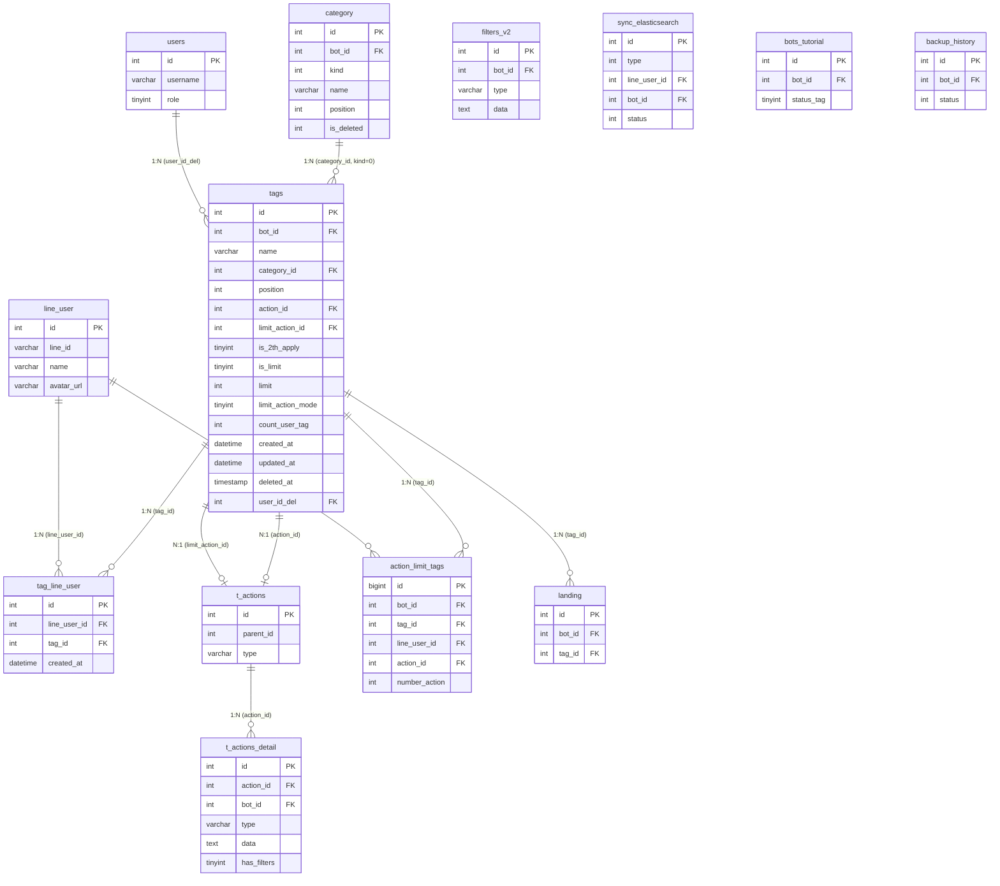

# FA-012 Quản lý thẻ「タグ管理」 — Feature Spec

> Tài liệu đặc tả tổng hợp tính năng Quản lý thẻ (Tag Management).
> Tổng hợp từ: UI Spec, API Spec, Logic Spec, DB Mapping, Validation Report.
> Ngày tạo: 2026-03-24
> Trạng thái validation: **ĐẠT** (78/78 cross-check items pass — 100%)

---

## 1. Tổng quan

### Mục đích
Tính năng quản lý thẻ (tag) gán cho bạn bè LINE. Cho phép tạo, sửa, xoá, phân loại tag vào folder, cấu hình action tự động khi tag được gắn, và tuỳ chọn giới hạn số người được gán tag. Tag được sử dụng để phân nhóm (segment) bạn bè và gửi tin nhắn có mục tiêu.

### Thông tin cơ bản
| Thuộc tính | Giá trị |
|-----------|---------|
| **Mã tính năng** | FA-012 |
| **Tên** | Quản lý thẻ |
| **Tên JP** | 「タグ管理」 |
| **Portal** | Admin (& Staff) |
| **URL patterns** | `/basic/tag`, `/basic/tag/edit-tag/{id}`, `/basic/tag/removed` |
| **Controllers** | `Basic\TagController` (1603 dòng, 20+ actions), `Api\TagController` (376 dòng, 8 actions) |
| **DB Tables chính** | `tags`, `category`, `tag_line_user` |
| **DB Tables phụ** | `t_actions`, `t_actions_detail`, `action_limit_tags`, `filters_v2`, `users`, `line_user`, `bots_tutorial`, `backup_history`, `landing`, `sync_elasticsearch`, `form_answer_details` |
| **Background Jobs** | Không có trực tiếp — gián tiếp qua `sync_elasticsearch` (Spring Boot) và `sendAction()` |

### Actors
| Actor | Vai trò | Quyền truy cập |
|-------|---------|----------------|
| Admin | Quản lý toàn bộ tag: tạo, sửa, xoá, phân folder, cấu hình action, giới hạn người | Toàn quyền |
| Staff | Được Admin phân quyền — truy cập cùng giao diện nhưng có thể bị giới hạn | Tuỳ role do Admin cấu hình |
| LINE User | Người dùng cuối — nhận tag thông qua các trigger (tự động trả lời, biểu mẫu, hành động...) | Gián tiếp — không truy cập giao diện tag |

### Phạm vi
- Quản lý CRUD tag và folder tag
- Cấu hình action tự động khi gán tag
- Cấu hình giới hạn số người được gán tag
- Import tag từ CSV
- Soft delete và khôi phục tag
- Gán/gỡ tag cho LINE user (qua Mobile API)
- Đồng bộ Elasticsearch khi thay đổi tag-user

---

## 2. Các màn hình + Luồng xử lý end-to-end

### SCR-TAG-01: Danh sách tag「タグ管理（一覧）」

**URL**: `/basic/tag`

**Layout**: Sidebar trái (folder panel) + vùng phải (bảng tag). Header có heading「タグ管理」và mô tả. Toolbar bottom bar với bulk actions.

#### Luồng: Load trang danh sách

```
User truy cập /basic/tag
  → API: EP-01 GET /basic/tag
  → Controller: Basic\TagController@index
    → Đọc cookie `folder_tag` xác định folder đang chọn
    → Kiểm tra folder tồn tại (category kind=0, is_deleted=0)
    → Nếu folder không tồn tại → reset cookie về 0 (未分類)
    → Trả view Blade `basic.tag.v2.index`
  → Frontend load AJAX:
    → EP-10 GET /ajax/v2/tag (danh sách tag, phân trang, sắp xếp)
      → DB: SELECT tags.* WHERE bot_id=current, filter category_id, keyword
      → Eager load action.details
      → Response: paginated list + action info
    → EP-20 GET /ajax/v2/tag/category (danh sách folder)
      → DB: SELECT category WHERE kind=0, is_deleted=0, bot_id=current
      → COUNT tags WHERE category_id=0 (未分類)
      → Response: categories[] + count_default
  → UI render: sidebar folders + bảng tag
```

#### Luồng: Lọc tag theo folder

```
User click folder trong sidebar
  → Frontend: EP-10 GET /ajax/v2/tag?category_id={folder_id}
  → DB: SELECT tags WHERE category_id={id}, bot_id=current
  → Lưu cookie folder: EP-50 GET /basic/tag/set-cookie
  → UI update: bảng tag hiển thị tags trong folder đã chọn
```

#### Luồng: Tìm kiếm tag

```
User nhập keyword vào ô search
  → Frontend: EP-10 GET /ajax/v2/tag?keyword={text}
  → DB: SELECT tags WHERE name LIKE '%keyword%', bot_id=current (bỏ qua category_id filter)
  → UI update: bảng tag hiển thị kết quả tìm kiếm
```

#### Luồng: Xoá nhiều tag (bulk delete)

```
User chọn checkbox trên các tag → click「一括削除」
  → Frontend: EP-11 DELETE /ajax/v2/tag {ids: [123, 456, 789]}
  → Controller: Basic\TagController@ajaxDeleteTags
    1. Kiểm tra backup: BackupHistory status NOT IN (0,1) → nếu đang backup → lỗi 500
    2. Gỡ tag khỏi Landing: landing.tag_id = NULL
    3. Ghi nhận người xoá: tags.user_id_del = Auth::id(), count_user_tag = 0
    4. Soft delete: tags.deleted_at = now()
    5. Với mỗi tag → deletedDataTag():
       a. Gỡ tag khỏi FilterV2 (type='tag')
       b. Gỡ tag khỏi ActionDetail (type='tag')
       c. Xoá t_actions nếu không còn detail
       d. Hard delete tag_line_user
       e. Hard delete action_limit_tags
       f. Insert sync_elasticsearch records
  → Response: {"message": "success"}
  → UI: reload danh sách
```

#### Luồng: Di chuyển tag sang folder khác

```
User chọn checkbox → click「一括フォルダ変更」→ chọn folder đích
  → Frontend: EP-12 POST /ajax/v2/tag/move-category {ids: [...], folder_move_id: 5}
  → Controller: ajaxMoveCategory
    1. Kiểm tra backup
    2. Lấy max position của bot
    3. Update mỗi tag: category_id = folder đích, position = max + 1
  → DB: UPDATE tags SET category_id=5, position=MAX+1 WHERE id IN (...)
  → Response: success → UI reload
```

#### Luồng: Sắp xếp tag (drag & drop)

```
User click「並べ替え」→ kéo thả tag → xác nhận
  → Frontend: EP-14 POST /ajax/v2/tag/sort-tag {sort_ids: "789,456,123"}
  → DB: UPDATE tags SET position = index+1 cho mỗi ID theo thứ tự
  → Response: success
```

---

### SCR-TAG-02: Modal tạo tag mới「タグ新規作成」

**URL**: `/basic/tag` (modal overlay)

#### Luồng: Tạo tag mới (happy path)

```
User click「新規作成」→ modal hiện lên
  → User chọn folder (mặc định「未分類」)
  → User nhập tên tag (max 50 ký tự, counter hiển thị N/50)
  → (Tuỳ chọn) click「タグを追加」thêm dòng input (tối đa 20 tag)
  → User click「保存」
  → Frontend: EP-13 POST /ajax/v2/tag/create-multiple
    {tags: [{name: "Tag1"}, {name: "Tag2"}], category_id: 5}
  → Controller: ajaxCreateMultipleTags
    1. Lấy mảng tag names
    2. Kiểm tra trùng tên: Tags::whereIn('name', names) → nếu trùng → lỗi
    3. Lấy max position trong folder
    4. Bulk insert: tags(bot_id, name, category_id, position++, count_user_tag=0)
    5. Cập nhật tutorial: BotsTutorial.status_tag = 1
  → DB: INSERT INTO tags (bot_id, name, category_id, position, count_user_tag) VALUES (...)
  → DB: UPDATE bots_tutorial SET status_tag=1 (nếu lần đầu)
  → Response: {"message": "success", "first_tag_id": 789}
  → UI: đóng modal, reload danh sách
```

**Lỗi có thể xảy ra**:
| Điều kiện | Response | Thông báo JP |
|----------|---------|-------------|
| Tên tag trùng | 500 | 「そのタグ名はすでに利用されています」 |
| Bot đang backup | 500 | 「データコピー中は、データ不備を回避するために、編集不可能です。少し待ってから操作し直してください。」 |

---

### SCR-TAG-03: Chỉnh sửa tag「タグ編集」

**URL**: `/basic/tag/edit-tag/{id}`

**Layout**: Trang đầy đủ. Breadcrumb「タグ一覧 > タグ編集」. Form thông tin cơ bản + 2 tabs cài đặt nâng cao (「アクション設定」,「人数制限」).

#### Luồng: Mở trang chỉnh sửa + load dữ liệu

```
User click tên tag trên SCR-TAG-01
  → EP-02 GET /basic/tag/edit-tag/{id}
  → Controller: editTag
    1. Lấy tag by ID → nếu không tìm thấy → redirect /basic/tag
    2. Lấy folders, scenarios, rich menus
    3. Trả view basic.tag.v2.edit
  → Frontend AJAX: EP-47 POST /basic/initDataInfoTag {id: 123}
  → Controller: initDataInfo
    1. Lấy tag by ID
    2. Lấy action details qua action_id → getActionDetailByActionId()
    3. Lấy limit action details qua limit_action_id
    4. Gắn setting_actions và setting_limit_actions
  → DB: SELECT tags WHERE id=123; SELECT t_actions_detail WHERE action_id=tags.action_id
  → UI render: form với dữ liệu tag + action settings
```

#### Luồng: Lưu tag đã chỉnh sửa

```
User sửa tên/folder/action/giới hạn → click「保存」
  → (Nếu bật giới hạn) Frontend gọi trước: EP-17 POST /ajax/v2/tag/validate-limit/{id}
    → Kiểm tra: count_user_tag > limit mới? → nếu vượt → lỗi
  → Frontend: EP-30 POST /ajax/save-tag
    {action: "edit_tag", tag_id: 123, tag_name: "Tên mới", category_id: 5,
     action_id: 789, limit_action_id: null, is_limit: false, limit: null,
     action_mode: 0, is_2th_apply: 0, limit_action_mode: 0}
  → Controller: ajaxSaveTag (case edit_tag)
    1. Kiểm tra backup
    2. So sánh tên cũ vs mới
    3. Nếu tên thay đổi: kiểm tra trùng tên, cập nhật FormAnswerDetails (select2_5)
    4. Update tag
  → DB: UPDATE tags SET name, category_id, action_id, limit_action_id, is_limit, limit, is_2th_apply, action_mode, limit_action_mode
  → DB: UPDATE form_answer_details SET settings (nếu đổi tên tag)
  → Response: {"status": true}
  → UI: redirect về danh sách
```

#### Luồng: Copy tag

```
User truy cập /basic/tag/copy-tag/{id}
  → EP-03 GET /basic/tag/copy-tag/{id}
  → Controller: copyTag — cùng view edit nhưng với id_copy
  → Frontend AJAX: EP-47 POST /basic/initDataInfoTag {id: 123, action: "copy_tag"}
    → Clone action qua MessageTemplateController::cloneMutilpleAction()
  → User chỉnh sửa → click「保存」
  → EP-30 POST /ajax/save-tag {action: "copy_tag", ...}
    → Tạo tag mới (clone) thay vì update
```

---

### SCR-TAG-04: Danh sách tag đã xoá「削除済みタグ」

**URL**: `/basic/tag/removed`

**Layout**: Trang đơn giản, không có folder panel. Breadcrumb「TOP > 削除済みタグ」. Bảng tag đã xoá + nút quay lại.

**Mô tả trên UI**:
1. 「このページでは削除したタグの復元ができます。」
2. 「手動では削除することができず、削除した日時から90日後に自動で削除されます。」

#### Luồng: Xem tag đã xoá

```
User click「削除したアイテム」trên SCR-TAG-01
  → EP-05 GET /basic/tag/removed → render view
  → Frontend AJAX: EP-15 GET /ajax/v2/tag/get-tag-removed
  → Controller: getTagRemoved
    1. Tags::onlyTrashed() WHERE bot_id = current
    2. Sắp xếp, phân trang (default 15)
    3. Với mỗi tag: lấy username_del từ User::find(user_id_del)
  → DB: SELECT tags WHERE deleted_at IS NOT NULL; JOIN users ON user_id_del
  → Response: {data: [{id, name, deleted_at, username_del}], pagination}
  → UI render: bảng tag đã xoá
```

#### Luồng: Khôi phục tag

```
User click nút khôi phục trên dòng tag
  → Frontend: EP-16 POST /ajax/v2/tag/restore-tag/{id}
  → Controller: restoreTag
    1. Tìm tag: Tags::withTrashed() WHERE id, bot_id
    2. Nếu không tìm thấy → 404
    3. Kiểm tra trùng tên với tag active → nếu trùng → lỗi
    4. Kiểm tra folder gốc: nếu is_deleted=1 → khôi phục folder (is_deleted=0)
    5. Restore tag: clear deleted_at
    6. Reset count_user_tag = 0 (vì tag_line_user đã bị xoá khi delete)
  → DB: UPDATE tags SET deleted_at=NULL, count_user_tag=0
  → DB: UPDATE category SET is_deleted=0 (nếu folder đã xoá)
  → Response: {"success": true}
  → UI: reload danh sách
```

---

### SCR-TAG-05: Danh sách bạn bè có tag (trang phụ)

**URL**: `/basic/tag/friend-list/{id}`

> Ghi chú: Trang này chưa mô tả trong UI Spec (V-01 trong validation report). API Spec và Logic Spec có endpoints liên quan.

#### Luồng: Xem bạn bè có tag

```
User click「{N} 人」trên SCR-TAG-01
  → EP-07 GET /basic/tag/friend-list/{id} → render view
  → Frontend AJAX: EP-35 POST /ajax/get-line-user-by-tag {id: 123, page: 1}
  → Controller: ajaxGetLineUserByTag
    1. Tìm tag → lấy count_user_tag
    2. Phân trang: limit 50, offset = (page-1)*50
    3. Với mỗi tagLineUser → lookup LineUser (name, avatar_url)
  → DB: SELECT tag_line_user WHERE tag_id; JOIN line_user
  → Response: {line_user_list: {data: [{name, avatar_url}], total, per_page: 50}}
```

#### Luồng: Gỡ bạn bè khỏi tag

```
User chọn users → click xoá
  → EP-36 POST /ajax/remove-line-users-from-tag {list_line_user_id: [...], tag_id: 123}
  → Controller: ajaxRemoveLineUsersFromTag
    1. Đếm tagLineUser cần xoá
    2. Giảm tags.count_user_tag
    3. Xoá records tag_line_user
    4. Sync Elasticsearch cho mỗi user
  → DB: DELETE tag_line_user; UPDATE tags SET count_user_tag -= N; INSERT sync_elasticsearch
```

---

### Luồng bổ sung: Quản lý folder

#### Tạo folder mới
```
User click「フォルダ追加」→ nhập tên
  → EP-21 POST /ajax/v2/tag/category/create {name: "Tên folder"}
  → DB: INSERT category (bot_id, name, kind=0, position=max+1)
  → Response: {item: {id, name, count: 0}}
```

#### Đổi tên folder
```
User click menu context → sửa tên
  → EP-22 PUT /ajax/v2/tag/category/update/{id} {name: "Tên mới"}
  → DB: UPDATE category SET name = 'Tên mới'
```

#### Xoá folder
```
User click menu context → xoá folder
  → EP-23 DELETE /ajax/v2/tag/category/{id}
  → Controller: ajaxDeleteCategory
    1. Kiểm tra backup
    2. Soft delete: category.is_deleted = 1
    3. Chuyển tất cả tag trong folder về 未分類: tags.category_id = 0, position = max+1
  → DB: UPDATE category SET is_deleted=1; UPDATE tags SET category_id=0
  → Lưu ý: v2 KHÔNG xoá tags, chỉ chuyển folder
```

#### Sắp xếp folder
```
User click「並べ替え」→ kéo thả
  → EP-24 POST /ajax/v2/tag/category/sort-category {sort_ids: "5,3,1"}
  → DB: UPDATE category SET position = index+1 cho mỗi ID
```

---

### Luồng bổ sung: Import tag từ CSV

```
User click「CSV一括追加」→ dialog upload hiện lên
  → (Tuỳ chọn) Download template:
    EP-32 POST /ajax/export-csv-edit → tạo file CSV mẫu
    EP-33 GET /ajax/downloadCsvEdit?fileName=編集用CSV.csv → download
  → User upload file CSV
  → EP-31 POST /ajax/save-tag-csv (multipart: csv_file, folder_add_id)
  → Controller: ajaxSaveTagCsv
    1. Validate MIME type (CSV-compatible)
    2. Detect encoding: SJIS-WIN → UTF-8
    3. Parse CSV, bỏ header row
    4. Giới hạn 200 tags/file
    5. Với mỗi tên: cắt 50 ký tự, bỏ qua nếu trùng hoặc rỗng
    6. Insert từng tag (reverse order): bot_id, name, category_id, position++
    7. Cập nhật tutorial
  → DB: INSERT INTO tags (...) cho mỗi tag hợp lệ
  → Response: success → UI reload
```

---

### Luồng bổ sung: Gán tag cho LINE user (Mobile API)

```
Mobile app gọi API gán tag cho user
  → EP-67 POST /api/add-tag-for-user {botId, lineUserId, tagIds: [1,2,3]}
  → Controller: Api\TagController@addTagForUser
    1. Lấy tag hiện tại của user (listTagOld)
    2. Tính diff: arrTagAdd = tagIds - listTagOld, arrTagDelete = listTagOld - tagIds
    3. Thêm tag (với mỗi tag mới):
       a. Kiểm tra giới hạn: count_user_tag + 1 <= limit
       b. Nếu đầy + is_limit=1:
          → Trigger limit_action qua ActionLimitTag::handleLimitActionTag()
          → Bỏ qua tag này (không thêm)
       c. Nếu chưa đầy:
          → INSERT tag_line_user
          → UPDATE tags SET count_user_tag += 1
          → Nếu tag có action_id → sendAction() (trigger tin nhắn, step, v.v.)
    4. Xoá tag (với mỗi tag không còn):
       → Giảm count_user_tag, xoá tag_line_user
    5. Sync Elasticsearch
  → Side effects: sendAction() có thể trigger gửi tin LINE, thêm step message, thay Rich Menu
```

---

## 3. Data Model

### Entities chính

| Entity | Bảng DB | Mô tả | Records ước tính |
|--------|---------|-------|------------------|
| Tag | `tags` | Thẻ gán cho bạn bè LINE | ~1100 |
| Tag Folder | `category` (kind=0) | Folder phân loại tag | ~50 per bot |
| Tag-User Link | `tag_line_user` | Pivot liên kết tag ↔ LINE user | Lớn |
| Action Set | `t_actions` | Nhóm action tự động | Shared |
| Action Detail | `t_actions_detail` | Chi tiết từng action (template, tag, step...) | Shared |
| Action Limit Tracking | `action_limit_tags` | Tracking trigger limit action | Log |

### ER Diagram



### Sơ đồ quan hệ text

```
category (kind=0) ──1:N──→ tags
                              │
                              ├──1:N──→ tag_line_user ←──N:1── line_user
                              │
                              ├──N:1──→ t_actions (action_id)
                              │            └──1:N──→ t_actions_detail
                              │
                              ├──N:1──→ t_actions (limit_action_id)
                              │            └──1:N──→ t_actions_detail
                              │
                              ├──1:N──→ action_limit_tags ←──N:1── line_user
                              │
                              ├──N:1──→ users (user_id_del → username)
                              │
                              ├──1:N──→ landing (tag_id, set null on delete)
                              │
                              └── side effects ──→ filters_v2 (cleanup)
                                                 ──→ sync_elasticsearch (queue)
                                                 ──→ bots_tutorial (status_tag)
                                                 ──→ form_answer_details (rename)
                                                 ──→ backup_history (lock check)
```

### Ghi chú quan trọng: Folder「未分類」

Folder「未分類」là **virtual folder** — không tồn tại record trong bảng `category`. Khi `tags.category_id = 0`, logic code coi đó là folder mặc định「未分類」. Tên hiển thị được hardcode trong frontend. Folder này luôn tồn tại, không thể xoá.

---

## 4. Field Traceability Matrix

### SCR-TAG-01: Danh sách tag

| # | UI Element | Màn hình | DB Table.Column | Hướng | Validation | Business Rule |
|---|-----------|----------|----------------|-------|-----------|--------------|
| 1 | 「管理名」 | SCR-TAG-01 bảng tag | `tags.name` | Read | — | Click → navigate EP-02 (edit) |
| 2 | 「アクション設定」 | SCR-TAG-01 bảng tag | `tags.action_id` → `t_actions` → `t_actions_detail` | Read (Computed) | — | 「なし」khi action_id IS NULL,「あり」khi có details |
| 3 | 「人数制限」 | SCR-TAG-01 bảng tag | `tags.is_limit`, `tags.limit` | Read (Computed) | — | 「人数制限なし」khi is_limit=0, hiển thị số khi is_limit=1 |
| 4 | 「作成日」 | SCR-TAG-01 bảng tag | `tags.created_at` | Read | — | Format: YYYY/MM/DD |
| 5 | 「最終編集日」 | SCR-TAG-01 bảng tag | `tags.updated_at` | Read | — | Format: YYYY/MM/DD |
| 6 | 「友だち数」 | SCR-TAG-01 bảng tag | `tags.count_user_tag` | Read | — | Denormalized counter. Format:「{N} 人」|
| 7 | Checkbox | SCR-TAG-01 bảng tag | `tags.id` | Read | — | Dùng cho bulk actions |
| 8 | Thứ tự hiển thị | SCR-TAG-01 bảng tag | `tags.position` | Read/Write | — | BR-15: Sort position DESC mặc định |
| 9 | Tên folder | SCR-TAG-01 sidebar | `category.name` | Read | — | WHERE kind=0, is_deleted=0 |
| 10 | Số tag trong folder | SCR-TAG-01 sidebar | COUNT(`tags` WHERE `category_id`) | Read (Aggregated) | — | Tính bằng Category::getListCategoryTag() |
| 11 | Folder「未分類」 | SCR-TAG-01 sidebar | — (virtual) | Read | — | BR-03: Hardcoded, category_id=0 |

### SCR-TAG-02: Tạo tag mới

| # | UI Element | Màn hình | DB Table.Column | Hướng | Validation | Business Rule |
|---|-----------|----------|----------------|-------|-----------|--------------|
| 12 | 「フォルダ」 | SCR-TAG-02 form | `tags.category_id` → `category.id` | Write (FK) | Bắt buộc | Options từ category WHERE kind=0, is_deleted=0 |
| 13 | 「タグ管理名」 | SCR-TAG-02 form | `tags.name` | Write | Max 50 ký tự (UI), bắt buộc | BR-01: Tên duy nhất trong bot |
| 14 | (implicit) bot_id | SCR-TAG-02 | `tags.bot_id` | Write | — | Từ session getBotId() |
| 15 | (implicit) position | SCR-TAG-02 | `tags.position` | Write (Computed) | — | BR-15: max(position) trong folder + 1 |
| 16 | (implicit) count | SCR-TAG-02 | `tags.count_user_tag` | Write | — | Default = 0 |

### SCR-TAG-03: Chỉnh sửa tag

| # | UI Element | Màn hình | DB Table.Column | Hướng | Validation | Business Rule |
|---|-----------|----------|----------------|-------|-----------|--------------|
| 17 | 「管理名」 | SCR-TAG-03 form | `tags.name` | Read/Write | Max 50 ký tự, bắt buộc | BR-01: Tên duy nhất; BR-11: đổi tên → update form_answer_details |
| 18 | 「フォルダ」 | SCR-TAG-03 form | `tags.category_id` | Read/Write (FK) | Bắt buộc | Options từ category WHERE kind=0, is_deleted=0 |
| 19 | 「アクションの稼働回数」 | SCR-TAG-03 tab 1 | `tags.is_2th_apply` | Read/Write (Enum) | — | 「何度でも」= 1,「1度のみ」= 0/NULL |
| 20 | Action cards (テンプレート) | SCR-TAG-03 tab 1 | `t_actions_detail.type='template'` | Read/Write (FK/JSON) | — | Qua tags.action_id → t_actions → t_actions_detail |
| 21 | Action cards (タグ) | SCR-TAG-03 tab 1 | `t_actions_detail.type='tag'` | Read/Write (FK/JSON) | — | Self-reference: thêm/xoá tag khác |
| 22 | Action cards (友だち情報) | SCR-TAG-03 tab 1 | `t_actions_detail.type='friend_info'` | Read/Write (FK/JSON) | — | Cập nhật custom field |
| 23 | Action cards (ステップ配信) | SCR-TAG-03 tab 1 | `t_actions_detail.type='step'` | Read/Write (FK/JSON) | — | Bắt đầu/dừng step delivery |
| 24 | Action cards (その他) | SCR-TAG-03 tab 1 | `t_actions_detail.type='other'` | Read/Write (FK/JSON) | — | Rich Menu, thông báo, v.v. |
| 25 | Action ID (hidden) | SCR-TAG-03 | `tags.action_id` | Write (FK) | — | FK → t_actions.id |
| 26 | 「人数制限」radio | SCR-TAG-03 tab 2 | `tags.is_limit` | Read/Write (Enum) | — | 「制限しない」= 0,「制限する」= 1 |
| 27 | 「制限人数」 | SCR-TAG-03 tab 2 | `tags.limit` | Read/Write | Phải >= count_user_tag | BR-05: Enable khi is_limit=1 |
| 28 | Limit action ID (hidden) | SCR-TAG-03 | `tags.limit_action_id` | Write (FK) | — | FK → t_actions.id |

### SCR-TAG-04: Tag đã xoá

| # | UI Element | Màn hình | DB Table.Column | Hướng | Validation | Business Rule |
|---|-----------|----------|----------------|-------|-----------|--------------|
| 29 | 「削除した日時」 | SCR-TAG-04 bảng | `tags.deleted_at` | Read | — | SoftDeletes::onlyTrashed() |
| 30 | 「管理名」 | SCR-TAG-04 bảng | `tags.name` | Read | — | — |
| 31 | 「操作者」 | SCR-TAG-04 bảng | `tags.user_id_del` → `users.username` | Read (FK lookup) | — | User::find(user_id_del)->username |
| 32 | Nút khôi phục | SCR-TAG-04 bảng | `tags.deleted_at`, `tags.count_user_tag` | Write | Tên không trùng tag active | BR-12: Reset count=0; BR-13: Restore folder nếu cần |

---

## 5. Business Rules

| # | Rule | Mô tả | Nơi implement | Confidence |
|---|------|-------|--------------|-----------|
| BR-01 | Tên tag duy nhất | Tên tag phải duy nhất trong cùng bot (bao gồm kiểm tra khi restore) | `TagController.php:279` (create-multiple), `:1329` (save-tag), `:1575` (restore) | **Cao** |
| BR-02 | Backup lock | Không cho phép CUD thao tác khi bot đang backup (BackupHistory status IN (0,1)) | Kiểm tra ở đầu mỗi write method | **Cao** |
| BR-03 | Folder 未分類 | Folder 未分類 (category_id=0) là virtual folder mặc định, luôn tồn tại, không xoá được. Tag không thuộc folder nào → category_id=0 | Logic xuyên suốt | **Cao** |
| BR-04 | Xoá folder → chuyển tag | Khi xoá folder (v2), tags không bị xoá mà chuyển về 未分類. Legacy (`deleteGroup` action) xoá cả tag | `TagController.php:240-256` (v2), `:456-477` (legacy) | **Cao** |
| BR-05 | Giới hạn số người | Tag bật `is_limit=1` → khi đạt limit, không thêm user nữa → trigger `limit_action` thay thế | `Api\TagController.php:313-326` | **Cao** |
| BR-06 | Limit action mode | `limit_action_mode=0`: chỉ trigger limit action 1 lần/user. Tracking qua `ActionLimitTag` | `ActionLimitTag.php:25` | **Cao** |
| BR-07 | Action mode (is_2th_apply) | `is_2th_apply=0`: action chỉ trigger lần đầu gán tag. `is_2th_apply=1`: trigger mỗi lần gán | Xử lý trong `sendAction()` | **Trung bình** |
| BR-08 | Soft delete 90 ngày | Tag xoá sẽ soft delete (set deleted_at), có thể khôi phục. Tag_line_user bị hard delete ngay. Tự động xoá vĩnh viễn sau 90 ngày (cơ chế chưa xác nhận — xem Gap G-01) | `TagController.php:143-144` (delete), `:1589-1590` (restore) | **Cao** (soft delete), **Thấp** (90 ngày auto-purge) |
| BR-09 | CSV import limit | Tối đa 200 tags/file CSV. Tên tag tối đa 50 ký tự (cắt tự động). Hỗ trợ SJIS-WIN encoding. Bỏ qua trùng tên (không báo lỗi) | `TagController.php:1460` (200), `:1471` (50 chars) | **Cao** |
| BR-10 | Xoá tag → cleanup chain | Xoá tag → 10 bước cleanup: landing(tag_id=null), tags(soft delete), FilterV2(gỡ tag), ActionDetail(gỡ tag), Actions(xoá nếu rỗng), tag_line_user(hard delete), ActionLimitTag(hard delete), sync_elasticsearch(insert) | `TagController.php:947-1041` | **Cao** |
| BR-11 | Edit tên → update form answers | Khi đổi tên tag → cập nhật FormAnswerDetails (select2_5 items) có reference đến tên cũ | `TagController.php:1370-1390` | **Cao** |
| BR-12 | Restore → reset count | Khôi phục tag đã xoá reset `count_user_tag=0` vì tag_line_user đã bị xoá khi delete | `TagController.php:1590` | **Cao** |
| BR-13 | Restore → restore folder | Nếu folder gốc đã bị soft delete → tự động khôi phục folder khi restore tag | `TagController.php:1584-1588` | **Cao** |
| BR-14 | Category kind | Folder tag có `kind=0`. Config: `config('sns-line.category_kind.tag') = 0` | `config/sns-line.php:293` | **Cao** |
| BR-15 | Position ordering | Tag và folder dùng `position` (integer) để sắp xếp. Position = index+1 khi drag sort. Tag mới: max+1 trong folder | Xuyên suốt controller | **Cao** |
| BR-16 | Elasticsearch sync | Đồng bộ tag data sang Elasticsearch khi thay đổi tag-user relationship. Chỉ khi `API_KEY_ES` env có giá trị. Qua bảng `sync_elasticsearch` (DB `mysql_step_message`) | Các method thêm/xoá tag_line_user | **Cao** |
| BR-17 | Tutorial tracking | Khi tạo tag đầu tiên → cập nhật `BotsTutorial.status_tag=1` | `TagController.php:323-324` | **Cao** |
| BR-18 | Cookie folder preference | Folder đang chọn lưu vào cookie `folder_tag` (JSON, key=bot_id). Expiry = 14400 phút (10 ngày) | `TagController.php:67-78` | **Cao** |

### Validation Rules chi tiết

| Endpoint | Rule | Thông báo lỗi JP |
|----------|------|-----------------|
| EP-13 (create-multiple) | Tên tag trùng (batch reject) | 「そのタグ名はすでに利用されています」 |
| EP-30 (save-tag add/copy) | Tên rỗng | 「新しいタグ名を入力してください」 |
| EP-30 (save-tag add/copy/edit) | Tên trùng | 「そのタグ名はすでに利用されています」 |
| EP-16 (restore) | Tên trùng tag active | 「そのタグ名はすでに利用されています」 |
| EP-17 (validate-limit) | count_user_tag > limit mới | 「入力した制限人数が、タグが付与された人数を下回っています。」 |
| EP-31 (CSV import) | File không phải CSV | 「CSVファイルを選択してください。」 |
| Mọi CUD | Bot đang backup | 「データコピー中は、データ不備を回避するために、編集不可能です。少し待ってから操作し直してください。」 |

---

## 6. API Endpoints

### Tổng quan: 48+ endpoints chia 7 nhóm

| Nhóm | Prefix | Middleware | Endpoints |
|------|--------|-----------|-----------|
| A. Web Routes | `/basic` | `basic_access`, `https_protocol`, `is_expire`, `check_remember_token` | EP-01 ~ EP-08 |
| B. AJAX v2 Tag | `/ajax/v2/tag` | `check_login`, `check_remember_token` | EP-10 ~ EP-17 |
| C. AJAX v2 Category | `/ajax/v2/tag/category` | `check_login`, `check_remember_token` | EP-20 ~ EP-24 |
| D. Legacy CRUD | `/ajax` | `check_login`, `check_remember_token` | EP-30 ~ EP-37 |
| E. Legacy Web | `/basic` | `basic_access`, `https_protocol`, `is_expire`, `check_remember_token` | EP-40 ~ EP-48 |
| F. Utility | `/basic/tag` | — | EP-50 |
| G. Mobile API | `/api` | `mobile-auth` (JWT) | EP-60 ~ EP-67 |

### Endpoints chính (v2 — UI hiện tại sử dụng)

| EP | Method | URI | Mô tả | Controller@Action |
|----|--------|-----|-------|-------------------|
| EP-10 | GET | `/ajax/v2/tag` | Danh sách tag (phân trang, lọc, sắp xếp) | `ajaxGetListTag` |
| EP-11 | DELETE | `/ajax/v2/tag` | Xoá nhiều tag (soft delete) | `ajaxDeleteTags` |
| EP-12 | POST | `/ajax/v2/tag/move-category` | Di chuyển tag sang folder khác | `ajaxMoveCategory` |
| EP-13 | POST | `/ajax/v2/tag/create-multiple` | Tạo nhiều tag cùng lúc | `ajaxCreateMultipleTags` |
| EP-14 | POST | `/ajax/v2/tag/sort-tag` | Sắp xếp tag (drag & drop) | `ajaxSortTag` |
| EP-15 | GET | `/ajax/v2/tag/get-tag-removed` | Danh sách tag đã xoá | `getTagRemoved` |
| EP-16 | POST | `/ajax/v2/tag/restore-tag/{id}` | Khôi phục tag | `restoreTag` |
| EP-17 | POST | `/ajax/v2/tag/validate-limit/{tag}` | Kiểm tra giới hạn trước khi lưu | `validateLimit` |
| EP-20 | GET | `/ajax/v2/tag/category` | Danh sách folder tag | `ajaxGetCategories` |
| EP-21 | POST | `/ajax/v2/tag/category/create` | Tạo folder mới | `ajaxCreateCategory` |
| EP-22 | PUT | `/ajax/v2/tag/category/update/{id}` | Đổi tên folder | `ajaxUpdateCategory` |
| EP-23 | DELETE | `/ajax/v2/tag/category/{id}` | Xoá folder (soft delete) | `ajaxDeleteCategory` |
| EP-24 | POST | `/ajax/v2/tag/category/sort-category` | Sắp xếp folder | `ajaxSortTagCategory` |

### Endpoints legacy (vẫn hoạt động)

| EP | Method | URI | Mô tả | Ghi chú |
|----|--------|-----|-------|---------|
| EP-30 | POST | `/ajax/save-tag` | Lưu tag (add/copy/edit — switch action) | UI edit/copy vẫn dùng endpoint này |
| EP-31 | POST | `/ajax/save-tag-csv` | Import tag từ CSV | UI hiện tại dùng |
| EP-32 | POST | `/ajax/export-csv-edit` | Tạo CSV mẫu | UI hiện tại dùng |
| EP-33 | GET | `/ajax/downloadCsvEdit` | Download CSV | UI hiện tại dùng |
| EP-34 | POST | `/ajax/get-list-group-tag` | Đa năng legacy — 11 sub-actions | v2 tách thành nhiều endpoint |
| EP-35 | POST | `/ajax/get-line-user-by-tag` | LINE users theo tag | UI hiện tại dùng |
| EP-36 | POST | `/ajax/remove-line-users-from-tag` | Gỡ users khỏi tag | UI hiện tại dùng |
| EP-47 | POST | `/basic/initDataInfoTag` | Load data tag + action settings | UI edit/copy dùng |

### Endpoints Mobile API

| EP | Method | URI | Mô tả |
|----|--------|-----|-------|
| EP-60 | POST | `/api/get-list-tag-of-user-v2` | Tags của user (grouped by folder) |
| EP-61 | POST | `/api/get-list-tag-of-user` | Tags của user (flat list) |
| EP-62 | POST | `/api/remove-tag-of-user-v2` | Gỡ nhiều tags khỏi user |
| EP-63 | POST | `/api/remove-tag-of-user` | Gỡ 1 tag khỏi user |
| EP-64 | POST | `/api/get-list-folder-tag-by-bot-v2` | Folders + tags (nested) |
| EP-65 | POST | `/api/get-list-folder-tag-by-bot` | Folders + count |
| EP-66 | POST | `/api/get-list-tag-by-category` | Tags theo category |
| EP-67 | POST | `/api/add-tag-for-user` | Thêm/xoá tag cho user (full sync) |

> Chi tiết đầy đủ request/response mẫu: xem `web/api-spec.md`

---

## 7. Background Jobs

**Không áp dụng** — Tính năng Tag Management không có background job Laravel trực tiếp.

Tuy nhiên, có 2 cơ chế gián tiếp:

| Cơ chế | Trigger | Bảng | Xử lý bởi |
|--------|---------|------|-----------|
| Elasticsearch sync | Thêm/xoá tag-user relationship | `sync_elasticsearch` (DB `mysql_step_message`) | Spring Boot background job |
| sendAction() | Gán tag có action_id cho user | `t_actions` → `t_actions_detail` | Helper function (inline), có thể trigger queue gửi tin |
| Auto-purge 90 ngày | Tag soft deleted > 90 ngày | `tags.deleted_at` | Chưa xác nhận — xem Gap G-01 |

---

## 8. Phụ thuộc chéo (Cross-references)

### Shared Components sử dụng

| ID | Component | Vị trí sử dụng | Mô tả |
|----|-----------|----------------|-------|
| SC-004 | Action Settings | SCR-TAG-03 Tab「アクション設定」→ nút「アクション追加・編集」 | Cấu hình danh sách action tự động. Gồm 5 loại: テンプレート, タグ, 友だち情報, ステップ配信, その他 |
| SC-001 | Template Message | SCR-TAG-03 → Action type「テンプレート」 | Chọn mẫu tin nhắn để gửi khi tag được thêm |
| SC-002 | Tag Selector | SCR-TAG-03 → Action type「タグ」 | Thêm/xoá tag khác khi tag hiện tại được gắn (action chain) |

### Tính năng liên quan

| Tính năng | Quan hệ | Mô tả |
|-----------|---------|-------|
| Friend List | tags → tag_line_user → line_user | SCR-TAG-05 hiển thị bạn bè có tag. Click「{N} 人」→ xem danh sách |
| Auto-Reply | tags dùng trong trigger conditions | Tag được gắn tự động khi auto-reply kích hoạt |
| Form Answers | form_answer_details reference tên tag | BR-11: Đổi tên tag → cập nhật form_answer_details |
| Step Delivery | t_actions_detail type='step' | Action settings có thể trigger step delivery |
| Landing Pages | landing.tag_id → tags.id | Xoá tag → set landing.tag_id = NULL |
| Broadcast (segment) | filters_v2 reference tag IDs | Filter theo tag → gửi broadcast. Xoá tag → cleanup filter |
| Rich Menu | t_actions_detail type='other' | Action settings có thể thay đổi Rich Menu |
| Backup/Transfer | backup_history lock check | BR-02: Chặn CUD khi backup |

---

## 9. Gaps và Unknowns

### Từ Validation Report

| # | ID | Mức độ | Mô tả | Đề xuất |
|---|----|----|-------|---------|
| G-01 | V-06 | **Trung bình** | UI mô tả tự động xoá vĩnh viễn sau 90 ngày nhưng không tìm thấy cron/scheduled job trong Laravel hay DB. Có thể xử lý bởi Spring Boot background job hoặc cron bên ngoài | Chạy `/spec-job tag-management` để xác minh. Kiểm tra Spring Boot source cho scheduled task cleanup |
| G-02 | V-07 | **Trung bình** | Chức năng Copy tag (EP-03 + EP-30 action=copy_tag) tồn tại trong code nhưng UI Spec chưa mô tả user flow copy. Truy cập từ icon menu 3 chấm trên mỗi dòng tag | Bổ sung SCR-TAG-03 chế độ copy vào UI Spec |
| G-03 | V-03 | **Nhẹ** | UI ghi tối đa 20 tag cùng lúc nhưng EP-13 backend không validate giới hạn 20. Giới hạn có thể là frontend-only | Ghi chú: giới hạn 20 là frontend validation, không enforce ở backend |
| G-04 | V-04 | **Nhẹ** | DB cho phép `tags.name` varchar(255) nhưng UI giới hạn 50 ký tự. EP-13 (create-multiple) không validate 50 ký tự ở backend. CSV import cắt 50 ký tự | Ghi chú: 50 ký tự là convention, không enforce ở tất cả API endpoints |
| G-05 | V-05 | **Nhẹ** | Giá trị mặc định `is_2th_apply`: UI hiển thị radio đầu tiên「何度でもアクション稼働」(=1) nhưng DB mặc định 0/NULL (=「1度のみ」). Cần xác minh radio nào selected mặc định khi tạo tag mới | Kiểm tra frontend JavaScript logic khởi tạo radio |
| G-06 | V-01 | **Nhẹ** | SCR-TAG-05 (trang bạn bè có tag) chưa có trong UI Spec. API Spec có EP-07, EP-35, EP-36 | Bổ sung SCR-TAG-05 vào UI Spec nếu chụp screenshot |
| G-07 | V-02 | **Nhẹ** | Dialog CSV import chưa mô tả chi tiết (fields, nút download template). API Spec đã bao phủ EP-31, EP-32, EP-33 | Bổ sung mô tả dialog CSV vào UI Spec |

### Từ UI Spec — Điểm chưa rõ

| # | Mô tả | Mức độ |
|---|-------|--------|
| G-08 | Form thêm folder mới — format dialog/inline chưa rõ | Thấp |
| G-09 | Menu context 3 chấm trên mỗi dòng tag — nội dung cụ thể chưa xác nhận | Trung bình |
| G-10 | CSV import format — các cột yêu cầu (EP-32 cho thấy có 1 header row hướng dẫn) | Trung bình |
| G-11 | Hành vi khi tag đạt giới hạn — từ code: không thêm user, trigger limit_action thay thế (BR-05) | Đã xác minh qua code |
| G-12 | Staff permissions cụ thể — phân quyền Staff vs Admin xử lý ở middleware `basic_access`, không có logic chi tiết trong TagController | Trung bình |
| G-13 | Tab「その他」trong Action Settings chứa những loại action gì cụ thể | Trung bình |

---

## 10. Chất lượng Spec

### Metrics tổng quan

| Metric | Giá trị |
|--------|---------|
| Số màn hình đã spec | 4 chính (SCR-TAG-01 ~ 04) + 1 phụ (SCR-TAG-05 — chưa đầy đủ) |
| Số endpoints | 48+ (8 web routes, 8 AJAX v2 tag, 5 AJAX v2 category, 8 legacy, 8 mobile API, utility) |
| Số business rules | 18 (BR-01 ~ BR-18) |
| Số bảng DB mapped | 13 (3 chính + 10 phụ) |
| DB coverage ước tính | ~95% |
| Cross-check pass rate | **78/78 = 100%** |
| Vấn đề phát hiện | 5 Nhẹ + 2 Trung bình + 0 Nghiêm trọng |
| User flows | 7 luồng chính + 4 luồng bổ sung |

### Confidence Distribution

| Mức độ | Số items | Ví dụ |
|--------|---------|-------|
| **Cao** | ~85% | Controllers, DB schema, API routes, business rules chính — đọc trực tiếp từ code |
| **Trung bình** | ~12% | Action mode logic (sendAction), Staff permissions, một số legacy columns |
| **Thấp** | ~3% | 90 ngày auto-purge mechanism, legacy `ins_*` columns, `embed_regex_text` |

### Open Questions

1. Cơ chế auto-purge tag sau 90 ngày xử lý ở đâu? (Spring Boot? Cron?)
2. Staff permissions cụ thể nào bị giới hạn cho tính năng Tag?
3. Tab「その他」trong Action Settings chứa cụ thể những loại action gì?
4. Giá trị mặc định radio「アクションの稼働回数」khi tạo tag mới — frontend hay backend quyết định?

### Điểm mạnh nổi bật

1. **Bao phủ toàn diện**: Specs bao phủ cả v2 API hiện tại lẫn legacy API. DB Mapping bao gồm 13 bảng với side effects analysis chi tiết.
2. **Cross-reference chặt chẽ**: API Spec mapping UI↔API, Logic Spec business rules với file:line, DB Mapping UI↔DB chi tiết cho từng màn hình.
3. **Legacy vs Modern phân biệt rõ**: Cả API Spec và Logic Spec đều phân biệt v1 legacy vs v2 endpoints.
4. **Side effects analysis**: Cleanup chain khi xoá tag (10 bước) được mô tả chi tiết với thứ tự thao tác rõ ràng.
5. **Validation report 100% pass**: Tất cả 78 cross-check items pass, không có vấn đề nghiêm trọng.
