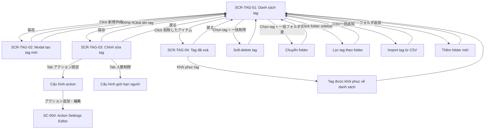

# FA-012 Quản lý thẻ「タグ管理」 — UI Spec

## Tổng quan
- **Mã tính năng**: FA-012
- **Tên**: Quản lý thẻ
- **Tên JP**: 「タグ管理」
- **Mô tả**: Tính năng quản lý thẻ (tag) gán cho bạn bè LINE. Cho phép tạo, sửa, xoá, phân loại tag vào folder. Tag được gắn cho bạn bè thông qua nhiều trigger khác nhau (tự động trả lời, biểu mẫu, hành động...) để phục vụ lọc phân nhóm (segment) và gửi tin nhắn có mục tiêu. Mỗi tag có thể cấu hình action tự động khi được thêm vào bạn bè, và tuỳ chọn giới hạn số người được gán tag.
- **Portal**: Admin
- **URL pattern**: `/basic/tag` (danh sách), `/basic/tag/edit-tag/{id}` (chỉnh sửa), `/basic/tag/removed` (đã xoá)

## Đối tượng sử dụng (Actors)
| Actor | Vai trò | Quyền truy cập |
|-------|---------|----------------|
| Admin | Quản lý toàn bộ tag: tạo, sửa, xoá, phân folder, cấu hình action, giới hạn người | Toàn quyền |
| Staff | Được Admin phân quyền — truy cập cùng giao diện nhưng có thể bị giới hạn | Tuỳ role do Admin cấu hình |

## Các màn hình

### SCR-TAG-01: Danh sách tag「タグ管理（一覧）」
- **URL**: `/basic/tag`
- **Tiêu đề trang**: 「タグ管理」
- **Screenshot**: `screenshots/main-clean.png`, `screenshots/list-with-data.png`, `screenshots/folder-with-tags.png`

#### Layout tổng thể
Giao diện chia làm 2 phần chính trong vùng nội dung:
- **Sidebar trái — Folder panel**: danh sách folder chứa tag, mỗi folder hiển thị tên + số tag trong ngoặc. Folder đặc biệt「未分類」(Chưa phân loại) luôn có sẵn ở đầu.
- **Vùng phải — Bảng tag**: bảng danh sách tag thuộc folder đang chọn (hoặc tất cả).

Phía trên có heading「タグ管理」kèm đoạn mô tả: 「様々なトリガーによって友だちにタグ付けを行い、タグごとに絞り込むことでセグメント配信などが可能となる機能です。」

Phía dưới bảng có toolbar bottom bar.

#### Header — Thông tin trang
| Vị trí | Element | Text JP | Loại | Hành vi |
|--------|---------|---------|------|---------|
| Trên cùng | Heading h2 | 「タグ管理」 | Tiêu đề | Không có action |
| Dưới heading | Paragraph | 「様々なトリガーによって友だちにタグ付けを行い、タグごとに絞り込むことでセグメント配信などが可能となる機能です。」 | Mô tả | Chỉ đọc |

#### Thanh công cụ — Folder panel (sidebar trái)
| Vị trí | Element | Text JP | Loại | Hành vi |
|--------|---------|---------|------|---------|
| Trên cùng folder panel | Button | 「フォルダ追加」 | Button (icon +) | Mở dialog/form thêm folder mới |
| Trên cùng folder panel | Button | 「並べ替え」 | Button (icon sort) | Cho phép kéo thả sắp xếp thứ tự folder |
| Cuối folder panel | Toggle link | 「フォルダを非表示」 | Link cursor | Ẩn/hiện folder panel sidebar |

#### Danh sách folder
Mỗi folder hiển thị dạng:
- Tên folder + `(số lượng tag)` — ví dụ: 「未分類 (4)」, 「最終編集 (175)」, 「絞り込み条件 (2)」
- Click vào folder → lọc bảng tag bên phải theo folder đó
- Folder đặc biệt「未分類」luôn có sẵn, không xoá được
- Folder có thể có icon thao tác (sửa tên, xoá) — quan sát được nút hamburger menu trên mỗi folder

#### Thanh công cụ — Tag panel (vùng phải, phía trên bảng)
| Vị trí | Element | Text JP | Loại | Hành vi |
|--------|---------|---------|------|---------|
| Trái trên | Button | 「新規作成」 | Button primary (icon +) | Mở modal tạo tag mới (SCR-TAG-02) |
| Trái trên | Button | 「CSV一括追加」 | Button (icon upload) | Mở dialog CSV import để thêm nhiều tag cùng lúc |
| Phải trên | Button | 「並べ替え」 | Button (icon sort) | Cho phép kéo thả sắp xếp thứ tự tag |
| Phải trên | Icon button | (icon search/filter) | Icon button | Mở bộ lọc tìm kiếm tag (keyword, category) |

#### Bảng dữ liệu — Danh sách tag
| # | Cột | Text JP | Kiểu dữ liệu | Sortable? | Ghi chú |
|---|-----|---------|-------------|----------|---------|
| 0 | Checkbox | — | Checkbox | Không | Checkbox chọn dòng, header có checkbox chọn tất cả |
| 1 | Tên quản lý | 「管理名」 | Text (link) | Có (up/down arrows) | Click vào tên → mở trang chỉnh sửa tag (SCR-TAG-03). Hỗ trợ sort ASC/DESC |
| 2 | Cài đặt action | 「アクション設定」 | Badge text | Không | Giá trị: 「アクション設定なし」(Chưa có) hoặc 「アクション設定あり」(Đã có, dạng link click được) |
| 3 | Giới hạn người | 「人数制限」 | Badge text | Không | Giá trị: 「人数制限なし」(Không giới hạn) hoặc số giới hạn cụ thể |
| 4 | Ngày tạo | 「作成日」 | Date (YYYY/MM/DD) | Có (up/down arrows) | Hỗ trợ sort ASC/DESC |
| 5 | Ngày sửa cuối | 「最終編集日」 | Date (YYYY/MM/DD) | Có (up/down arrows) | Hỗ trợ sort ASC/DESC |
| 6 | Số bạn bè | 「友だち数」 | Number + actions | Không | Hiển thị「{N} 人」, click vào「{N} 人」→ xem chi tiết. Bên cạnh có nút「表示」(Hiển thị) và icon menu (3 chấm) với thao tác bổ sung |

Khi bảng rỗng (chưa có tag): hiển thị dòng 「タグが登録されていません」

#### Actions trên mỗi dòng
| Action | Text/Icon JP | Hành vi | Xác nhận? |
|--------|-------------|---------|----------|
| Click tên tag | 「{tên tag}」 | Navigate đến trang edit tag SCR-TAG-03 | Không |
| Click「アクション設定あり」 | Link | Mở cấu hình action (có thể navigate đến SCR-TAG-03 tab action) | Không |
| Click「{N} 人」 | Link số người | Xem danh sách bạn bè đã gán tag này | Không |
| Click「表示」 | Button link | Xem chi tiết tag (có thể cùng action với click tên) | Không |
| Icon menu (hamburger) | Icon 3 chấm | Mở dropdown menu với các tuỳ chọn (sửa, xoá, di chuyển folder...) | Có thể có confirm khi xoá |

#### Thanh công cụ dưới (bottom bar)
| Vị trí | Element | Text JP | Loại | Hành vi |
|--------|---------|---------|------|---------|
| Trái | Button | 「一括フォルダ変更」 | Button disabled | Chuyển folder cho nhiều tag đã chọn checkbox. Disabled khi chưa chọn tag nào |
| Trái | Button | 「一括削除」 | Button disabled | Xoá nhiều tag đã chọn checkbox. Disabled khi chưa chọn tag nào |
| Trái | Link | 「削除したアイテム」 | Link | Navigate đến trang tag đã xoá SCR-TAG-04 (`/basic/tag/removed`) |

#### Pagination / Filtering
- Pagination phía dưới phải: dropdown chọn số dòng/trang, hiển thị「100/page」mặc định
- API hỗ trợ filter: `category_id` (folder), `keyword` (tìm kiếm), `type`, `orders` (sort column + direction), `limit`, `page`
- Sort mặc định: `position DESC`

---

### SCR-TAG-02: Modal tạo tag mới「タグ新規作成」
- **URL**: `/basic/tag` (modal overlay trên trang danh sách)
- **Tiêu đề modal**: 「タグ新規作成」
- **Screenshot**: `screenshots/create-form.png`

#### Layout tổng thể
Modal dialog hiển thị overlay trên SCR-TAG-01. Gồm:
- Header: tiêu đề「タグ新規作成」 + nút đóng (X)
- Body: form nhập thông tin tag
- Footer: nút thao tác

#### Form fields
| # | Label JP | Loại input | Bắt buộc? | Giá trị mặc định | Ghi chú |
|---|---------|-----------|----------|-----------------|---------|
| 1 | 「フォルダ」 | Select (combobox) | Có | 「未分類」(folder đang chọn trên danh sách) | Dropdown chứa tất cả folder đã tạo. Option mặc định「未分類」 |
| 2 | 「タグ管理名」 | Text input (repeatable) | Có | Rỗng | Placeholder:「タグ管理名を入力してください」. Counter hiển thị `{N}/50` (max 50 ký tự). Mỗi field có số thứ tự (1, 2, ...). Có thể thêm nhiều tag cùng lúc (tối đa 20) |

Ghi chú trên form:「同時に20個までタグが作成できます」 — Có thể tạo đồng thời tối đa 20 tag.

#### Action Buttons
| Vị trí | Element | Text JP | Loại | Hành vi |
|--------|---------|---------|------|---------|
| Footer trái | Button | 「タグを追加」 | Button link (icon +) | Thêm 1 dòng input tag mới (tối đa 20 dòng) |
| Footer phải | Button | 「保存」 | Button primary | Lưu tất cả tag đã nhập, đóng modal, reload danh sách |
| Header phải | Icon button | X | Icon close | Đóng modal không lưu |

---

### SCR-TAG-03: Chỉnh sửa tag「タグ編集」
- **URL**: `/basic/tag/edit-tag/{id}`
- **Tiêu đề trang**: 「タグ編集」
- **Screenshot**: `screenshots/edit-tag.png`, `screenshots/edit-tag-limit.png`

#### Layout tổng thể
Trang đầy đủ (không phải modal). Breadcrumb: 「タグ一覧 > タグ編集」. Gồm 2 phần:
- **Phần trên**: Form thông tin cơ bản (tên, folder)
- **Phần giữa**: Cài đặt nâng cao (tabs: Action settings + Giới hạn người)
- **Phần dưới**: Nút lưu và quay lại

#### Form fields — Thông tin cơ bản
| # | Label JP | Loại input | Bắt buộc? | Giá trị mặc định | Ghi chú |
|---|---------|-----------|----------|-----------------|---------|
| 1 | 「管理名」 | Text input | Có | Giá trị hiện tại của tag | Counter hiển thị `{N}/50` (max 50 ký tự). Ví dụ: "abc" → "3/50" |
| 2 | 「フォルダ」 | Select (combobox) | Có | Folder hiện tại | Dropdown chứa tất cả folder: 「未分類」,「nga test」,「ntest」,「タグ 管理」,「最終編集」,「絞り込み条件」 |

#### Tabs cài đặt nâng cao「設定項目」
| Tab | Text JP | Nội dung | Mặc định? |
|-----|---------|---------|----------|
| Tab 1 | 「アクション設定」 | Cấu hình action tự động khi tag được thêm vào bạn bè | Có (mặc định hiển thị) |
| Tab 2 | 「人数制限」 | Cấu hình giới hạn số người tối đa được gán tag | Không |

#### Tab 1: Cài đặt action「タグ追加時アクション設定」
Mô tả trên UI: 「自動応答や回答フォームなどでタグが追加された時に行うアクションを設定します。」
(Cài đặt hành động thực hiện khi tag được thêm thông qua tự động trả lời, biểu mẫu trả lời, v.v.)

| # | Label JP | Loại input | Bắt buộc? | Giá trị mặc định | Ghi chú |
|---|---------|-----------|----------|-----------------|---------|
| 1 | 「アクションの稼働回数」 | Radio button | Có | 「何度でもアクション稼働」 | 2 options: 「何度でもアクション稼働」(Chạy action mỗi lần) / 「1度のみアクション稼働」(Chỉ chạy 1 lần) |

**Danh sách loại action khả dụng** (hiển thị dạng icon tabs ngang):
| Icon/Tab | Text JP | Mô tả |
|----------|---------|-------|
| Icon image | 「テンプレート」 | Gửi mẫu tin nhắn (→ SC-001 Template Message) |
| Icon tag | 「タグ」 | Thêm/xoá tag khác (→ SC-002 Tag Selector) |
| Icon person | 「友だち情報」 | Cập nhật thông tin bạn bè |
| Icon step | 「ステップ配信」 | Bắt đầu/dừng phát hành theo bước |
| Icon gear | 「その他」 | Các action khác |

**Nút cấu hình action**:
| Element | Text JP | Loại | Hành vi |
|---------|---------|------|---------|
| Button | 「アクション追加・編集」 | Button primary | Mở editor cấu hình danh sách action. Đây chính là shared component SC-004 Action Settings |

**Hiển thị action đã cấu hình** (nếu có):
Danh sách dạng chip/card, ví dụ: 「テンプレート」→「絞り込みなし」→「を送信」

#### Tab 2: Giới hạn người「人数制限」
Mô tả trên UI: 「タグの追加上限人数を設定します。」
(Cài đặt số người tối đa có thể được gán tag này.)

| # | Label JP | Loại input | Bắt buộc? | Giá trị mặc định | Ghi chú |
|---|---------|-----------|----------|-----------------|---------|
| 1 | 「人数制限」 | Radio button | Có | 「制限しない」 | 2 options: 「制限しない」(Không giới hạn) / 「制限する」(Giới hạn) |
| 2 | 「制限人数」 | Spinbutton (number) | Có khi chọn「制限する」 | Rỗng (disabled khi「制限しない」) | Nhập số người tối đa. Đơn vị「人」hiển thị bên phải. Disabled khi chọn「制限しない」 |

#### Action Buttons — Footer
| Vị trí | Element | Text JP | Loại | Hành vi |
|--------|---------|---------|------|---------|
| Trái | Button | 「保存」 | Button primary | Lưu thay đổi và quay lại danh sách |
| Phải | Button | 「戻る」 | Button secondary | Quay lại danh sách không lưu |

#### Breadcrumb
| Element | Text JP | Hành vi |
|---------|---------|---------|
| Link | 「タグ一覧」 | Navigate về `/basic/tag` |
| Text | 「> タグ編集」 | Trang hiện tại (không click được) |

---

### SCR-TAG-04: Danh sách tag đã xoá「削除済みタグ」
- **URL**: `/basic/tag/removed`
- **Tiêu đề trang**: 「TOP > 削除済みタグ」
- **Screenshot**: `screenshots/removed.png`

#### Layout tổng thể
Trang đơn giản, không có folder panel. Breadcrumb: 「TOP > 削除済みタグ」.
Gồm:
- Phần mô tả
- Bảng tag đã xoá
- Footer: nút quay lại + pagination

#### Thông tin mô tả
2 đoạn paragraph:
1. 「このページでは削除したタグの復元ができます。」 (Tại trang này bạn có thể khôi phục tag đã xoá.)
2. 「手動では削除することができず、削除した日時から90日後に自動で削除されます。」 (Không thể xoá thủ công, tag sẽ tự động bị xoá vĩnh viễn sau 90 ngày kể từ ngày xoá.)

#### Bảng dữ liệu — Tag đã xoá
| # | Cột | Text JP | Kiểu dữ liệu | Sortable? | Ghi chú |
|---|-----|---------|-------------|----------|---------|
| 1 | Ngày xoá | 「削除した日時」 | DateTime | Có (up/down arrows) | Thời điểm tag bị xoá |
| 2 | Tên quản lý | 「管理名」 | Text | Không | Tên tag đã xoá |
| 3 | Người thao tác | 「操作者」 | Text | Không | Tên user đã thực hiện thao tác xoá |
| 4 | (Thao tác) | — | Button | Không | Cột action — nút khôi phục (suy luận từ mô tả "復元") |

Khi bảng rỗng: hiển thị hình minh hoạ + 「まだデータがありません」(Chưa có dữ liệu)

#### Action Buttons
| Vị trí | Element | Text JP | Loại | Hành vi |
|--------|---------|---------|------|---------|
| Footer trái | Button | 「戻る」 | Button | Navigate về `/basic/tag` (danh sách tag chính) |

#### Pagination
- Dropdown chọn số dòng/trang: 「100/page」mặc định
- Navigation pagination (breadcrumb dạng「TOP」link về `/basic/tag`)

---

## Luồng người dùng (User Flows)

### Luồng 1: Tạo tag mới (Happy path)
1. Admin ở trang danh sách tag (SCR-TAG-01)
2. Click nút「新規作成」→ Modal tạo tag (SCR-TAG-02) hiện lên
3. Chọn folder từ dropdown「フォルダ」(mặc định「未分類」)
4. Nhập tên tag vào ô「タグ管理名」(tối đa 50 ký tự)
5. (Tuỳ chọn) Click「タグを追加」để thêm nhiều tag cùng lúc (tối đa 20)
6. Click「保存」→ Tag được tạo, modal đóng, danh sách reload với tag mới

### Luồng 2: Sửa tag + cấu hình action
1. Admin ở trang danh sách tag (SCR-TAG-01)
2. Click vào tên tag trong bảng → Navigate đến trang edit (SCR-TAG-03)
3. Sửa tên tag / chuyển folder nếu cần
4. Click tab「アクション設定」→ Cấu hình action:
   - Chọn tần suất: 「何度でもアクション稼働」hoặc「1度のみアクション稼働」
   - Click「アクション追加・編集」→ Mở editor chọn loại action (template, tag, friend info, step, khác)
5. Click「保存」→ Lưu thay đổi, quay lại danh sách

### Luồng 3: Cấu hình giới hạn người cho tag
1. Từ trang edit tag (SCR-TAG-03)
2. Click tab「人数制限」
3. Chọn「制限する」→ Ô nhập「制限人数」enable
4. Nhập số người tối đa
5. Click「保存」

### Luồng 4: Xoá tag
1. Admin ở trang danh sách tag (SCR-TAG-01)
2. Chọn 1 hoặc nhiều tag bằng checkbox
3. Click「一括削除」(enable khi đã chọn tag)
4. Xác nhận xoá (suy luận có dialog confirm)
5. Tag bị soft-delete → chuyển vào trang tag đã xoá

### Luồng 5: Khôi phục tag đã xoá
1. Từ trang danh sách tag (SCR-TAG-01), click link「削除したアイテム」
2. Navigate đến trang tag đã xoá (SCR-TAG-04)
3. Xem danh sách tag đã xoá với ngày xoá, tên, người thao tác
4. Click nút khôi phục trên dòng cần → Tag được khôi phục về danh sách chính
5. Click「戻る」→ Quay lại SCR-TAG-01

### Luồng 6: Quản lý folder
1. Admin ở trang danh sách tag (SCR-TAG-01)
2. Click「フォルダ追加」→ Nhập tên folder mới → Lưu
3. Folder mới xuất hiện trong sidebar, có thể kéo thả sắp xếp (「並べ替え」)
4. Click vào folder → Lọc bảng tag theo folder đó
5. Di chuyển tag giữa các folder: chọn tag → 「一括フォルダ変更」

### Luồng 7: Import tag từ CSV
1. Admin ở trang danh sách tag (SCR-TAG-01)
2. Click「CSV一括追加」→ Mở dialog upload CSV
3. Upload file CSV chứa danh sách tag
4. Hệ thống import và tạo tag hàng loạt

## Flow Diagram

## Shared Components phát hiện

| Component | Mã SC | Vị trí sử dụng | Mô tả |
|-----------|-------|----------------|-------|
| Action Settings | SC-004 | SCR-TAG-03 Tab「アクション設定」→ Nút「アクション追加・編集」 | Cấu hình danh sách action tự động khi tag được gắn. Gồm 5 loại: テンプレート, タグ, 友だち情報, ステップ配信, その他 |
| Template Message | SC-001 | SCR-TAG-03 → Action type「テンプレート」 | Chọn mẫu tin nhắn để gửi khi tag được thêm |
| Tag Selector | SC-002 | SCR-TAG-03 → Action type「タグ」 | Thêm/xoá tag khác khi tag hiện tại được gắn (action chain) |

## Điểm chưa rõ / Cần xác minh

| # | Nội dung | Mức độ | Ghi chú |
|---|---------|--------|---------|
| 1 | Form thêm folder mới — format dialog/inline chưa rõ | Thấp | Chỉ thấy nút「フォルダ追加」, chưa chụp được giao diện thêm folder |
| 2 | Nội dung cụ thể khi click icon menu (3 chấm) trên mỗi dòng tag | Trung bình | Suy luận có: sửa, xoá, di chuyển folder — cần xác nhận |
| 3 | CSV import format — các cột yêu cầu trong file CSV | Trung bình | Chưa chụp được dialog CSV upload |
| 4 | Hành vi khi tag đạt giới hạn người (「人数制限」) — từ chối gán hay thông báo? | Trung bình | Cần kiểm tra logic trong code |
| 5 | Cách xoá/sửa/đổi tên folder | Thấp | Thấy icon menu trên folder nhưng chưa mở xem chi tiết |
| 6 | Dialog confirm khi xoá tag — có hay không, nội dung gì? | Thấp | Suy luận có confirm dialog nhưng chưa chụp được |
| 7 | Chức năng kéo thả sắp xếp tag/folder (「並べ替え」) — UX chi tiết | Thấp | Chưa chụp được trạng thái drag-and-drop |
| 8 | Staff permissions cụ thể — quyền nào bị giới hạn? | Trung bình | Cần phân tích code để xác định quyền Staff với tính năng tag |
| 9 | Tab「その他」trong Action Settings chứa những loại action gì? | Trung bình | Chỉ thấy tên tab, chưa mở chi tiết |
| 10 | Nút「表示」bên cạnh số bạn bè — navigate đến đâu? | Thấp | Có thể link đến friend list filtered by tag |
